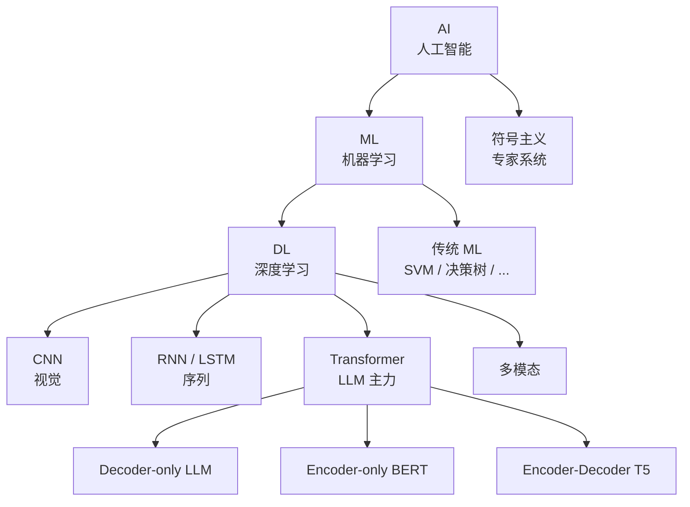
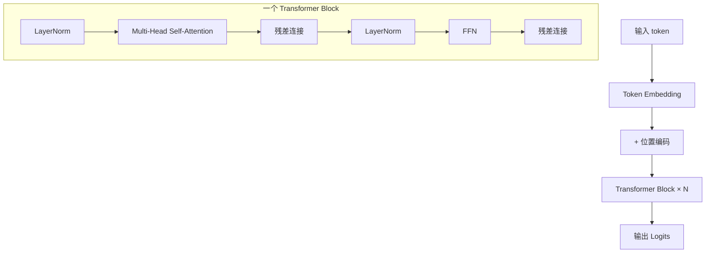

# Part 1 大模型基础 Implementation Plan

> **For agentic workers:** REQUIRED SUB-SKILL: Use superpowers:subagent-driven-development (recommended) or superpowers:executing-plans to implement this plan task-by-task. Steps use checkbox (`- [ ]`) syntax for tracking.

**Goal:** 在 `/data/projects/agentkit` 中写完 Part 1《大模型基础》的全部 5 章 + 对应 Python 示例代码，作为《Agent原理及实践》一书的第一个 Part。

**Architecture:** 每个章节一个独立 markdown 文件，每章按统一模板（标题 → 一句话简介 → 本章目标 → 本章导览（mermaid 总览图）→ 子节正文 → 本章小结 → 本章参考）。代码示例放在 `code/part-1/` 目录，文件名与正文引用一致。每章节独立 commit，便于 review 与回滚。

**Tech Stack:** Markdown（GitHub Flavored）、Mermaid（GitHub 原生渲染）、Python 3.10+、PyTorch ≥ 2.0、Transformers ≥ 4.30。

## Global Constraints

[来源：spec docs/superpowers/specs/2026-09-20-agent-principles-practice-part1-design.md，逐字摘录]

- 目标读者：大学本科以上、会写代码、没有 AI/ML 背景
- 数学策略：直觉优先、最少公式；关键公式（attention、loss、KL）必须出现并解释，但不完整推导
- 总字数：18-22k 字（5 章）
- 语言：中文（简体）；技术术语首次出现用 `中文名（English term）` 格式
- 风格：教程式、朋友式；用"读者"、"我们"，避免"您"
- 段落 3-6 句一个自然段
- Mermaid 仅用四种图：`graph` / `flowchart` / `sequenceDiagram` / `mindmap`
- 复杂关系用表格，不堆 mermaid
- 引用：随文 markdown 链接 + 章末 "本章参考"（分必读论文 / 推荐博客 / 视频课程 三类）
- 代码 Python（PyTorch 优先），中文注释，文件头加 `# runnable: yes` 或 `# illustrative only`
- 跨章引用 `参见 X.3`；跨 Part `(见 Part N ChM)`，不复制内容
- Part 1 不涉及：Agent / 工业落地 / LLM 家族详细对比 / 数学严格证明

---

## File Structure

新建/修改文件清单：

```
agentkit/
├── README.md                                  # MODIFY：从 "# agentkit" 扩为书籍总目录
├── part-1-大模型基础/
│   ├── README.md                              # CREATE：Part 1 目录与简介
│   ├── ch01-ai-ml-dl-概览.md                  # CREATE
│   ├── ch02-神经网络与深度学习.md             # CREATE
│   ├── ch03-transformer与注意力.md            # CREATE
│   ├── ch04-预训练与微调.md                   # CREATE
│   └── ch05-rlhf与对齐.md                     # CREATE
└── code/
    └── part-1/
        ├── README.md                          # CREATE：依赖说明
        ├── train_mlp.py                       # CREATE：Ch2 示例（runnable）
        ├── attention.py                       # CREATE：Ch3 示例（runnable）
        └── tokenize_demo.py                   # CREATE：Ch4 示例（runnable）
```

每个 `.md` 章节文件的责任是单一章节的完整内容；不跨章、不引用未定义的类型/章节。

---

## Task 0：项目脚手架

**Files:**
- Modify: `README.md`
- Create: `part-1-大模型基础/README.md`
- Create: `code/part-1/README.md`

- [ ] **Step 1：扩展顶层 README.md**

将 `/data/projects/agentkit/README.md` 从仅含 `# agentkit` 替换为：

```markdown
# Agent原理及实践

一本从原理到实践的中文技术书籍，面向有编程基础但无 AI/ML 背景的初学者。

## 阅读路线

| Part | 主题 | 状态 |
|---|---|---|
| 1 | 大模型基础 | 已发布 |
| 2 | 大模型与 Agent 的演进 | 待写作 |
| 3 | Agent 原理 | 待写作 |
| 4 | Harness 工程 | 待写作 |
| 5 | Agent 功能实现 | 待写作 |
| 6 | 工业落地 | 待写作 |

## 仓库结构

- `CLAUDE.md`：写作规范与项目宪法
- `part-N-.../`：第 N 个 Part 的章节文件
- `code/part-N/`：第 N 个 Part 的示例代码
- `docs/superpowers/specs/`：设计 spec
- `docs/superpowers/plans/`：实现 plan

## 当前进度

- ✅ Part 1 spec 与 plan
- 🚧 Part 1 章节写作
```

- [ ] **Step 2：创建 Part 1 README.md**

写入 `/data/projects/agentkit/part-1-大模型基础/README.md`：

```markdown
# Part 1 大模型基础

> 从 AI/ML/DL 概览到 LLM 训练与 RLHF 的完整理论铺垫。

## 章节

| 章 | 标题 | 字数 | 阅读时长 |
|---|---|---|---|
| [Ch1](ch01-ai-ml-dl-概览.md) | AI / ML / DL 概览 | ~3-4k | 15 分钟 |
| [Ch2](ch02-神经网络与深度学习.md) | 神经网络与深度学习基础 | ~3-4k | 15 分钟 |
| [Ch3](ch03-transformer与注意力.md) | Transformer 与注意力 | ~4.5-5.5k | 25 分钟 |
| [Ch4](ch04-预训练与微调.md) | 预训练与微调 | ~4-5k | 25 分钟 |
| [Ch5](ch05-rlhf与对齐.md) | RLHF 与对齐 | ~4-5k | 25 分钟 |

## 一句话简介

Part 1 不讲 Agent，只讲"LLM 是怎么训练出来的"。读完 Part 1 后，你能描述从一段原始语料到一个对齐后的对话模型所经历的完整流程。

## 配套代码

见 [`code/part-1/`](../code/part-1/)。
```

- [ ] **Step 3：创建 code/part-1/README.md**

写入 `/data/projects/agentkit/code/part-1/README.md`：

```markdown
# Part 1 示例代码

依赖：

- Python ≥ 3.10
- PyTorch ≥ 2.0
- transformers ≥ 4.30
- numpy

安装：

```bash
pip install torch transformers numpy
```

| 文件 | 对应章节 | 是否可运行 | 说明 |
|---|---|---|---|
| [`train_mlp.py`](train_mlp.py) | Ch2 | 是 | 一个最小 MLP 拟合正弦函数 |
| [`attention.py`](attention.py) | Ch3 | 是 | 手写 scaled dot-product attention |
| [`tokenize_demo.py`](tokenize_demo.py) | Ch4 | 是 | 用 transformers tokenizer 演示 BPE |
```

- [ ] **Step 4：验证文件存在**

运行：

```bash
ls /data/projects/agentkit/README.md \
   /data/projects/agentkit/part-1-大模型基础/README.md \
   /data/projects/agentkit/code/part-1/README.md
```

期望：三个文件全部存在，无错误。

- [ ] **Step 5：Commit**

```bash
git add README.md part-1-大模型基础/README.md code/part-1/README.md
git commit -m "Add Part 1 scaffolding (READMEs + directory layout)"
```

---

## Task 1：Ch1 AI / ML / DL 概览

**Files:**
- Create: `part-1-大模型基础/ch01-ai-ml-dl-概览.md`

- [ ] **Step 1：创建章节骨架**

写入 `/data/projects/agentkit/part-1-大模型基础/ch01-ai-ml-dl-概览.md`：

```markdown
# Ch1 AI / ML / DL 概览

> 一句话简介：先搞清楚"AI、ML、DL、LLM"分别是什么、各自解决什么问题，再开始看模型细节。

## 本章目标

读完本章你应当能：
- 准确区分 AI / ML / DL 三个概念的范围
- 说出三大范式（符号主义、连接主义、统计学习）的核心主张
- 区分监督、无监督、强化三种学习方式，并举出典型任务
- 解释深度学习在 2010 年后崛起的关键驱动
- 描述 LLM 在 AI 整体图谱中的位置
- 规划本书接下来 5 个 Part 的阅读路线

## 本章导览



## 1.1 什么是 AI、ML、DL

## 1.2 三大范式

## 1.3 三大学习划分

## 1.4 深度学习为什么崛起

## 1.5 LLM 在 AI 整体图谱中的位置

## 1.6 本书阅读路线

## 本章小结

## 本章参考
```

- [ ] **Step 2：起草 1.1 什么是 AI、ML、DL（~500-700 字）**

覆盖：AI 的目标是让机器表现出类人智能行为；ML 是 AI 的一种实现路径（从数据中学习规律，而非手写规则）；DL 是 ML 的一个分支，使用多层神经网络作为函数逼近器。用一个生活类比（如做饭）帮助初学者建立直觉。

- [ ] **Step 3：起草 1.2 三大范式（~500-700 字）**

覆盖：符号主义（专家系统、知识图谱、逻辑推理）；连接主义（神经网络，从感知机到深度学习）；统计学习（SVM、概率图模型）。各举 1-2 个代表方法与典型局限（如专家系统的脆弱性）。

- [ ] **Step 4：起草 1.3 三大学习划分（~500-700 字）**

覆盖：监督学习（有标注数据，学习输入→输出映射，如分类、回归）；无监督学习（无标注，发现数据结构，如聚类、降维）；强化学习（与环境交互，奖励信号驱动策略）。用表格对比。

- [ ] **Step 5：起草 1.4 深度学习为什么崛起（~600-800 字）**

覆盖四个驱动：算力（GPU/TPU、并行计算）、数据（互联网产生的海量文本/图像）、算法（ReLU 解决梯度消失、Adam 优化器、BatchNorm、Transformer 架构）、任务（ImageNet 等大规模基准催化进展）。用时间线展示关键节点（2012 AlexNet、2017 Transformer、2018 GPT/BERT）。

- [ ] **Step 6：起草 1.5 LLM 在 AI 整体图谱中的位置（~400-600 字）**

覆盖：LLM 是"深度学习 + Transformer + 大规模自监督预训练 + 通用任务"这条路径的产物；它属于连接主义 / 深度学习 / 自监督学习 / 生成式模型。强调它不是 AGI，但确实是当前最强的通用语言接口。

- [ ] **Step 7：起草 1.6 本书阅读路线（~300-500 字）**

用一段话概述 6 个 Part 的内容，给读者一条阅读建议路径。Part 1-2 为前置理论，Part 3-5 为 Agent 核心，Part 6 为工业落地。

- [ ] **Step 8：写本章小结**

3-5 条 bullet，每条 1-2 句，概括本章核心要点。

- [ ] **Step 9：写本章参考**

分三类（必读论文 / 推荐博客 / 视频课程），各 2-4 条。必读论文建议：
- [Deep Learning (LeCun, Bengio, Hinton, 2015)](https://www.nature.com/articles/nature14539) — Nature 综述
- [ImageNet Classification with Deep CNN (Krizhevsky et al., 2012)](https://www.cs.toronto.edu/~kriz/cifar.html) — AlexNet 论文
- 推荐博客：
  - [The Illustrated Transformer](https://jalammar.github.io/illustrated-transformer/)
  - [3Blue1Brown 神经网络系列](https://www.3blue1brown.com/topics/neural-networks)
- 视频课程：
  - [吴恩达 Machine Learning 课程](https://www.coursera.org/learn/machine-learning)

- [ ] **Step 10：字数与一致性检查：

```bash
cd /data/projects/agentkit/part-1-大模型基础
wc -w ch01-ai-ml-dl-概览.md
grep -c "## " ch01-ai-ml-dl-概览.md
```

期望：字数在 2800-3600 之间（3-4k 范围的 -20%）；二级标题数量 = 12（本章目标 + 本章导览 + 6 个子节 + 本章小结 + 本章参考 + 顶部 #）。

- [ ] **Step 11：Commit**

```bash
git add part-1-大模型基础/ch01-ai-ml-dl-概览.md
git commit -m "Add Ch1: AI / ML / DL 概览"
```

---

## Task 2：Ch2 神经网络与深度学习基础

**Files:**
- Create: `part-1-大模型基础/ch02-神经网络与深度学习.md`
- Create: `code/part-1/train_mlp.py`

- [ ] **Step 1：创建代码文件 train_mlp.py**

写入 `/data/projects/agentkit/code/part-1/train_mlp.py`：

```python
# runnable: yes
# 依赖：torch
# 用法：python train_mlp.py
# 说明：用一个最小 MLP（2 层隐藏层）拟合 y = sin(x)，演示 PyTorch 训练基本流程

import torch
import torch.nn as nn
import torch.optim as optim


class MLP(nn.Module):
    """最小 MLP：输入 1 → 隐藏 32 → 隐藏 32 → 输出 1"""

    def __init__(self) -> None:
        super().__init__()
        self.net = nn.Sequential(
            nn.Linear(1, 32),
            nn.ReLU(),
            nn.Linear(32, 32),
            nn.ReLU(),
            nn.Linear(32, 1),
        )

    def forward(self, x: torch.Tensor) -> torch.Tensor:
        return self.net(x)


def main() -> None:
    torch.manual_seed(0)
    x = torch.linspace(-2 * torch.pi, 2 * torch.pi, 200).reshape(-1, 1)
    y = torch.sin(x)

    model = MLP()
    optimizer = optim.Adam(model.parameters(), lr=1e-2)
    loss_fn = nn.MSELoss()

    for step in range(1000):
        pred = model(x)
        loss = loss_fn(pred, y)
        optimizer.zero_grad()
        loss.backward()
        optimizer.step()
        if step % 200 == 0:
            print(f"step {step:4d}  loss={loss.item():.4f}")

    final_loss = loss_fn(model(x), y).item()
    print(f"final loss = {final_loss:.4f}")
    assert final_loss < 0.01, f"训练未收敛：final loss = {final_loss}"


if __name__ == "__main__":
    main()
```

- [ ] **Step 2：验证代码可运行**

运行：

```bash
cd /data/projects/agentkit
python code/part-1/train_mlp.py
```

期望：打印 `step 0 loss=...` 到 `step 800 loss=...` 共 6 行，最后一行 `final loss < 0.01` 通过；程序退出码 0。

- [ ] **Step 3：创建章节骨架**

写入 `/data/projects/agentkit/part-1-大模型基础/ch02-神经网络与深度学习.md`：

```markdown
# Ch2 神经网络与深度学习基础

> 一句话简介：搭建起"神经元 → 损失函数 → 反向传播 → 优化器"的最小心智模型，为理解 Transformer 训练做准备。

## 本章目标

读完本章你应当能：
- 画出一个多层感知机（MLP）并口述其前向计算
- 解释反向传播的核心思想（不必手推）
- 说出常见激活函数（ReLU / GELU / Softmax）的用途与差异
- 区分 MSE 与交叉熵损失的使用场景
- 比较 SGD / Adam / AdamW 优化器的差异
- 说出 Dropout、Weight Decay、BatchNorm / LayerNorm 的目的

## 本章导览


## 2.1 神经元与多层感知机

## 2.2 激活函数

## 2.3 反向传播的直觉

## 2.4 损失函数

## 2.5 优化器演进

## 2.6 正则化

## 2.7 归一化

## 2.8 一个最小的 PyTorch 训练示例

## 本章小结

## 本章参考
```

- [ ] **Step 4：起草 2.1-2.7（正文 ~2800-3500 字）**

每个子节约 350-500 字。每节用文字 + 1 个示意性 mermaid 或公式说明，避免长篇大论。

- 2.1：神经元模型、MLP 结构、为什么需要非线性
- 2.2：ReLU 的简洁性、GELU 的平滑性、Softmax 用于多分类输出
- 2.3：链式法则的直觉、"梯度从损失流回每一层"的比喻
- 2.4：MSE 用于连续值、交叉熵用于离散概率分布
- 2.5：SGD 朴素但稳定、Adam 自适应学习率、AdamW 修正权重衰减
- 2.6：Dropout 随机失活、Weight Decay L2 正则
- 2.7：BatchNorm 跨样本归一、LayerNorm 跨特征归一

- [ ] **Step 5：起草 2.8 一个最小的 PyTorch 训练示例（~400-600 字）**

解释 `train_mlp.py` 的结构：模型定义、优化器、损失、训练循环、断言收敛。引用文件：`code/part-1/train_mlp.py`。

- [ ] **Step 6：写本章小结**

3-5 条 bullet。

- [ ] **Step 7：写本章参考**

必读论文：
- [Adam: A Method for Stochastic Optimization (Kingma & Ba, 2015)](https://arxiv.org/abs/1412.6980)
- [Dropout: A Simple Way to Prevent Neural Networks from Overfitting (Srivastava et al., 2014)](https://jmlr.org/papers/v15/srivastava14a.html)
- [Batch Normalization (Ioffe & Szegedy, 2015)](https://arxiv.org/abs/1502.03167)

博客：
- [PyTorch 官方 60 分钟入门](https://pytorch.org/tutorials/beginner/deep_learning_60min_blitz.html)

视频：
- [3Blue1Brown 神经网络与梯度下降](https://www.3blue1brown.com/topics/neural-networks)

- [ ] **Step 8：字数检查**

```bash
cd /data/projects/agentkit/part-1-大模型基础
wc -w ch02-神经网络与深度学习.md
```

期望：2800-3600 字。

- [ ] **Step 9：Commit**

```bash
git add part-1-大模型基础/ch02-神经网络与深度学习.md code/part-1/train_mlp.py
git commit -m "Add Ch2: 神经网络与深度学习基础 + train_mlp.py 示例"
```

---

## Task 3：Ch3 Transformer 与注意力

**Files:**
- Create: `part-1-大模型基础/ch03-transformer与注意力.md`
- Create: `code/part-1/attention.py`

- [ ] **Step 1：创建代码文件 attention.py**

写入 `/data/projects/agentkit/code/part-1/attention.py`：

```python
# runnable: yes
# 依赖：torch
# 用法：python attention.py
# 说明：手写 scaled dot-product attention，对一组随机 query/key/value 计算注意力输出与权重

import torch
import torch.nn.functional as F


def scaled_dot_product_attention(
    query: torch.Tensor,
    key: torch.Tensor,
    value: torch.Tensor,
) -> tuple[torch.Tensor, torch.Tensor]:
    """Scaled dot-product attention.

    Args:
        query: shape (batch, seq_len, d_k)
        key: shape (batch, seq_len, d_k)
        value: shape (batch, seq_len, d_v)

    Returns:
        output: shape (batch, seq_len, d_v)
        attn: shape (batch, seq_len, seq_len)
    """
    d_k = query.size(-1)
    scores = torch.matmul(query, key.transpose(-2, -1)) / (d_k ** 0.5)
    attn = F.softmax(scores, dim=-1)
    output = torch.matmul(attn, value)
    return output, attn


def main() -> None:
    torch.manual_seed(0)
    batch, seq_len, d = 2, 4, 8
    q = torch.randn(batch, seq_len, d)
    k = torch.randn(batch, seq_len, d)
    v = torch.randn(batch, seq_len, d)

    output, attn = scaled_dot_product_attention(q, k, v)

    print(f"output shape: {tuple(output.shape)}")
    print(f"attn shape:   {tuple(attn.shape)}")

    # 验证：注意力权重每行和为 1
    row_sums = attn.sum(dim=-1)
    assert torch.allclose(row_sums, torch.ones_like(row_sums), atol=1e-5), \
        f"注意力权重行和应为 1，实际 = {row_sums}"
    # 验证：输出形状正确
    assert output.shape == (batch, seq_len, d), \
        f"输出形状错误：{output.shape}"

    print("OK：注意力权重行和为 1，输出形状正确")


if __name__ == "__main__":
    main()
```

- [ ] **Step 2：验证代码可运行**

运行：

```bash
cd /data/projects/agentkit
python code/part-1/attention.py
```

期望：打印 `output shape: (2, 4, 8)` 和 `attn shape: (2, 4, 4)`，最后一行 `OK：注意力权重行和为 1，输出形状正确`；退出码 0。

- [ ] **Step 3：创建章节骨架**

写入 `/data/projects/agentkit/part-1-大模型基础/ch03-transformer与注意力.md`：

```markdown
# Ch3 Transformer 与注意力

> 一句话简介：从 RNN 的局限讲起，到 self-attention 的直觉，再到 Transformer block 的标准结构，为理解现代 LLM 打地基。

## 本章目标

读完本章你应当能：
- 解释 RNN / LSTM 在长序列上的局限
- 直观描述 self-attention 的工作机制
- 写出 scaled dot-product attention 的公式并解释每一项
- 说出多头注意力的作用
- 解释位置编码的必要性，并比较 Sinusoidal / RoPE / ALiBi
- 画出一个标准 Transformer block 的结构
- 区分 Decoder-only / Encoder-only / Encoder-Decoder 三种架构
- 描述 KV cache 的作用
- 简述 MoE 的稀疏激活思想

## 本章导览



## 3.1 为什么需要新架构

## 3.2 Self-attention 的直觉

## 3.3 Q/K/V 与 attention 公式

## 3.4 多头注意力

## 3.5 位置编码

## 3.6 Transformer block

## 3.7 Decoder-only vs Encoder-Decoder

## 3.8 KV cache 直观理解

## 3.9 一个最小 attention 示例

## 3.10 MoE 与现代 Transformer 变体

## 本章小结

## 本章参考
```

- [ ] **Step 4：起草 3.1-3.8（正文 ~3500-4500 字）**

每子节约 400-550 字。3.3 必须包含 attention 公式：

```
Attention(Q, K, V) = softmax(Q Kᵀ / √dₖ) V
```

3.5 解释三种位置编码的动机：Sinusoidal（原始方案）；RoPE（旋转矩阵编码相对位置，LLaMA / Qwen / DeepSeek 等主流采用）；ALiBi（加线性距离偏置，无需额外参数）。3.8 解释 KV cache 通过缓存历史 token 的 K/V 避免重复计算。

- [ ] **Step 5：起草 3.9 一个最小 attention 示例（~300-500 字）**

引用 `code/part-1/attention.py`，解释 `scaled_dot_product_attention` 函数的三步：打分 → softmax → 加权求和。强调"行和为 1"是 softmax 的不变量。

- [ ] **Step 6：起草 3.10 MoE 与现代 Transformer 变体（~500-800 字）**

四个要点：
- MoE：路由器（Router）决定每个 token 走哪几个专家；只有少数专家被激活；总参数大但推理成本可控（DeepSeek-V2、Mixtral）
- RMSNorm：去掉均值中心，只做缩放；计算更快，与 LayerNorm 效果相当（LLaMA 采用）
- SwiGLU：门控激活函数，Swish × GLU；在 FFN 中取代 ReLU，性能更好（PaLM / LLaMA）
- GQA：分组查询注意力，多个 query head 共享同一组 K/V；推理时 KV cache 更小，质量接近 MHA（LLaMA-2/3、Qwen）

强调这些是"现代 LLM 的标配"，细节留给 Part 2。

- [ ] **Step 7：写本章小结**

5 条 bullet。

- [ ] **Step 8：写本章参考**

必读论文：
- [Attention Is All You Need (Vaswani et al., 2017)](https://arxiv.org/abs/1706.03762)
- [RoFormer: Enhanced Transformer with Rotary Position Embedding (Su et al., 2021)](https://arxiv.org/abs/2104.09864)
- [GQA: Training Generalized Multi-Query Transformer Models from Multi-Head Checkpoints (Ainslie et al., 2023)](https://arxiv.org/abs/2305.13245)
- [Mixtral of Experts (Jiang et al., 2024)](https://arxiv.org/abs/2401.04088)

博客：
- [The Illustrated Transformer](https://jalammar.github.io/illustrated-transformer/)
- [Llama 3 架构组件](https://kdopen.com/blog-3/llm-architecture-components-rmsnorm-swiglu-gqa-rope-explained)

视频：
- [Andrej Karpathy "Let's build GPT"](https://www.youtube.com/watch?v=kCc8FmEb1nY)

- [ ] **Step 9：字数检查**

```bash
cd /data/projects/agentkit/part-1-大模型基础
wc -w ch03-transformer与注意力.md
```

期望：4000-5500 字（4.5-5.5k 范围）。

- [ ] **Step 10：Commit**

```bash
git add part-1-大模型基础/ch03-transformer与注意力.md code/part-1/attention.py
git commit -m "Add Ch3: Transformer 与注意力 + attention.py 示例"
```

---

## Task 4：Ch4 预训练与微调

**Files:**
- Create: `part-1-大模型基础/ch04-预训练与微调.md`
- Create: `code/part-1/tokenize_demo.py`

- [ ] **Step 1：创建代码文件 tokenize_demo.py**

写入 `/data/projects/agentkit/code/part-1/tokenize_demo.py`：

```python
# runnable: yes
# 依赖：transformers
# 用法：python tokenize_demo.py
# 说明：用 Qwen2.5 的 tokenizer 演示 BPE 编码与解码

from transformers import AutoTokenizer


def main() -> None:
    # 使用一个轻量级开源 tokenizer；若无网络，可替换为本地路径
    tokenizer = AutoTokenizer.from_pretrained("Qwen/Qwen2.5-0.5B")

    texts = [
        "Hello, world!",
        "Transformer 是 LLM 的核心架构。",
        "Tokenization 把文本切成子词单元。",
    ]

    for text in texts:
        ids = tokenizer.encode(text)
        tokens = tokenizer.convert_ids_to_tokens(ids)
        decoded = tokenizer.decode(ids)
        print(f"原文: {text}")
        print(f"  ids:   {ids}")
        print(f"  tokens:{tokens}")
        print(f"  解码:  {decoded}")
        assert decoded == text or decoded.strip() == text.strip(), \
            f"解码后与原文不一致：{decoded!r} vs {text!r}"

    print("OK：编码 / 解码可逆")


if __name__ == "__main__":
    main()
```

- [ ] **Step 2：验证代码可运行**

运行：

```bash
cd /data/projects/agentkit
python code/part-1/tokenize_demo.py
```

期望：3 行原文与对应 ids/tokens/解码 + 最后一行 `OK：编码 / 解码可逆`；退出码 0。注：首次运行会下载 tokenizer，可能需要网络。

- [ ] **Step 3：创建章节骨架**

写入 `/data/projects/agentkit/part-1-大模型基础/ch04-预训练与微调.md`：

```markdown
# Ch4 预训练与微调

> 一句话简介：从数据清洗到分布式训练，看一个 LLM 是怎么从无到有被"喂养"出来的。

## 本章目标

读完本章你应当能：
- 解释 next-token prediction 预训练目标
- 描述数据流水线的关键步骤（清洗、去重、配比）
- 比较 BPE / WordPiece / SentencePiece 三种 tokenizer 思路
- 说出数据并行（DP）、张量并行（TP）、流水线并行（PP）的核心思想
- 用一句话描述 Scaling Law（Chinchilla 之类）
- 区分 SFT 与预训练目标的差异
- 解释 LoRA / QLoRA 为什么能参数高效微调
- 说出灾难性遗忘的原因

## 本章导览


## 4.1 预训练目标

## 4.2 数据流水线

## 4.3 Tokenizer

## 4.4 训练基础设施

## 4.5 Scaling Law

## 4.6 SFT 数据构造

## 4.7 LoRA / QLoRA 参数高效微调

## 4.8 灾难性遗忘

## 4.9 一个 tokenizer 示例

## 本章小结

## 本章参考
```

- [ ] **Step 4：起草 4.1-4.8（正文 ~3500-4500 字）**

每子节约 400-550 字。
- 4.1：next-token prediction 公式（直觉讲法）
- 4.2：清洗（去 HTML、去广告）、去重、配比（中英 / 代码 / 数学）
- 4.3：三种 tokenizer 简要对比
- 4.4：DP 切样本、TP 切矩阵、PP 切层
- 4.5：Chinchilla 法则：算力给定，模型大小与数据量平衡
- 4.6：SFT 用问答对数据；与预训练 next-token 目标相同但数据形态不同
- 4.7：LoRA 在旁路注入低秩矩阵；QLoRA 把基座量化到 4-bit
- 4.8：模型学新任务时忘掉旧任务；解决方案：低 LR + 与预训练数据混训

- [ ] **Step 5：起草 4.9 一个 tokenizer 示例（~300-500 字）**

引用 `code/part-1/tokenize_demo.py`，展示 BPE 编码后中英文的不同表现：英文可能按词根切，中文按字或词。强调可逆性。

- [ ] **Step 6：写本章小结**

4 条 bullet。

- [ ] **Step 7：写本章参考**

必读论文：
- [Scaling Laws for Neural Language Models (Kaplan et al., 2020)](https://arxiv.org/abs/2001.08361)
- [Training Compute-Optimal Large Language Models (Chinchilla, Hoffmann et al., 2022)](https://arxiv.org/abs/2203.15556)
- [LoRA: Low-Rank Adaptation of Large Language Models (Hu et al., 2022)](https://arxiv.org/abs/2106.09685)
- [QLoRA: Efficient Finetuning of Quantized LLMs (Dettmers et al., 2023)](https://arxiv.org/abs/2305.14314)

博客：
- [Hugging Face Tokenizers 概览](https://huggingface.co/docs/transformers/tokenizer_summary)

视频：
- [Andrej Karpathy "Let's build the GPT tokenizer"](https://www.youtube.com/watch?v=zduSFxRajkE)

- [ ] **Step 8：字数检查**

```bash
cd /data/projects/agentkit/part-1-大模型基础
wc -w ch04-预训练与微调.md
```

期望：3600-5000 字（4-5k 范围）。

- [ ] **Step 9：Commit**

```bash
git add part-1-大模型基础/ch04-预训练与微调.md code/part-1/tokenize_demo.py
git commit -m "Add Ch4: 预训练与微调 + tokenize_demo.py 示例"
```

---

## Task 5：Ch5 RLHF 与对齐

**Files:**
- Create: `part-1-大模型基础/ch05-rlhf与对齐.md`

- [ ] **Step 1：创建章节骨架**

写入 `/data/projects/agentkit/part-1-大模型基础/ch05-rlhf与对齐.md`：

```markdown
# Ch5 RLHF 与对齐

> 一句话简介：从"会续写"到"听得懂话、答得体面"，看 LLM 是怎么被"调教"成对话助手的。

## 本章目标

读完本章你应当能：
- 解释"对齐"为何必要（不是单纯提升能力）
- 口述 RLHF 三步曲（SFT → RM → PPO）
- 解释奖励模型（Reward Model）如何训练
- 说出 PPO 在 LLM 中的核心思想（策略 / 参考 / 价值 / 奖励 四模型）
- 描述 DPO 的核心思想（直接从偏好学习，无需奖励模型）
- 列出至少 2 种 RLHF 之外的对齐方法
- 解释安全与红队为何是对齐的一部分
- 描述推理模型（o1 / R1）与多模态 LLM 的基本思想

## 本章导览


## 5.1 为什么要对齐

## 5.2 RLHF 三步

## 5.3 奖励模型

## 5.4 PPO 在 LLM 中的应用

## 5.5 DPO

## 5.6 其他对齐方法

## 5.7 安全与红队

## 5.8 推理模型与思维链

## 5.9 多模态与延伸

## 5.10 Part 1 小结与 Part 2 衔接

## 本章小结

## 本章参考
```

- [ ] **Step 2：起草 5.1-5.7（正文 ~3000-3800 字）**

每子节约 400-550 字。
- 5.1：能力 ≠ 对齐；模型可能答得出但答得不对人
- 5.2：SFT → RM → PPO 三步直讲
- 5.3：奖励模型训练：用偏好对训练一个标量打分器
- 5.4：PPO 概念：策略模型、参考模型、价值模型、奖励模型共同训练；直觉讲法
- 5.5：DPO 核心：从偏好对直接导出策略，避免单独训练奖励模型；数学上与 RLHF 等价但更稳定
- 5.6：Constitutional AI（用 AI 评价 AI）、RLAIF（AI 反馈代替人类反馈）
- 5.7：红队通过对抗性提问发现安全漏洞

- [ ] **Step 3：起草 5.8 推理模型与思维链（~500-700 字）**

- 推理模型代表：OpenAI o1（2024.09）、DeepSeek-R1（2025.01）
- 核心思想："思考更久答更好"，用更多推理时算力换取质量
- 思维链（CoT）：在答案前生成中间推理步骤
- 关键算法：GRPO（DeepSeek-R1 使用）、Process Reward Models（PRMs）
- 推理时计算 vs 训练时计算的权衡

- [ ] **Step 4：起草 5.9 多模态与延伸（~500-700 字）**

- 多模态 = 把图像 / 音频 / 视频也变成"token"，让 Transformer 统一处理
- 两种思路：
  - CLIP-style 对齐：单独训练视觉编码器，与语言模型对齐（LLaVA）
  - Native Multimodal：从一开始就把多模态 token 一起训练（GPT-4V、Gemini）
- 多模态对齐的挑战：跨模态语义对齐、长视频上下文、模态间的推理一致性

- [ ] **Step 5：起草 5.10 Part 1 小结与衔接（~400-600 字）**

总结 Part 1：你已了解 LLM 是怎么从数据到对齐后模型的完整流程。
衔接 Part 2：从"原理"到"家族演进"——主流 TRL 模型各自走了什么变体（GPT-2/3/4、LLaMA、DeepSeek 等）。

- [ ] **Step 6：写本章小结**

5 条 bullet。

- [ ] **Step 7：写本章参考**

必读论文：
- [InstructGPT: Training Language Models to Follow Instructions with Human Feedback (Ouyang et al., 2022)](https://arxiv.org/abs/2203.02155)
- [Direct Preference Optimization (Rafailov et al., 2023)](https://arxiv.org/abs/2305.18290)
- [DeepSeek-R1: Incentivizing Reasoning Capability in LLMs via Reinforcement Learning (Guo et al., 2025)](https://arxiv.org/abs/2501.12948)

博客：
- [Hugging Face TRL 库文档](https://huggingface.co/docs/trl)
- [Anthropic Constitutional AI 介绍](https://www.anthropic.com/news/claudes-constitution)

视频：
- [Andrej Karpathy "Let's reproduce GPT-2"](https://www.youtube.com/watch?v=lnA9DMSEyqs)

- [ ] **Step 8：字数检查**

```bash
cd /data/projects/agentkit/part-1-大模型基础
wc -w ch05-rlhf与对齐.md
```

期望：3600-5000 字（4-5k 范围）。

- [ ] **Step 9：Commit**

```bash
git add part-1-大模型基础/ch05-rlhf与对齐.md
git commit -m "Add Ch5: RLHF 与对齐"
```

---

## Task 6：Part 1 整合与终审

**Files:**
- Modify: `README.md`（顶部目录行）
- All files: `part-1-大模型基础/*.md`、`code/part-1/*.py`

- [ ] **Step 1：更新顶层 README 进度**

将 `/data/projects/agentkit/README.md` 的 Part 1 状态由 `已发布` 改为 `✅ 已发布`，Part 2-6 改为 `🚧 待写作`：

```markdown
| 1 | 大模型基础 | ✅ 已发布 |
| 2 | 大模型与 Agent 的演进 | 🚧 待写作 |
| 3 | Agent 原理 | 🚧 待写作 |
| 4 | Harness 工程 | 🚧 待写作 |
| 5 | Agent 功能实现 | 🚧 待写作 |
| 6 | 工业落地 | 🚧 待写作 |
```

- [ ] **Step 2：Mermaid 语法检查**

用 GitHub 渲染前，先用 mermaid CLI（如果可用）校验：

```bash
which mmdc || echo "未安装 mermaid-cli，跳过本地校验"
```

如已安装 `mmdc`，可对每个 .md 提取 mermaid 代码块单独校验。如未安装，至少做肉眼检查：用 grep 找到所有 ```mermaid 起止块，确认语法无 `graph LR`/`graph TD` 之外的不规范类型。

- [ ] **Step 3：所有 Python 代码可运行**

```bash
cd /data/projects/agentkit
python code/part-1/train_mlp.py
python code/part-1/attention.py
python code/part-1/tokenize_demo.py
```

期望：三个脚本均退出码 0。

- [ ] **Step 4：总字数与章节字数检查**

```bash
cd /data/projects/agentkit/part-1-大模型基础
for f in ch0*.md; do
  echo "$f: $(wc -w < "$f")"
done
echo "TOTAL: $(cat ch0*.md | wc -w)"
```

期望：
- 每章在自身目标区间
- TOTAL 在 18000-22000

- [ ] **Step 5：内部一致性自查**

- 跨章引用：`grep -nE "参见 [0-9]" part-1-大模型基础/*.md` 检查每条引用都指向存在的子节
- 术语一致性：每章对"自监督"、"监督学习"、"对齐"等用同一中英对照
- 文件引用一致性：`grep -nE "code/part-1/" part-1-大模型基础/*.md` 中每个引用的文件都存在于 `code/part-1/`

- [ ] **Step 6：Out-of-Scope 自查**

- 全文搜索 `Agent`、`harness` 应仅出现在 5.10 衔接段、Ch1.6 阅读路线中
- 不应出现具体的 LLM 家族横评（"LLaMA 比 Mistral 好..."等具体模型对比）
- 不应出现完整数学推导（"由链式法则得..."之后的展开）

- [ ] **Step 7：Commit 最终状态**

```bash
git add README.md
git commit -m "Mark Part 1 as 已发布"
```

---

## 完成标志

- [ ] 5 章 markdown 全部在 `part-1-大模型基础/` 下
- [ ] 3 个 Python 示例文件全部在 `code/part-1/` 下且运行通过
- [ ] Part 1 总字数 18000-22000
- [ ] Mermaid 图全部使用 graph / flowchart / sequenceDiagram / mindmap 四种类型之一
- [ ] 每章含 "本章目标"、"本章小结"、"本章参考"
- [ ] README.md 中 Part 1 状态为"已发布"
- [ ] 所有 commit 信息符合 conventional commits