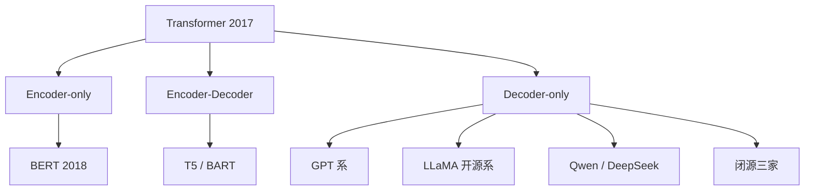
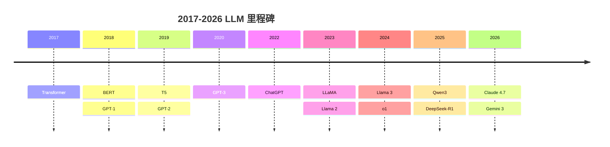
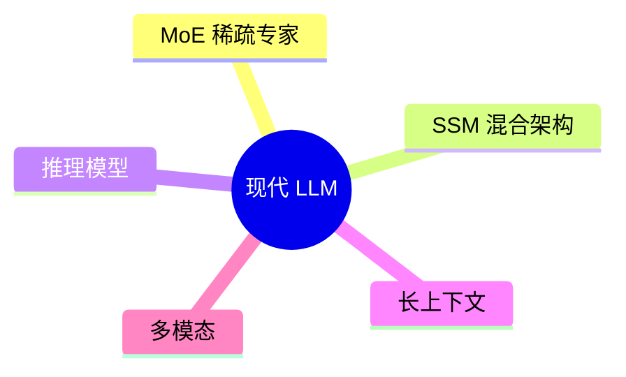
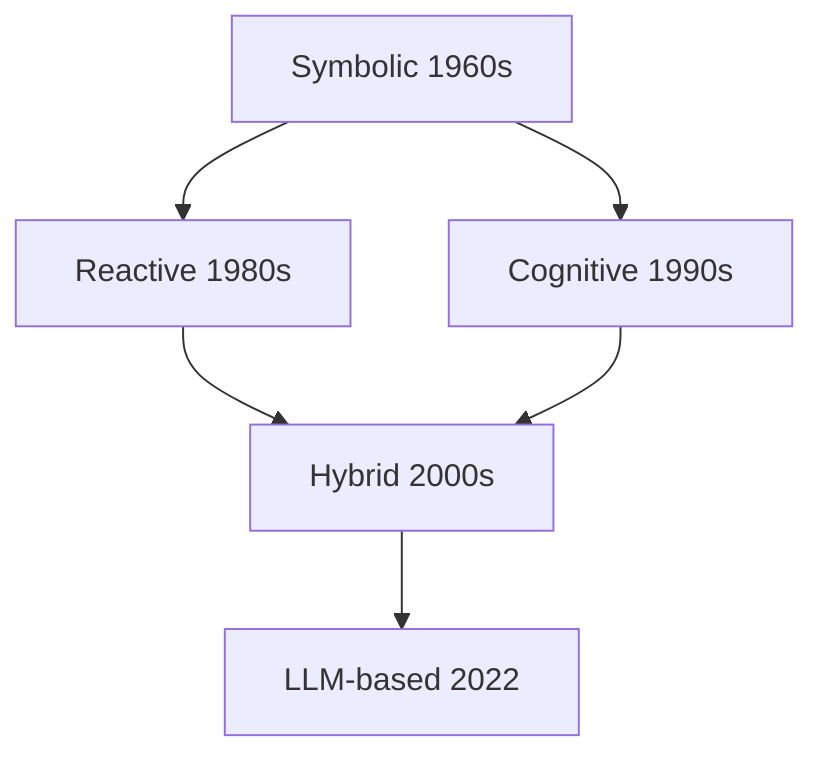
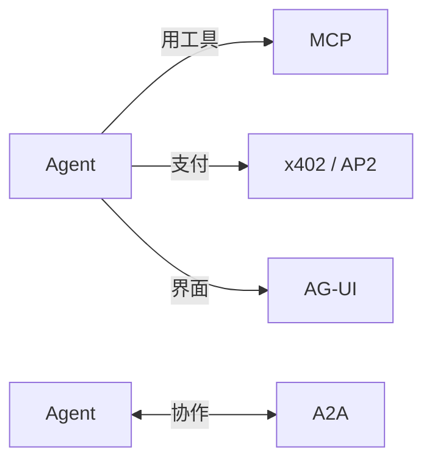
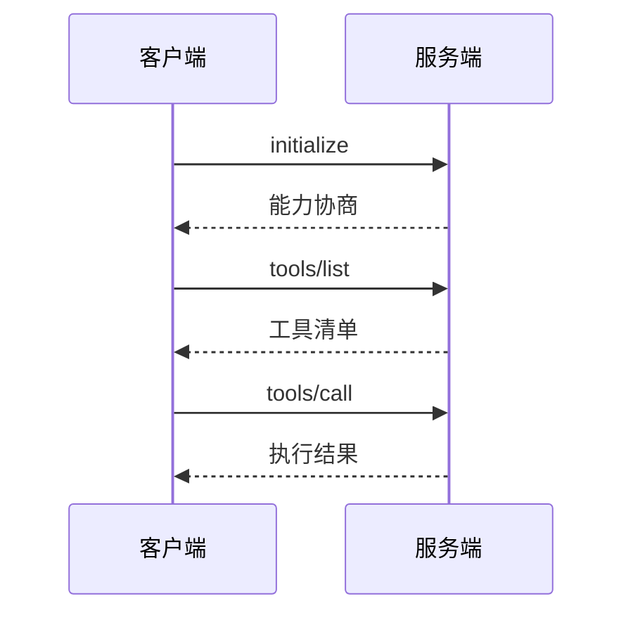
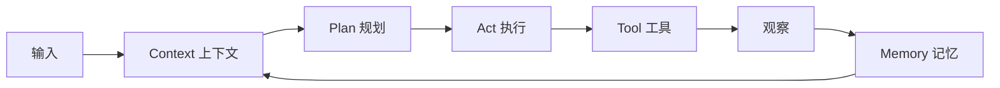

# Part 2 大模型与 Agent 的演进 Implementation Plan

> **For agentic workers:** REQUIRED SUB-SKILL: Use superpowers:subagent-driven-development (recommended) or superpowers:executing-plans to implement this plan task-by-task. Steps use checkbox (`- [ ]`) syntax for tracking.

**Goal:** 在 `/data/projects/agentkit` 中写完 Part 2《大模型与 Agent 的演进》的全部 5 章（Ch6-Ch10）+ 1 个最小 ReAct 示例代码，为《Agent原理及实践》建立 2026 年 LLM 与 Agent 世界的横向时间线。

**Architecture:** 每章一个独立 markdown 文件，按统一模板（标题 → 一句话简介 → 本章目标 → 本章导览（mermaid 总览图）→ 子节正文 → 本章小结 → 本章参考）。历史叙事章（Ch6-Ch9）以图 + 表为主、几乎无代码；仅 Ch10 配一个 ≤50 行、无外部 API 依赖的可运行示例 `code/part-2/react_loop.py`。每章独立 commit，便于 review 与回滚。

**Tech Stack:** Markdown（GitHub Flavored）、Mermaid（GitHub 原生渲染）、Python 3.10+（仅标准库）。

## Global Constraints

[来源：spec docs/superpowers/specs/2026-09-20-agent-principles-practice-part2-design.md + CLAUDE.md，关键项逐字摘录]

- 目标读者：大学本科以上、会写代码、**已完成 Part 1**、无 AI/ML 背景
- **初学者可懂性原则（CLAUDE.md 一·甲，最高优先级，凌驾于完整性/覆盖度之上）：**
  - 一个段落同时塞给读者的新概念 ≤ 3 个；一节 4+ 新概念必须显式分小节
  - 任何公式/抽象概念出现前必须已完成：直觉（plain language）→ 类比 → 视觉（图/表）→ 公式，顺序不可颠倒
  - 同一段英文缩写 ≤ 3 个
  - "一招鲜 + 一句话点名"：主推一种深入讲，其余表格一句话提及
  - worked-example effect：抽象概念前先给具体可触摸的小例子
  - Split-Attention 防护：mermaid 图 / 表格紧贴它解释的段落
  - 每章最多 1-2 个 mermaid 架构图 + 多张局部小图（ASCII / 对比表）
  - 冗余覆盖：关键概念首次讲透，后续小节首段简短回顾
- 总字数：25-30k 字（5 章合计，"字"= 中文字符；`wc -m` ≈ 字数 × 2）
- 单章字数目标（`wc -m`，引导值 ±5%）：Ch6 10500-13000 / Ch7 9500-12000 / Ch8 10500-13000 / Ch9 8500-11000 / Ch10 9500-12000；TOTAL 50000-60000 为硬约束
- 语言：中文（简体）；技术术语首次出现用 `中文名（English term）` 格式，章内保持一致
- 风格：教程式、朋友式；用"读者"、"我们"，避免"您"；段落 3-6 句一个自然段
- Mermaid 仅用六种图（CLAUDE.md 第六节）：`graph` / `flowchart` / `sequenceDiagram` / `mindmap` / `timeline` / `stateDiagram-v2`；节点文字 ≤ 4 个字/词；复杂关系用表格，不堆 mermaid
- 引用：随文 markdown 链接 + 章末"本章参考"（分必读论文 / 推荐博客 / 视频课程 三类）；不使用脚注语法
- **历史事实联网核查强制（CLAUDE.md §十三）**：论文年份、模型发布日期、协议时间线写作时必须 WebSearch 复核；spec 研究笔记中的裸链接（如 `https://arxiv.org`、`https://huggingface.co` 无具体路径）**不得直接引用**，须重新搜索拿到具体 URL
- 代码：仅 Ch10 一个示例；约 50 行有效代码（不含注释与空行，spec"50 行内"按此口径）；Python 标准库、中文注释、文件头 `# runnable: yes`；依赖列在 `code/part-2/README.md`
- 跨章引用 `参见 X.N`；跨 Part `(见 Part N ChM)`，不复制内容
- **Ch10 深度上限（防越界）**：五个工程组件（context / memory / tool / plan / act）每个只给一句话直觉 + 一张局部图，不展开实现细节——展开属于 Part 3（原理）/ Part 5（实现）的范围
- 所有 commit message 末尾加 `Co-Authored-By: Claude Code <noreply@anthropic.com>`
- Out-of-Scope（spec §7）：Transformer/Attention 数学推导→Part 1；RLHF/DPO 细节→Part 1；Agent 算法完整描述（ReAct 完整算法、Reflexion 机制实现）→Part 3；Harness/hooks/permissions/sandbox→Part 4；MCP server 完整实现→Part 5；工业落地/监控/评估/合规→Part 6；LLM 训练数学→Part 1；**逐个横评 LLM**→不做，只取模式抽象

---

## File Structure

新建/修改文件清单：

```
agentkit/
├── README.md                                  # MODIFY：Part 2 状态 → 🚧 写作中 → ✅ 已发布
├── part-2-大模型与agent的演进/
│   ├── README.md                              # CREATE：Part 2 目录与简介
│   ├── ch06-llm家族编年史.md                  # CREATE
│   ├── ch07-现代llm关键变体.md                 # CREATE
│   ├── ch08-agent五十年演进.md                 # CREATE
│   ├── ch09-协议层mcp与a2a.md                  # CREATE
│   └── ch10-从模型到agent.md                   # CREATE
└── code/
    └── part-2/
        ├── README.md                          # CREATE：依赖说明（仅标准库）
        └── react_loop.py                      # CREATE：Ch10 最小 ReAct 循环（runnable）
```

每个 `.md` 章节文件的责任是单一章节的完整内容；不跨章复制内容、不引用未定义的子节。

---

## Task 0：Part 2 项目脚手架

**Files:**
- Modify: `README.md`（阅读路线表 Part 2 行 + 当前进度）
- Create: `part-2-大模型与agent的演进/README.md`
- Create: `code/part-2/README.md`

**Interfaces:**
- Consumes: Part 1 已发布的顶层 README 结构
- Produces: 目录骨架；后续 Task 1-5 的文件落位路径

- [ ] **Step 1：更新顶层 README.md（就地改，不整体覆盖）**

先 `cat README.md` 查看当前内容（Part 1 Task 6 可能刚更新过），然后只做两处修改：

1. 阅读路线表中 Part 2 行状态：`待写作` / `🚧 待写作` → `🚧 写作中`
2. "当前进度"列表追加一行：`- 🚧 Part 2 章节写作`

- [ ] **Step 2：创建 Part 2 README.md**

写入 `/data/projects/agentkit/part-2-大模型与agent的演进/README.md`：

```markdown
# Part 2 大模型与 Agent 的演进

> 从 BERT/GPT 编年史到 MCP/A2A 协议诞生——建立 2026 年 LLM 与 Agent 世界的地图。

## 章节

| 章 | 标题 | 字数 | 阅读时长 |
|---|---|---|---|
| [Ch6](ch06-llm家族编年史.md) | LLM 家族编年史 | ~6k | 25 分钟 |
| [Ch7](ch07-现代llm关键变体.md) | 现代 LLM 的关键变体 | ~5.5k | 25 分钟 |
| [Ch8](ch08-agent五十年演进.md) | Agent 五十年演进 | ~6k | 25 分钟 |
| [Ch9](ch09-协议层mcp与a2a.md) | 协议层的诞生：MCP 与 A2A | ~5k | 20 分钟 |
| [Ch10](ch10-从模型到agent.md) | 从模型到 Agent：必备的工程组件 | ~5.5k | 25 分钟 |

## 一句话简介

Part 1 讲了"LLM 是怎么训练出来的"，Part 2 讲"这一路是怎么走过来的"：LLM 家族 10 年编年史、Agent 的 50 年思想积淀、以及 2024 年起为何突然冒出 MCP / A2A 协议。读完你能在脑中画出一张 2026 年 LLM 与 Agent 世界的地图。

## 配套代码

见 [`code/part-2/`](../code/part-2/)。
```

- [ ] **Step 3：创建 code/part-2/README.md**

写入 `/data/projects/agentkit/code/part-2/README.md`：

```markdown
# Part 2 示例代码

依赖：

- Python ≥ 3.10
- 无第三方库（仅标准库）

| 文件 | 对应章节 | 是否可运行 | 说明 |
|---|---|---|---|
| [`react_loop.py`](react_loop.py) | Ch10 | 是 | 最小 ReAct 循环：Thought → Action → Observation，用规则模拟 LLM 决策，不依赖外部 API |
```

- [ ] **Step 4：验证文件存在**

Run:

```bash
ls "/data/projects/agentkit/part-2-大模型与agent的演进/README.md" \
   /data/projects/agentkit/code/part-2/README.md
```

Expected: 两个文件全部存在，无报错。

- [ ] **Step 5：Commit**

```bash
git add README.md "part-2-大模型与agent的演进/README.md" code/part-2/README.md
git commit -m "Add Part 2 scaffolding (READMEs + directory layout)"
```

---

## Task 1：Ch6 LLM 家族编年史

**Files:**
- Create: `part-2-大模型与agent的演进/ch06-llm家族编年史.md`

**Interfaces:**
- Consumes: Part 1 的 Transformer / 预训练概念（只引用，不重讲）
- Produces: `ch06-llm家族编年史.md`；Ch7 开头回引本章（"上章我们画完了时间线"）

- [ ] **Step 1：创建章节骨架**

写入 `/data/projects/agentkit/part-2-大模型与agent的演进/ch06-llm家族编年史.md`：

````markdown
# Ch6 LLM 家族编年史

> 一句话简介：十年 100+ 个模型，其实只有三条架构路线。

## 本章目标

读完本章你应当能：
- 画出 2017-2026 年 LLM 发展的时间线，标出三个分水岭年
- 区分 Encoder-only / Decoder-only / Encoder-Decoder 三种架构路线，并说出为什么 Decoder-only 赢了
- 说出 GPT、BERT、T5、LLaMA、Qwen、DeepSeek 各自的开创性贡献（每条一句话）
- 解释"开源浪潮"如何改变了 LLM 的竞争格局
- 用一句话回答"为什么 2020 年后几乎所有 LLM 都是 Decoder-only"

## 本章导览



## 6.1 引子：三个分水岭年

## 6.2 三大架构路线

## 6.3 Encoder-only 时代：BERT 与它的继承者

## 6.4 Decoder-only 统一：GPT 系

## 6.5 Encoder-Decoder 路线：T5 与 BART

## 6.6 开源浪潮：LLaMA 系

## 6.7 中文 LLM 双雄：Qwen 与 DeepSeek

## 6.8 闭源前沿：Claude、Gemini、GPT-5

## 6.9 编年总表

## 本章小结

## 本章参考
````

- [ ] **Step 2：起草 6.1 引子：三个分水岭年（~450-550 字）**

覆盖：2017（Transformer 架构诞生，一切起点——回指 Part 1 Ch3 一句即可，`参见 3.1`）、2020（GPT-3 证明"规模"本身是一种能力涌现）、2023（ChatGPT 把 LLM 变成产品，开源与闭源分道扬镳）。类比：像汽车史的 1886（奔驰一号）/ 1908（T 型车）/ 1970s（石油危机催生省油车）。一张三列小表格（年份 / 事件 / 为什么是分水岭）。

- [ ] **Step 3：起草 6.2 三大架构路线（~550-650 字）**

覆盖：三种路线各一句话直觉 + 一个类比（Encoder-only = 只做阅读理解的读者；Decoder-only = 一个字一个字往下写的作家；Encoder-Decoder = 先通读全文再写摘要的译者）。对比表：输入可见性 / 典型任务 / 代表模型。**先类比后术语**，不出现任何公式。

- [ ] **Step 4：起草 6.3 Encoder-only 时代（~550-650 字）**

覆盖：BERT（2018，Devlin et al.）的完形填空式预训练（Masked LM）；为什么它当年碾压排行榜；继承者 RoBERTa / ALBERT / DeBERTa 各一句话点名（表格）；为什么后来掉队——不能顺畅生成文本。论文链接随文给出（写作前 WebSearch 核实 arXiv 编号）。

- [ ] **Step 5：起草 6.4 Decoder-only 统一：GPT 系（~750-850 字）**

覆盖：GPT-1（2018，微调范式）→ GPT-2（2019，"太危险不敢发布"的梗）→ GPT-3（2020，few-shot 涌现，`参见 6.1` 的 2020 分水岭）→ GPT-3.5 / ChatGPT（2022.11 产品拐点）→ GPT-4（2023）→ GPT-4o（2024 多模态）→ GPT-5 与 o 系列（2024.09 o1 开启推理模型，2025 GPT-5——**写作时 WebSearch 核实发布日期与命名**）。用一张"阶梯图"式 ASCII 或表格展示代际递进。不横评，只讲每代的"开创性一句话"。

- [ ] **Step 6：起草 6.5 Encoder-Decoder 路线（~450-550 字）**

覆盖：T5（2019，"text-to-text" 把所有任务统一成生成问题）与 BART；这条路线为何式微（seq2seq 任务被 Decoder-only + 指令微调吸收；如今主要活在翻译/摘要专用模型里）。类比：全能翻译官 vs 专用速记员的职业变迁。

- [ ] **Step 7：起草 6.6 开源浪潮：LLaMA 系（~650-750 字）**

覆盖：LLaMA 1（2023.02，Meta 泄漏事件如何引爆开源生态）→ Llama 2（2023.07，商用许可）→ Llama 3 / 3.1（2024）→ Llama 4 Scout/Maverick（2025.04）→ **2026 转向：LLaMA 4 Behemoth 放弃公开发布（Reuters 2026.03）、Meta Superintelligence Labs 转向闭权重 Muse Spark（2026.04）——写作时必须 WebSearch 核实这两个事件的最新状态**。金句方向："开源浪潮真正改变的不是模型本身，而是'谁能 fine-tune'的准入门槛"。LLaMA 论文链接随文给。

- [ ] **Step 8：起草 6.7 中文 LLM 双雄（~650-750 字）**

覆盖：Qwen 系（阿里，Qwen 2.5 → Qwen3 2025.04 hybrid thinking 一键切换思考/非思考模式）与 DeepSeek 系（V3 → R1 2025.01 推理模型开源震撼 → V3.2 sparse attention）——各自"开创性一句话"；两者共同点：开源权重 + 便宜推理 API 改变了全球开发者的默认选项。**日期与版本写作时 WebSearch 核实**。不与 LLaMA/GPT 横评。

- [ ] **Step 9：起草 6.8 闭源前沿（~550-650 字）**

覆盖：Claude / Gemini / GPT 三家 2026 现状与"分工"（只描述定位差异，不跑 benchmark 对比——违反 Out-of-Scope）。每个模型一句话 + 发布日期（全部 WebSearch 核实，含 spec 笔记中的 Claude 4.7 Opus 2026.02、Gemini 3 Pro）。类比：三家像三家航空公司——路线不同，安全标准（对齐）都是刚需。

- [ ] **Step 10：起草 6.9 编年总表（~350-450 字 + timeline 图）**

写 `mermaid timeline` 总览（这是本章第 2 张、也是最后一张 mermaid）：



（每个条目写作时核实；timeline 紧跟一段 3-4 句解读文字——哪几年密集、哪几年是拐点。）配一张 6.2 三大路线的回看小结表。

- [ ] **Step 11：写本章小结**

5-6 条 bullet：三条路线与胜负原因 / 三个分水岭年 / 开源改变准入门槛 / 2026 闭源前沿格局 / 预告 Ch7"今天的模型长什么样"（一句话衔接）。

- [ ] **Step 12：写本章参考**

分三类，写作前全部 WebSearch 核实链接有效：

- 必读论文：
  - [Attention Is All You Need (Vaswani et al., 2017)](https://arxiv.org/abs/1706.03762)
  - [BERT (Devlin et al., 2018)](https://arxiv.org/abs/1810.04805)
  - [Language Models are Few-Shot Learners (Brown et al., 2020)](https://arxiv.org/abs/2005.14165)
  - [LLaMA: Open and Efficient Foundation Language Models (2023)](https://arxiv.org/abs/2302.13971)
- 推荐博客 / 教程：
  - [The Illustrated BERT (Alammar)](https://jalammar.github.io/illustrated-bert/)
  - [Open LLM Leaderboard (Hugging Face)](https://huggingface.co/spaces/open-llm-leaderboard/open_llm_leaderboard)
- 视频 / 课程：
  - [Andrej Karpathy - Intro to Large Language Models](https://www.youtube.com/watch?v=zjkBMFhNj_g)

- [ ] **Step 13：字数与结构检查**

```bash
cd "/data/projects/agentkit/part-2-大模型与agent的演进"
wc -m ch06-llm家族编年史.md
grep -c "^## " ch06-llm家族编年史.md
grep -c '```mermaid' ch06-llm家族编年史.md
```

Expected: `wc -m` 在 10500-13000；`^## ` = 13（本章目标 + 本章导览 + 9 子节 + 本章小结 + 本章参考）；mermaid 块 = 2（导览 graph + timeline）。

- [ ] **Step 14：Commit**

```bash
git add "part-2-大模型与agent的演进/ch06-llm家族编年史.md"
git commit -m "Add Ch6: LLM 家族编年史"
```

---

## Task 2：Ch7 现代 LLM 的关键变体

**Files:**
- Create: `part-2-大模型与agent的演进/ch07-现代llm关键变体.md`

**Interfaces:**
- Consumes: Ch6 的时间线（开篇回引"上章画完了时间线"）；Part 1 Ch3.10 的"现代变体一句话预告"（本章兑现承诺）
- Produces: `ch07-现代llm关键变体.md`；Ch8 开头引用"架构讲完，下一站：Agent"

- [ ] **Step 1：创建章节骨架**

写入 `/data/projects/agentkit/part-2-大模型与agent的演进/ch07-现代llm关键变体.md`：

````markdown
# Ch7 现代 LLM 的关键变体

> 一句话简介：当代模型身上贴着五个标签，每个标签解决一个具体痛点。

## 本章目标

读完本章你应当能：
- 说出当代 SOTA LLM 的五个关键标签（MoE / SSM 混合 / 推理模型 / 长上下文 / 多模态），并用一句话解释每个的动机
- 用一个生活类比解释 MoE 稀疏激活为什么省钱
- 说明 Transformer 在长序列上贵在哪里、SSM 的解法思路
- 说出推理模型"思考更久答更好"背后的训练与推理两种算力
- 用一句话点名 RMSNorm / SwiGLU / RoPE 等现代组件各自替换掉了什么

## 本章导览



## 7.1 引子：为什么 2023 后的模型"长得不一样"

## 7.2 MoE：稀疏激活的专家

## 7.3 SSM 与 Mamba：不走寻常路的长序列

## 7.4 混合架构：Attention 遇见 SSM

## 7.5 推理模型：思考更久，答得更好

## 7.6 长上下文与 KV cache

## 7.7 多模态原生化

## 7.8 现代组件一句话点名

## 本章小结

## 本章参考
````

- [ ] **Step 2：起草 7.1 引子（~350-450 字）**

覆盖：Ch6 的模型按"家族"排，本章换一个视角——按"技术标签"排；五个标签各解决一个痛点（贵、长、慢、窄、单模态）。类比：手机的五个卖点（芯片/电池/快充/屏幕/相机）。预告 mindmap 图紧贴本段。

- [ ] **Step 3：起草 7.2 MoE（~650-750 字，本章"一招鲜"主推项）**

覆盖：直觉先行——"不是所有问题都需要全部专家"；类比：医院分诊（全院会诊 vs 挂对科室）；**worked example**：一个 8×2 MoE 的 3 行数字示例（2 个专家、每次只激活 1 个）；然后才给一句形式化（稀疏激活 = 每 token 只走一小部分参数）。一句话点名：Switch Transformer / Mixtral / DeepSeek-V3 / Qwen3-MoE（表格一行一个）。**不给训练公式**。

- [ ] **Step 4：起草 7.3 SSM 与 Mamba（~650-750 字）**

覆盖：痛点直觉——Transformer 的 attention 对每对 token 都要"互看一眼"，序列翻倍计算翻四倍（回指 Part 1 `参见 3.4` 一句）；类比：读书时的"便签纸"——SSM 像不断滚动更新的一页便签，永远只带最相关的信息往下走；Mamba（2023.12，Gu & Dao）一句话定位 + arXiv 链接。**不推导状态方程**，最多一个"输入 → 状态滚动 → 输出"的 ASCII 小图。

- [ ] **Step 5：起草 7.4 混合架构（~450-550 字）**

覆盖：SSM 的短板（精确回忆"第 3 页第 2 行写了啥"不如 attention）→ 混合是当前共识；Jamba（AI21，2024.03）、Nemotron-H（NVIDIA，2025）、Falcon-H1（TII，2025）表格一句话点名（配比：约 1 个 Attention 配 5-7 个 SSM 层——写作时核实具体配比数字来源）。金句方向："混合不是骑墙，是各取所长"。

- [ ] **Step 6：起草 7.5 推理模型（~650-750 字）**

覆盖：直觉——"抢答选手 vs 打草稿选手"（回指 Part 1 Ch5.8 已建立的类比，一句带过）；时间线：o1（2024.09）→ o3 → DeepSeek-R1（2025.01，开源推理）→ Qwen3 Thinking；**震撼数据**：o1 在 AIME 2024 拿到 74/100 而 GPT-4o 约 12%（内联链接 OpenAI 官方，写作时复核）；区分两种算力：训练时学"思考"（RL + 过程奖励）、推理时多花 token——一张两行对比表。

- [ ] **Step 7：起草 7.6 长上下文与 KV cache（~550-650 字）**

覆盖：需求侧直觉（整本书塞进一次对话）；4K → 128K → 1M 的台阶（表格 + 代表模型年份）；为什么长了贵：KV cache 是"草稿纸的副本"，每个 token 都要存自己那份（类比：会议室白板，人越多白板越占地方）；缓解手段一句话点名：GQA / MQA / KV 量化 / 6.3 的 sparse attention（不展开，Part 4 上下文工程再会）。

- [ ] **Step 8：起草 7.7 多模态原生化（~450-550 字）**

覆盖：两条路线对比（CLIP-style：视觉编码器 + 投影层拼给 LLM；Native：图文音统一成 token 一体训练）——一张 ASCII 或小表；代表：GPT-4o / Gemini（写作时核实一句话定位）；挑战一句话点名（跨模态对齐、细粒度、长视频）。

- [ ] **Step 9：起草 7.8 现代组件一句话点名（~350-450 字）**

严格"一招鲜 + 一句话点名"：表格列出 RMSNorm / SwiGLU / RoPE / ALiBi / YaRN，每行两列——"它替换/解决了什么"（如 RoPE → 位置编码的外推问题，Part 1 已讲 `参见 3.5`）。明确写"以上只需记住名字和一句话动机，实现细节 Part 2 不展开"。本节**不出现新公式**。

- [ ] **Step 10：写本章小结**

5-6 条 bullet：五个标签各一句话动机 + 一句"贴着这五个标签的模型，就是 2026 年你调用的那些 API"。

- [ ] **Step 11：写本章参考**

- 必读论文：
  - [Switch Transformer (Fedus et al., 2021)](https://arxiv.org/abs/2101.03961)
  - [Mixtral of Experts (2024)](https://arxiv.org/abs/2401.04088)
  - [Mamba: Linear-Time Sequence Modeling with Selective State Spaces (2023)](https://arxiv.org/abs/2312.00752)
  - [Jamba: A Hybrid Transformer-Mamba Language Model (2024)](https://arxiv.org/abs/2403.19887)
  - [DeepSeek-R1 (2025)](https://arxiv.org/abs/2501.12948)
- 推荐博客 / 教程：
  - [The Illustrated Transformer (Alammar)](https://jalammar.github.io/illustrated-transformer/) —— 复习用
- 视频 / 课程：
  - [Andrej Karpathy - Let's build GPT](https://www.youtube.com/watch?v=kCc8FmEb1nY)

- [ ] **Step 12：字数与结构检查**

```bash
cd "/data/projects/agentkit/part-2-大模型与agent的演进"
wc -m ch07-现代llm关键变体.md
grep -c "^## " ch07-现代llm关键变体.md
grep -c '```mermaid' ch07-现代llm关键变体.md
```

Expected: `wc -m` 在 9500-12000；`^## ` = 12（目标 + 导览 + 8 子节 + 小结 + 参考）；mermaid = 1（mindmap 导览；局部图用 ASCII/表格）。

- [ ] **Step 13：Commit**

```bash
git add "part-2-大模型与agent的演进/ch07-现代llm关键变体.md"
git commit -m "Add Ch7: 现代 LLM 的关键变体"
```

---

## Task 3：Ch8 Agent 五十年演进

**Files:**
- Create: `part-2-大模型与agent的演进/ch08-agent五十年演进.md`

**Interfaces:**
- Consumes: Ch6/Ch7 建立的"模型"视角（本章切换到"Agent"视角）
- Produces: `ch08-agent五十年演进.md`；四阶段框架（Symbolic → Reactive → Cognitive → LLM-based）是 Part 3 Ch11 认知架构的历史前奏

- [ ] **Step 1：创建章节骨架**

写入 `/data/projects/agentkit/part-2-大模型与agent的演进/ch08-agent五十年演进.md`：

````markdown
# Ch8 Agent 五十年演进

> 一句话简介：Agent 不是 2023 年的发明，它有 50 年的思想积淀。

## 本章目标

读完本章你应当能：
- 说出 Agent 演进的四个阶段及每阶段的代表工作（各一句话）
- 复述 Agent 的工作定义（自主性 / 反应性 / 主动性 / 社会性），并为每个性质举一个生活例子
- 解释 Symbolic 与 Reactive 两派的核心分歧（"先想后做" vs "先做后想"）
- 用一句话说明为什么 2022 年后 Agent 范式被 LLM-based 统治
- 指出四条路线留下的、至今仍在当代 Agent 设计中出现的通用模式（perception / memory / planning / action）

## 本章导览



## 8.1 引子：Agent 不是一个新词

## 8.2 Agent 的工作定义

## 8.3 Symbolic Agents：规则与逻辑的辉煌

## 8.4 Reactive Agents：不思考，直接反应

## 8.5 Cognitive Agents：BDI 与心智模型

## 8.6 混合架构：分层各司其职

## 8.7 LLM-based Agents：LLM 当大脑

## 8.8 五十年演进全景

## 本章小结

## 本章参考
````

- [ ] **Step 2：起草 8.1 引子（~350-450 字）**

覆盖："Agent"在 CS 里 1960 年代就有（Nilsson 的 Shaky 机器人等一句话点名）；本章回答"这个词一路变成了什么意思"。类比：像"黑客"一词——从 1960s 到今天的语义漂移。

- [ ] **Step 3：起草 8.2 Agent 的工作定义（~500-600 字）**

覆盖：Wooldridge & Jennings（1995）"Intelligent Agents: Theory and Practice"（随文链接，核实 DOI）；四性质各配一个生活类比 + 一句反例（自主性=空调自动调温不等你按遥控；反应性=接住掉落的杯子；主动性=主动带伞；社会性=团队分工传球）。一张 2×4 小表。**先例子后术语**。

- [ ] **Step 4：起草 8.3 Symbolic Agents（~650-750 字）**

覆盖：核心信念"智能 = 符号推理"；代表作各一句话：Logic Theorist（1956，机器证明定理）/ General Problem Solver（1956）/ SHRDLU（1970，积木世界）/ MYCIN（1970s，专家系统诊断血液感染）；类比：智能是一本写死的食谱/流程图；辉煌与局限（环境一变规则就崩——"脆弱性"）。论文/资料链接写作时 WebSearch 核实。

- [ ] **Step 5：起草 8.4 Reactive Agents（~550-650 字）**

覆盖：Rodney Brooks "Intelligence Without Representation"（1991，核实 DOI）；subsumption architecture（层叠行为：躲障碍 > 乱走）；类比：蟑螂——没有地图照样活；核心挑战："表示"真的是必需的吗？与 Symbolic 的分歧一句话：**先想后做 vs 先做后想**。

- [ ] **Step 6：起草 8.5 Cognitive Agents（~550-650 字）**

覆盖：BDI（Belief-Desire-Intention，信念-愿望-意图）模型 + SOAR / ACT-R 各一句话；类比：出门约会的决策（信念=知道地铁末班车 23 点；愿望=准时到；意图=现在就去坐地铁）；配一张 ASCII 循环框图：`感知 → 更新信念 → 愿望过滤 → 意图形成 → 规划 → 行动 → 环境`（回环箭头）。

- [ ] **Step 7：起草 8.6 混合架构（~400-500 字）**

覆盖：InteRRaP / TouringMachines 各一句话；分层思想：底层 reactive 保命、上层 deliberative 规划——**这个分层模式在今天的 Agent harness 里依然出现**（一句话预告 Part 4，不展开）。

- [ ] **Step 8：起草 8.7 LLM-based Agents（~750-850 字）**

覆盖：2022.10 ReAct（Yao et al.，arXiv:2210.03629 随文链接）把 Thought-Action-Observation 变成通用循环；2023 浪潮：Toolformer（2023.02）/ AutoGPT（2023.03）/ Reflexion（2023.03）/ BabyAGI（2023.03）各一句话 + 一张时间线小表；重点写"**为什么是 LLM 赢了**"——前四代都卡在"表示与规划写死"，LLM 把 natural language 当作通用的表示与规划介质。**明确写：这些范式的算法细节 Part 3 展开（见 Part 3 Ch12），本章只讲历史位置**。

- [ ] **Step 9：起草 8.8 五十年演进全景（~300-400 字 + 对比表）**

四阶段对比表（年代 / 代表工作 / 核心思想 / 局限 / 遗产）——本章的收束锚点，紧贴一段"遗产"解读：reaction 的快速通路、BDI 的意图分层、至今仍是 Part 3 认知架构的原料。本节不再加 mermaid（导览图已完成定锚）。

- [ ] **Step 10：写本章小结**

5-6 条 bullet：四阶段一句话 / 四性质 / "先想后做 vs 先做后想"之争如何被 LLM 统一 / 预告 Ch9"模型和 Agent 都齐了，谁来定接口？"

- [ ] **Step 11：写本章参考**

- 必读论文 / 经典：
  - [Intelligent Agents: Theory and Practice (Wooldridge & Jennings, 1995)](https://dl.acm.org/doi/10.1145/204889.204891)
  - [Intelligence Without Representation (Brooks, 1991)](https://doi.org/10.1016/0004-3702(91)90054-P)
  - [ReAct: Synergizing Reasoning and Acting in Language Models (Yao et al., 2022)](https://arxiv.org/abs/2210.03629)
  - [Reflexion: Language Agents with Verbal Reinforcement Learning (2023)](https://arxiv.org/abs/2303.11366)
- 推荐博客 / 教程：
  - 写作时 WebSearch 补 1-2 篇 subsumption architecture / BDI 的入门综述
- 视频 / 课程：
  - [Rodney Brooks - Intelligence Without Representation (演讲录像)](https://www.youtube.com/results?search_query=rodney+brooks+intelligence+without+representation)（写作时挑一个具体可信链接）

- [ ] **Step 12：字数与结构检查**

```bash
cd "/data/projects/agentkit/part-2-大模型与agent的演进"
wc -m ch08-agent五十年演进.md
grep -c "^## " ch08-agent五十年演进.md
grep -c '```mermaid' ch08-agent五十年演进.md
```

Expected: `wc -m` 在 10500-13000；`^## ` = 12（目标 + 导览 + 8 子节 + 小结 + 参考）；mermaid = 1（导览；BDI 用 ASCII）。

- [ ] **Step 13：Commit**

```bash
git add "part-2-大模型与agent的演进/ch08-agent五十年演进.md"
git commit -m "Add Ch8: Agent 五十年演进"
```

---

## Task 4：Ch9 协议层的诞生：MCP 与 A2A

**Files:**
- Create: `part-2-大模型与agent的演进/ch09-协议层mcp与a2a.md`

**Interfaces:**
- Consumes: Ch8 结尾"谁来定接口"的问题
- Produces: `ch09-协议层mcp与a2a.md`；MCP/A2A 的起源与动机 → Part 4 Ch17/Ch18 深入实现

- [ ] **Step 1：创建章节骨架**

写入 `/data/projects/agentkit/part-2-大模型与agent的演进/ch09-协议层mcp与a2a.md`：

````markdown
# Ch9 协议层的诞生：MCP 与 A2A

> 一句话简介：Agent 时代的"USB-C 时刻"——工具与协作的统一接口。

## 本章目标

读完本章你应当能：
- 用"每台打印机都要专用驱动"的痛点解释协议层为什么会出现
- 说出 MCP 的起源（时间、发起方、灵感来源）与三大原语（Tools / Resources / Prompts）
- 看懂一张 MCP 客户端调用工具的四步时序图
- 说出 A2A 的起源与它和 MCP 的分工（Agent↔工具 vs Agent↔Agent）
- 用一张表列出 x402 / AP2 / AG-UI 的一句话定位

## 本章导览



## 9.1 引子：为什么突然冒出"协议"

## 9.2 MCP 起源：从 LSP 到 Model Context Protocol

## 9.3 MCP 三大原语

## 9.4 MCP 传输层：stdio 与 Streamable HTTP

## 9.5 MCP 生态时间线

## 9.6 A2A 起源：Google 发起的协作协议

## 9.7 A2A 与 MCP：互补不竞争

## 9.8 一句话点名其他协议

## 本章小结

## 本章参考
````

- [ ] **Step 2：起草 9.1 引子（~350-450 字）**

覆盖：2024 年前的痛点——每个模型接每个工具都要写一套专属胶水（N×M 问题，一张 2 列 ASCII 网状图）；类比：打印机专用驱动 → USB-C；一句话预告本章两个协议各解决什么。

- [ ] **Step 3：起草 9.2 MCP 起源（~550-650 字）**

覆盖：2024.11.25 Anthropic 发布 MCP；主创 David Soria Parra、Justin Spahr-Summers（写作时 WebSearch 核实姓名拼写与角色）；灵感来自 LSP（Language Server Protocol）——类比详写：LSP 让一个编辑器通吃所有语言，MCP 让一个 Agent 通吃所有工具；给出 MCP 官网/modelcontextprotocol.io 链接。

- [ ] **Step 4：起草 9.3 MCP 三大原语（~550-650 字）**

覆盖：Tools（可执行的动作）/ Resources（可读取的数据）/ Prompts（提示模板）各一句话直觉 + 一个类比（Tools = 厨房里可操作的厨具；Resources = 食材架上可读的食材；Prompts = 菜谱模板）；一张三行对比表（原语 / 方向 / 例子）。**只讲概念，不写代码**（实现 → Part 5）。

- [ ] **Step 5：起草 9.4 MCP 传输层（~500-600 字）**

覆盖：stdio（本地：客户端直接拉起子进程，类比：插 U 盘）vs Streamable HTTP（远程：走 HTTP 且支持服务端推送，类比：快递柜 + 实时物流推送）；为什么裸 HTTP 不够（工具执行可能耗时、需要流式中间结果）；**spec 笔记：2026.07.28 规范中 SSE 独立传输已废弃并入 Streamable HTTP、Sampling 已废弃——写作时 WebSearch 核实最新规范状态再写**。配本章第 2 张 mermaid——四步时序图：



- [ ] **Step 6：起草 9.5 MCP 生态时间线（~400-500 字 + 表格）**

覆盖（全部 WebSearch 核实日期）：2025.03 OpenAI 采纳 → 2025.04 Google DeepMind 支持 → 2025.05 Microsoft Windows 原生 → 2025.12.09 捐赠 Linux Foundation AAIF；解读 2-3 句：从"一家的接口"到"行业公共基础设施"的标志。用表格而非 mermaid（本章 mermaid 预算已用完）。

- [ ] **Step 7：起草 9.6 A2A 起源（~450-550 字）**

覆盖：2025.04.09 Google 发起（与 500+ 家企业同期公布——写作时核实数字）；目标：跨厂商 / 跨框架的 Agent 协作；核心抽象一句话点名：Agent Card（能力名片）+ Task（任务生命周期）；2026.04 v1.0 进入 Linux Foundation、150+ 组织支持（核实）。类比：公司间的合作协议 vs 公司内的岗位说明书（与 MCP 的关系留给 9.7）。

- [ ] **Step 8：起草 9.7 A2A 与 MCP：互补不竞争（~450-550 字）**

覆盖：一张对比表（解决什么问题 / 通信双方 / 发起方 / 时间 / 核心抽象）；类比收束：MCP 是"手"（Agent 操控工具的标准手），A2A 是"电话"（Agent 之间通话的标准协议）；点破初学者常见误解："A2A 是 MCP 的升级版"——错，二者不在同一层。

- [ ] **Step 9：起草 9.8 一句话点名其他协议（~300-400 字 + 表格）**

x402（HTTP 402 复活：链上支付）/ AP2（代理支付授权）/ AG-UI（Agent 驱动的 UI 事件协议）——每行：名字 / 一句话定位 / 详见 Part N（x402、AG-UI → Part 5）。明确"本章不展开"。

- [ ] **Step 10：写本章小结**

5-6 条：协议层 = USB-C 时刻 / MCP 起源与三原语 / A2A 分工 / 互补关系 / 预告 Ch10"协议有了，一个最小 Agent 还差哪几块积木"。

- [ ] **Step 11：写本章参考**

- 必读（官方文档优先）：
  - [Model Context Protocol 官网](https://modelcontextprotocol.io)
  - [MCP GitHub](https://github.com/modelcontextprotocol)
  - [A2A GitHub (google/A2A)](https://github.com/google/A2A)
  - [Model Context Protocol - Wikipedia](https://en.wikipedia.org/wiki/Model_Context_Protocol)
- 推荐博客 / 教程：
  - [Announcing the Agent2Agent Protocol (Google Developers Blog, 2025.04)](https://developers.googleblog.com/en/announcing-the-agent2agent-protocol-a2a/)（写作时核实最终 URL）
- 视频 / 课程：
  - 写作时 WebSearch 挑 1 个 MCP 官方介绍视频

- [ ] **Step 12：字数与结构检查**

```bash
cd "/data/projects/agentkit/part-2-大模型与agent的演进"
wc -m ch09-协议层mcp与a2a.md
grep -c "^## " ch09-协议层mcp与a2a.md
grep -c '```mermaid' ch09-协议层mcp与a2a.md
```

Expected: `wc -m` 在 8500-11000；`^## ` = 12（目标 + 导览 + 8 子节 + 小结 + 参考）；mermaid = 2（导览 graph LR + 9.4 sequenceDiagram）。

- [ ] **Step 13：Commit**

```bash
git add "part-2-大模型与agent的演进/ch09-协议层mcp与a2a.md"
git commit -m "Add Ch9: 协议层的诞生 MCP 与 A2A"
```

---

## Task 5：Ch10 从模型到 Agent + react_loop.py

**Files:**
- Create: `part-2-大模型与agent的演进/ch10-从模型到agent.md`
- Create: `code/part-2/react_loop.py`

**Interfaces:**
- Consumes: Ch8 的四阶段与 LLM-based 定位、Ch9 的协议背景
- Produces: `ch10-从模型到agent.md`；`code/part-2/react_loop.py`（被正文 10.8 引用）；Part 3 衔接节

- [ ] **Step 1：创建 react_loop.py（先代码后正文，正文引用真实输出）**

写入 `/data/projects/agentkit/code/part-2/react_loop.py`：

```python
# runnable: yes
# 最小 ReAct 循环（Ch10 配套示例）
# 依赖：Python >= 3.10，仅标准库；用规则模拟 LLM 的 Thought/Action 决策，不依赖外部 API
# 目的：让读者看见 Thought -> Action -> Observation 三步循环的真实数据流

# ---------- 两个模拟工具 ----------
def search(query: str) -> str:
    """检索工具：从内置小知识库里找事实"""
    kb = {"法国首都": "法国的首都是巴黎，人口约 210 万"}
    for key, fact in kb.items():
        if key in query:
            return fact
    return "没查到。"


def calc(expr: str) -> str:
    """计算工具：支持 a + b / a * b（仅演示，生产环境勿用 eval）"""
    try:
        return str(eval(expr, {"__builtins__": {}}, {}))
    except Exception:
        return "算式无法解析。"


TOOLS = {"search": search, "calc": calc}


# ---------- 用规则模拟 LLM 的"思考" ----------
def llm_decide(observations: list) -> str:
    """根据已有观察决定下一步。真实系统里这里是 LLM 补全。"""
    if not observations:
        return "Thought: 需要先知道巴黎人口\nAction: search: 法国首都人口"
    if len(observations) == 1:
        return "Thought: 拿到人口 210 万，接下来算两倍\nAction: calc: 210 * 2"
    return "Thought: 已经算出结果\nFinal Answer: " + observations[-1] + " 万"


# ---------- ReAct 主循环 ----------
def react(question: str, max_steps: int = 5) -> str:
    observations = []
    for _ in range(max_steps):
        decision = llm_decide(observations)
        print(decision)
        if decision.startswith("Final Answer"):
            return decision.replace("Final Answer: ", "")
        # 解析最后一行 "Action: tool_name: argument"
        action_line = decision.splitlines()[-1]
        tool_name, _, argument = action_line.replace("Action: ", "").partition(": ")
        observation = TOOLS[tool_name](argument.strip())
        observations.append(observation)
        print("Observation: " + observation)
    return "达到最大步数，未得到答案。"


if __name__ == "__main__":
    answer = react("法国首都人口的两倍是多少？")
    print("\n>>> " + answer)
```

- [ ] **Step 2：运行 react_loop.py 验证**

Run: `python /data/projects/agentkit/code/part-2/react_loop.py`
Expected: 退出码 0，输出依次为：

```
Thought: 需要先知道巴黎人口
Action: search: 法国首都人口
Observation: 法国的首都是巴黎，人口约 210 万
Thought: 拿到人口 210 万，接下来算两倍
Action: calc: 210 * 2
Observation: 420
Thought: 已经算出结果
Final Answer: 420 万

>>> 420 万
```

- [ ] **Step 3：创建章节骨架**

写入 `/data/projects/agentkit/part-2-大模型与agent的演进/ch10-从模型到agent.md`：

````markdown
# Ch10 从模型到 Agent：必备的工程组件

> 一句话简介：LLM 只是大脑，Agent 是大脑 + 身体——本章给出身体的五块积木。

## 本章目标

读完本章你应当能：
- 说出最小 Agent 系统的五个工程组件（context / memory / tool / plan / act），并为每个画一张草图
- 用一句话解释上下文工程到底在"工程"什么
- 区分短期记忆、工作记忆、长期记忆三层各自存什么
- 描述 RAG 的三步流水线，并说出它解决什么问题
- 逐行走读一个 50 行的 ReAct 循环示例，说出每一步的数据流

## 本章导览



## 10.1 引子：LLM ≠ Agent

## 10.2 上下文工程

## 10.3 记忆三层

## 10.4 工具调用

## 10.5 RAG 的直觉

## 10.6 多 Agent 协作

## 10.7 代码即工具

## 10.8 一个最小 ReAct 循环

## 本章小结

## Part 3 衔接

## 本章参考
````

- [ ] **Step 4：起草 10.1 引子（~350-450 字）**

覆盖：类比——LLM 是大脑，但只有大脑没法干活：还需要感官（感知与上下文）、小脑（记忆）、手（工具）、执行计划的习惯（规划-行动）；一句话点出五组件与导览图（图紧贴本段）；声明本章是"预告深度"——每个组件一句话直觉，实现分别在 Part 3 / Part 4 / Part 5。

- [ ] **Step 5：起草 10.2 上下文工程（~450-550 字）**

覆盖：一句话直觉——"把该看的信息在正确时机塞进有限的窗口"；类比：办公桌上摊开的资料（桌面 = context window，只放此刻要用的）；拼装的三味原料：system prompt / 历史对话 / 工具结果，各一句话；一张 3 行 ASCII 拼装示意。**不展开压缩/裁剪策略**（→ Part 4 Ch19）。

- [ ] **Step 6：起草 10.3 记忆三层（~450-550 字）**

覆盖：短期（in-context，本次对话）/ 工作记忆（scratchpad，草稿纸，本轮任务中间结果）/ 长期（跨会话，向量库或文件）——各一句直觉 + 一个类比（便签 / 草稿纸 / 笔记本）；一张三行表格；预告"怎么实现 → Part 3 Ch13 + Part 4。

- [ ] **Step 7：起草 10.4 工具调用（~450-550 字）**

覆盖：一句话——"让模型输出一段结构化的'我想调 XX 工具'，由宿主程序真的去执行"；时间线一句话：OpenAI Function Calling（2023.06，写作时核实日期）→ 今天借 MCP 标准化（回指 `参见 9.3`）；一张 ASCII 数据流：模型输出 JSON → 宿主校验 → 执行 → 结果回填上下文。**不写真实 API 代码**（→ Part 5 Ch22）。

- [ ] **Step 8：起草 10.5 RAG 的直觉（~400-500 字）**

覆盖：痛点——模型不知道你的私有文档且会编；三步流水线：检索 → 拼上下文 → 生成，每步一句话 + 一个类比（开卷考试：考前把对的那几页翻出来摊在桌上）；一句话预告完整实现（agentic RAG → Part 5）。

- [ ] **Step 9：起草 10.6 多 Agent 协作（~400-500 字）**

覆盖：为什么一个 Agent 不够（上下文窗口有限、专业分工）；orchestrator + sub-agent 模式一句话 +  ASCII 小图（工头与工人）；通信标准化靠 A2A（回指 `参见 9.6`）；实现 → Part 5 Ch24。

- [ ] **Step 10：起草 10.7 代码即工具（~350-450 字）**

覆盖：让 Agent 直接写代码/跑 shell 为什么是"万能工具"（任意计算、任意文件操作都能被它兜底）；一句话安全提醒（执行任意代码必须沙箱——细节 → Part 4 Ch20）。

- [ ] **Step 11：起草 10.8 一个最小 ReAct 循环（~500-600 字 + 代码引用）**

覆盖：Thought → Action → Observation 三步一句话各；ASCII 三角循环小图；引用真实文件 `code/part-2/react_loop.py`（用 markdown 链接 `../code/part-2/react_loop.py`），贴出**运行输出**（Step 2 的实际输出，不是伪代码），逐行走读 3 句（search 返回 → 回填观察 → 下一轮决策）；点明"真实系统里 `llm_decide` 换成 LLM API 调用，循环骨架不变"。

- [ ] **Step 12：写本章小结 + Part 3 衔接**

`## 本章小结`：5-6 条五组件各一句话。
`## Part 3 衔接`：一段（4-6 句）——本章给了"身体的积木清单"，Part 3 从原理层回答"这些积木如何组成认知架构、ReAct/Reflexion 等范式如何驱动循环"；不展开 Part 3 内容（CLAUDE.md 第九节：衔接不展开）。

- [ ] **Step 13：写本章参考**

- 必读论文：
  - [ReAct: Synergizing Reasoning and Acting in Language Models (Yao et al., 2022)](https://arxiv.org/abs/2210.03629)
  - [Toolformer: Language Models Can Teach Themselves to Use Tools (2023)](https://arxiv.org/abs/2302.04761)
  - [Retrieval-Augmented Generation for Knowledge-Intensive NLP (Lewis et al., 2020)](https://arxiv.org/abs/2005.11401)
- 推荐博客 / 教程：
  - 写作时 WebSearch 补 1 篇"context engineering"的权威出处文（如 Anthropic / LangChain 官方博客，核实后引用）
- 视频 / 课程：
  - 写作时 WebSearch 挑 1 个 ReAct 相关讲座

- [ ] **Step 14：字数与结构检查**

```bash
cd "/data/projects/agentkit/part-2-大模型与agent的演进"
wc -m ch10-从模型到agent.md
grep -c "^## " ch10-从模型到agent.md
grep -c '```mermaid' ch10-从模型到agent.md
```

Expected: `wc -m` 在 9500-12000；`^## ` = 13（目标 + 导览 + 8 子节 + 小结 + Part 3 衔接 + 参考）；mermaid = 1（导览 flowchart；ReAct 循环用 ASCII）。

- [ ] **Step 15：Commit**

```bash
git add "part-2-大模型与agent的演进/ch10-从模型到agent.md" code/part-2/react_loop.py
git commit -m "Add Ch10: 从模型到 Agent + react_loop.py"
```

---

## Task 6：Part 2 整合与终审

**Files:**
- Modify: `README.md`（Part 2 状态 → ✅ 已发布）
- Review all: `part-2-大模型与agent的演进/*.md`、`code/part-2/*.py`

**Interfaces:**
- Consumes: Task 1-5 的全部产出
- Produces: Part 2 交付状态；`.superpowers/sdd/task-N-report.md` 终审报告

**验证批量执行约定（CLAUDE.md §十三 2026-09 用户约定）：Task 1-5 每章只做最小自查，完整审查全部集中在本 Task。**

- [ ] **Step 1：更新顶层 README**

阅读路线表 Part 2 行状态：`🚧 写作中` → `✅ 已发布`；"当前进度"更新为 Part 2 完成行。

- [ ] **Step 2：全量链接验证**

```bash
cd "/data/projects/agentkit/part-2-大模型与agent的演进"
grep -hoE '\[([^]]+)\]\((https?://[^)]+)\)' ch*.md | sort -u > /tmp/part2-links.txt
wc -l /tmp/part2-links.txt
```

每个 URL 用 WebFetch 验证：HTTP 200 + 页面标题与引用内容匹配。失败链接找 canonical 替代并更新、commit。

- [ ] **Step 3：全量事实核查（WebSearch 逐项）**

重点项（spec 研究笔记 → 写作时状态可能已变）：
- 模型版本与日期：GPT-5 / o1（2024.09，AIME 74/100）、Claude 4.7 Opus、Gemini 3 Pro、Qwen3（2025.04）、DeepSeek-R1（2025.01）/ V3.2、Llama 4 Scout/Maverick、LLaMA 4 Behemoth 放弃（Reuters 2026.03）、Meta → Muse Spark（2026.04）
- 协议时间线：MCP 2024.11.25 发布、2026.07.28 规范（SSE/Sampling 状态）、OpenAI 2025.03 / Google 2025.04 / Windows 2025.05 / LF AAIF 2025.12.09；A2A 2025.04.09、v1.0 2026.04、150+ 组织
- 论文：BERT / GPT-3 / LLaMA / ReAct / Reflexion / Mamba / Switch / Mixtral / Jamba / DeepSeek-R1 / Toolformer / RAG 的标题、作者、年份、arXiv 编号
- 经典：Wooldridge & Jennings 1995、Brooks 1991 DOI
记录到 `.superpowers/sdd/task-6-report.md` 的"事实核查清单"。

- [ ] **Step 4：代码运行**

```bash
python /data/projects/agentkit/code/part-2/react_loop.py
echo $?
```

Expected: 退出码 0，输出与 Task 5 Step 2 一致。

- [ ] **Step 5：字数检查**

```bash
cd "/data/projects/agentkit/part-2-大模型与agent的演进"
for f in ch*.md; do echo "$f: $(wc -m < "$f")"; done
echo "TOTAL: $(cat ch*.md | wc -m)"
```

Expected: 每章接近 Task 1-5 各自目标区间（±5% 容差，单章区间是引导值）；**TOTAL 必须在 50000-60000（spec 硬约束，优先级高于单章区间）**。超标章 trim（只删冗余，不删概念/图/表），trim 单独 commit。

- [ ] **Step 6：内部一致性自查**

- 跨章引用：`grep -nE "参见 [0-9]" ch*.md` 每条指向存在的子节；`grep -nE "见 Part [0-9]" ch*.md` 只出现在衔接位置
- 术语一致：同一英文术语（如 Mixture of Experts、Streamable HTTP）全 Part 统一中文译名
- 文件引用：`grep -nE "code/part-2/" ch*.md` 每个文件存在于 `code/part-2/`
- 模板齐全：每章含 `## 本章目标` / `## 本章导览` / `## 本章小结` / `## 本章参考`

- [ ] **Step 7：范围自查**

- Ch10 五组件是否守住"一句话直觉 + 一张图"的深度上限（越界 = 违反 Out-of-Scope，回修）
- 全文不应出现：Transformer/Attention 数学推导、ReAct/Reflexion 算法完整描述（应只有历史定位 + "详见 Part 3"）、MCP server 实现代码（→ Part 5）、benchmark 横评对比表（不做）
- Mermaid 类型全部在六种之内：`grep -A1 '```mermaid' ch*.md | grep -E "graph|flowchart|sequenceDiagram|mindmap|timeline|stateDiagram"`
- Placeholder 扫描：`grep -nE "TBD|TODO|占位|待补" ch*.md` 应为空

- [ ] **Step 8：风格抽查**

每章抽 1 节跑 CLAUDE.md 一·甲检查清单：新概念 ≤3/段、缩写 ≤3/段、图/表紧贴正文、无"您"。

- [ ] **Step 9：写终审报告 + Commit**

报告写到 `/data/projects/agentkit/.superpowers/sdd/task-6-report.md`（不进 git）：

```bash
git add README.md
git commit -m "Mark Part 2 as 已发布"
```

（如 Step 2/3/5 产生章节修改，与对应章节一起 add，message 写明章号。）

---

## 完成标志

- [ ] 5 章 markdown 全部在 `part-2-大模型与agent的演进/` 下，各含目标/导览/小结/参考
- [ ] `code/part-2/react_loop.py` 运行通过（退出码 0）
- [ ] Part 2 总字数 `wc -m` 50000-60000（中文 25-30k）
- [ ] Mermaid 全部使用六种允许类型；每章 mermaid ≤ 2 张
- [ ] 所有 URL WebFetch 可达；关键历史事实 WebSearch 核查
- [ ] Ch10 守住深度上限（不与 Part 3/5 重复展开）
- [ ] README.md 中 Part 2 状态为 `✅ 已发布`
- [ ] 所有 commit message 符合约定 + Co-Authored-By 尾行
