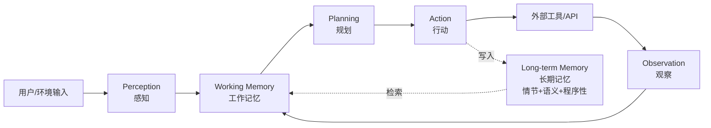
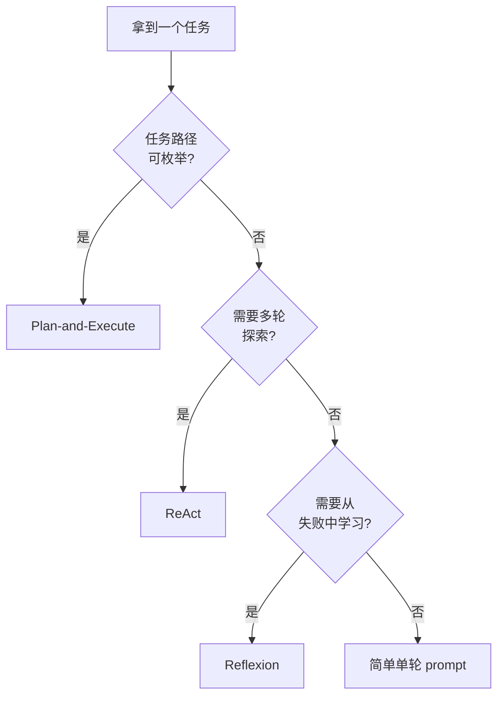
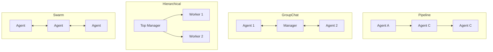
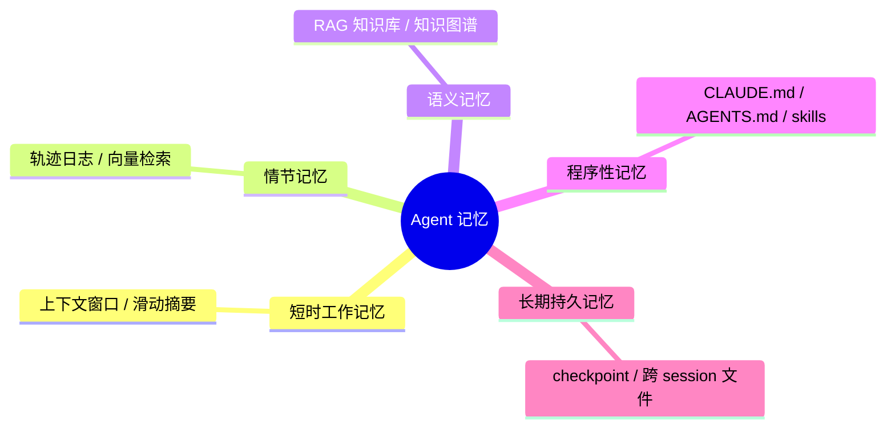

# Spec: Agent原理及实践 — Part 3 Agent 原理

**Date:** 2026-09-20
**Status:** Draft (pending user review)
**Project:** `agentkit` (Chinese technical book on Agent principles and practice)
**Scope:** Part 3 of 6

---

## 1. 项目背景与分解策略

本书《Agent原理及实践》面向**有编程基础但无 AI/ML 背景的初学者**，以中文 Markdown 写成。整体拆为 6 个 Part，每个 Part 独立走 `brainstorm → spec → plan → 写作` 流程：

| Part | 主题 |
|---|---|
| 1 | 大模型基础 |
| 2 | 大模型与 Agent 的演进 |
| 3 | Agent 原理 ← **本 spec** |
| 4 | Harness 工程 |
| 5 | Agent 功能实现 |
| 6 | 工业落地 |

本 spec 只覆盖 **Part 3**。其余 Part 在各自 spec 中设计。

**Part 3 的核心任务**（CLAUDE.md 规定）：讲清楚"一个 Agent 内部是什么在运转"——
- 认知架构的四个组件：感知（perception）、记忆（memory）、规划（planning）、行动（action）
- 三大经典范式：ReAct、Reflexion、Plan-and-Execute（含 AutoGPT / BabyAGI 谱系）
- 记忆机制的工程实现
- 多 Agent 协作的设计选择
- 混合系统：规则 + 检索 + 小模型 + 中心 LLM 的真实落地形态

**Part 3 的克制边界**：
- 不讲"如何调用 API / 写 tool function" → Part 5
- 不讲"具体 harness 怎么搭（hooks、permissions、sandbox）" → Part 4
- 不讲"工业落地评估 / 监控 / 成本控制" → Part 6
- 不重复 Part 1（Transformer、attention）、Part 2（LLM 家族史）的训练侧内容

---

## 2. 目标读者与约束

- **读者：** 大学本科以上、会写代码（至少一门主流语言）；**没有** AI/ML 背景但 Part 1-2 已读完
- **数学策略：** 直觉优先，本 Part 几乎不用公式（更关注"组件怎么拼"而非"梯度怎么算"）
- **代码：** 少量伪代码 + 1-2 个 Python 示意（in-context learning、ReAct 循环、Plan-and-Execute 状态机）放在 `code/part-3/`；完整可运行示例留到 Part 5
- **语言：** 中文（简体）；技术术语首次出现用 `中文名（English term）` 格式
- **总字数：** 25-30k 字（5 章）
- **风格：** 教程式、朋友式；"读者"、"我们"；段落 3-6 句
- **2026 视角：** 以 Claude Code / Pi / Codex CLI / AutoGen / LangGraph / CrewAI 为观察对象，**只提炼通用要素**，不写产品教程

---

## 3. 文件结构

```
agentkit/
├── README.md                   # 书籍总目录
├── CLAUDE.md                   # 写作规范
├── part-3-agent-原理/
│   ├── README.md               # Part 3 目录与一句话简介
│   ├── ch11-agent-认知架构.md
│   ├── ch12-范式-react-reflexion-plan-execute.md
│   ├── ch13-记忆机制.md
│   ├── ch14-多-agent-协作.md
│   └── ch15-小结与衔接.md
└── code/
    └── part-3/
        ├── README.md           # 依赖说明（无需安装，纯示意代码）
        ├── react_loop.py       # Ch12 ReAct 伪代码实现
        └── plan_execute.py     # Ch12 Plan-and-Execute 状态机示意
```

注：Part 3 没有可大规模运行的训练代码，示例以"读懂即可"的示意代码为主。

---

## 4. Part 3 五章内容大纲

### Ch11 Agent 认知架构（~5-6k 字）

读完应能描述一个 Agent 的"四件套"内部组件，并说清每个组件在干什么。

**本章核心问题**：一个 LLM Agent 到底由哪些部件组成？这些部件之间怎么协作？

- 11.1 什么是 Agent：从 LLM 到 Agent（最小定义：能感知环境、能采取行动、能根据反馈调整）
- 11.2 感知（Perception）：输入归一化、工具结果的格式化、多模态输入的统一抽象
- 11.3 行动（Action）：工具调用、副作用边界、原子化与幂等性
- 11.4 记忆（Memory）：短时 / 长时 / 情节 / 语义 / 程序性五分法的直觉（CoALA 框架）
- 11.5 规划（Planning）：任务分解、子目标链、Plan-and-Execute 的直觉
- 11.6 四件套的协作循环：perception → memory → planning → action → feedback
- 11.7 三代语言 Agent 的演进（CoALA：Generation A/B/C）
- 11.8 一个心智模型：从"调用 LLM"到"运行 Agent"的思维跃迁

**Anchor：** Mermaid `graph LR` 四件套数据流；`sequenceDiagram` 单步交互；表格（组件职责 / 实现 / Part 4-5 衔接）；`react_loop.py` 50 行示意。

---

### Ch12 三大范式：ReAct / Reflexion / Plan-and-Execute（~7-8k 字）

读完应能说清三种范式的"假设-步骤-优劣-典型应用"，并能在工程上选择。

**本章核心问题**：给定一个任务，Agent 该怎么"想"？是边做边想、做错了反思、还是先想清楚再做？

- 12.1 ReAct 范式：Reasoning + Acting 交织（Yao et al. 2022, arXiv:2210.03629）
  - 12.1.1 直觉：人是怎么"边想边做"的（厨师看菜谱下锅、程序员边调 API 边查文档）
  - 12.1.2 三步循环：Thought → Action → Observation
  - 12.1.3 ReAct 的两个关键优势：可解释性 + 减少幻觉（HotpotQA 幻觉 56% → 6%）
  - 12.1.4 ReAct 的局限：长链路稳定性、长上下文成本
- 12.2 Reflexion 范式：反思 + 迭代（Shinn et al. 2023, arXiv:2303.11366）
  - 12.2.1 直觉：考完试订正错题、写代码跑测试再修 bug
  - 12.2.2 三元记忆：短期轨迹 + 长期反思 + 任务反馈
  - 12.2.3 与 ReAct 的区别：ReAct 是"当下推理"，Reflexion 是"跨轮学习"
  - 12.2.4 工业落地的简化版：Self-Critique + Retry（不是完整 Reflexion）
- 12.3 Plan-and-Execute 范式：先规划后执行（含 BabyAGI / AutoGPT 谱系）
  - 12.3.1 直觉：项目经理先写 WBS，再分给执行人
  - 12.3.2 起源：BabyAGI（任务创建/优先级/执行三循环，2023.03）
  - 12.3.3 现代实现：LangGraph 的 Planner / Executor / Replanner 三节点
  - 12.3.4 ReWOO / LLMCompiler：减少 LLM 调用次数（~40% 减少）或并行化（~3.6× 提速）
- 12.4 三范式对比表：假设 / 步骤 / 优势 / 局限 / 典型场景
- 12.5 选择指南：什么时候用哪个（一个简单的决策树）
- 12.6 伪代码实现：三种范式各一个 30-50 行示意

**Anchor：** Mermaid `sequenceDiagram`（ReAct 三方时序）+ `graph TD`（Plan-and-Execute 状态图）+ 两张对比表 + `plan_execute.py` 状态机伪代码。

---

### Ch13 记忆机制（~5-6k 字）

读完应能区分五种记忆类型，并说清每种在工程上怎么落地。

**本章核心问题**：上下文窗口是有限的，Agent 怎么"记住"过去？

- 13.1 直觉：人脑的短时/长时/情节/语义/程序性记忆
- 13.2 五类记忆与工程对应
  - 短时工作记忆 → 当前 context window / 滑动摘要
  - 情节记忆 → 向量数据库中的轨迹日志（state-action-observation-reflection）
  - 语义记忆 → RAG 知识库 / 知识图谱
  - 程序性记忆 → 提示词文件（CLAUDE.md、AGENTS.md）+ skills / hooks
  - 长期持久记忆 → 跨 session 的文件 / checkpoint
- 13.3 MemGPT：把 LLM 当 OS 的虚拟内存分页（Packer et al. 2023, arXiv:2310.08560）
  - 13.3.1 灵感来源：操作系统虚拟内存
  - 13.3.2 主上下文（RAM）+ 外部上下文（磁盘）+ LLM 自驱分页
  - 13.3.3 工业启示：现代 Agent harness 的"自动压缩（autocompact）"思想
- 13.4 记忆的写入与读取决策：何时写、何时读、安全边界（记忆写入也是 prompt injection 攻击面）
- 13.5 记忆与遗忘：衰减评分、容量上限、定期合并
- 13.6 Part 4-5 衔接：harness 的 context engineering 把记忆做成产品能力

**Anchor：** Mermaid `mindmap` 五类记忆载体 + 表格（五类 vs 实现 vs 失效模式）+ ASCII 图（MemGPT 主/外部上下文数据流）。

---

### Ch14 多 Agent 协作（~5-6k 字）

读完应能描述主流多 Agent 框架的设计模式，并能在"单 Agent 还是多 Agent"间做出有理由的选择。

**本章核心问题**：什么时候一个人干完就行，什么时候要分给多人协作？

- 14.1 直觉：流水线工厂 vs 手工作坊 vs 交响乐团
- 14.2 多 Agent 的两大动机：角色分工（专精化）+ 视角多样性（避免单点偏见）
- 14.3 三大主流框架的设计哲学（2026 视角）
  - 14.3.1 LangGraph：状态机图、checkpoint、HITL、time-travel debug
  - 14.3.2 AutoGen（v0.4，2024 末重写）：actor 模型 + GroupChat 消息路由；**2026 进入维护模式**，被 Microsoft Agent Framework 整合
  - 14.3.3 CrewAI：role-based team，30-60 行代码可起步，2026 企业级发力
- 14.4 协作模式分类：流水线 / 群聊 / 层级 / 群体智能
- 14.5 何时用多 Agent：决策树 + 失败模式（MAST 失败分类法）
  - 单 Agent 优先：任务可线性分解、上下文可控、调试要求高
  - 多 Agent 的代价：通信成本、调试难度、误差放大（multi-agent at scale 不一定更强）
- 14.6 多 Agent 的工程取舍：消息协议（A2A、MCP）、共享状态、上下文传递、身份与权限
- 14.7 一个最小多 Agent 示例（伪代码：researcher + writer）

**Anchor：** Mermaid `graph TD` 四种协作模式 + 表格（框架设计哲学对比）+ 表格（单 vs 多 Agent 决策表）+ Mermaid `sequenceDiagram` 两 Agent 协作。

---

### Ch15 小结与 Part 4 衔接（~2-3k 字）

读完应能把 Part 3 的所有概念收束到一张"决策图"，并预知 Part 4 harness 工程要解决什么。

- 15.1 全章回顾：四件套 + 三范式 + 五记忆 + 多 Agent
- 15.2 一张决策图：拿到任务怎么选范式与架构
- 15.3 关键陷阱：把"多 Agent"当万能解、把"ReAct"当银弹
- 15.4 Part 4 衔接：组件已经清楚 → 但还需要 harness 把它们组装成产品
  - 上下文工程（context engineering）：把记忆、提示、工具结果塞进窗口的工艺
  - 工具协议（MCP）：工具的标准化接缝
  - 多 Agent 协议（A2A）：协作的标准化接缝
  - 沙箱、权限、hooks、observability：把"内部 Agent"变成"可信赖的产品"

**Anchor：** Mermaid `graph TD`：Part 3 → Part 4 → Part 5 的概念衔接。

---

## 5. 关键 Anchor 草图

### 5.1 四件套组件图（Ch11 主图）



### 5.2 三范式选择决策树（Ch12 / Ch15）



### 5.3 多 Agent 协作模式（Ch14 主图）



### 5.4 五类记忆工程映射（Ch13 主图）



---

## 6. 代码示例规划

Part 3 的代码量**显著少于** Part 1，目标是"读完代码立刻懂概念"，不追求工程完整。

| 文件 | 用途 | 章节 | 类型 |
|---|---|---|---|
| `react_loop.py` | ReAct 三步循环最小实现（伪代码 + 注释） | Ch12 | 示意（`# illustrative only`） |
| `plan_execute.py` | Plan-and-Execute 状态机伪代码（不用 LangGraph 框架，纯 Python dict 模拟 State） | Ch12 | 示意（`# illustrative only`） |
| `multi_agent_min.py` | researcher + writer 两 Agent 消息传递最小示例 | Ch14 | 示意（`# illustrative only`） |
| `README.md` | 明确说明：Part 3 代码都是示意，Part 5 才给可运行工程示例 | — | — |

每个文件 ≤ 80 行；中文注释；用纯 Python（不依赖 LangChain / LangGraph，**避免把外部 API 当成"概念本身"**）。

---

## 7. 写作约定（简版，详见 CLAUDE.md）

- 每章模板：标题 → 一句话简介 → 本章目标（3-5 条 bullet）→ 本章导览（mermaid 总览图）→ 子节 → 本章小结 → 本章参考
- Mermaid 仅用四种图：`graph` / `flowchart` / `sequenceDiagram` / `mindmap`
- 复杂关系用表格，不堆 mermaid
- 引用：随文 markdown 链接 + 章末 "本章参考"（分必读论文 / 推荐博客 / 视频课程 三类）
- 代码：中文注释；示意性文件头加 `# illustrative only`
- 跨章引用 `参见 X.3`；跨 Part `(见 Part N ChM)`，**不**复制内容
- **初学者可懂性铁律（CLAUDE.md 一·甲）**：认知负荷 ≤ 3 个新概念/段；公式/抽象前必须有直觉+类比+视觉；表格紧邻正文

---

## 8. 完成度与验收标准

### 单章完成标准

- 子节齐全，与大纲一致
- 含本章目标、小结、本章参考
- 含至少 1 个 mermaid + 1 个表格
- 字数在 ±20% 区间内
- 关键概念全覆盖（每章 5-8 个）
- 至少 1 个代码示意（Ch15 可豁免）

### Part 3 整体验收

- 5 章全部写完
- 总字数 25-30k
- `part-3-agent-原理/README.md` 含目录与一句话简介
- `README.md` 出现 Part 3，标记为 "已发布"
- 所有 mermaid 在 GitHub 渲染无语法错误
- 所有 Python 示意文件存在于 `code/part-3/`
- 自查通过（placeholder / 内部一致性 / 范围 / 歧义）

### 自查清单

1. **Placeholder 扫描：** 无 TBD / TODO / 占位文本
2. **内部一致性：** 章间不矛盾（术语、概念、数据一致）
3. **范围检查：** 不混入 Part 1（Transformer 训练）、Part 2（LLM 家族史）、Part 4（harness 实现细节）、Part 5（具体代码）、Part 6（工业监控）
4. **歧义检查：** 每个子节要求无歧义
5. **产品中立性：** 删除任何具体产品名（Claude Code / Pi / Codex / LangGraph / AutoGen / CrewAI）后，章节依然成立（产品名仅在"例子"位置出现，不在"概念定义"位置）

---

## 9. 显式 Out-of-Scope（Part 3 不涉及）

- Transformer 训练数学 → Part 1
- LLM 家族演进史（BERT/GPT/LLaMA/Qwen/DeepSeek 横评）→ Part 2
- Harness 工程实现（hooks / permissions / sandbox / 流式协议）→ Part 4
- 具体代码实现细节（tool calling / RAG / MCP server 编码）→ Part 5
- 工业落地（监控 / 评测 / 成本 / EU AI Act 合规）→ Part 6
- 数学严格证明、模型逐个横评

---

## 10. 后续流程

1. 本 spec 经用户审阅通过后，进入 `superpowers:writing-plans` 流程
2. writing-plans 输出 Part 3 的实现 plan（每章一个任务）
3. plan 完成后进入实际写作阶段
4. Part 3 完成后再启动 Part 4 的 brainstorm

---

## 11. 研究资料来源（联网调研汇总）

### 必读论文

| # | 标题 | 作者 / 年份 | arXiv | 用途章节 |
|---|---|---|---|---|
| 1 | [ReAct: Synergizing Reasoning and Acting in Language Models](https://arxiv.org/abs/2210.03629) | Yao et al., 2022 (Princeton + Google Brain) | 2210.03629 | Ch12 ReAct |
| 2 | [Reflexion: Language Agents with Verbal Reinforcement Learning](https://arxiv.org/abs/2303.11366) | Shinn et al., 2023 (Northeastern) | 2303.11366 | Ch12 Reflexion |
| 3 | [MemGPT: Towards LLMs as Operating Systems](https://arxiv.org/abs/2310.08560) | Packer et al., 2023 (UC Berkeley) | 2310.08560 | Ch13 记忆 |
| 4 | [Cognitive Architectures for Language Agents (CoALA)](https://arxiv.org/abs/2309.02427) | Sumers et al., 2023 (Princeton) | 2309.02427 | Ch11 认知架构 |
| 5 | [A Survey on LLM-based Agents](https://www.sciencedirect.com/science/article/pii/S2666672424000036) | Wei et al., 2024 | — | Ch11 综述 |

### 推荐博客 / 教程

- [LangGraph Plan-and-Execute Tutorial](https://langchain-ai.github.io/langgraph/tutorials/planning-and-execute/plan-and-execute/) — Ch12 Plan-and-Execute 工业实现
- [BabyAGI GitHub](https://github.com/yoheinakajima/babyagi) — Ch12 Plan-and-Execute 起源
- [LangChain Blog: Task decomposition and Plan-and-Execute](https://blog.langchain.com/plan-and-execute/) — Ch12 范式对比
- [MemGPT Project Page](https://research.memgpt.ai) — Ch13 MemGPT
- [Microsoft AutoGen v0.4 Architecture](https://www.microsoft.com/en-us/research/publication/autogen-enabling-next-gen-llm-applications-via-multi-agent-conversation-framework/) — Ch14 AutoGen

### 行业参考（2026 视角）

- [QConSF 2025: Developing Claude Code at Anthropic](https://www.infoq.com/news/2025/11/claude-ai-speed/) — Anthropic lesson（ship small, unship fast）
- [OpenAI: Unrolling the Codex Agent Loop](https://openai.com/index/unrolling-the-codex-agent-loop/) — Codex CLI 架构
- [Anthropic: Building agents with the Claude Agent SDK](https://www.anthropic.com/engineering/building-agents-with-the-claude-agent-sdk) — Claude Agent SDK 设计

### 多 Agent 框架对比（2026）

- [2026 Multi-Agent Framework Showdown: LangGraph vs CrewAI vs AutoGen](https://moltbook.com/post/52b0970b-1000-40d3-81c3-e08924066a59) — Ch14 三大框架对比
- [Why Do Multi-Agent LLM Systems Fail to Improve at Scale?](https://arxiv.org/abs/2509.15307) — Ch14 多 Agent 失败模式
- [MAST: Multi-Agent LLM System Failure Taxonomy](https://arxiv.org/abs/2503.09957) — Ch14 失败分类法

### 混合系统 / Routing

- [A Unified Approach to Routing and Cascading for LLMs](https://adsabs.harvard.edu/abs/2024arXiv241010347D) — Dekoninck et al., 2024
- [What is the Role of Small Models in the LLM Era](https://arxiv.org/html/2409.06857v3) — 小模型 + LLM 协作
- [Compound AI Systems](https://aiwiki.ai/wiki/compound_ai_system) — 复合 AI 系统概念

---

## 12. 关键决策点（写给 reviewer）

1. **章节数 5 章**：与 Part 1 对齐；Ch11/Ch12 是 Part 3 的"双主轴"（认知架构 + 范式），Ch13/Ch14 是延伸（记忆 + 多 Agent），Ch15 收束 + 衔接 Part 4。**不**做 6 章，避免与 Part 4 harness 内容重复。

2. **三范式而非四范式**：把 BabyAGI/AutoGPT 归入"Plan-and-Execute 谱系"而非单独列章节。BabyAGI 在 2026 已不是工业主流，更多是历史脉络；放进 Ch12.3.2"起源"段即可。

3. **记忆独立成章（Ch13）而非并入 Ch11**：因为 Part 4 harness 的"上下文工程"几乎全是记忆问题，独立成章让 Part 4 衔接更顺畅。

4. **多 Agent 独立成章（Ch14）**：CLAUDE.md 明确要求覆盖 AutoGen/CrewAI/LangGraph，且 2026 视角下"单 vs 多"是真实工程决策。

5. **代码以示意为主**：避免与 Part 5 重复。`react_loop.py` / `plan_execute.py` / `multi_agent_min.py` 都是"读完即懂"的伪代码，文件头标注 `# illustrative only`。

6. **不引入 MCP/A2A 细节**：MCP/A2A 是 Part 4 主题；Part 3 只在 Ch14.6 提一句作为预告。

7. **不写评估 / 监控**：全部归 Part 6；Part 3 不出现 LLM-as-judge / Langfuse 等术语。