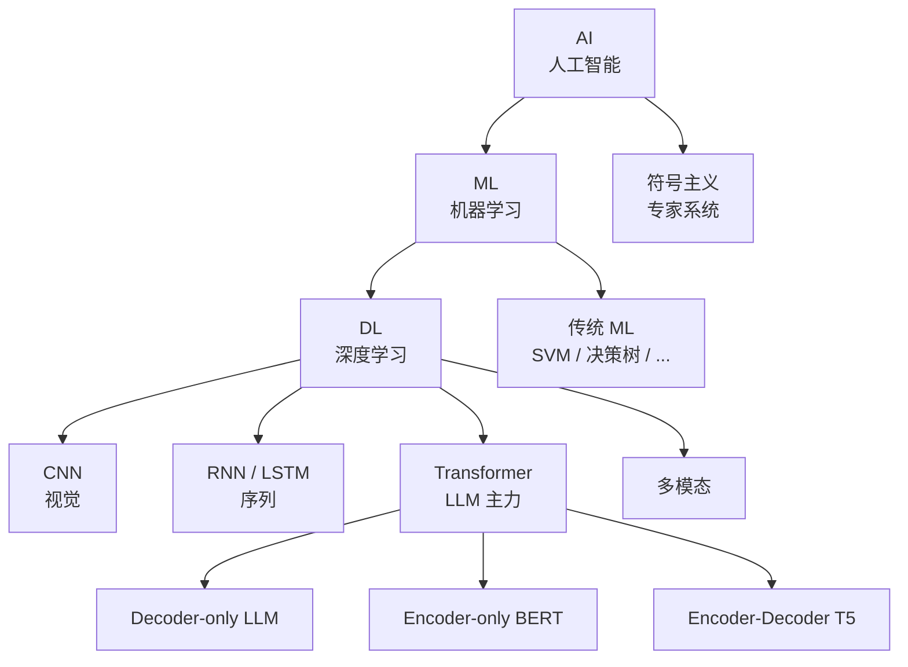

# Ch1 AI / ML / DL 概览

> 一句话简介：先搞清楚"AI、ML、DL、LLM"分别是什么、各自解决什么问题，再开始看模型细节。

## 本章目标

读完本章你应当能：
- 准确区分 AI / ML / DL 三个概念的范围
- 说出三大范式（符号主义、连接主义、统计学习）的核心主张
- 区分监督、无监督、强化三种学习方式，并举出典型任务
- 解释深度学习在 2010 年后崛起的关键驱动
- 描述 LLM 在 AI 整体图谱中的位置
- 规划本书接下来 5 个 Part 的阅读路线

## 本章导览

## 1.1 什么是 AI、ML、DL

我们先把最容易混淆的四个术语一次说清楚，因为后面整本书都会用到它们。

**AI（人工智能）** 是一个目标——让机器表现出通常需要人类智慧才能完成的行为，比如识别猫狗、理解一段话、下棋、开车。这个目标从 1956 年的达特茅斯会议被正式提出，70 年来尝试过很多不同路线。

**ML（机器学习）** 是实现 AI 的一类方法。传统编程是"人写规则、机器执行"；机器学习反过来——人准备数据，机器从数据里自己学规则。它是 AI 的一个子集。

**DL（深度学习）** 又是 ML 的一个子集，特指用"多层神经网络"做函数逼近的方法。多层意味着模型可以有上亿个参数，从而拟合非常复杂的模式。

我们用一个做饭的类比来建立直觉：假设你想让一台"机器厨师"做出一桌菜。
- **AI** 是目标——让它做出美味佳肴。
- **ML** 是一条具体路径——让它尝遍 1000 道菜，自己总结"放盐太多不好吃""火候不够会夹生"。我们没显式写菜谱，但机器从数据里总结出一套"内在菜谱"。
- **DL** 是 ML 中的一类实现——给它一台高级厨具（多层神经网络），能捕捉更细微的味道组合。

一句话总结三者的包含关系：**AI ⊃ ML ⊃ DL**。我们后面讲的 LLM（大语言模型）就处在 DL 这一层里。

## 1.2 三大范式

AI 70 年的历史里，研究者们对"智能到底怎么实现"形成了三种主流主张，我们把它们叫**范式（Paradigm）**。理解这三种范式能帮我们看清深度学习为什么会在 2010 年代后来居上。

**符号主义（Symbolism / Good Old-Fashioned AI）** 认为智能可以用"符号 + 规则"来表达。知识就是事实（如"苏格拉底是人"），推理就是逻辑规则的演绎（如"人都会死，苏格拉底是人，所以苏格拉底会死"）。代表成果有 1980 年代的专家系统（如 MYCIN 医疗诊断）、Cyc 常识知识库、知识图谱。优点是可解释——每一步推理都能追溯；缺点是知识获取成本极高、面对模糊或噪声数据非常脆弱。

**连接主义（Connectionism）** 认为智能藏在大量简单单元的连接权重里。神经元不存具体知识，知识分布在亿万个权重之上。代表人物有 1943 年的 McCulloch & Pitts、1958 年的感知机、1986 年的反向传播算法，再到 2012 年的 AlexNet 和 2017 年的 Transformer。优点是拟合能力极强、可直接处理图像和文本这种高维原始数据；缺点是黑盒、需大量数据。深度学习就属于连接主义这一脉。

**统计学习（Statistical Learning）** 用概率和统计工具来建模，主张"知识 = 数据背后的概率分布"。代表方法有支持向量机（SVM）、贝叶斯网络、隐马尔可夫模型（HMM）、条件随机场（CRF）。优点是数学基础扎实、泛化理论清晰；缺点是特征往往需要人工设计。

值得提醒的是，这三种范式并不是非此即彼的关系。现代 AI 系统经常把它们混在一起——比如自动驾驶里既有符号规则（红绿灯）、也有深度学习（视觉识别）、还有概率推断（轨迹预测）。我们后面涉及的 LLM 主要是连接主义的胜利，但也会借统计学习的工具（如 Ch5 RLHF 里的 KL 散度）。

## 1.3 三大学习划分

机器学习内部又可以根据"数据里有没有标注、学习信号怎么来"分成三大学习范式。下表给出一句话定义和典型任务：

| 维度 | 监督学习（Supervised） | 无监督学习（Unsupervised） | 强化学习（Reinforcement） |
|---|---|---|---|
| 数据形态 | `(输入, 标签)` 配对 | 只有 `输入` | `(状态, 动作, 奖励)` 序列 |
| 学习目标 | 学映射 `f: X → Y` | 发现数据结构 | 学策略 `π: 状态 → 动作` |
| 信号来源 | 人工标注 | 数据内部结构 | 环境反馈的奖励 |
| 典型任务 | 分类（垃圾邮件）、回归（房价预测） | 聚类（用户分群）、降维（可视化） | 游戏 AI、机器人、推荐 |
| 代表算法 | 逻辑回归、随机森林、神经网络 | K-Means、PCA、GAN | Q-Learning、Policy Gradient、PPO |
| 本书出场 | Ch2-Ch5 大量 | Ch4 预训练 | Ch5 RLHF |

**监督学习**是工业界用得最多的形态。垃圾邮件识别、图像分类、机器翻译的早期版本都是监督学习——人标好答案，模型去拟合。优点是目标明确、易评估；缺点是标注成本高（一些领域请专家标一份数据要几百元）。

**无监督学习**不需要人给答案，让模型自己找结构。K-Means 能把 100 万用户按消费习惯自动分成 5 类；PCA 能把 1000 维特征压到 2 维画散点图；GAN（生成对抗网络）能从随机噪声生成逼真图像。注意——LLM 训练用的"自监督学习"是无监督学习的一个特例：标签不是人工标，而是从文本里天然派生出来的（下一句就是上一句的标签）。

**强化学习（Reinforcement Learning, RL）** 的设定不一样：有一个 Agent 在环境里不断做动作，环境会反馈奖励。Agent 学的是"在什么状态下做什么动作能拿最多奖励"。AlphaGo 击败世界冠军靠的就是 RL。RLHF（基于人类反馈的强化学习）也是大模型对齐的关键技术，参见 Ch5。

## 1.4 深度学习为什么崛起

深度学习的概念从 1980 年代就有，但真正大爆发是 2012 年之后的事。为什么等了 30 年才"突然"起飞？业内通常归结为四个驱动力同时到位：**算力、数据、算法、任务**。

**算力** 方面，NVIDIA 在 2007 年开放 CUDA，让 GPU 不再只是游戏显卡，也能跑通用并行计算——神经网络训练本质是大规模矩阵乘法，正是 GPU 最擅长的。2016 年 Google 推出 TPU、之后各厂陆续推出 ASIC 加速卡。**数据** 方面，互联网与移动互联网产生了海量文本（Common Crawl 现已抓取到千亿级网页）和图像（Instagram 每天上亿张图）。

**算法** 的突破解决了训练深网络的几个老大难：
- 2010 年 ReLU 激活函数替代 Sigmoid，缓解梯度消失；
- 2012 年 AlexNet 在 ImageNet 一战成名，把图像分类错误率从 26% 降到 15%；
- 2014 年 Adam 优化器让收敛更快更稳；
- 2015 年 ResNet 残差连接让网络从几十层跃升到上百层；
- 2017 年 Transformer 架构提出，彻底改变了序列建模。

**任务 / 评测** 像 ImageNet（1400 万张标注图像、1000 个类别）这样的公开基准，给了研究者一个明确的"考试卷"。谁家模型分数高，论文就能发顶会、模型就能被工业采用。

下面这条时间线标出我们后面会反复提到的里程碑：

- **2012** AlexNet 在 ImageNet 上把图像分类错误率从 26% 降到 15%，深度学习一夜成名。
- **2014** GAN 与 VAE 让生成式模型成为独立方向。
- **2017** Google 提出 Transformer，奠定后来所有 LLM 的架构基础。
- **2018** GPT（OpenAI）与 BERT（Google）相继发布，开启预训练-微调范式。
- **2020** GPT-3 把参数推到 1750 亿，展示了"规模即能力"的早期证据。
- **2022** ChatGPT 让 LLM 进入大众视野。

这四个驱动力少任何一个都不行：没有 GPU 跑不动大模型，没有数据训不出来，没有算法训练不稳定，没有评测没人知道方向对不对。

## 1.5 LLM 在 AI 整体图谱中的位置

LLM（Large Language Model，大语言模型）是这本书要讲的核心对象。在我们前面画的 AI 图谱里，它处在很具体的一个位置。

可以用一个等式来记忆它的"配方"：**LLM = 深度学习 + Transformer（主要是 Decoder-only 架构）+ 大规模自监督预训练 + 通用任务接口**。每一项都不是它发明的，但它把这四项组合到了极致。

对应到图谱的层次：
- **范式层**：连接主义（不是符号主义、也不是纯统计学习）；
- **方法层**：深度学习（多层 Transformer）；
- **学习范式层**：自监督学习——把"下一句预测"当作监督信号，标签是数据本身派生出来的，绕开了标注成本瓶颈；
- **任务层**：生成式模型——给定上文，逐 token 生成下文。

一个常被误解的点：**LLM 不等于 AGI（通用人工智能）**。它是一个"狭义但极强的通用语言接口"——你给它任何用自然语言描述的任务，它大概率能给出像样的回答；但它会一本正经地胡说（幻觉）、不知道今天几号（缺实时性）、不会真的操作你的电脑（缺工具）、也记不住三天前聊过什么（缺记忆）。

正是这些"缺"，构成了本书 Part 2 之后要讨论的 Agent 主题。简单说：**LLM 是大脑，Agent 是大脑 + 手脚 + 记忆 + 工具**。Ch1 之后我们会先在 Part 1 把"大脑"是怎么训练出来的讲清楚。

## 1.6 本书阅读路线

在动手之前，给读者一张整本书的地图。本书共 6 个 Part：

| Part | 主题 | 你会学到 |
|---|---|---|
| 1 | 大模型基础（Ch1-Ch5） | LLM 是怎么从语料训出来的、对齐是怎么回事 |
| 2 | LLM 与 Agent 的演进 | 从 BERT/GPT 到 Claude/Gemini；Agent 范式演进 |
| 3 | Agent 原理 | 认知架构、ReAct、Plan-and-Execute 等范式 |
| 4 | Harness 工程 | MCP、A2A、上下文工程、记忆、hooks、permissions |
| 5 | Agent 功能实现 | tool calling、RAG、多 Agent；复现 Claude Code 核心特性 |
| 6 | 工业落地 | 部署、可观测性、评测、安全、合规 |

**给读者的阅读建议**：
- **Part 1 通读**：这是后续所有内容的地基，尤其是 Ch3（Transformer）和 Ch5（RLHF），错过这两章后面会读得很累。
- **Part 2 推荐**：了解 LLM 家族史和 Agent 范式演进，能帮你在面对新模型时快速分类。
- **Part 3-5 是核心**：如果你只想读一遍就上手写 Agent，这三 Part 必读。
- **Part 6 选读**：偏工程实践，等你真要上线一个 Agent 产品时再回来翻。

读完 Ch1，你应该能在脑子里画出一张清晰的 AI 全景图——下一章我们聚焦到"神经网络"这一格。

## 本章小结

- AI 是目标，ML 是数据驱动的方法，DL 是用多层神经网络实现 ML；它们是层层包含关系（AI ⊃ ML ⊃ DL）。
- AI 三大范式：符号主义靠规则、连接主义靠神经网络权重、统计学习靠概率模型；现代系统往往是混合体。
- 机器学习按信号来源分为监督（有标签）、无监督（无标签）、强化（奖励反馈）；LLM 训练用的是自监督，是无监督的一个特例。
- 深度学习 2010 年代起飞靠算力（GPU）+ 数据（互联网）+ 算法（ReLU/Transformer 等）+ 评测（ImageNet）四股力量同时到位。
- LLM = 深度学习 + Transformer + 大规模自监督预训练；它不是 AGI，而是"狭义但极强的通用语言接口"。
- 本书 6 个 Part 由浅入深；Part 1 是地基，Part 3-5 是 Agent 核心。

## 本章参考

### 必读论文
- [Deep Learning (LeCun, Bengio, Hinton, 2015)](https://www.nature.com/articles/nature14539) — Nature 综述，三位深度学习奠基人回顾领域全貌。
- [ImageNet Classification with Deep CNN (Krizhevsky et al., 2012)](https://proceedings.neurips.cc/paper/2012/file/c399862d3b9d6b76c8436e924a68c45b-Paper.pdf) — AlexNet 论文，深度学习崛起的标志性工作。

### 推荐博客 / 教程
- [The Illustrated Transformer (Jay Alammar)](https://jalammar.github.io/illustrated-transformer/) — 图解 Transformer 最好的入门读物之一，Ch3 也会用到。
- [3Blue1Brown 神经网络系列](https://www.3blue1brown.com/topics/neural-networks) — 视频化的神经网络直觉讲解，适合零基础读者。

### 视频 / 课程
- [吴恩达 Machine Learning 课程 (Coursera)](https://www.coursera.org/learn/machine-learning) — 经典入门课，覆盖监督/无监督全流程。
- [李宏毅 机器学习 (台大公开课)](https://speech.ee.ntu.edu.tw/~hylee/ml/2021-spring.php) — 中文讲解，例程丰富，与本书配套度高。
