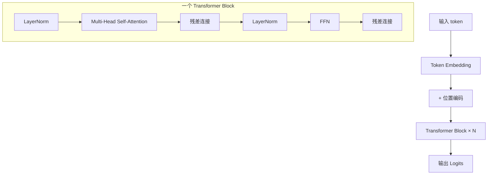

# Ch3 Transformer 与注意力

> 一句话简介：从 RNN 的局限讲起，到 self-attention 的直觉，再到 Transformer block 的标准结构，为理解现代 LLM 打地基。

## 本章目标

读完本章你应当能：
- 解释 RNN / LSTM 在长序列上的局限
- 直观描述 self-attention 的工作机制
- 写出 scaled dot-product attention 的公式并解释每一项
- 说出多头注意力的作用
- 解释位置编码的必要性，并比较 Sinusoidal / RoPE / ALiBi
- 画出一个标准 Transformer block 的结构
- 区分 Decoder-only / Encoder-only / Encoder-Decoder 三种架构
- 描述 KV cache 的作用
- 简述 MoE 的稀疏激活思想

## 本章导览



## 3.1 为什么需要新架构

在 Transformer 出现之前（2017 年之前），处理序列数据的主流架构是 RNN 及其升级版 LSTM / GRU。它们的核心思想是**按时间步递归**：第 $t$ 步的隐藏状态 $h_t$ 由当前输入 $x_t$ 和上一步的隐藏状态 $h_{t-1}$ 计算得到。理论上这种结构可以捕捉任意长距离的依赖。

但实践暴露了三个棘手问题。**第一，并行性差**。$h_t$ 依赖 $h_{t-1}$，整个序列必须串行计算——在 GPU 上 RNN 训练效率非常低。**第二，长距离依赖仍然难学**。虽然 LSTM 的门控机制一定程度上缓解了梯度消失，但当序列长度达到几百上千个 token 时，早期 token 的信息仍然会被稀释。**第三，难以扩展**。RNN 的隐藏状态维度是固定的，无论输入多长都得压缩进同一个向量。

正是为了解决这三个问题，Vaswani 等人在 2017 年提出了 **Transformer**（参见本章参考）。它抛弃了递归结构，改用一种叫 **self-attention（自注意力）** 的机制，让序列里**任意两个位置**直接"对话"。这一改动带来两个革命性收益：长距离依赖一步到位（信息传递路径长度恒定为 1），并且整个序列可以**完全并行**计算。于是我们看到了今天所有主流 LLM——GPT、LLaMA、Qwen、DeepSeek——清一色都建立在 Transformer 之上。

## 3.2 Self-attention 的直觉

Self-attention 的核心想法可以用一句话概括：**序列里每个位置都要"看一看"其它所有位置，根据相关性重新组合自己的表示**。

设想你在读一个句子："小明借了小王的书，**他**说下周还。" 这里的"他"指代的是谁？人脑会下意识回到上文找"小明"或"小王"，根据语义关系推断。Self-attention 就是让模型做同样的事——它让"他"这个位置的 token 去"询问"句子里所有 token（包括自己），每个被询问的位置给出一个相关性分数（也叫做注意力权重），然后"他"把自己的新表示定义为这些位置的加权平均。

给定一个长度为 $L$ 的序列，self-attention 把每个位置 $i$ 变成一个**新的向量**，这个向量的每一位都是从其它位置"借"来的信息，权重由位置 $i$ 和位置 $j$ 的相关性决定。直观上，这就像一个"软检索"——模型不是从记忆里硬挑一个 token，而是软性地、按权重融合它们。

这种机制有两个非常优雅的性质。**第一，路径长度恒定**。任意两个位置之间只需要一次"询问"就能交换信息，不像 RNN 那样要沿着链一步步传递。**第二，可解释性强**。可视化训练后的注意力权重，常常能看到句法结构（主谓关系、指代关系）自动浮现——这在 RNN 时代是不可想象的。

## 3.3 Q/K/V 与 attention 公式

Self-attention 在工程上通过三个矩阵——**Query（查询）、Key（键）、Value（值）**——来实现，借鉴自信息检索：用 query 去和所有 key 比对相关性，再按相关性从对应的 value 里取内容。

给定输入 $X$（形状 $(L, d)$），三组可学习权重 $W^Q, W^K, W^V$ 做线性投影：

$$Q = X W^Q, \quad K = X W^K, \quad V = X W^V$$

然后套用著名的 **scaled dot-product attention** 公式：

$$\text{Attention}(Q, K, V) = \text{softmax}\!\left(\frac{Q K^\top}{\sqrt{d_k}}\right) V$$

逐项拆解：

- **$Q K^\top$**：query 和 key 做矩阵乘，得到形状 $(L, L)$ 的打分矩阵，元素 $(i, j)$ 表示"位置 $i$ 的 query 和位置 $j$ 的 key 有多相关"。
- **$\sqrt{d_k}$**：缩放因子。当 $d_k$ 较大时 $Q K^\top$ 方差变大，softmax 概率会集中到一个位置（梯度消失）。除以 $\sqrt{d_k}$ 把方差拉回 1 附近。
- **softmax**：沿最后一维把打分转成概率分布，每行和为 1——这就是注意力权重。
- **乘以 $V$**：用权重对 value 加权求和，形状仍是 $(L, d)$，但每个位置融合了全局信息。

这个公式是整个 Transformer 的"心脏"。配套的最小实现见 `code/part-1/attention.py`（3.9 节会进一步解读）。

## 3.4 多头注意力

单头 attention 的表达能力有限——它只能从一个"视角"看序列。比如想让模型同时关注"主谓关系"和"指代关系"，单头就要被迫折中。

**多头注意力（Multi-Head Attention, MHA）** 把 $Q/K/V$ 分别拆成 $h$ 组（每组维度 $d_k = d / h$），独立做 attention，再把结果拼起来：

$$\text{MultiHead}(Q, K, V) = \text{Concat}(\text{head}_1, \dots, \text{head}_h) W^O$$

其中 $\text{head}_i = \text{Attention}(X W_i^Q, X W_i^K, X W_i^V)$，最后用一个输出投影 $W^O$ 把拼接结果映射回去。

每个 head 就像一个"专家"，专门负责某一种关系——有的追踪主谓一致，有的对齐指代词，有的聚焦最近 token。**总参数量和单头差不多**——一个大矩阵拆成几个小矩阵相乘，参数量几乎一样。所以多头没有显著增加模型体积，只是把同样的预算"重新分配"到了多个子空间里。经验上几乎所有 LLM 都有 16~128 个 head。

## 3.5 位置编码

Self-attention 有一个隐藏的、但极其关键的弱点：**它对序列顺序不敏感**。把"猫吃鱼"和"鱼吃猫"分别喂给 attention 层，输出会完全一样——因为 attention 只关心"哪些 token 共现"，不关心"谁先谁后"。但语言显然是有顺序的，所以必须显式告诉模型"位置"信息。

这就需要**位置编码（Positional Encoding）**：给每个位置生成一个向量，加到 token embedding 上。原始 Transformer 论文用的是**Sinusoidal（正弦）** 编码——用不同频率的 sin/cos 函数生成位置向量：

$$PE_{(pos, 2i)} = \sin(pos / 10000^{2i/d}), \quad PE_{(pos, 2i+1)} = \cos(pos / 10000^{2i/d})$$

这套方案的好处是不需要学习、外推性好；坏处是表达绝对位置、对相对位置不直接——LLM 已经几乎不用了。

现代 LLM 几乎都用 **RoPE（Rotary Position Embedding，旋转位置编码）**。核心思想是：**把 query 和 key 向量在二维子空间里按位置旋转**。对位置 $m$ 的 query 和位置 $n$ 的 key 做内积，结果会自动包含 $(m-n)$ 这一项——RoPE 直接编码的是**相对位置**而不是绝对位置。LLaMA、Qwen、DeepSeek 等几乎所有主流开源模型采用（论文见本章参考）。

**ALiBi（Attention with Linear Biases）** 走另一条路：保持普通 attention 不变，但在打分 $Q K^\top$ 上**加一个与距离成正比的负偏置**。距离越远分数越被压低，注意力权重越小。ALiBi 不需要额外的位置向量，但对长度外推支持非常好。MPT、Falcon 等模型采用 ALiBi。

| 方案 | 编码对象 | 是否需要额外参数 | 代表模型 |
|---|---|---|---|
| Sinusoidal | 绝对位置 | 否 | 原始 Transformer |
| RoPE | 相对位置 | 否 | LLaMA / Qwen / DeepSeek |
| ALiBi | 距离偏置 | 否 | MPT / Falcon / BLOOM |

简单记法：**RoPE 是当前主流，ALiBi 适合长上下文外推，老的 Sinusoidal 已被淘汰**。

## 3.6 Transformer block

一个完整的 Transformer block 由两大部分组成：**多头自注意力（MHA）** 和**前馈网络（FFN）**。两者各包一层 LayerNorm（详见 Ch2）和一条残差连接。

现代 LLM 几乎都用 **Pre-Norm** 结构——把 LayerNorm 放在注意力和 FFN **之前**：

```text
x → LayerNorm → Multi-Head Self-Attention → + → LayerNorm → FFN → + → 输出
|________________________________________________|
                残差连接 1
                |________________________________________________|
                                残差连接 2
```

对应伪代码：

```python
# 残差连接 1
attn_out = mha(layer_norm_1(x))
x = x + attn_out

# 残差连接 2
ffn_out = ffn(layer_norm_2(x))
x = x + ffn_out
```

为什么要 Pre-Norm 而不是 Post-Norm（BN 时代那种"先注意、后归一化"）？因为 Post-Norm 在深层 Transformer 里会让梯度不稳定；Pre-Norm 则天然让梯度可以走"残差直路"直接回传，深层训练稳定得多。**所有现代 LLM——GPT、LLaMA、Qwen——都用 Pre-Norm**。

FFN 部分通常是两层全连接中间一个非线性激活。原始 Transformer 用 ReLU，现代 LLM 普遍用 **SwiGLU**（详见 3.10 节），结构可以理解为：

$$\text{FFN}(x) = W_2 \cdot \sigma(W_1 x) \odot W_3 x$$

最后，整模型就是把同一个 Transformer block **重复堆叠 N 次**（N 通常是 32、80、128），中间穿插 LayerNorm 和残差连接。每一层结构完全相同，只是参数不同——这就是"Transformer 是一个深而规整的模型"的由来。

## 3.7 Decoder-only vs Encoder-Decoder

Transformer 论文（2017 年）描述的是 **Encoder-Decoder** 架构：一个 Encoder 堆叠负责"读懂"输入，一个 Decoder 堆叠负责"生成"输出，中间通过 cross-attention 沟通。这种结构非常适合**翻译、摘要**这种"输入-输出对齐"的 seq2seq 任务。

但 2018 年以后，社区发现了一个更简单的替代：**Decoder-only**——只保留 Decoder 堆叠，让它一次性看完整个 prompt，再一个 token 一个 token 地续写。今天所有主流大语言模型——GPT、LLaMA、Qwen、DeepSeek、Claude——清一色都是 Decoder-only。

**Encoder-only** 是另一条路，代表是 BERT。它的目标是"理解"输入文本（如分类、检索、问答），不需要生成新内容。它通常用**掩码语言模型（MLM）** 训练——把句子里某些词遮住，让模型猜回来。今天 Encoder-only 仍广泛用在**检索增强（RAG）** 和**嵌入模型** 里。

| 架构 | 输入 → 输出 | 注意力掩码 | 代表模型 | 典型任务 |
|---|---|---|---|---|
| Decoder-only | 单向（自回归） | causal mask | GPT / LLaMA / Qwen | 文本生成、对话 |
| Encoder-only | 双向理解 | 无 mask | BERT / RoBERTa | 分类、检索、嵌入 |
| Encoder-Decoder | 输入编码 → 输出生成 | 编码无掩码 / 解码 causal + cross | T5 / BART | 翻译、摘要 |

**掩码（mask）** 是这三个架构的关键区别。Decoder-only 在算 attention 时，必须**遮住未来的位置**——位置 $i$ 只能看到位置 $\leq i$ 的 token。这是用 **causal mask**（一个上三角为 $-\infty$ 的矩阵）实现的：把不允许看的位置在 softmax 之前设为 $-\infty$。Encoder-only 双向都能看，所以不需要 mask。Encoder-Decoder 的解码器部分既要 causal mask（看不到未来），又要 cross-attention 去看编码器的输出。

简单记法：**生成用 Decoder-only，理解用 Encoder-only，翻译用 Encoder-Decoder**。本书后续章节默认关注 Decoder-only LLM。

## 3.8 KV cache 直观理解

LLM 推理是**自回归**的——生成第 $t$ 个 token 时，需要把前 $t-1$ 个 token 重新过一遍 attention。朴素实现里每生成一个 token 都要重算所有历史 token 的 K 和 V，序列一长计算量就爆炸式增长。

**KV cache** 的核心思想是：**历史 token 的 K/V 在第一次算完后缓存下来，下次生成新 token 时直接复用**。

自回归生成的每一步：
1. 把新 token 的 query 算出来；
2. 用这个 query 和**已经缓存的历史 K/V**算 attention；
3. 把当前新 token 的 K/V 追加进缓存。

这样，生成第 $t$ 个 token 的计算量从 $O(t)$ 降到 $O(1)$，整个序列总计算量从 $O(L^2)$ 降到 $O(L)$。代价是**显存占用增加**——每个 Transformer 层、所有历史 token 的 K 和 V 都要存起来。对于 32 层、40k 上下文、每层 8 KV head、head dim 128 的模型，KV cache 显存约 2.5 GB。

正因为 KV cache 成为长上下文推理的瓶颈，3.10 节要介绍的 **GQA** 才变得重要——它让多个 query head 共享同一组 K/V，把 KV cache 直接砍掉几倍。**理解 KV cache 是理解现代 LLM 推理优化的起点**。

## 3.9 一个最小 attention 示例

理论讲完了，我们用一个最小可运行的 PyTorch 代码把 3.3 节的公式真正跑一遍。完整代码在 `code/part-1/attention.py`，核心函数 `scaled_dot_product_attention` 只有 4 行有效计算：

```python
def scaled_dot_product_attention(query, key, value):
    d_k = query.size(-1)
    scores = torch.matmul(query, key.transpose(-2, -1)) / (d_k ** 0.5)
    attn = F.softmax(scores, dim=-1)
    output = torch.matmul(attn, value)
    return output, attn
```

它精确对应公式 $\text{softmax}(Q K^\top / \sqrt{d_k}) V$，**没有省略任何一项**。配套的 `main()` 函数用 `torch.manual_seed(0)` 固定随机种子，生成 shape `(2, 4, 8)` 的随机 Q/K/V，调用 attention，打印输出形状 `(2, 4, 8)` 和注意力权重形状 `(2, 4, 4)`。最后两个 `assert` 验证 softmax 行和为 1（不变量）、输出形状正确。

直接运行 `python code/part-1/attention.py`，应当看到：

```text
output shape: (2, 4, 8)
attn shape:   (2, 4, 4)
OK：注意力权重行和为 1，输出形状正确
```

退出码为 0。这个例子虽然只有 30 行，但**它就是工业级 Transformer 库（PyTorch `F.scaled_dot_product_attention`、FlashAttention）的数学骨架**——真正的大模型只是把它批量化、加了多头、加了 causal mask。

## 3.10 MoE 与现代 Transformer 变体

标准 Transformer 块已经 8 年了，期间涌现出一系列"小改动、大收益"的变体。下面四个概念是现代 LLM 的**标配**——在 LLaMA-3、Qwen-3、DeepSeek-V3、Mixtral 等所有前沿模型里都能见到它们。

**MoE（Mixture of Experts）** 是"稀疏激活"架构。传统 FFN 是一个大块参数，每次推理都要算完它；MoE 把它拆成 $E$ 个（典型 $E=8, 16, 64, 256$）"专家"网络，外加一个**路由器（Router）**——对每个 token 计算分数，决定它**走哪几个专家**（通常 top-2 或 top-4）。模型总参数可以非常大，但每个 token 只激活一小部分专家，**推理成本几乎和激活专家数成正比**。DeepSeek-V2、Mixtral 8x7B、GPT-4 都采用了 MoE。

**RMSNorm** 是 LayerNorm 的简化版，去掉了均值中心化，只做缩放：

$$\text{RMSNorm}(x) = \gamma \odot \frac{x}{\sqrt{\text{mean}(x^2) + \epsilon}}$$

LLaMA、Qwen 都用 RMSNorm。

**SwiGLU** 是门控激活函数，把 FFN 里的 ReLU/GELU 换成"Swish 门 × 线性门"的形式：

$$\text{FFN}_{\text{SwiGLU}}(x) = W_2 \cdot (\text{Swish}(W_1 x) \odot W_3 x)$$

PaLM 和 LLaMA 把它定型为现代 LLM 标配——实践表明比单纯 GELU 性能好 1~2 个百分点。

**GQA（Grouped-Query Attention）** 是 MHA 的"瘦身版"。MHA 里每个 query head 都有自己的 K/V；MQA 让所有 query head 共享同一组 K/V。GQA 是折中：把 query head 分成 $g$ 组，**每组共享一组 K/V**。$g = 8$ 是 LLaMA-2/3、Qwen 常用配置。

四个改动的共同设计哲学：**用更聪明的方法用好每一 FLOP、每一字节显存**，而不是单纯堆参数。**细节留给 Part 2**。

## 本章小结

- **RNN 的局限**：长距离依赖被稀释、训练难并行、扩展性差；Transformer 用 self-attention 一次解决。
- **Self-attention 直觉**：每个位置"询问"序列所有位置，按相关性加权融合，得到融合全局信息的新表示。
- **核心公式**：$\text{Attention}(Q, K, V) = \text{softmax}(Q K^\top / \sqrt{d_k}) V$；$Q/K/V$ 由输入分别投影，$\sqrt{d_k}$ 是稳定 softmax 的关键。
- **多头注意力**：把 Q/K/V 拆成多组并行算 attention，让不同 head 学不同模式，几乎不增加参数量。
- **位置编码**：必须显式注入顺序信息。RoPE 编码相对位置（主流）、ALiBi 加距离偏置（适合长上下文）、Sinusoidal 已淘汰。
- **Transformer block**：Pre-Norm + MHA + 残差 + FFN + 残差，重复堆叠 N 次；现代 LLM 几乎都用 Pre-Norm。
- **三类架构**：Decoder-only（生成，主流）、Encoder-only（理解/检索）、Encoder-Decoder（翻译/摘要）；区别在于注意力掩码。
- **KV cache**：自回归推理时缓存历史 K/V，生成从 $O(L^2)$ 降到 $O(L)$；长上下文的显存瓶颈。
- **现代变体**：MoE（稀疏激活）、RMSNorm（去掉均值中心）、SwiGLU（门控激活）、GQA（共享 K/V）——这些都是前沿 LLM 的标配。

## 本章参考

### 必读论文

- [Attention Is All You Need (Vaswani et al., 2017)](https://arxiv.org/abs/1706.03762) — Transformer 的开山之作，提出 self-attention 和 Encoder-Decoder 架构。
- [RoFormer: Enhanced Transformer with Rotary Position Embedding (Su et al., 2021)](https://arxiv.org/abs/2104.09864) — RoPE 论文，把旋转矩阵引入位置编码，成为 LLaMA/Qwen/DeepSeek 的标配。
- [GQA: Training Generalized Multi-Query Transformer Models from Multi-Head Checkpoints (Ainslie et al., 2023)](https://arxiv.org/abs/2305.13245) — GQA 论文，给出从 MHA checkpoint 蒸馏到 GQA 的实用方法。
- [Mixtral of Experts (Jiang et al., 2024)](https://arxiv.org/abs/2401.04088) — Mixtral 8x7B 报告，展示了稀疏 MoE 在开源 LLM 中的可行路径。

### 推荐博客 / 教程

- [The Illustrated Transformer (Jay Alammar)](https://jalammar.github.io/illustrated-transformer/) — 图解 Transformer 经典之作，把 Q/K/V、注意力、Encoder/Decoder 讲得非常直观。
（中文 LLM 架构讲解可参考 Sebastian Raschka 的 "Build a Large Language Model From Scratch" 第 4 章讲解 RMSNorm / SwiGLU / GQA / RoPE 各组件的中文翻译与解读；或者阅读 LLaMA-3 / Qwen-2 技术报告原文里的 Architecture 章节。）

### 视频 / 课程

- [Andrej Karpathy "Let's build GPT"](https://www.youtube.com/watch?v=kCc8FmEb1nY) — 从零手写 GPT 的视频教程，看完对 decoder-only Transformer 的训练与采样会有具象认识。