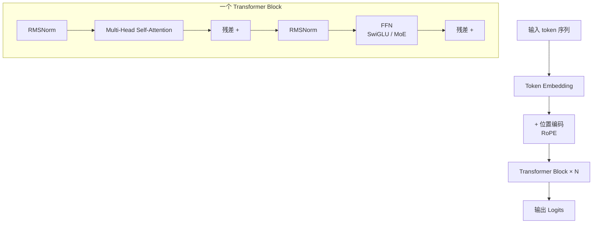
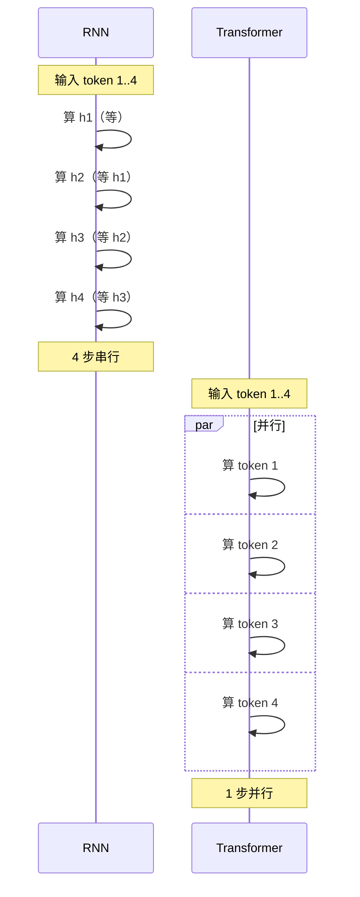
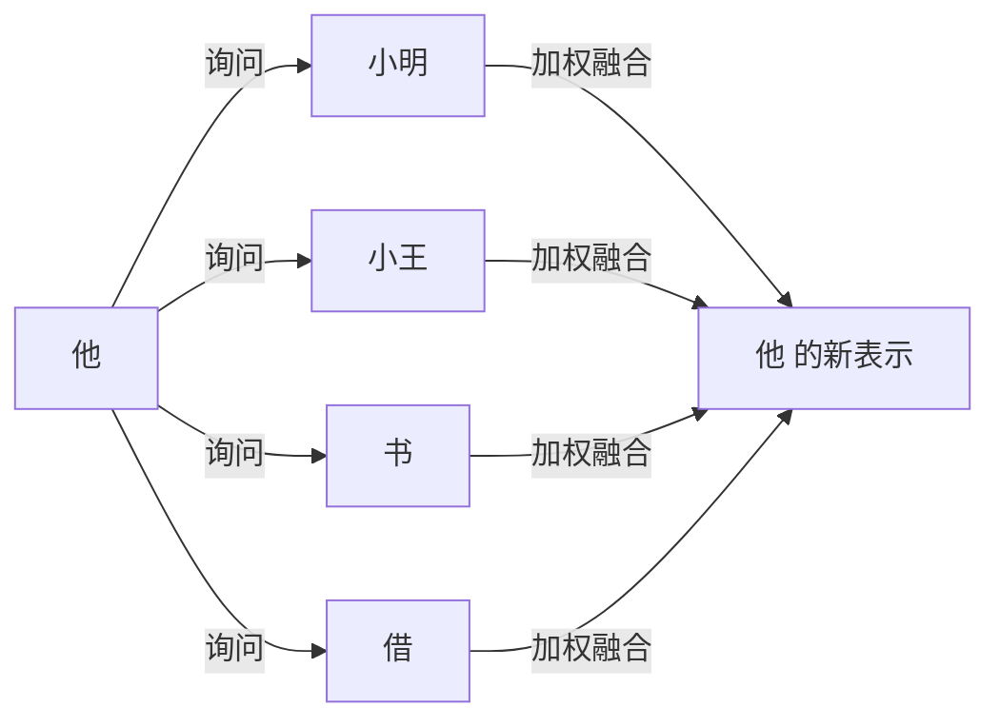
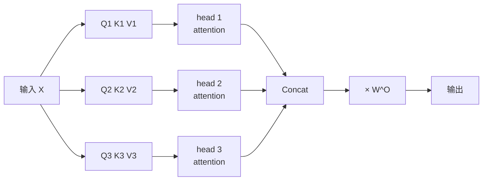
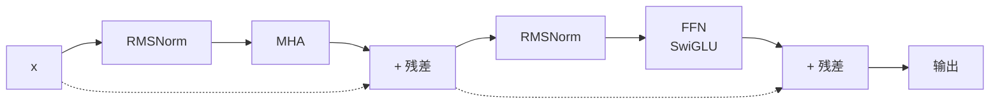
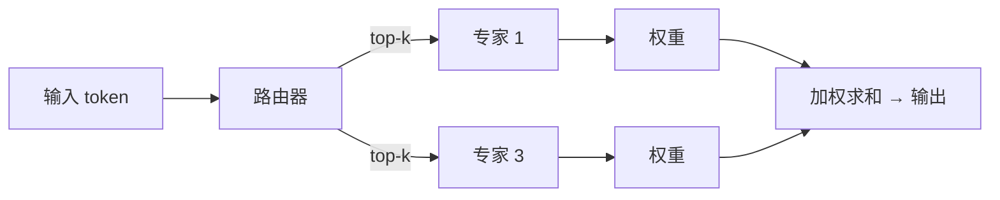

# Ch3 Transformer 与注意力

> 一句话简介：从 RNN 的痛点讲起，到 self-attention 的直觉，再到 Transformer block 的标准结构，为理解现代 LLM 打地基。

## 本章目标

读完本章你应当能：
- 用"工程师痛点"解释为什么 Transformer 取代了 RNN
- 用一句话说出 self-attention 在做什么
- 解释 Q/K/V 三个角色，并理解 scaled dot-product attention 公式每一项的含义
- 说出多头注意力为什么有效
- 解释位置编码的必要性，说出现代 LLM 默认用 RoPE 的原因
- 画出一个标准 Transformer block（Pre-Norm + Attention + FFN + 残差）
- 区分 Decoder-only / Encoder-only / Encoder-Decoder 三种架构
- 描述 KV cache 的作用与代价
- 用"分诊台 + 专家"类比解释 MoE 的稀疏激活思想

## 本章导览



## 3.1 为什么需要新架构

Transformer（2017）之前，主流方法是 **RNN**（循环神经网络）及其升级版 LSTM / GRU。核心思想：**第 $t$ 步隐藏状态 $h_t$ 依赖 $h_{t-1}$，像流水线一节传一节**。

这个设计在工程上撞了三堵墙：**训练慢**（GPU 几千核只用 1 个）、**长文丢信息**（信息沿链传 999 次被"稀释"）、**扩不动**（隐藏状态维度固定）。

2017 年 Google 用一个改动同时解决：**抛弃递归，让序列里任意两个位置直接"对话"**。这种机制叫 **self-attention（自注意力）**。今天所有主流 LLM——GPT、LLaMA、Qwen、DeepSeek、Claude——共同的基石就是由此诞生的 **Transformer** 架构。



左边 RNN 像只有 1 个窗口的快递站，前一个没办完后面的都得排队；右边 Transformer 像开了 8 个窗口，所有包裹同时办。**加速的秘密就是去掉"顺序依赖"**——但代价是用 3.5 节的"位置编码"把顺序补回来。

## 3.2 Self-attention 的直觉

Self-attention 的核心想法一句话：**序列里每个位置都要"看一看"其它所有位置，根据相关性重新组合自己的表示。**

读这句话："小明借了小王的书，**他**说下周还。" 人脑会下意识回上文找"小明"或"小王"判断指代。Self-attention 让模型做同样的事——"他"去"询问"句子里所有 token，每个给出一个相关性分数（**注意力权重**），最后"他"的新表示是所有位置的加权平均。



这种机制有两个非常优雅的性质：**任意两个位置一次"询问"就能交换信息**（不像 RNN 要沿链传），**注意力权重可视化常常能直接看出句法结构**（主谓、指代关系自动浮现）。

## 3.3 Q/K/V 与 attention 公式

Self-attention 在工程上借鉴了**信息检索**的思路：用"查询词"去和所有"索引标签"比对相关性，按相关性从对应的"内容"里取信息。这三个角色就是 **Query（查询）、Key（键）、Value（值）**。

**图书馆类比。** 想象你走进图书馆找关于"小王"的指代信息：
- **Q** 是你的检索词："我在找关于'他'的指代"
- **K** 是每本书脊背上的索引标签
- **V** 是每本书的实际内容

你把自己的 Q 和所有书的 K 逐一比对，相关性高的书就多取一点内容。这就是 attention 在做的事。

**一个 4 维的小例子。** 假设 4 个 token，每个用 2 维向量表示（真实模型是几百维，逻辑一样）。Q、K、V 都由输入 X 通过 $W^Q, W^K, W^V$ 投影得到（这里简化示意，直接用 X）。用 Q 和每个 K 做点积得到"他"对所有位置的注意力分数，再丢进 softmax 转成概率。

完整算一遍：Q·K 点积得 `[1.0, 0.0, 0.5, 0.2]`，softmax 后约 `[0.43, 0.17, 0.28, 0.12]`——"他"主要看自己和小王。这个权重矩阵叫 **attention matrix**，下面 ASCII 图是 4 个 token 全部相互 attention 的结果（行=查询者，列=被查询者）：

```text
         他     借     小王    书
   他  [0.43,  0.17,  0.28,  0.12]   ← "他"主要看自己和小王
   借  [0.20,  0.30,  0.25,  0.25]
  小王 [0.25,  0.15,  0.40,  0.20]
   书  [0.15,  0.25,  0.30,  0.30]
```

**每行和为 1**——softmax 的物理含义，也是 attention 的"软检索"性质。

现在我们把整个过程写成公式——这就是 Transformer 的"心脏"：

$$\text{Attention}(Q, K, V) = \text{softmax}\!\left(\frac{Q K^\top}{\sqrt{d_k}}\right) V$$

逐项拆解：

- **$Q K^\top$**：query 和 key 做矩阵乘，得到 $(L, L)$ 的打分矩阵，每格表示"位置 $i$ 和位置 $j$ 有多相关"。
- **$\sqrt{d_k}$**：缩放因子。维度大时点积方差变大、softmax 会把概率挤到一个位置（梯度消失），除以 $\sqrt{d_k}$ 把方差拉回 1 附近。
- **softmax**：把打分转成概率分布（每行和为 1）。
- **乘以 $V$**：用权重对 value 加权求和，每个位置都融合了全局信息。

配套的最小 PyTorch 实现在 `code/part-1/attention.py`（3.9 节进一步解读）。

## 3.4 多头注意力

单头 attention 只能从一个"视角"看序列——就像只用一盏灯照房间。**多头注意力（MHA）** 同时开多盏"灯"，每盏灯专注一种关系（主谓、动宾、局部语法...）。



工程上，把 Q/K/V 拆成 $h$ 组（每组维度 $d/h$），**独立做 attention，再拼起来**，用输出投影 $W^O$ 把结果映射回去：

$$\text{MultiHead}(Q, K, V) = \text{Concat}(\text{head}_1, \dots, \text{head}_h)\, W^O$$

关键点：**多头几乎不增加参数量**——大矩阵拆成几个小矩阵，总参数几乎一样，只是把预算"重新分配"到多个子空间。LLM 通常有 16~128 个 head。

## 3.5 位置编码

Self-attention 有一个隐藏的、但极其致命的弱点：**它对序列顺序完全不敏感**。把"猫吃鱼"和"鱼吃猫"分别喂给 attention 层，输出会完全一样——因为 attention 只关心"哪些 token 共现"，不关心"谁先谁后"。但语言显然是有顺序的。

**信封类比。** 想象 token embedding 是信封里的内容（信件），**位置编码（Positional Encoding）** 是信封外面的邮政编码。没有邮编，邮局不知道该把这封信送到序列里的第几格。

主流方案：**RoPE（Rotary Position Embedding）**。现代 LLM 几乎都用它（LLaMA / Qwen / DeepSeek / Mistral）。核心思想一句话：**把 query 和 key 向量在二维子空间里按位置旋转一个角度**。旋转后位置 $m$ 的 query 和位置 $n$ 的 key 做内积会自动包含 $(m-n)$——直接编码**相对位置**。

其他两种一句话点名：

- **Sinusoidal**：原始 Transformer 方案，用不同频率的 sin/cos 生成位置向量。已被淘汰。
- **ALiBi**：保持 attention 不变，在打分上加一个与距离成正比的负偏置。MPT、BLOOM 采用。

| 方案 | 编码对象 | 是否需参数 | 代表模型 | 现状 |
|---|---|---|---|---|
| Sinusoidal | 绝对位置 | 否 | 原始 Transformer | 已淘汰 |
| **RoPE** | **相对位置** | **否** | **LLaMA / Qwen / DeepSeek** | **当前主流** |
| ALiBi | 距离偏置 | 否 | MPT / BLOOM | 长上下文场景 |

**记法：RoPE 主流，ALiBi 长上下文，Sinusoidal 已淘汰。**

## 3.6 Transformer block

Transformer block 由两大部分组成：**多头自注意力（MHA）** 和**前馈网络（FFN）**，各包一层归一化和一条残差连接。



**变形金刚积木类比。** 每一层 Transformer block 都是同一块积木，叠得越高能力越强——LLaMA-3-70B 叠了 80 块。

**Pre-Norm 还是 Post-Norm？** 现代 LLM 几乎都用 **Pre-Norm**——把归一化放在注意力和 FFN **之前**。类比：Pre-Norm 像"出门前先体检"，Post-Norm 像"回家后再体检"——前者深层训练更稳。伪代码：

```python
# 残差连接 1（自注意力子层）
attn_out = mha(rms_norm_1(x))
x = x + attn_out
# 残差连接 2（FFN 子层）
ffn_out = ffn(rms_norm_2(x))
x = x + ffn_out
```

**FFN** 子层通常是"两层全连接中间夹一个激活函数"——**汉堡包类比**：两片肉饼（线性层）夹一片芝士（激活函数）。现代 LLM 普遍用 **SwiGLU**（3.10 节）。

## 3.7 Decoder-only vs Encoder-Decoder

Transformer 论文（2017）描述的是 **Encoder-Decoder**：Encoder "读懂"输入，Decoder "生成"输出。但 2018 年后社区发现更简单的替代——**Decoder-only**：只保留 Decoder，一次看完 prompt 再续写。今天 GPT、LLaMA、Qwen 等主流模型清一色都是 Decoder-only。

**对话模式类比**：

| 架构 | 对话模式 | 注意力掩码 | 代表模型 | 典型任务 |
|---|---|---|---|---|
| **Decoder-only** | **续写模式** | causal mask | GPT / LLaMA / Qwen | 文本生成、对话 |
| Encoder-only | 阅读理解模式 | 无 mask | BERT / RoBERTa | 分类、检索 |
| Encoder-Decoder | 翻译模式 | 编码无掩码 / 解码 causal + cross | T5 / BART | 翻译、摘要 |

**causal mask** 是关键区别。用"**单向玻璃**"类比：Decoder-only 必须遮住未来——位置 $i$ 只能看到 $\leq i$ 的 token。工程上用上三角为 $-\infty$ 的 mask 矩阵，把不允许看的分数在 softmax 前设为 $-\infty$。**本书后续章节默认关注 Decoder-only LLM**。

## 3.8 KV cache 直观理解

LLM 推理是**自回归**的——生成第 $t$ 个 token 时，要重新过一遍前 $t-1$ 个 token 的 attention。朴素实现每步都重算所有历史 K 和 V，序列一长计算量爆炸。

**查字典类比。** 你第一次查"他"这个字，记住它在第 247 页。下次再翻到那个位置，不用从头找——这就是 KV cache。**历史 token 的 K/V 在第一次算完后缓存，下次生成新 token 时直接复用。**

```text
朴素（每步都重算）               KV cache 优化
生成 token 1: 算 K1/V1           生成 token 1: 算 K1/V1 → 缓存
生成 token 2: 重算 K1/V1 + K2/V2 生成 token 2: 算 K2/V2 → 拼接进缓存
生成 token L: O(L²) 总计算        生成 token L: O(L) 总计算
```

**算一笔显存账。** KV cache 把 $O(L^2)$ 总计算量降到 $O(L)$，但显存占用增加——每层、所有历史 token 的 K/V 都要存。32 层、40k 上下文、每层 8 KV head、head dim 128 的模型，KV cache 显存（fp16）约 5.2 GB。3.10 节的 **GQA** 就是为这个问题设计的——多 query head 共享一组 K/V，把 KV cache 直接砍掉几倍。

## 3.9 一个最小 attention 示例

用最小 PyTorch 代码把 3.3 节公式跑一遍。完整代码在 `code/part-1/attention.py`，核心函数只有 5 行：

```python
def scaled_dot_product_attention(query, key, value):
    d_k = query.size(-1)
    scores = torch.matmul(query, key.transpose(-2, -1)) / (d_k ** 0.5)
    attn = F.softmax(scores, dim=-1)
    output = torch.matmul(attn, value)
    return output, attn
```

数据流：

```text
输入 Q,K,V (2, 4, 8)
   → Q·K^T → scores (2, 4, 4) ── 每行是"该位置对所有位置的相关性"
   → ÷ √8 → softmax → attn (2, 4, 4) ── 每行和为 1（不变量）
   → attn·V → output (2, 4, 8) ── 形状和输入一样，但融合全局信息
```

它精确对应公式 $\text{softmax}(Q K^\top / \sqrt{d_k}) V$，**没有省略任何一项**。配套 `main()` 用 `torch.manual_seed(0)` 固定种子，生成 `(2, 4, 8)` 随机 Q/K/V，调用 attention，并用 `assert` 验证 **softmax 行和为 1**、输出形状正确。

直接运行 `python code/part-1/attention.py`：

```text
output shape: (2, 4, 8)
attn shape:   (2, 4, 4)
OK：注意力权重行和为 1，输出形状正确
```

这个 30 行例子就是工业级 Transformer 库（PyTorch `F.scaled_dot_product_attention`、FlashAttention）的数学骨架。

## 3.10 MoE 与现代 Transformer 变体

标准 Transformer 块已近十年，这期间涌现出一系列"小改动、大收益"的变体。LLaMA-3、Qwen-3、DeepSeek-V3、Mixtral 等前沿模型都同时具备下面这些特性。

### MoE（Mixture of Experts）— 深入讲

**医院分诊类比。** 一家医院有 8 个科室的专家。病人看病，分诊台（**路由器 Router**）判断该看哪几个科室（通常 top-2 或 top-4）。普通模型相当于让病人把 8 个科室全看一遍——慢；**MoE** 只看相关几个——又快又准。



工程上把传统 FFN 拆成 $E$ 个专家网络（$E=8, 16, 64, 256$ 都常见），路由器对每个 token 算分数，决定走哪几个专家。模型总参数可以很大，但每个 token 只激活一小部分，**推理成本几乎和激活专家数成正比**。DeepSeek-V2/V3、Mixtral 8x7B、GPT-4 都用了 MoE。

### 其他三种现代变体 — 一句话点名

现代 LLM 几乎都同时采用以下三个"小改动"，设计哲学一致：**用更聪明的方法用好每一 FLOP、每一字节显存**。

| 变体 | 直观说法 | 谁在用 |
|---|---|---|
| **RMSNorm** | 比 LayerNorm 简化，去掉均值中心，只做缩放——计算稍快，效果相当 | LLaMA / Qwen |
| **SwiGLU** | 比 ReLU 更聪明的"门控"激活函数——输入自己决定要不要激活 | LLaMA / PaLM |
| **GQA** | 多头共享 KV——节省显存，质量接近 MHA | LLaMA-2/3 / Qwen |

细节、对比、权衡留到 Part 2 第 6 章展开。本节只要形成"现代 LLM 标准件"的心智模型：**MoE** 让模型大而不慢、**RMSNorm** 让训练更快、**SwiGLU** 让表达更准、**GQA** 让推理更省。

## 本章小结

- **RNN 的局限**：训练难并行、长距离依赖被稀释；Transformer 用 self-attention 一次解决。
- **Self-attention 直觉**：每个位置"询问"序列所有位置，按相关性加权融合。
- **核心公式**：$\text{Attention}(Q, K, V) = \text{softmax}(Q K^\top / \sqrt{d_k}) V$；$\sqrt{d_k}$ 是稳定 softmax 的关键。
- **多头注意力**：把 Q/K/V 拆成多组并行算 attention，让不同 head 学不同模式，几乎不增加参数量。
- **位置编码**：必须显式注入顺序。RoPE 主流、ALiBi 长上下文、Sinusoidal 已淘汰。
- **Transformer block**：Pre-Norm + MHA + 残差 + FFN + 残差，堆叠 N 次。
- **三类架构**：Decoder-only（主流）、Encoder-only（理解）、Encoder-Decoder（翻译）。
- **KV cache**：自回归推理缓存历史 K/V，总计算量从 $O(L^2)$ 降到 $O(L)$。
- **现代变体**：MoE（稀疏激活）、RMSNorm、SwiGLU（门控激活）、GQA（共享 K/V）——前沿 LLM 标配。

## 本章参考

### 必读论文

- [Attention Is All You Need (Vaswani et al., 2017)](https://arxiv.org/abs/1706.03762) — Transformer 的开山之作，提出 self-attention 和 Encoder-Decoder 架构。
- [RoFormer: Enhanced Transformer with Rotary Position Embedding (Su et al., 2021)](https://arxiv.org/abs/2104.09864) — RoPE 论文，把旋转矩阵引入位置编码，成为 LLaMA/Qwen/DeepSeek 的标配。
- [GQA: Training Generalized Multi-Query Transformer Models from Multi-Head Checkpoints (Ainslie et al., 2023)](https://arxiv.org/abs/2305.13245) — GQA 论文，给出从 MHA checkpoint 蒸馏到 GQA 的实用方法。
- [Mixtral of Experts (Jiang et al., 2024)](https://arxiv.org/abs/2401.04088) — Mixtral 8x7B 报告，展示了稀疏 MoE 在开源 LLM 中的可行路径。

### 推荐博客 / 教程

- [The Illustrated Transformer (Jay Alammar)](https://jalammar.github.io/illustrated-transformer/) — 图解 Transformer 经典之作，把 Q/K/V、注意力、Encoder/Decoder 讲得非常直观。
（中文 LLM 架构讲解可参考 Sebastian Raschka 的 "Build a Large Language Model From Scratch" 第 4 章讲解 RMSNorm / SwiGLU / GQA / RoPE 各组件的中文翻译与解读；或者阅读 LLaMA-3 / Qwen-2 技术报告原文里的 Architecture 章节。）

### 视频 / 课程

- [Andrej Karpathy "Let's build GPT"](https://www.youtube.com/watch?v=kCc8FmEb1nY) — 从零手写 GPT 的视频教程，看完对 decoder-only Transformer 的训练与采样会有具象认识。
