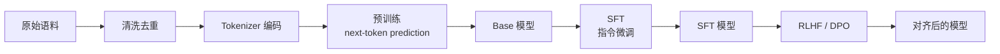

# Ch4 预训练与微调

> 一句话简介：从数据清洗到分布式训练，看一个 LLM 是怎么从无到有被"喂养"出来的。

## 本章目标

读完本章你应当能：
- 解释 next-token prediction 预训练目标
- 描述数据流水线的关键步骤（清洗、去重、配比）
- 比较 BPE / WordPiece / SentencePiece 三种 tokenizer 思路
- 说出数据并行（DP）、张量并行（TP）、流水线并行（PP）的核心思想
- 用一句话描述 Scaling Law（Chinchilla 之类）
- 区分 SFT 与预训练目标的差异
- 解释 LoRA / QLoRA 为什么能参数高效微调
- 说出灾难性遗忘的原因

## 本章导览



## 4.1 预训练目标

预训练（pre-training）是 LLM "学说话"的阶段。我们手头有几千亿甚至几万亿 token 的网页、书、代码、问答语料，目标只有一个：**让模型学会"下一个 token 是什么"**——这就是所谓 **next-token prediction**（也叫 causal language modeling）。

形式上，给定一段文本 $x_1, x_2, \dots, x_T$，模型的训练目标是最大化对数似然：

$$\mathcal{L}(\theta) = -\sum_{t=1}^{T} \log p_\theta(x_t \mid x_1, x_2, \dots, x_{t-1})$$

直觉解释：**让模型看到前文，预测下一个 token，预测得越准，损失越小**。这看起来像个"补全游戏"，但规模化之后，它能"涌现"出翻译、写代码、做推理等五花八门的能力——GPT-3 的论文首次系统展示了这一点。

实现细节上要注意几点：

- **Teacher forcing**：训练时把整段序列一次性喂给 Transformer，让每一层并行算所有位置的损失，而不是真的"一个一个生成"。这正是 Ch3 讲的 self-attention 并行性的红利——没有它，训练几千亿 token 是不可想象的。
- **Causal mask**：为了不让位置 $t$ "偷看"位置 $t+1$ 的答案，attention 层会用上三角为 $-\infty$ 的掩码（Ch3.7 提过）。这正是 Decoder-only 的精髓——单向、自回归。
- **损失函数**：交叉熵（cross-entropy）一次算出整段序列的损失，然后对所有 token 取平均。

为什么 next-token prediction 这么"够用"？一个直觉是：**要让模型准确预测下一个 token，它必须学会语法、常识、推理、世界知识**——这些都是"理解语言"的必要条件。所以当我们把模型规模、数据量都堆到足够大，next-token prediction 就成了一个"通用预训练目标"。

## 4.2 数据流水线

数据是 LLM 训练的"粮食"。一句行业老话叫 **"Garbage in, garbage out"**——再大的模型也救不了脏数据。一个典型的数据流水线要经过四道关：

**第一步：来源聚合。** 主流 LLM 的预训练数据通常由多个来源拼成：CommonCrawl 网页抓取、GitHub 代码、Wikipedia、Books、StackExchange 问答、arXiv 论文等。各家会按比例混合，后面会讲到"配比"。

**第二步：清洗。** CommonCrawl 是体量最大的来源，但质量也最杂。典型清洗步骤包括：
- **去 HTML 标签、广告、导航栏**——这些是页面骨架，不是正文；
- **语言识别（LID）**：用 fastText 这类模型筛掉非目标语言文档；
- **启发式过滤**：去掉重复段落、过短/过长文档、符号-字母比异常的文档；
- **质量打分**：用一个轻量分类器判断文档"像不像 Wikipedia"，给每篇文档打分，保留高分样本。GPT-3 的论文里专门讲了这一步（参见本章参考）。

**第三步：去重。** 网页里大量"模板化"的页面（产品列表、SEO 农场）会整段整段重复。如果不去重，模型会过度记忆这些重复模式，损害泛化能力。常用做法是 **MinHash** 或者 **exact hash** 在文档级和段落级都做一遍去重。DeepSeek-V2 技术报告里就明确把去重列为关键步骤之一。

**第四步：配比（mixture）。** 清洗完后，还要决定**每个来源各取多少**——这就是数据配比。比如 LLaMA-3 的数据配比大致是：英语网页 ~50%、代码 ~15%、多语言 ~8%、高质量问答 ~5%、书籍 ~5%。配比对模型"擅长什么"影响巨大——代码占比高，模型编程就强；中文占比低，中文就弱。这是一条**经验科学**，没有标准答案。

整套流水线跑下来，原始语料常常被砍掉 90% 以上。LLaMA-3 公开过，从 15.6T token 的原始数据里，最终保留下来的训练 token 是 ~15T——其中去重和过滤砍掉的比例其实非常显著。**质量比数量更重要**，是现代 LLM 数据工程的共识。

## 4.3 Tokenizer

数据清洗完，下一步是 **tokenize**——把字符串切成整数 id 序列。这个步骤看起来朴素，但直接决定了模型能"看到"什么、训练效率多高、外推到新语言的能力如何。

主流的 tokenizer 几乎都是**子词（subword）**方案：在字符和词之间找一个折中。常用的有三种：

- **BPE（Byte Pair Encoding）**：从字符集开始，反复把出现频率最高的相邻符号合并成新符号，直到词表大小达标。GPT 系列用 BPE。优点是简单、可逆、词表可控；缺点是对多语言支持有限（因为是基于 Unicode 字符频率的）。
- **WordPiece**：和 BPE 思路很像，但合并准则是"似然增益最大化"而不是"频率最大化"。BERT 用 WordPiece。Google 的内部系统也广泛使用。
- **SentencePiece**：一种端到端的子词切分框架。它把文本当作 Unicode 字符流处理（**不依赖空格**），因此天然支持中日韩等无空格语言。最常用的算法是 **Unigram Language Model**（基于概率剪枝）。LLaMA、Qwen、DeepSeek 等几乎所有现代开源 LLM 都用 SentencePiece。

它们三者的关系可以用一个表格看清楚：

| 方案 | 切分依据 | 是否依赖空格 | 代表模型 |
|---|---|---|---|
| BPE | 频率合并 | 依赖（预分词） | GPT-2/3/4 |
| WordPiece | 似然增益 | 依赖（预分词） | BERT |
| SentencePiece (Unigram) | 概率剪枝 | 不依赖 | LLaMA / Qwen / DeepSeek |

**特别提醒中文场景**：英文里词与词之间有空格，预分词很容易；但中文没有空格，预分词本身就难。SentencePiece 把整段文本当成 Unicode 流处理，配合 BPE/Unigram 算法，是目前处理中文最稳的方案。这也是为什么 Qwen、DeepSeek 一类的中文 LLM 都用 SentencePiece。

词表大小也是一个工程权衡：**太小**，每个词要切成很多 token，序列变长、训练慢；**太大**，embedding 层参数量爆炸（vocab × d 维）、低频词学不好。现代 LLM 词表一般在 **32k ~ 256k** 之间，Qwen-2 用了约 152k。

## 4.4 训练基础设施

把模型训起来，靠一张 GPU 是远远不够的。一个 70B 参数的 LLM，光参数就要 ~140 GB 显存（fp16），还没算优化器状态、激活值、KV cache——一张 H100（80GB）连模型都装不下。所以**分布式训练是必然**，业界用三种并行方式：

**数据并行（Data Parallelism, DP）**：把数据切碎，每个 GPU 拿到完整的模型副本 + 一份数据切片，各自算梯度，然后**同步梯度**（AllReduce）。这是最简单的并行方式，适合模型能装进单卡、但数据量很大的场景。瓶颈是每张卡都得有完整的模型，模型一大就放不下。

**张量并行（Tensor Parallelism, TP）**：把单个矩阵乘法**按维度切开**到多张卡上。比如把一个 $[d \times d]$ 的权重矩阵切成两块 $[d \times d/2]$，分别放到两张卡上算，最后在某个维度 concat 起来。优点是突破了"单卡装不下"的限制；缺点是**通信量巨大**——每层前向/反向都要做 AllReduce，通常只能在**单机多卡**（NVLink 高速互联）上做。Megatron-LM 把这套方法定型成工业标准。

**流水线并行（Pipeline Parallelism, PP）**：把模型的**层**切成几段，每张卡负责一段。卡 0 算 layer 1~16，卡 1 算 17~32，……数据像流水线一样流过去。优点是通信量小（只传 activations）、可以跨机器；缺点是会有"流水线气泡"——前向时卡 1 要等卡 0 算完才能开始。GPipe、PipeDream 用各种调度策略减少气泡。

实际工业实践中，这三种并行**经常组合使用**：8 路 TP + 16 路 PP + 64 路 DP = 8192 张卡，这正是 GPT-4 训练集群的典型规模。配套还有 **ZeRO**（优化器状态切分）、**FSDP**（Fully Sharded Data Parallel，PyTorch 的官方实现）、**DeepSpeed** 等工具链——这些都是 Part 2 才会深入展开的话题。

**简单记法**：DP 切样本、TP 切矩阵、PP 切层。

## 4.5 Scaling Law

大模型为什么"大力出奇迹"？这背后有一套经验规律，叫 **Scaling Law**——描述模型性能 $L$ 如何随模型参数 $N$、数据量 $D$、算力 $C$ 变化。

最早系统研究这个问题的是 OpenAI 的 Kaplan 等人（2020，参见本章参考）。他们发现：当固定算力时，模型性能与参数量的对数呈幂律关系——**模型每变大 10 倍，损失下降一个稳定比例**。换句话说，越大的模型，单位算力的回报越高。

但 Kaplan 的结论被 DeepMind 的 **Chinchilla**（Hoffmann et al., 2022）修正了。Chinchilla 用同一套算力训练了一系列不同 $N$ 和 $D$ 的组合，发现：**最优的模型大小和数据量应该按比例同步增长**。具体地，给定一份算力预算（比如 1e24 FLOPs），最优配比大约是 **每 1 个参数配 20 个训练 token**。Chinchilla-70B 只用 70B 参数 + 1.4T token，就击败了 GPT-3 的 175B 参数 + 300B token——证明了"模型不是越大越好，数据要和模型匹配"。

Chinchilla 的影响是深远的。今天几乎所有 LLM 训练都会参考"1 参数配 20 token"这条经验线。**GPT-4 时代往后**，大家发现这条线在推理、多模态时代不一定最优（数据质量、RLHF 阶段引入的新计算等都让公式变复杂），但 Chinchilla 的核心思想——**算力要在模型和数据之间平衡分配**——至今是 LLM 训练的第一性原则。

简单记法：**给定的算力，要让模型大小和数据量"等比例放大"，而不是只把模型变大**。

## 4.6 SFT 数据构造

预训练出来的 **base 模型** 会"接话"，但不会"听话"。你问它问题，它可能接着把问题重新说一遍，而不是回答——因为它的训练目标是 next-token prediction，不是"按指令办事"。

**SFT（Supervised Fine-Tuning，监督微调）** 就是解决这个问题。SFT 用**问答对**数据继续训练 base 模型：每条样本是 `(指令, 回答)`，让模型学习"看到指令 → 输出回答"。SFT 之后，模型就具备基本的指令跟随能力——这就是 ChatGPT、Qwen-Chat 的雏形。

数据形态上，SFT 数据和预训练数据有本质区别：

| 维度 | 预训练 | SFT |
|---|---|---|
| 目标 | next-token prediction | next-token prediction（同） |
| 数据形态 | 连续文档、网页 | `(指令, 回答)` 对 |
| 规模 | 千亿 ~ 十万亿 token | 1 万 ~ 100 万条样本 |
| 训练轮数 | 1 轮（一次性看完） | 2~5 轮 |
| 学习率 | 较大（1e-4 ~ 5e-4） | 较小（1e-5 ~ 5e-5） |

虽然底层优化目标都是 next-token prediction，但**数据形态变了，模型的行为就变了**——这是 SFT 的精髓。

SFT 数据怎么来？几条主要路径：
- **人工标注**：雇佣标注员写"指令-回答"对，质量最高，成本也最高；
- **蒸馏大模型**：用 GPT-4、Claude 这样的强模型生成回答，再让小模型去学（Self-Instruct、Alpaca 路线）；
- **用户日志**：从真实用户交互中筛选高质量对话（经过脱敏和合规处理）；
- **合成数据**：用规则、模板、强模型生成针对特定技能的样本（比如数学题、代码题）。

**数据多样性比数据量更重要**。业界经验：5 万条高质量、多样化的指令数据，足以让一个 base 模型变成"可对话"的助手；再多就要靠 RLHF/DPO 阶段继续打磨（详见 Ch5）。

## 4.7 LoRA / QLoRA 参数高效微调

SFT 时如果直接全参数微调一个大模型，成本极高——一个 70B 模型，光梯度+优化器状态就要几百 GB 显存。**LoRA（Low-Rank Adaptation）** 用一个非常优雅的观察绕开了这个问题。

**核心观察**：模型学新任务时，权重的变化量 $\Delta W$ 其实**"秩很低"**——虽然 $W$ 本身是满秩的，但适配新任务需要的更新可以近似用两个低秩矩阵的乘积表示：

$$\Delta W \approx B \cdot A$$

其中 $W \in \mathbb{R}^{d \times k}$，$A \in \mathbb{R}^{r \times k}$，$B \in \mathbb{R}^{d \times r}$，$r \ll \min(d, k)$（典型 $r = 4, 8, 16$）。

训练时：**冻结原始 $W$，只训练 $A$ 和 $B$**。新增的训练参数只有 $r \times (d + k)$ 个——当 $r=8, d=k=4096$ 时，新增参数不到 $W$ 的 $0.4\%$。推理时把 $B \cdot A$ 合并回 $W$，**不增加任何额外延迟**。

工程实现上还有几个细节：
- **注入位置**：LoRA 通常只加在 attention 的 $W^Q, W^V$ 上（也有加在 FFN 的 $W$ 上的），效果已经很好；
- **初始化**：$A$ 用随机高斯，$B$ 用零——保证训练开始时 $\Delta W = 0$，模型行为和 base 模型完全一致；
- **多任务切换**：不同任务训练不同的 $(A, B)$，共享同一个 base $W$，切换任务只需换一对小矩阵——极大方便多任务部署。

**QLoRA（Dettmers et al., 2023）** 把 LoRA 进一步推到了极限。它先把 base 模型**量化到 4-bit（NF4 数据类型）**，把显存占用砍到原来的 1/4；然后在量化的 base 上做 LoRA 微调。QLoRA 让一张 24GB 显存的消费级 GPU（比如 RTX 4090）就能微调 65B 参数的模型——**让个人开发者也能负担得起 LLM 微调**。

为什么低秩就够了？目前没有完美的理论解释，主流观点是：语言模型在预训练阶段已经学到了大部分"通用知识"，SFT 只需要在一个低维子空间里调整方向即可——这和 "intrinsic dimension"（内在维度）研究的结果一致。

简单记法：**LoRA 冻结主权重，只训练旁路的小矩阵；QLoRA 把主权重再量化到 4-bit，把显存砍到极致**。

## 4.8 灾难性遗忘

SFT 不是没有代价。一个常见现象是：**模型学新任务时，会忘掉预训练时学到的旧能力**——这叫 **catastrophic forgetting（灾难性遗忘）**。

为什么会这样？因为神经网络是用同一套参数"装"所有能力的。学新任务时梯度下降更新参数，不可避免地"擦掉"一部分旧知识。打个比方：pre-train 阶段模型"读完了一整个图书馆"，SFT 阶段你让它改学数学题——它可能学会了解方程，但把历史、化学忘得一干二净。

灾难性遗忘在 SFT、RLHF、持续学习（continual learning）等场景下都非常常见。**几个常用缓解策略**：

- **低学习率 + 少训练轮数**：SFT 用 1e-5 级别的 LR 跑 2~3 轮，而不是预训练的 5e-4 跑 1 轮，参数改动幅度小，旧能力保留得多。
- **与预训练数据混训**：在 SFT 数据里掺入 10%~30% 的预训练语料（纯文本，不是问答对），让模型在"学新"的同时"复习旧"。LLaMA-2-Chat 的训练流程里就明确用了这个技巧。
- **正则化**：EWC（Elastic Weight Consolidation）这类方法给重要参数加约束，阻止它们偏离原值太远。实践中用得不多，但概念重要。
- **参数高效微调**：LoRA 这种方法天然缓解遗忘——只更新一小撮低秩参数，对原模型的扰动小。QLoRA 论文里专门测过，QLoRA 微调后模型在通用基准上的退化远小于全参数微调。

简单记法：**低 LR + 混训 + 参数高效 = 缓解灾难性遗忘的三板斧**。

## 4.9 一个 tokenizer 示例

理论讲完了，我们用一个最小可运行的代码把 4.3 节的概念跑一遍。完整代码在 `code/part-1/tokenize_demo.py`，它加载 Qwen2.5-0.5B 的 SentencePiece tokenizer，对三段中英文文本做编码和解码：

```bash
cd /data/projects/agentkit
python code/part-1/tokenize_demo.py
```

预期输出（简化版）：

```text
原文: Hello, world!
  ids:    [9707, 11, 1879, 0]
  tokens: ['Hello', ',', ' world', '!']
  解码:   Hello, world!
原文: Transformer 是 LLM 的核心架构。
  ids:    [92893, 220, 101909, 220, 3577, 102898, 37961, 99577, 3837]
  tokens: ['Transform', 'er', ' 是', ' ', 'L', 'LM', ' 的', '核心', '架构', '。']
  解码:   Transformer 是 LLM 的核心架构。
...
OK：编码 / 解码可逆
```

几个值得注意的观察：

1. **英文按"片段"切**：`"Hello"` 被切成 `Hello` 一整个 token，而 `"Transformer"` 被拆成 `Transform` + `er` 两个 token。这是因为前者出现频率高，已经成为词表里的一个独立符号；后者被 BPE 算法认为不够"划算"，于是拆成子词。
2. **中文按"字/词"切**：`"核心架构"` 被切成 `核心` + `架构` 两个 token——SentencePiece 在中文上更像"按词切"；而单字如 `"是"` `"的"` `"。"` 各占一个 token。这正是 SentencePiece 比传统 BPE 更适合中文的地方。
3. **可逆性**：最后那个 `assert` 验证 `decoded == text`，证明 **tokenizer 是无损的**——编码再解码，可以精确还原原文。这条性质非常关键：模型看到的输入和生成的输出，都是 token 流；如果 tokenizer 不可逆，整个链路就会有系统性误差。

这个例子虽然只有 30 行，但它把 4.3 节讲的子词切分、词表、id 编码、可逆性全都跑了一遍。理解了它，你就理解了所有现代 LLM 数据处理流水线的第一步。

## 本章小结

- **预训练目标**：next-token prediction，最大化每个位置的条件似然；用 causal mask 实现单向自回归。规模化之后，这个"补全游戏"能涌现翻译、写代码、推理等通用能力。
- **数据流水线**：来源聚合 → 清洗（去 HTML、语言识别、质量打分）→ 去重（MinHash）→ 配比（多源混合）。质量比数量更重要，常常砍掉 90% 的原始数据。
- **Tokenizer**：BPE / WordPiece / SentencePiece 三种主流方案；中文场景 SentencePiece 是首选；词表大小一般 32k ~ 256k。
- **训练基础设施**：DP 切样本、TP 切矩阵、PP 切层，工业界经常组合使用；FSDP、DeepSpeed 等工具链支撑万卡级训练。
- **Scaling Law**：Kaplan 给出幂律，Chinchilla 修正为"算力要在模型和数据之间平衡"，1 参数配 20 token 是经验法则。
- **SFT**：用 `(指令, 回答)` 数据继续训练 base 模型；优化目标和预训练相同但数据形态不同；数据多样性比数量更重要。
- **LoRA / QLoRA**：冻结主权重，只训练低秩旁路矩阵 $B \cdot A$；QLoRA 把 base 量化到 4-bit，让消费级 GPU 也能微调大模型。
- **灾难性遗忘**：学新忘旧；缓解手段是低 LR、与预训练数据混训、参数高效微调。

## 本章参考

### 必读论文

- [Scaling Laws for Neural Language Models (Kaplan et al., 2020)](https://arxiv.org/abs/2001.08361) — 首次系统研究模型规模、数据量、算力与性能之间的幂律关系。
- [Training Compute-Optimal Large Language Models (Chinchilla, Hoffmann et al., 2022)](https://arxiv.org/abs/2203.15556) — 修正 Kaplan 结论，提出 "1 参数配 20 token" 的最优配比。
- [LoRA: Low-Rank Adaptation of Large Language Models (Hu et al., 2022)](https://arxiv.org/abs/2106.09685) — 提出低秩适配方法，参数高效微调的奠基之作。
- [QLoRA: Efficient Finetuning of Quantized LLMs (Dettmers et al., 2023)](https://arxiv.org/abs/2305.14314) — 把 base 模型量化到 4-bit 后做 LoRA，让消费级 GPU 也能微调大模型。

### 推荐博客 / 教程

- [Hugging Face Tokenizers 概览](https://huggingface.co/docs/transformers/tokenizer_summary) — BPE / WordPiece / Unigram 三种方案的官方对比，配合代码示例。
- [LLaMA-3 数据配比与训练流程解析](https://kdopen.com/blog-3/llama3-data-mixture-and-training-pipeline) — 拆解 LLaMA-3 的数据工程和训练策略的中文好文。

### 视频 / 课程

- [Andrej Karpathy "Let's build the GPT tokenizer"](https://www.youtube.com/watch?v=zduSFxRajkE) — 从零手写 BPE tokenizer 的视频教程，看完会对子词切分有第一性认识。
