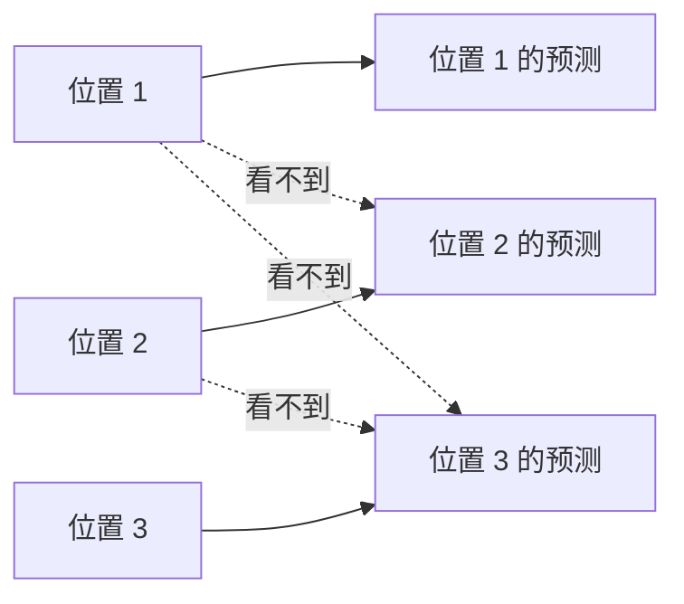
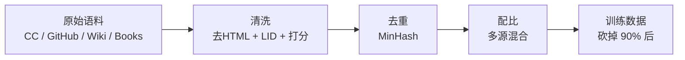
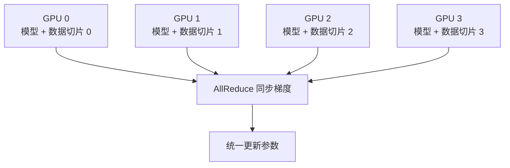

# Ch4 预训练与微调

> 一句话简介：从数据清洗到分布式训练，看一个 LLM 是怎么从无到有被"喂养"出来的。

## 本章目标

读完本章你应当能：
- 解释 next-token prediction 预训练目标
- 描述数据流水线的关键步骤（清洗、去重、配比）
- 比较 BPE / WordPiece / SentencePiece 三种 tokenizer 思路
- 说出数据并行（DP）、张量并行（TP）、流水线并行（PP）的核心思想
- 用一句话描述 Scaling Law（Chinchilla 之类）
- 区分 SFT 与预训练目标的差异
- 解释 LoRA / QLoRA 为什么能参数高效微调
- 说出灾难性遗忘的原因

## 本章导览


## 4.1 预训练目标

预训练（pre-training）是 LLM "学说话"的阶段。我们手头有几千亿甚至几万亿 token 的网页、书、代码、问答语料，目标只有一个：**让模型学会"看到前文，预测下一个 token"**——这就是 **next-token prediction**（也叫 causal language modeling）。

**直觉**：模型看到 "今天天气真___"，要预测下一个词是"好"。每预测一次就跟标准答案对一下，错得多就调参数。这是个**打字游戏**。

**为什么这个"补全游戏"能学会那么多？** 要预测准确，模型被迫学会语法、常识、推理、世界知识。规模化之后，next-token prediction 成了一个**通用预训练目标**，能"涌现"翻译、写代码、做推理等能力——GPT-3 论文首次系统展示了这一点。

**实现细节**（点到为止，详见 Ch3）：



- **Causal mask（因果掩码）**：模型在预测位置 $t$ 时，只能看到 $\leq t$ 的前文——就像一面"单向玻璃"，是 Decoder-only 的精髓。
- **Teacher forcing**：训练时把整段序列一次性喂给 Transformer，让所有位置并行算损失，而不是"一个一个生成"。这正是 self-attention 并行性的体现。

## 4.2 数据流水线

数据是 LLM 训练的"粮食"。一句行业老话叫 **"Garbage in, garbage out"**——再大的模型也救不了脏数据。

**类比**：把数据流水线想成"中央厨房的备菜流程"——买菜（来源）→ 洗菜切菜（清洗）→ 拣菜（去重）→ 按菜谱配比（mixture）。原料坏，做出来的菜也坏。



四个核心步骤：

**第一步：来源聚合。** 主流 LLM 的预训练数据由多个来源拼成：CommonCrawl（占大头，约 80%+）、GitHub、Wikipedia、Books、StackExchange、arXiv 论文。LLaMA-3 一共用了约 **15.6T token**，英文占约 90%，代码和数学相对 LLaMA-2 大幅上调。

**第二步：清洗。** CommonCrawl 体量最大但也最杂。典型清洗：去 HTML 标签；用 fastText 做语言识别（LID）；启发式过滤（去掉重复段落、过短或过长的文档）；用轻量分类器给文档质量打分。

**第三步：去重。** 网页里大量"模板化"页面（产品列表、SEO 农场）整段重复，不去重模型会过度记忆、损害泛化。常用 **MinHash** 在文档级和段落级都做一遍去重。

**第四步：配比（mixture）。** 决定**每个来源各取多少**——配比对模型"擅长什么"影响巨大：代码占比高，编程就强；中文占比低，中文就弱。LLaMA-3 最后跑了一段**退火阶段（annealing）**，用验证集对比不同配比选最优。

整套流水线跑下来，原始语料常常被砍掉 **90% 以上**。**质量比数量更重要**，是数据工程共识。

## 4.3 Tokenizer

数据清洗完，下一步是 **tokenize**——把字符串切成整数 id 序列。这个步骤看起来朴素，但直接决定了模型能"看到"什么、训练效率多高、外推到新语言的能力如何。

**类比**：tokenizer 像"切菜刀"——切得太大（按词）词表爆炸；切得太小（按字）句子变长、训练变慢；**子词（subword）** 是个折中——按出现频率把高频片段合并成"块"。

```text
原文 "Hello world"
     ↓ 切分
["Hello", " world"]
     ↓ 编码
[15496, 995]
     ↓ 解码
"Hello world"
```

主流的 tokenizer 几乎都是**子词**方案，常用三种：

- **BPE（Byte Pair Encoding）**：从字符集开始，反复把出现频率最高的相邻字符合并成新符号。GPT-2/3/4、Qwen-2.5、DeepSeek 都用 BPE（Qwen2.5 用的是 tiktoken 风格）。
- **WordPiece**：和 BPE 思路很像，但合并准则是"似然增益最大化"而非频率。BERT 用 WordPiece。
- **SentencePiece**：把文本当作 Unicode 字符流处理（**不依赖空格**），天然支持中日韩等无空格语言，内部可跑 **Unigram**（概率剪枝）或 BPE——LLaMA-2 用 SentencePiece + BPE。

| 方案 | 切分依据 | 是否依赖空格 | 代表模型 |
|---|---|---|---|
| BPE | 频率合并 | 依赖（预分词） | GPT-2/3/4、Qwen-2.5、DeepSeek |
| WordPiece | 似然增益 | 依赖（预分词） | BERT |
| SentencePiece（框架） | 内部跑 Unigram / BPE | 不依赖 | LLaMA-2 |

**中文场景特别提醒**：英文词与词之间有空格，预分词容易；中文没有空格，预分词本身就难。SentencePiece 或字节级 BPE（tiktoken 风格）不依赖英文式空格切分，是目前处理中文最稳的方案——Qwen、DeepSeek 等中文 LLM 都走这条路。

**词表大小**是工程权衡：**太小**，每个词要切成很多 token，序列变长；**太大**，embedding 层参数量爆炸、低频词学不好。现代 LLM 词表一般在 **32k ~ 256k**，Qwen-2.5 用了约 **152k**。

## 4.4 训练基础设施

把模型训起来，靠一张 GPU 是远远不够的。一个 70B 参数的 LLM，光参数就要约 140 GB 显存（fp16），一张 H100（80GB）连模型都装不下。所以**分布式训练是必然**。

**类比**：训练一个 70B 模型就像开一家巨大的工厂。一间小作坊（一块 GPU）根本干不完。所以把工厂分成多个车间，**每种车间做不同的事**。

**重点讲最常用的——数据并行（DP）**：



8 个厨师每人一份完整菜谱（模型副本）+ 一份不同的菜（数据切片），各自做完一道菜，把"心得"（梯度）汇总更新菜谱，再做下一批。

至于**张量并行（TP）**和**流水线并行（PP）**——名字很吓人，本质就是把"切菜的动作"或"流水线阶段"分给多个厨师：

| 并行方式 | 切什么 | 一句话 |
|---|---|---|
| DP（数据并行） | 数据切片 | 每张卡有完整模型，喂不同数据 |
| TP（张量并行） | 矩阵 | 把矩阵乘切到多张卡上算 |
| PP（流水线并行） | 模型的层 | 卡 0 算前 N 层，卡 1 算后 N 层 |

**简单记法**：DP 切样本、TP 切矩阵、PP 切层。
GPT-4 训练集群据估算动用了**上万张 GPU**（Meta 公布的 24k H100 集群是同级别参照）。
配套还有 ZeRO / FSDP / DeepSpeed 等工具链——这些是 Part 2 才会深入的话题。

## 4.5 Scaling Law

大模型为什么"大力出奇迹"？这背后有一套经验规律，叫 **Scaling Law**——描述模型性能如何随参数、数据、算力变化。

**类比**：养一个孩子（模型），给他好的学校（数据）+ 好的家教（算力）+ 营养（参数），长大就更厉害。但每个维度的边际效益是递减的——这就是 Scaling Law 的直觉。

最早系统研究这个问题的是 OpenAI 的 Kaplan 等人（2020，参见本章参考）：当固定算力时，模型性能与参数量的对数呈**幂律关系**——**模型每变大 10 倍，损失下降一个稳定比例**。

但 Kaplan 的结论被 DeepMind 的 **Chinchilla**（Hoffmann et al., 2022）修正了。Chinchilla 用同一套算力训练了一系列不同参数量和数据量的组合，发现最优的模型大小和数据量应该按比例同步增长——给定一份算力预算，最优配比大约是 **每 1 个参数配 20 个训练 token**。

```text
性能损失 L
   ↑
   │  ╲         ╲
   │   ╲ ●GPT-3 (175B + 300B)
   │    ╲╱
   │    ╱╲ ●Chinchilla-Optimal
   │   ╱  ╲
   │  ●Chinchilla-70B (70B + 1.4T)
   └────────────────────→ 算力 C（log scale）
```

Chinchilla-70B 只用 70B 参数 + 1.4T token，就击败了 GPT-3 的 175B 参数 + 300B token——证明了"模型不是越大越好，数据要和模型匹配"。

**Chinchilla 在 2026 还适用吗？** 训练起点仍然有效，但现代 LLM 往往**故意"过度训练"**——比如 LLaMA-3 用 8B 模型 + 15T token，远超 1:20 推荐。原因：部署阶段推理成本远高于训练成本，**小模型 + 多数据**比"训练最优"更划算。Scaling Law 没被推翻，但**最优点的定义**扩展了——要把训练和推理成本一起算账。

## 4.6 SFT 数据构造

预训练出来的 **base 模型** 会"接话"，但不会"听话"。你问它问题，它可能接着把问题重新说一遍，而不是回答——因为它的训练目标是 next-token prediction，不是"按指令办事"。

**SFT（Supervised Fine-Tuning，监督微调）** 就是解决这个问题：SFT 用**问答对**数据继续训练 base 模型，每条样本是 `(指令, 回答)`，让模型学习"看到指令 → 输出回答"。SFT 之后模型就具备基本的指令跟随能力——这就是 ChatGPT、Qwen-Chat 的雏形。

数据形态上，SFT 数据和预训练数据有本质区别：

| 维度 | 预训练 | SFT |
|---|---|---|
| 目标 | next-token prediction | next-token prediction（同） |
| 数据形态 | 连续文档、网页 | `(指令, 回答)` 对 |
| 规模 | 千亿 ~ 十万亿 token | 1 万 ~ 100 万条样本 |
| 训练轮数 | 1 轮（一次性看完） | 2~5 轮 |
| 学习率 | 较大（1e-4 ~ 5e-4） | 较小（1e-5 ~ 5e-5） |

虽然底层优化目标都是 next-token prediction，但**数据形态变了，模型的行为就变了**——这是 SFT 的精髓。

SFT 数据怎么来？几条主要路径：

- **人工标注**：雇佣标注员写"指令-回答"对，质量最高，成本也最高；
- **蒸馏大模型**：用 GPT-4、Claude 这样的强模型生成回答，再让小模型去学（Self-Instruct、Alpaca 路线）；
- **用户日志**：从真实用户交互中筛选高质量对话；
- **合成数据**：用规则、模板、强模型生成针对特定技能的样本。

**数据多样性比数据量更重要**。业界经验：5 万条高质量、多样化的指令数据，足以让一个 base 模型变成"可对话"的助手；再多就要靠 RLHF/DPO 阶段继续打磨（详见 Ch5）。

## 4.7 LoRA / QLoRA 参数高效微调

SFT 时如果直接全参数微调一个大模型成本极高——一个 70B 模型，光梯度 + 优化器状态就要几百 GB 显存。**LoRA（Low-Rank Adaptation）** 用一个优雅的观察绕开了这个问题。

**类比**：LoRA 像给主菜加酱料——主菜（原始权重 $W$）不变，酱料（小矩阵）按口味（任务）调。调好了可以拌进主菜一起吃（推理合并），**不增加任何额外延迟**。

```text
      ┌──→ [W 4096×4096 冻住] ──────────────────┐
x ───┤                                            ├──→ [+] ──→ 输出
      └──→ [A 4096×8 训练] → [B 8×4096 训练] ────┘
```

**维度对比**让数字游戏很清楚：

- 原始权重 $W$：$4096 \times 4096 = 16\text{M}$ 参数
- LoRA 新增 $B \cdot A$：约 **65K 参数**
- 新增占比约 **0.4%**

训练时**冻结 $W$，只训练 $A$ 和 $B$**。$\Delta W \approx B \cdot A$，其中 $A$ 用随机高斯、$B$ 用零初始化——保证训练开始时 $\Delta W = 0$。推理时把 $B \cdot A$ 合并回 $W$，**不增加任何额外延迟**。

LoRA 通常只加在 attention 的 $W^Q, W^V$ 上。

**QLoRA（Dettmers et al., 2023）** 把 LoRA 推到极限：先把 base **量化到 4-bit（NF4 数据类型）**，显存砍到原来的 1/4，再在量化的 base 上做 LoRA——论文里单张 **48GB** 卡就微调了 65B 模型，**让微调大模型的成本骤降**。

**简单记法**：**LoRA 冻结主权重，只训练旁路的小矩阵；QLoRA 把主权重再量化到 4-bit**。

## 4.8 灾难性遗忘

SFT 不是没有代价。一个常见现象是：**模型学新任务时，会忘掉预训练时学到的旧能力**——这叫 **catastrophic forgetting（灾难性遗忘）**。

为什么会这样？因为神经网络是用同一套参数"装"所有能力的。学新任务时梯度下降更新参数，不可避免地"擦掉"一部分旧知识。

```text
SFT 数据 100%：        SFT 数据 70~90% + 预训练数据 10~30%：
[指令1][指令2][指令3]    [指令1][Wiki 段落][指令2][网页片段]...
  → 灾难性遗忘             → 旧能力保留
```

**几个常用缓解策略**：

- **低学习率 + 少训练轮数**：SFT 用 1e-5 级别的 LR 跑 2~3 轮，参数改动幅度小，旧能力保留得多。
- **与预训练数据混训**：在 SFT 数据里掺入少量预训练语料，让模型"学新"的同时"复习旧"，是业界防遗忘的常用做法。
- **正则化**：EWC（Elastic Weight Consolidation）给重要参数加约束。
- **参数高效微调**：LoRA 只更新一小撮低秩参数，对原模型扰动小，天然缓解遗忘。

## 4.9 一个 tokenizer 示例

理论讲完了，我们用一个最小可运行的代码把 4.3 节的概念跑一遍。完整代码在 `code/part-1/tokenize_demo.py`，它加载 Qwen2.5-0.5B 的 BPE tokenizer，对三段中英文文本做编码和解码：

```text
原文:  "Hello, world!"
       ↓ tokenize
ids:   [9707, 11, 1879, 0]
       ↓ decode
还原:  "Hello, world!"
```

```bash
cd /data/projects/agentkit
python code/part-1/tokenize_demo.py
```

**中英文切分差异对比表**：

| 文本 | 切分结果 | 解释 |
|---|---|---|
| Hello | `['Hello']` | 频率高，整词一个 token |
| Transformer | `['Transform', 'er']` | 频率不够高，拆成子词 |
| 核心架构 | `['核心', '架构']` | 中文按词切 |
| 是 | `['是']` | 单字一个 token |

几个值得注意的观察：

1. **英文按"片段"切**：`"Hello"` 被切成 `Hello` 一整个 token，而 `"Transformer"` 被拆成 `Transform` + `er` 两个 token。这是因为前者频率高，已成为词表里的独立符号；后者被 BPE 算法认为不够"划算"，于是拆成子词。
2. **中文按"字/词"切**：`"核心架构"` 被切成 `核心` + `架构` 两个 token——SentencePiece / tiktoken 在中文上更像"按词切"；单字如 `"是"` `"的"` `"。"` 各占一个 token。
3. **可逆性**：最后那个 `assert` 验证 `decoded == text`，证明 **tokenizer 是无损的**——编码再解码能精确还原原文。模型看到的输入和生成的输出都是 token 流。

这个例子虽然只有 30 行，但子词切分、词表、id 编码、可逆性全都跑了一遍。理解了它，你就理解了所有现代 LLM 数据处理流水线的第一步。

## 本章小结

- **预训练目标**：next-token prediction——模型看到前文预测下一个 token；用 causal mask 实现单向自回归。规模化之后，这个"补全游戏"能涌现翻译、写代码、推理等通用能力。
- **数据流水线**：来源聚合 → 清洗（去 HTML、语言识别、质量打分）→ 去重（MinHash）→ 配比（多源混合）。质量比数量更重要，常常砍掉 90% 的原始数据。
- **Tokenizer**：BPE / WordPiece / SentencePiece 三种主流方案；中文场景 SentencePiece 或 tiktoken-style BPE 是首选。
- **训练基础设施**：DP 切样本、TP 切矩阵、PP 切层；FSDP、DeepSpeed 等工具链支撑万卡级训练。
- **Scaling Law**：Kaplan 给出幂律，Chinchilla 修正为"算力要在模型和数据之间平衡"，1 参数配 20 token 是经验法则。
- **SFT**：用 `(指令, 回答)` 数据继续训练 base 模型；优化目标和预训练相同但数据形态不同；数据多样性比数量更重要。
- **LoRA / QLoRA**：冻结主权重，只训练低秩旁路矩阵 $B \cdot A$；QLoRA 把 base 量化到 4-bit，让消费级 GPU 也能微调大模型。
- **灾难性遗忘**：学新忘旧；缓解手段是低 LR、与预训练数据混训、参数高效微调。

## 本章参考

### 必读论文

- [Scaling Laws for Neural Language Models (Kaplan et al., 2020)](https://arxiv.org/abs/2001.08361) — 首次系统研究模型规模、数据量、算力与性能之间的幂律关系。
- [Training Compute-Optimal Large Language Models (Chinchilla, Hoffmann et al., 2022)](https://arxiv.org/abs/2203.15556) — 修正 Kaplan 结论，提出 "1 参数配 20 token" 的最优配比。
- [LoRA: Low-Rank Adaptation of Large Language Models (Hu et al., 2022)](https://arxiv.org/abs/2106.09685) — 提出低秩适配方法，参数高效微调的奠基之作。
- [QLoRA: Efficient Finetuning of Quantized LLMs (Dettmers et al., 2023)](https://arxiv.org/abs/2305.14314) — 把 base 模型量化到 4-bit 后做 LoRA，消费级 GPU 也能微调大模型。

### 推荐博客 / 教程

- [Hugging Face Tokenizers 概览](https://huggingface.co/docs/transformers/tokenizer_summary) — BPE / WordPiece / Unigram 三种方案的对比。
- [The Llama 3 Herd of Models (Meta, 2024)](https://arxiv.org/abs/2407.21783) — 官方技术报告，重点读 Data / Pre-Training / Post-Training 章节。

### 视频 / 课程

- [Andrej Karpathy "Let's build the GPT tokenizer"](https://www.youtube.com/watch?v=zduSFxRajkE) — 从零手写 BPE tokenizer 的视频教程，看完会对子词切分有第一性认识。