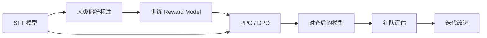
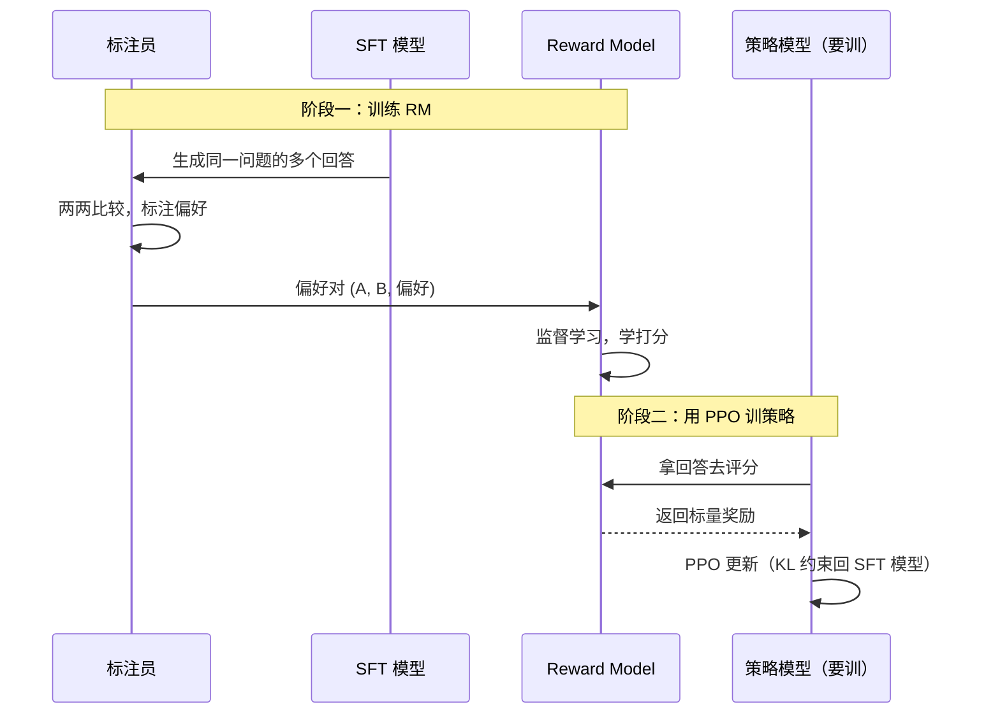
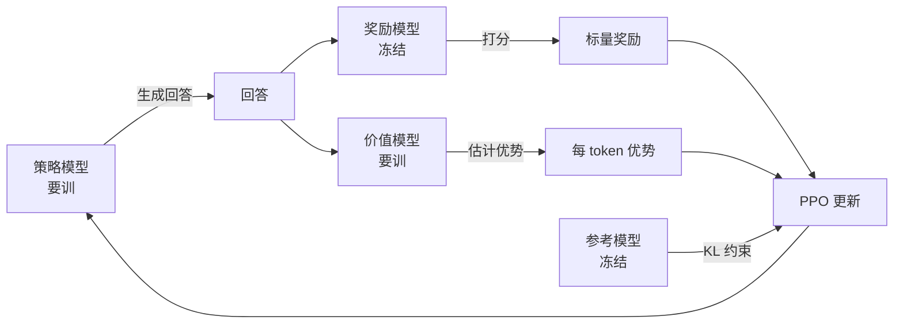
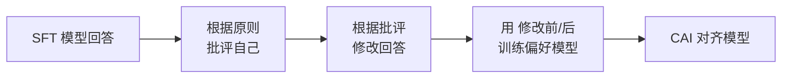
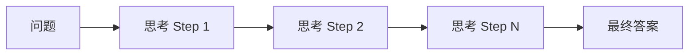
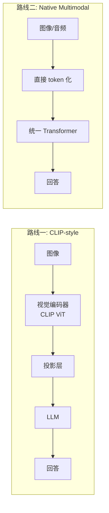

# Ch5 RLHF 与对齐

> 一句话简介：从"会续写"到"听得懂话、答得体面"，看 LLM 是怎么被"调教"成对话助手的。

## 本章目标

读完本章你应当能：
- 解释"对齐"为何必要（不是单纯提升能力）
- 口述 RLHF 三步曲（SFT → RM → PPO）
- 解释奖励模型（Reward Model）如何训练
- 说出 PPO 在 LLM 中的核心思想（策略 / 参考 / 价值 / 奖励 四模型）
- 描述 DPO 的核心思想（直接从偏好学习，无需奖励模型）
- 列出至少 2 种 RLHF 之外的对齐方法
- 解释红队是对齐一部分
- 描述推理模型（o1 / R1）与多模态 LLM 的基本思想

## 本章导览



这张图是全章的"地图"——左半边是训练（SFT → RM → PPO 或 DPO），右半边是部署后的循环（红队找漏洞，反哺训练数据）。下面 10 节会一步步展开。

## 5.1 为什么要对齐

经过 Ch4 的预训练和 SFT，模型已经"会接话"，也大致"听得懂指令"。但它还不是一个合格的助手——它会**答得出，但不一定答得对**：可能答非所问、说胡话、夹带偏见，甚至在诱导下输出有害内容。

这就是 **对齐（alignment）** 要解决的问题：**让模型的行为符合人类意图**。"意图"有三层：
- **有用性（helpful）**：能真正解决用户的问题；
- **诚实性（honest）**：知道自己不知道什么，不编造；
- **无害性（harmless）**：不输出危险、违法、歧视性的内容。

三层合起来常被缩写为 **HHH**——Anthropic 在 Constitutional AI 里最早提出。

**关键认识：能力 ≠ 对齐**。两件事必须分开看：

```text
            对齐高 ↑
                    │   ★ 理想助手（能力强 + 答得体面）
                    │
                    │              ★ "危险天才"
                    │                 （能力强 + 胡说 / 越狱）
   ─────────────────┼──────────────────→ 能力高
                    │   ★ 能力弱但无害（SFT 早期水平）
                    │
            对齐低 ↓
```

一个 SFT 后的模型在 MMLU 上可以打 80 分，但遇到"教我怎样制造炸弹"的诱导提问，照样可能"乐于助人"地给出步骤。**能力是"会不会"，对齐是"该不该"**。Ch4 把模型训练得"更聪明"，本章要把模型训练得"更靠谱"。

## 5.2 RLHF 三步

**RLHF（Reinforcement Learning from Human Feedback，人类反馈强化学习）** 是 2022 年 InstructGPT / ChatGPT 之后被广泛采纳的对齐范式。核心思想：**人很难写出完美的"奖励函数"，但能分清两个回答谁更好**。

**第一步：SFT（Supervised Fine-Tuning）**——用 `(指令, 回答)` 对继续训练 base 模型（Ch4 已讲）。

**第二步：奖励模型（RM）训练**——让标注员对同一问题的多个回答两两比较，用偏好对**打分器**进行监督训练。RM 输出标量分数。

**第三步：PPO 强化学习**——把 SFT 模型当作**策略（policy）**，用 RM 的分数当奖励信号，让模型通过试错学出"高分回答"。同时用 KL 惩罚把模型拉回 SFT 模型附近，避免它刷分而胡说八道。

### 教小孩的类比

SFT = 看教科书学基础；RM = 训练"考官"判断好坏；PPO = 让小孩在模拟环境里反复练习，按"考官"评分改进。

### 时序图



**RLHF 的精髓**：把"难以形式化的目标"（什么是好回答）转成"易于优化的标量"（RM 分数）。

## 5.3 奖励模型

奖励模型是 RLHF 的"灵魂"——它的好坏直接决定最终模型的好坏。RM 的架构通常**和 SFT 模型一致**，但**最后一层换成回归头**：把最后的隐藏状态过一个线性层，输出标量分数。

### 一个具体例子

```text
指令:  "巴黎是法国首都吗？"
回答 A: "是的。"
回答 B: "不是。巴黎是英国首都。"
偏好:   A 远好于 B  (A 正确，B 错误)
```

RM 看到这条数据后，应该学会给 A 打高分、B 打低分。它**不需要知道"为什么 A 好"，只需要把好回答打到比坏回答更高的分**——这就是"质性判断"转成"量化打分"的秘密。InstructGPT 用约 3.3 万条偏好对——这就是 RM 训练的全部数据。

### Bradley-Terry 公式

训练时把偏好对转成两两排序学习的目标。一个常用形式是 **Bradley-Terry 模型**——假设"A 比 B 好"的概率为：

$$P(A \succ B) = \sigma(r_\theta(A) - r_\theta(B))$$

其中 $r_\theta(\cdot)$ 是 RM 的打分，$\sigma$ 是 sigmoid 函数。训练目标就是**让好回答的分数减去坏回答的分数越大越好**。

### 工程上的两个常见坑

- **位置偏差**：标注员倾向选"出现在上面的"——收集数据时要随机化顺序；
- **长度偏差**：标注员倾向选"更长的"——RM 也会学到这个偏差。

## 5.4 PPO 在 LLM 中的应用

**PPO（Proximal Policy Optimization）** 是 2017 年 OpenAI 提出的强化学习算法，被 RLHF 借来更新 LLM。在 LLM 场景下，PPO 涉及四个模型协同工作。

### 学生考试的类比

- **策略模型（Policy）** = 正在考试的学生（要训练）
- **参考模型（Reference）** = 学生手里那本"标准答案"（冻结）
- **奖励模型（Reward）** = 阅卷老师（冻结）
- **价值模型（Value / Critic）** = 学生的"自我评估"（要训练）

### 四个模型怎么配合



### KL 惩罚

为什么需要参考模型？因为学生可能为了拿高分"完全偏离标准答案"——输出怪字符、复读机式回答骗过 RM。这种 **reward hacking** 是 RLHF 的头号敌人。**KL 散度惩罚**就是答案：策略跑得越远，惩罚越大。**参考模型是"安全绳"**。

### 现实痛点

PPO 是**显存怪兽**——四个模型同时在显存里，70B 训练要 80~160 张 H100。开源社区发展出"省显存变体"：LoRA-PPO、ReMax、GRPO（5.8 节会讲）。

## 5.5 DPO

**DPO（Direct Preference Optimization, Rafailov et al., 2023）** 是 2023 年提出的优雅替代：**完全跳过奖励模型**，直接从偏好对学习策略。

### 直觉：只做考卷对照，不请老师

传统 RLHF 要训 RM + 用 RM 当老师教 PPO——像学生做完题还要等老师批改。DPO 直接用"考卷"（偏好对）做训练：模型看完"好答案"和"坏答案"的对照，自己琢磨为什么好答案更好，然后调整参数。

### RLHF vs DPO 的工程对比

```text
   RLHF 流程                       DPO 流程
   ─────────                      ─────────
   SFT 模型 ──┐                   SFT 模型 ──┐
              │                              │
   偏好对 ──→ RM（训）                 偏好对 ─┴→ 直接训
              │                              │
              ↓                              ↓
   SFT 模型 ──→ PPO（用 RM 打分）     得到对齐模型
              │
              ↓
        得到对齐模型
```

**对比一目了然**：DPO 省掉 RM——少一个模型、少一段训练、少一堆显存。

### DPO 的核心观察

RLHF 的最优策略有一个闭式解——$\pi^*(y|x) \propto \pi_{\text{ref}}(y|x) \exp(r(x,y)/\beta)$。把它反过来：**不知道奖励，但知道最优策略的形状，就能从偏好对直接拟合**。

DPO 的损失（简化版）：

$$\mathcal{L}_{\text{DPO}} = -\log\sigma\!\left(\beta \log \frac{\pi_\theta(y_w)}{\pi_{\text{ref}}(y_w)} - \beta \log \frac{\pi_\theta(y_l)}{\pi_{\text{ref}}(y_l)}\right)$$

直觉：让"获胜回答相对参考模型的提升幅度"远大于"失败回答"。

**三个优点**：极简（两个模型 + 偏好对）；稳定（无 reward hacking）；好用（2024 年后大多数开源 LLM 首选）。**主要坑：** 对超参 $\beta$ 敏感；泛化到训练分布外时不稳定。**简单记法：** DPO = RLHF 的数学等价物，工程上更简单。

## 5.6 其他对齐方法

RLHF / DPO 不是唯一答案。下面**只深入讲一个**，其他六个给一句话定位。

### Constitutional AI：宪法法庭

**类比**：CAI 像"宪法法庭"。模型给官员一支"宪法小册子"（一组原则），让官员**自己评判自己的回答**是否符合宪法，根据评判修改。人类只负责写宪法，不负责具体评判。

**流程四步：**



**两个突出优点**：大大减少人类标注量；原则可解释、可审计。Anthropic 2026.01 重写的 Claude 宪法（84 页、约 2.3 万词）加入对 agent 场景的"可逆性、最小特权、审计轨迹"等新原则——CAI 正从"对话对齐"扩展到"行动对齐"。

### 其他六种

| 方法 | 一句话定位 | 代表 |
|---|---|---|
| **RLAIF** | 用 AI 反馈代替人类反馈训 RM | Google |
| **Self-Rewarding** | 模型给自己打分继续训 DPO | Meta |
| **PRM** | 给推理的每一步打分 | OpenAI |
| **ORPO** | DPO 变体，结合 SFT，省掉参考模型 | 学术界 |
| **SimPO** | DPO 简化版，对长样本无偏好 | 学术界 |
| **KTO** | 不需要成对偏好，单条好坏即可 | 学术界 |

**简单记法：** **RLHF/DPO 基础款**，CAI / RLAIF **规模化方案**，PRM **过程监督**（5.8 节会再讲），ORPO / SimPO / KTO **工程改进**。

## 5.7 安全与红队

对齐的另一面是**安全**——不仅要让模型"答得好"，还要让它"不答坏"。这部分工作主要由**红队（red teaming）**承担。

**类比**：红队像"安全测试工程师"——专门找漏洞的"白帽黑客"。

**常见攻击类别**（五类）：**越狱**、**提示注入**、**隐私提取**、**偏见触发**、**幻觉诱导**。

**工作流程**：构造攻击 prompt 库 → 扫模型 → 分析失败 → 补强 → 迭代。**自动化红队**用"攻击者 LLM"自动生成对抗 prompt，比纯人工效率高几个数量级。

为什么红队是对齐的一部分？因为**红队找到的失败案例会被反哺回训练数据**——这是**对齐数据飞轮**的关键一环。

最后，**过度对齐会损害有用性**（safety-helpfulness tradeoff），只能按部署场景调节。

## 5.8 推理模型与思维链

2024 年下半年开始，LLM 出现了"**推理模型**"这条新赛道——OpenAI o1（2024.09）、DeepSeek-R1（2025.01）、Claude 3.7 Sonnet Extended Thinking 等。核心思想：

> **"思考更久，答得更好"** ——用更多推理时算力，换取更高回答质量。

**直觉**：传统 LLM 像**抢答选手**——立刻回答；推理模型像**草稿选手**——先"长考"再给答案。

**思维链（CoT）** 是基础：prompt 里给几个"思考过程 → 答案"的例子，模型就能生成中间推理步骤。推理模型把 CoT 从"prompt 技巧"升级成"训练范式"——**让模型在训练时就学会"先想后答"**：



### GRPO：PPO 的简化版

**DeepSeek-R1** 的核心算法叫 **GRPO**——PPO 的"简化版"：不训价值模型；对同一 prompt 采样一组回答；用组内**相对分数**作优势估计。"四个模型"砍到"两个"——显存减半。

### PRM：给每步打分

**Process Reward Model（PRM）**——传统 RM 只给"最终答案"打分，PRM 给"每一步推理"打分。

### 推理时计算 vs 训练时计算

| 维度 | 传统 LLM | 推理模型 |
|---|---|---|
| 推理 token 数 | 几十~几百 | 几千~几万 |
| 回答耗时 | 1~3 秒 | 10~60 秒 |
| 适用场景 | 闲聊、简单问答 | 数学、代码、复杂规划 |
| 训练范式 | SFT + RLHF/DPO | SFT + GRPO + PRM |

OpenAI o1 在 AIME 数学、奥赛级代码题上比 GPT-4o 高 30-50 个百分点——但**单次回答贵 10 倍**。**LLM 范式转折**：从"堆训练算力"到"堆推理算力"。

**简单记法：** CoT 让模型"先想后答"，GRPO 让它可训练，PRM 让它更精准。

### 三种主流 RL 算法对比

| 算法 | RM | 价值模型 | 显存（相对） | 适用 |
|---|---|---|---|---|
| **PPO** | 需要 | 需要 | 1.0× | 通用对齐 |
| **DPO** | 不要 | 不要 | 0.5× | 通用对齐（偏好对） |
| **GRPO** | 不要 | 不要 | 0.5× | 推理（数学 / 代码） |

## 5.9 多模态与延伸

前四章讲的都是文本 LLM。但现实世界的信息远不止文字：图、视频、表格、音频……**多模态 LLM（Multimodal LLM, MLLM）** 就是要把这些模态统一处理。

**类比**：多模态像"翻译不同语言"——文本是普通话，图像是粤语，音频是英语。Transformer 像"超级翻译官"，把各语言翻译成"通用语"（token）再统一处理。

核心思想：**把图像 / 音频 / 视频都变成"token"**。文本是离散 token；图像可以是 patch token（ViT 切出的 14×14 patch 各压成一个向量）、音频是帧 token、视频是时空 patch token。

### 两条主流技术路线



**路线一：CLIP-style（LLaVA 路线）**——单独训视觉编码器 + 语言模型，用投影层把视觉特征映射到 LLM。优点：模块化、训练便宜。代表：LLaVA、Qwen-VL、InternVL。

**路线二：Native Multimodal（GPT-4V / Gemini 路线）**——从一开始就混训多模态 token。优点：端到端；缺点：训练贵。代表：GPT-4V、Gemini、Claude。

**特殊挑战**：跨模态语义对齐、细粒度理解、长视频、多模态幻觉。**简单记法：** 多模态 = 把所有模态变 token；CLIP-style 模块化拼接，Native 端到端融合。

## 5.10 Part 1 小结与 Part 2 衔接

到这里，Part 1 的旅程告一段落。回顾一下你走过的路：

- **Ch1**：AI / ML / DL 概览；
- **Ch2**：神经网络基础——MLP、反向传播、激活函数；
- **Ch3**：Transformer 与注意力——self-attention、因果 mask、位置编码；
- **Ch4**：预训练与微调——数据流水线、Tokenizer、Scaling Law、SFT、LoRA；
- **Ch5**：对齐——RLHF、RM、PPO、DPO、其他方法、红队、推理模型、多模态。

**一句话总结 Part 1**：**LLM 是 next-token prediction 的规模化产物——"有用"靠预训练 + SFT；"靠谱"靠 RLHF/DPO；"安全"靠红队；"更强"靠推理时计算和更多模态**

**衔接 Part 2**：Part 1 讲"**原理**"，Part 2 讲"**家族演进**"——过去 7 年里主流 LLM 各自走了什么变体、有什么设计选择。Part 2 会带你走 GPT / LLaMA / DeepSeek / Qwen / Claude / Gemini 等系列，展开 Ch3.10 提到的 MoE / RMSNorm / SwiGLU / GQA 等现代组件，以及 Ch5.6 提到的各种对齐方法的具体演进。准备好了吗？我们出发。

## 本章参考

### 必读论文

- [InstructGPT: Training Language Models to Follow Instructions with Human Feedback (Ouyang et al., 2022)](https://arxiv.org/abs/2203.02155) — RLHF 三步曲的开山之作，奠定 ChatGPT 时代的对齐范式。
- [Direct Preference Optimization: Your Language Model is Secretly a Reward Model (Rafailov et al., 2023)](https://arxiv.org/abs/2305.18290) — DPO，用一个优雅的闭式解绕过奖励模型，工程上比 PPO 简单一个数量级。
- [DeepSeek-R1: Incentivizing Reasoning Capability in LLMs via Reinforcement Learning (Guo et al., 2025)](https://arxiv.org/abs/2501.12948) — 推理模型路线的代表作，详细讲 GRPO + RL 训练推理能力的全过程。

### 推荐博客 / 教程

- [Hugging Face TRL 库文档](https://huggingface.co/docs/trl) — 工业级 RLHF/DPO/GRPO 训练工具，覆盖 SFT、RM、PPO、DPO 全流程，含可运行代码。
- [Anthropic Constitutional AI 介绍](https://www.anthropic.com/news/claudes-constitution) — 用"宪法原则"代替人类标注，让 AI 评价 AI，是大规模对齐的代表性方案。

### 视频 / 课程

- [Andrej Karpathy "Let's reproduce GPT-2"](https://www.youtube.com/watch?v=lnA9DMSEyqs) — 从零复现 GPT-2 的 4 小时长视频，覆盖预训练 + instruction tuning 的端到端流程，看完会对"训练一个 LLM"有第一性认识。
