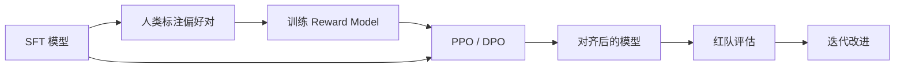

# Ch5 RLHF 与对齐

> 一句话简介：从"会续写"到"听得懂话、答得体面"，看 LLM 是怎么被"调教"成对话助手的。

## 本章目标

读完本章你应当能：
- 解释"对齐"为何必要（不是单纯提升能力）
- 口述 RLHF 三步曲（SFT → RM → PPO）
- 解释奖励模型（Reward Model）如何训练
- 说出 PPO 在 LLM 中的核心思想（策略 / 参考 / 价值 / 奖励 四模型）
- 描述 DPO 的核心思想（直接从偏好学习，无需奖励模型）
- 列出至少 2 种 RLHF 之外的对齐方法
- 解释安全与红队为何是对齐的一部分
- 描述推理模型（o1 / R1）与多模态 LLM 的基本思想

## 本章导览

## 5.1 为什么要对齐

经过 Ch4 的预训练和 SFT，模型已经"会接话"，也大致"听得懂指令"。但它还不是一个合格的助手——它会**答得出，但不一定答得对**：可能答非所问、说胡话、夹带偏见、甚至在诱导下输出有害内容。

这就是 **对齐（alignment）** 要解决的问题：**让模型的行为符合人类意图**。"意图"包括三层：
- **有用性（helpful）**：能真正解决用户的问题；
- **诚实性（honest）**：知道自己不知道什么，不编造；
- **无害性（harmless）**：不输出危险、违法、歧视性的内容。

这三层合在一起，常被缩写为 **"HHH"**——Anthropic 在 Constitutional AI 里最早系统化提出。

**关键认识：能力 ≠ 对齐**。一个 SFT 后的模型在 MMLU 上可以打 80 分，但遇到"教我怎样制造炸弹"的诱导提问，照样可能"乐于助人"地给出步骤。能力是"会不会"，对齐是"该不该"。两者必须分开训练、分开评估。Ch4 把模型训练得"更聪明"，本章要把模型训练得"更靠谱"。

因为 LLM 不再是实验室玩具——它被嵌入客服、医疗、编程、教育的真实工作流，对齐失误的代价是真实存在的。一句错话、一个错误指令，在自动驾驶、医疗建议、代码生成场景下都可能造成实际伤害。**对齐是 LLM 部署前必经的一道工序，不是可选项**。

## 5.2 RLHF 三步

**RLHF（Reinforcement Learning from Human Feedback，人类反馈强化学习）** 是 2022 年 InstructGPT / ChatGPT 之后被广泛采纳的对齐范式。它的核心思想很朴素：**人不能写出完美的"奖励函数"，但能分清两个回答谁更好**。

整套流程分三步：

**第一步：SFT（Supervised Fine-Tuning）。** Ch4 已经讲过：用 `(指令, 回答)` 对继续训练 base 模型，让它具备基本的指令跟随能力。SFT 模型是 RLHF 的起点。

**第二步：奖励模型（Reward Model, RM）训练。** 让标注员对同一个问题的多个回答两两比较（"A 比 B 好"），用这些偏好对一个**打分器**进行监督训练。RM 输出标量分数——给定 `(指令, 回答)`，输出"这个回答有多好"。

**第三步：PPO（Proximal Policy Optimization）强化学习。** 把 SFT 模型当作**策略（policy）**，用 RM 的分数当奖励信号，让模型通过试错学出"高分回答"。同时用一个 KL 惩罚把模型拉回 SFT 模型附近，避免它为了刷分而胡说八道——这个细节很重要。

直觉上，这三步就像训练一个新员工：
1. **SFT** = 看教科书学基础（"标准答案是什么"）；
2. **RM** = 训练一个"考官"，能判断回答好坏（"什么是好答案"）；
3. **PPO** = 让员工在模拟环境里反复练习，按"考官"评分不断改进（"在实践中拿高分"）。

这是 RLHF 整套范式的精髓：**把"难以形式化的目标"（什么是好回答）转成"易于优化的标量"（RM 分数）**。

## 5.3 奖励模型

奖励模型是 RLHF 的"灵魂"——它的好坏直接决定最终模型的好坏。RM 的架构通常**和 SFT 模型一致**（比如都是同一个 LLM 架构），但**最后一层换成回归头**：把最后的隐藏状态过一个线性层，输出一个标量分数。

训练数据是**偏好对**：每条样本是 `(指令, 回答A, 回答B, 偏好)`——标注员表示"在这个问题下，A 比 B 好"。业界通常用 4-7 档（明显比 A 好、B 比 A 好很多、A 略好、B 略好……）来表达偏好的强弱。

训练时把偏好对转成两两排序学习的目标。一个常用形式是 **Bradley-Terry 模型**——假设"A 比 B 好"的概率为：

$$P(A \succ B) = \frac{\exp(r_\theta(A))}{\exp(r_\theta(A)) + \exp(r_\theta(B))} = \sigma(r_\theta(A) - r_\theta(B))$$

其中 $r_\theta(\cdot)$ 是 RM 的打分。训练目标就是最大化 $\log P(A \succ B)$——**让 RM 给好回答高分、坏回答低分，分差越大越好**。

直觉解释：**RM 不需要知道"为什么 A 好"，只需要把好回答打到比坏回答更高的分**——这就是把"质性判断"转成"量化打分"的全部秘密。

几个工程细节：
- **RM 大小**：通常和 SFT 模型同规模或略小（6B/13B RM 比 70B RM 更常见）；
- **数据规模**：几万到几十万条偏好对就足以训出一个像样的 RM；InstructGPT 用了 ~33k 条；
- **位置偏差**：标注员倾向选"出现在上面的"回答——需要在数据收集时随机化顺序；
- **长度偏差**：标注员倾向选"更长的"回答——RM 也会学到这个偏差。

RM 训好之后就是"冻结打分器"，下一步 PPO 用它的分数作为奖励信号。

## 5.4 PPO 在 LLM 中的应用

**PPO（Proximal Policy Optimization）** 是 2017 年 OpenAI 提出的强化学习算法，被 RLHF 借用来更新 LLM。在 LLM 场景下，PPO 涉及四个模型协同工作：

| 模型 | 角色 | 是否训练 |
|---|---|---|
| **策略模型（Policy）** | 当前要被优化的 LLM | 训练 |
| **参考模型（Reference）** | SFT 模型的冻结副本 | 不训练 |
| **价值模型（Value / Critic）** | 估计每个 token 的"未来奖励总和" | 训练 |
| **奖励模型（Reward）** | 给完整回答打分的标量函数 | 不训练 |

一句话概括：**策略模型负责"答题"，参考模型负责"不跑偏"，价值模型负责"评估中间状态"，奖励模型负责"打分"**。

PPO 训练循环：
1. **采样**：用策略模型对一批 prompt 生成回答；
2. **打分**：用 RM 给每个回答一个标量奖励；
3. **估计优势**：用价值模型估计每个 token 的优势；
4. **更新策略**：用 PPO 的 clipped surrogate 目标更新策略，同时加 **KL 散度惩罚** $-\beta \cdot \mathrm{KL}(\pi_\theta \| \pi_{\text{ref}})$；
5. **更新价值**：用 MSE 损失让价值模型预测逼近实际回报。

直觉：**策略模型像正在考试的学生，价值模型是它的"自我评估"；RM 是"老师评分"；参考模型是"参考答案"**。KL 惩罚保证学生不会为了拿高分而完全偏离"参考答案"，避免**reward hacking**。

工程上的痛点：PPO 是**显存怪兽**——四个模型同时在显存里，一个 70B 级别的 RLHF 训练常常要 80~160 张 H100。开源社区因此发展出"省显存变体"：LoRA-PPO、ReMax、GRPO（5.8 节会讲）等。

## 5.5 DPO

**DPO（Direct Preference Optimization, Rafailov et al., 2023）** 是 2023 年提出的一个优雅替代：它**完全跳过奖励模型这一步**，直接从偏好对学习策略。

核心观察很深刻：**RLHF 的最优策略有一个闭式解**——给定奖励 $r(x, y)$，最优策略可以写成 $\pi^*(y|x) \propto \pi_{\text{ref}}(y|x) \exp(r(x,y)/\beta)$。把这个关系反过来：**如果我们不知道奖励，但知道最优策略的形状，就能从偏好对直接拟合"什么样的策略能产生这种偏好"**。

DPO 的训练损失简洁到令人发指——给定偏好对 $(y_w, y_l)$（winning vs losing）：

$$\mathcal{L}_{\text{DPO}} = -\log \sigma\left(\beta \log \frac{\pi_\theta(y_w|x)}{\pi_{\text{ref}}(y_w|x)} - \beta \log \frac{\pi_\theta(y_l|x)}{\pi_{\text{ref}}(y_l|x)}\right)$$

直觉解释：**让"获胜回答相对参考模型的提升幅度"远大于"失败回答相对参考模型的提升幅度"**——本质上还是排序学习，但不再经过 RM 这一中介。

DPO 的优点非常突出：
- **极简**：不需要 RM、不需要价值模型、不需要 PPO；只需要两个模型（策略 + 参考）+ 偏好对——显存砍一半；
- **稳定**：没有 reward hacking 的风险，因为奖励是被隐式定义的；
- **等价**：数学上和 RLHF 的最优策略等价（在 Bradley-Terry 假设下）；
- **好用**：实践经验上效果与 RLHF 相当或更好，是 2024 年后大多数开源 LLM（Mistral、Qwen、Zephyr、Tulu）的首选对齐方法。

也有一些已知坑：**DPO 对超参数 $\beta$ 敏感**；**泛化到训练分布外的偏好时表现不稳定**；对**多目标对齐**（既要 helpful 又要 harmless）效果不如 RLHF 灵活。所以业界目前是"DPO 为主、RLHF 为辅"——DPO 处理 80% 场景，PPO 处理复杂多目标场景。

简单记法：**DPO = RLHF 的数学等价物，但工程上更简单**。

## 5.6 其他对齐方法

RLHF / DPO 不是对齐的唯一答案。2023-2025 年业界探索了大量替代或补充方案：

**Constitutional AI（Anthropic, 2022）**——用 AI 评价 AI。流程是：(1) 用 SFT 模型回答问题；(2) 让模型**根据一组"宪法原则"**对自己的回答做批评；(3) 根据批评修改回答；(4) 用修改前/后的回答训练偏好模型。好处：**大大减少人类标注量**；原则可解释、可审计。

**RLAIF（RL from AI Feedback）**——把 RLHF 中的人类偏好标注换成 **AI 的偏好标注**。让一个强 LLM（Claude 或 GPT-4）对两个回答做比较，输出"A 比 B 好"，再用这些 AI 偏好训练 RM。

**Self-Rewarding / Iterative DPO**——让模型**自己给自己打分**，用这些自打分继续训练 DPO。但**奖励模型的偏差在迭代中会被放大**，有"自我确认偏差"的风险。

**Process Reward Models（PRMs）**——传统 RM 只给最终回答打分，PRM **给每一步推理打分**。对数学、代码等需要多步推理的任务特别有用——5.8 节会展开。

**ORPO / SimPO / KTO**——DPO 的几个变体，针对 DPO 的超参数敏感、长度偏差等问题做改进。

简单记法：**RLHF/DPO 是基础款，Constitutional AI / RLAIF 是规模化方案，PRM 是过程监督方案，ORPO 类是工程改进方案**。

## 5.7 安全与红队

对齐的另一面是**安全**——不仅要让模型"答得好"，还要让它"不答坏"。这部分工作主要由**红队（red teaming）**承担。

**红队的定义**：组织一批"专业攻击者"（人类或 AI），用对抗性的输入去测试模型的安全边界，看能不能诱导出有害输出。常见攻击类别：
- **越狱（jailbreak）**：用角色扮演、隐喻、多语言混淆等方式绕开安全护栏；
- **提示注入（prompt injection）**：在用户输入里塞指令，劫持系统提示；
- **隐私提取**：诱导模型泄露训练数据里的个人信息；
- **偏见触发**：诱导模型对特定群体产生歧视性输出；
- **幻觉诱导**：在医学、法律等高风险领域诱导模型"自信地说错话"。

红队的工作流程：(1) 构造攻击 prompt 库；(2) 用 prompt 库扫模型；(3) 分析失败模式；(4) 针对性补强；(5) 迭代循环。

**自动化红队**是 2024 年后的重要方向——用一个"攻击者 LLM"自动生成对抗 prompt。

为什么红队是对齐的一部分？因为**安全测试发现的问题，会反哺训练数据**——红队找到的失败案例，会被转化成 SFT/RP（负样本）喂回模型。这是**对齐数据飞轮**的关键一环。

最后，安全也不是越多越好——**过度对齐会损害有用性**。这个权衡叫 **safety-helpfulness tradeoff**，只能根据部署场景调节。

## 5.8 推理模型与思维链

2024 年下半年开始，LLM 出现了"**推理模型**"这条新赛道——OpenAI o1（2024.09）、DeepSeek-R1（2025.01）、Claude 3.7 Sonnet Extended Thinking 等都属此类。它们的核心思想可以概括为一句话：

> **"思考更久，答得更好"** ——用更多的推理时算力，换取更高的回答质量。

直觉上，传统 LLM 像一个**抢答选手**——看到问题立刻给回答；推理模型像一个**草稿选手**——先在内部"长考"一番（生成大量思考 token），再给出最终答案。

**思维链（Chain-of-Thought, CoT）** 是这一切的基础。2022 年 Wei 等人发现：只要在 prompt 里给几个"思考过程 → 答案"的例子，模型就能在回答时自动生成中间推理步骤，质量明显提升。

推理模型把 CoT 从"prompt 技巧"升级成了"训练范式"——**让模型在训练时就学会"先想后答"**，并在推理时强制生成大量 CoT token。

**DeepSeek-R1** 是这条路径的代表作。它使用的核心 RL 算法叫 **GRPO（Group Relative Policy Optimization）**——可以理解为 PPO 的"简化版"：不用单独训练价值模型；对同一个 prompt 采样一组回答；用组内回答的**相对分数**作为优势估计；直接用这个相对优势做策略梯度更新。GRPO 把 PPO 的"四个模型"砍到"两个模型"——显存减半，训练稳定。

另一个关键技术是 **Process Reward Model（PRM）**——传统 RM 只给"最终答案"打分，PRM 给"每一步推理"打分。

推理模型的核心权衡是**推理时计算 vs 训练时计算**：

| 维度 | 传统 LLM | 推理模型 |
|---|---|---|
| 推理时 token 数 | 几十 ~ 几百 | 几千 ~ 几万 |
| 单次回答耗时 | 1~3 秒 | 10~60 秒 |
| 适用场景 | 闲聊、简单问答 | 数学、代码、复杂规划 |
| 训练范式 | SFT + RLHF | SFT + GRPO + PRM |

OpenAI o1 在 AIME 数学竞赛、奥赛级代码题上比 GPT-4o 高出 30-50 个百分点——但代价是**单次回答贵 10 倍**。这是 LLM 范式的一次重要转折：**从"堆训练算力"到"堆推理算力"**。

简单记法：**CoT 让模型"先想后答"，GRPO 让"先想后答"可训练，PRM 让"先想后答"更精准**。

## 5.9 多模态与延伸

前面四章讲的都是文本 LLM。但现实世界的信息远不止文字：图、视频、表格、音频……**多模态 LLM（Multimodal LLM, MLLM）** 就是要把这些模态统一处理。

核心思想极其朴素：**把图像 / 音频 / 视频都变成"token"，让 Transformer 统一处理**。文本是离散 token（词 id），图像可以是 patch token（ViT 切出的 14×14 patch 各压成一个向量）、音频是帧 token、视频是时空 patch token。

**两条主流技术路线**：

**路线一：CLIP-style 对齐（LLaVA 路线）**：单独训练视觉编码器（CLIP ViT）+ 语言模型，用一个投影层把视觉特征映射到语言模型的 embedding 空间，然后在图文对上 SFT。优点：模块化、训练便宜、可扩展。代表：LLaVA、MiniGPT-4、Qwen-VL、InternVL。

**路线二：Native Multimodal（GPT-4V / Gemini 路线）**：从一开始就把多模态 token 混在一起训练，模态融合由 transformer 隐式完成。优点：端到端、模态间推理更自然；缺点：训练贵、数据要求高。代表：GPT-4V、Gemini、Claude 3.5 Sonnet（部分能力）。

多模态对齐面临的独特挑战：跨模态语义对齐（CLIP 时代的核心问题）、细粒度理解（counting / grounding）、长视频上下文（小时级视频远超普通 LLM 窗口）、模态间推理一致性、多模态幻觉。

简单记法：**多模态 = 把所有模态变 token；CLIP-style 是模块化拼接，Native 是端到端融合**。

## 5.10 Part 1 小结与 Part 2 衔接

到这里，Part 1 的旅程告一段落。回顾一下你走过的路：

- **Ch1**：从 AI / ML / DL 出发，理解 LLM 在整个 AI 学科里的位置；
- **Ch2**：从神经网络基础出发，理解 MLP、反向传播、激活函数——这些是 Transformer 的基石；
- **Ch3**：进入 Transformer 和注意力机制——理解 self-attention、因果 mask、位置编码这些 LLM 的核心构件；
- **Ch4**：从架构走到训练——预训练数据流水线、Tokenizer、分布式训练、Scaling Law、SFT、LoRA、灾难性遗忘；
- **Ch5**：从训练走到对齐——RLHF 三步、RM、PPO、DPO、其他对齐方法、安全红队、推理模型、多模态。

**一句话总结 Part 1**：**LLM 是 next-token prediction 的规模化产物，要让它"有用"，需要预训练 + SFT；要让它"靠谱"，需要 RLHF/DPO；要让它"安全"，需要红队；要让它"更强"，需要推理时计算和更多模态**。

**衔接 Part 2**：Part 1 讲的是"**原理**"——LLM 是什么、为什么能 work、怎么训出来。但 LLM 领域另一条同等重要的线是"**家族演进**"——过去 7 年里主流 TRL 模型各自走了什么变体、有什么设计选择、相互之间是什么关系。Part 2 会带你走一遍这条线：GPT 系列（OpenAI 的"封闭 + 规模化"）、LLaMA 系列（Meta 的"开源 + 工程优化"）、DeepSeek 系列（中国社区的"开源 + 极致效率"）、Qwen / GLM / Baichuan 系列（国产开源代表）、Claude / Gemini（"RLHF-first"和"原生多模态"路线）。

每条线都有自己的设计哲学——有的靠堆参数，有的靠堆数据，有的靠堆工程，有的靠堆对齐。**理解了 Part 1 的原理，再看 Part 2 的家族演进，你就真正能把"理论"和"产业"对上号了**。准备好了吗？我们出发。

## 本章参考

### 必读论文

- [InstructGPT: Training Language Models to Follow Instructions with Human Feedback (Ouyang et al., 2022)](https://arxiv.org/abs/2203.02155) — RLHF 三步曲的开山之作，奠定 ChatGPT 时代的对齐范式。
- [Direct Preference Optimization: Your Language Model is Secretly a Reward Model (Rafailov et al., 2023)](https://arxiv.org/abs/2305.18290) — DPO，用一个优雅的闭式解绕过奖励模型，工程上比 PPO 简单一个数量级。
- [DeepSeek-R1: Incentivizing Reasoning Capability in LLMs via Reinforcement Learning (Guo et al., 2025)](https://arxiv.org/abs/2501.12948) — 推理模型路线的代表作，详细讲 GRPO + RL 训练推理能力的全过程。

### 推荐博客 / 教程

- [Hugging Face TRL 库文档](https://huggingface.co/docs/trl) — 工业级 RLHF/DPO/GRPO 训练工具，覆盖 SFT、RM、PPO、DPO 全流程，含可运行代码。
- [Anthropic Constitutional AI 介绍](https://www.anthropic.com/news/claudes-constitution) — 用"宪法原则"代替人类标注，让 AI 评价 AI，是大规模对齐的代表性方案。

### 视频 / 课程

- [Andrej Karpathy "Let's reproduce GPT-2"](https://www.youtube.com/watch?v=lnA9DMSEyqs) — 从零复现 GPT-2 的 4 小时长视频，覆盖预训练 + instruction tuning 的端到端流程，看完会对"训练一个 LLM"有第一性认识。