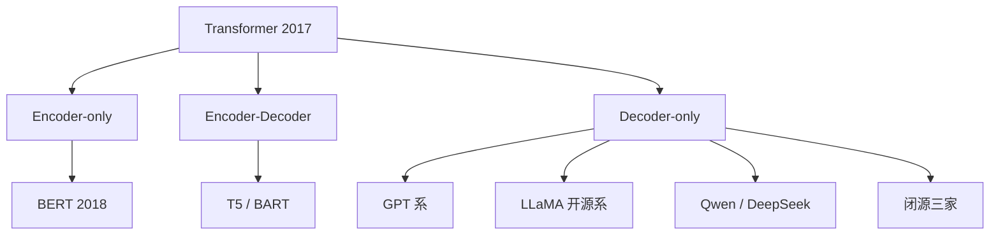
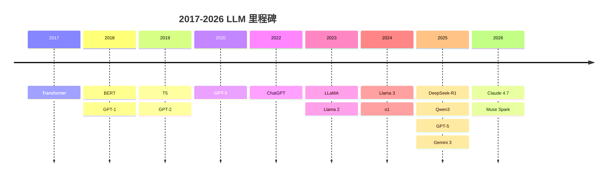

# Ch6 LLM 家族编年史

> 一句话简介：十年 100+ 个模型，其实只有三条架构路线。

## 本章目标

读完本章你应当能：
- 画出 2017-2026 年 LLM 发展的时间线，标出三个分水岭年
- 区分 Encoder-only / Decoder-only / Encoder-Decoder 三种架构路线，并说出为什么 Decoder-only 赢了
- 说出 GPT、BERT、T5、LLaMA、Qwen、DeepSeek 各自的开创性贡献（每条一句话）
- 解释"开源浪潮"如何改变了 LLM 的竞争格局
- 用一句话回答"为什么 2020 年后几乎所有 LLM 都是 Decoder-only"

## 本章导览



全图只讲一件事：一个起点（Transformer），三条分岔（三种架构路线），四个去向（各路线的代表模型与阵营）。读完本章，你应该能自己在图上标出每个方块对应的年份、代表模型和它的一句话贡献。

## 6.1 引子：三个分水岭年

十年间公开的大语言模型少说上百个，名字每年都换一茬。但如果我们只挑三个年份，就能把整段历史串起来：**2017、2020、2023**。

- **2017**：Transformer 架构诞生，此后所有 LLM 都是它的后代——它的原理 Part 1 已经讲透（见 Part 1 Ch3），本章只把它当起点。
- **2020**：GPT-3 证明"把规模做大"本身就会涌现出新能力（参见 6.4）。
- **2023**：ChatGPT 于 2022 年 11 月底上线，到 2023 年初成了亿级用户的现象级产品；同一年 LLaMA 权重泄漏、Llama 2 发布，开源与闭源正式分道扬镳。

这很像汽车史上的三个瞬间。1886 年奔驰一号证明"装了发动机的车能跑"（2017，原理可行）；1908 年福特 T 型车把车做成普通家庭买得起的日用品（2020，规模带来新能力）；1970 年代石油危机催生了省油的小型车，市场从此分成省油派与豪华派两条路（2023，产品化与开闭源分野）。汽车的形态后来千变万化，但"能跑、买得起、分阵营"这三件事，分别在那三个年代定型。

| 年份 | 事件 | 为什么是分水岭 |
|---|---|---|
| 2017 | Transformer 论文发表 | 一切起点，奠定了此后所有模型的骨架 |
| 2020 | GPT-3 发布 | 证明"规模"本身是一种能力涌现：不做微调也能现场学会新任务 |
| 2023 | ChatGPT 爆红 + LLaMA 开源生态起飞 | LLM 变成大众产品；开源与闭源从此走两条路 |

记住这三个年份，后面所有模型都能挂到这条钩子上。本章接下来的路线是：先用 6.2 把上百个模型收拢成三条架构路线，再各用一节讲每条路线的代表模型（6.3-6.5），然后补上开源与闭源两条阵营线（6.6-6.8），最后在 6.9 收成一张总表。带着三个年份往下读，再乱的名字也有地方挂。

## 6.2 三大架构路线

上一节是时间线，这一节换一个切法：不按年份，按**架构路线**。十年上百个模型，底层其实只有三种骨架，区别在一个问题——**每个词写出来的时候，允许看到多少原文**。

先用三个类比建立直觉，再看术语——如果你只记住本节一句话，记住那张对比表就够了。

- **只编码（Encoder-only）**像一个只做阅读理解的读者：读整句话时，每个词都能看到左右邻居，理解得透彻，但你问他"写一句新的话"，他不会——他从来没学过写。
- **只解码（Decoder-only）**像一个作家：一个字一个字往下写，写每个字时只看已经写出来的前文。天生就会生成，而且"接着往下写"这一件事可以用在对话、翻译、写代码等几乎所有任务上。
- **先编码再解码（Encoder-Decoder）**像一位先通读全文再写摘要的译者：编码器先通读输入，解码器再逐步写出结果。

这三条路线都源自同一篇 Transformer 论文——原论文两半都有，后来的模型各自砍掉了其中一半：

| 路线 | 输入可见性 | 典型任务 | 代表模型 |
|---|---|---|---|
| Encoder-only（只编码） | 每个词都能看到整句话 | 分类、信息抽取等"理解"任务 | BERT、RoBERTa |
| Encoder-Decoder | 编码器通读全文，解码器写时看前文 | 翻译、摘要等"输入一段、输出一段" | T5、BART |
| Decoder-only（只解码） | 只能看到自己已写出的前文 | 续写、对话，以及几乎一切生成任务 | GPT 系、LLaMA、Qwen、DeepSeek |

需要说明的是，三种路线用的零件完全相同——都是 Part 1 讲过的自注意力与前馈网络（见 Part 1 Ch3），不同的只是**训练目标**和**允许看到的原文范围**。就像同一套发动机，装成只读不写的阅读机、一个字一个字写的打字机，或者先读后写的速记仪。

一句话记住胜负手：**现实世界里"往下写"是最高频的需求，所以 Decoder-only 赢了**。接下来三节（6.3 / 6.4 / 6.5）各讲一条路线的代表模型，看这个判断是怎么在十年里被验证的。

## 6.3 Encoder-only 时代：BERT 与它的继承者

先回头看"读者"路线，因为它是 2018-2020 年的绝对主角。

2018 年，Devlin 等人发表 [BERT](https://arxiv.org/abs/1810.04805)（Bidirectional Encoder Representations from Transformers）。它的预训练方式是一个巧妙的填空游戏：把句子遮住 15% 的词做遮盖式语言建模（Masked LM），让模型猜被遮住的词。比如"法国的首都是 [MASK]"，模型要在数万亿词的练习里反复做这类题。为了猜对，模型被迫同时利用左边和右边的上下文——这比当时"只能从左往右读"的模型理解得更透。可以把它想成阅读理解训练：不是抄写原文，而是反复做完形填空。

这一招在当年立竿见影。2018-2020 年，几乎所有"理解类"评测榜的榜首都被 BERT 及其后代占据，分类、问答、信息抽取这些任务上，各家公司纷纷把 BERT 当作标配底座。它之后还出了几位各有所长的继承者：

| 模型 | 年份 | 一句话贡献 |
|---|---|---|
| [RoBERTa](https://arxiv.org/abs/1907.11692) | 2019 | 把 BERT 的训练配方调到极致：训练更久、去掉多余的训练目标 |
| [ALBERT](https://arxiv.org/abs/1909.11942) | 2019 | 做减法：用更少的参数达到接近的效果，让模型更轻 |
| [DeBERTa](https://arxiv.org/abs/2006.03654) | 2020 | 改进注意力的算法设计，是这条路线的集大成者 |

那为什么后来掉队了？原因很简单：**它不会顺畅地生成文本**。完形填空一次只填一个被遮的词，和"从零写出一篇连贯的文章"是两回事；前者学的是"对一句话的理解"，后者学的是"把想法变成文字"。当 2020 年之后大家要的是对话、写作、写代码时，Encoder-only 的天花板就露出来了。它没有消失——今天做文本分类、意图识别这类"只判断不生成"的任务，轻量的 BERT 系模型依然是性价比之选——但它不再是舞台中心。舞台中心让给了"作家"路线，这就是下一节的主角。

## 6.4 Decoder-only 统一：GPT 系

上一节说 Encoder-only 天花板露了出来，接棒的是 OpenAI 的 GPT 系——一条从 2018 年一路走到 2025 年的"阶梯"，每一代只做一件事，但一件比一件大：

```
GPT-1  (2018)     预训练 + 微调：先读海量书，再针对具体任务练手
    ↓
GPT-2  (2019)     规模变大：模型开始"举一反三"，换任务不用重练
    ↓
GPT-3  (2020)     继续变大：few-shot 涌现——几个示例就能现场学会新任务
    ↓
ChatGPT(2022.11)  加上对齐训练（RLHF）：会对话、听话的产品诞生
    ↓
GPT-4  (2023.03)  通用能力大跨步，长文本与多模态输入
    ↓
GPT-4o (2024.05)  多模态：文本、图像、音频共用一个模型
    ↓
o1     (2024.09)  推理模型：先"打草稿"思考，再给出答案
    ↓
GPT-5  (2025.08)  统一系统：按题目难度自动分配"快答"或"深思"
```

每级台阶的开创性各说一句：

- **GPT-1（2018）**：确立"预训练 + 微调"范式——先在海量文本上自学，再用少量标注数据练具体任务（预训练与微调的细节见 Part 1 Ch4）。
- **GPT-2（2019）**：OpenAI 当时只放出一亿多参数的小号（117M），扣住 15 亿参数（1.5B）的完整版，理由是"太危险不敢发布"，成了圈内著名的梗——几个月后还是放了出来。它真正证明的是：模型够大，换任务就不用从头训练。
- **GPT-3（2020）**：1750 亿参数，few-shot 涌现—— prompt 里给几个例子，模型就能现场照猫画虎，不再需要微调。比如想让它做中译英，不用改任何参数，只要在输入里放三个"中文 → 英文"的例句，第四句中文跟上去，它就能接着翻。这就是 6.1 说的 2020 分水岭（参见 6.1）。
- **ChatGPT（2022.11）**：模型还是 GPT-3.5 一系，开创性在于加上了对齐训练（RLHF，见 Part 1 Ch5），让模型学会"听懂指令、拒绝过分要求"，于是论文变成了产品。
- **GPT-4（2023.03）**：通用能力的大幅跃升，多模态输入进入旗舰。
- **GPT-4o（2024.05）**："o"指 omni，文本、图像、音频在一个模型里原生打通，回应速度接近人类对话。
- **o1（2024.09）**：另起一条"推理模型"支线——回答前先生成长长的思考过程，数学与编程能力显著提升，后来几乎所有家都跟进了这个方向。
- **GPT-5（2025.08）**：把普通快答与深度思考合并成一个统一路由系统，按题目难度自动切换。

十年八代，动作始终如一：**把"接着往下写"这一件事做到极致，写得多了，别的能力自己长出来**。也正因为"接着写"足够简单、足够统一，它才能原样扩展到对话、代码、多模态这些当年没想到的场景。这是 Decoder-only 路线的主线故事；同期还有另一条安静的路线，下一节收尾。

## 6.5 Encoder-Decoder 路线：T5 与 BART

"作家"（Decoder-only）和"读者"（Encoder-only）讲完了，还剩"译者"路线。

2019 年，Google 发表 [T5](https://arxiv.org/abs/1910.10683)（Text-to-Text Transfer Transformer），核心想法是一个漂亮的统一：**把所有任务都变成"输入一段文本，输出一段文本"**。分类？把句子输进去，输出标签词。翻译？输入中文，输出英文。摘要？输入原文，输出短文。它的系列命名也来自这个思路：同一个 Transformer，试着当"通用文本转换器"用。同年 Facebook 的 [BART](https://arxiv.org/abs/1910.13461) 走了类似路线，把"破坏再修复文本"作为预训练方式，专攻翻译与摘要。

这条路线像一位全能翻译官：什么语种、什么文体都能接。但职业变迁往往不奖励"全能"。指令微调（instruction tuning）普及之后，Decoder-only 模型学会了直接听懂"把这段话翻译成英文""给这篇长文写三句摘要"这类自然语言指令——全能翻译官会的活，作家看几眼示例也会了。于是序列到序列（seq2seq）类任务被 Decoder-only 一条船装走。今天的翻译、摘要需求，要么直接交给通用对话模型，要么留在专用小模型里：Encoder-Decoder 没有消失，但不再是研究与产品的中心。

这不是失败，而是**被吸收**：T5 提出的"万物皆可转成文本生成"这一思想，反而借 Decoder-only 之躯普及到了所有模型上。判断一个技术路线的成败，不能只看它是否消失，更要看它的想法是否活在了后继者身上。

## 6.6 开源浪潮：LLaMA 系

前面三条讲的是"架构之争"，这一节讲另一条改变格局的暗线：**谁有权拿到模型权重**。架构决定模型"能做什么"，权限决定"谁能用、谁改得动"——两条线叠加，才构成今天的真实版图。这里的"开源"准确说是开放权重（open weights）——模型参数文件可以下载，可以自己跑、自己改；闭源 API 只给你一个调用入口，权重永远锁在对方机房里。

转折点是 Meta 的 LLaMA 系：

| 时间 | 事件 | 开创性一句话 |
|---|---|---|
| 2023.02 | [LLaMA 1](https://arxiv.org/abs/2302.13971) 发布 | Meta 以研究许可开放权重；随后一周内泄漏到公网，开发者发现它比当时绝大多数开源模型都好用，Alpaca、Vicuna 等微调版本迅速涌现——"泄漏事件"成了开源浪潮的发令枪 |
| 2023.07 | Llama 2 发布 | 首次给出可免费商用的许可，企业敢把开源模型放进产品了 |
| 2024.04 / 07 | Llama 3 → Llama 3.1 发布 | 旗舰级 405B 权重也开放下载，开源与闭源的差距被肉眼可见地拉近 |
| 2025.04 | Llama 4 Scout / Maverick 发布 | 转向混合专家架构（Mixture-of-Experts, MoE）与原生多模态；同月预览的旗舰 Behemoth 宣称"史上最聪明 LLM 之一" |
| 2025.05 起 | Behemoth 一再推迟、事实上搁置 | 据 Reuters 2025 年 5 月报道多次延期，此后长期未公开发布 |
| 2026.04 | Meta Superintelligence Labs 发布 Muse Spark | Meta 首个闭权重旗舰模型——开源旗手转身闭源，路线之争再添变数 |

这张表藏着本节的金句：**开源浪潮真正改变的不是模型本身，而是"谁能微调"的准入门槛**。从前要让模型听自己的话，只有大公司烧得起训练集群；有了开放权重，任何有一张显卡的开发者都能在底座上继续改——写诗的、写法律文书的、说行业黑话的模型，都可以在车库里诞生。LLaMA 让"下载一个模型自己改"从不可能变成默认操作，也逼着闭源阵营用产品体验而不是"独占模型"来竞争。至于 2026 年 Meta 自己转身闭权重，恰恰说明这场竞争的焦点已经从"模型归谁"挪到了"产品做给谁"。

## 6.7 中文 LLM 双雄：Qwen 与 DeepSeek

上一节的开源浪潮在 2024-2025 年撞出了中文世界的两股最强涌流：阿里的 Qwen（通义千问）与深度求索的 DeepSeek。它们不是"中国版 LLaMA"，而是各自有明确的开创性贡献。

**Qwen 系（阿里）**：覆盖尺寸最全的开源家族之一，从几亿到千亿参数、从手机到服务器都有对应型号，到 2025 年底已是 Hugging Face 上下载量最高的开源家族之一。Qwen2.5（2024.09）把中文能力与代码能力稳稳推到开源第一梯队；[Qwen3（2025.04）](https://qwenlm.github.io/blog/qwen3/)的开创性是**混合思考模式**：同一个模型一键切换"直接回答"与"先打草稿再回答"两种状态——简单问题秒回省成本，难题多想一会儿保质量。

**DeepSeek 系（深度求索）**：三步走出一条"低成本高智能"路线。DeepSeek-V3（2024.12）是 6710 亿参数的 MoE 基座，据其技术报告训练成本约 560 万美元，把旗舰模型的价格打了下来；[DeepSeek-R1（2025.01）](https://github.com/deepseek-ai/DeepSeek-R1)把推理模型以完全开放的权重发布，还提供一串蒸馏小模型——把大模型的思考能力"压"进几亿到几百亿参数的小模型里，让消费级显卡也能跑"会思考的模型"；DeepSeek-V3.2-Exp（2025.09）引入稀疏注意力（Sparse Attention），让模型在长文本里只精读关键部分，推理成本大降，API 价格再砍一半以上。

两家的共同点，也是它们改变世界的姿势：**开源权重 + 便宜的推理 API**。全球开发者从此有了第二个默认选项——不必锁定任何一家闭源 API，下载权重自己部署，或者调用价格低一个量级的托管服务。创业公司拿它们当底座，研究者拿它们做实验，大量本地部署与离线场景也因为它们成为可能。这不涉及谁比谁强的横评，而是结构性变化：**"最强能力"与"最低成本"第一次出现在同一个选择里**。

## 6.8 闭源前沿：Claude、Gemini、GPT-5

开源系之外，闭源前沿在 2026 年形成了相对稳定的三家格局。这里只描述各自的**定位差异**，不做跑分对比——跑分月月变，定位相对稳定。

三家像三家航空公司：主飞的航线不同，但安全标准（对齐与安全）都是刚需。

- **Claude（Anthropic）**：以编程与长程任务见长，公司把"安全与对齐"写进了产品优先级。版本节奏在 2025-2026 年明显加快：Claude Opus 4.5（2025.11）→ Opus 4.6（2026.02）→ Opus 4.7（2026.04），每次迭代都围绕可靠性与智能体（agentic）编程打磨。
- **Gemini（Google DeepMind）**：原生多模态是它的标签——文本、图像、视频、音频从预训练起就进同一个模型。[Gemini 3 Pro 于 2025 年 11 月 18 日发布](https://en.wikipedia.org/wiki/Gemini_(language_model))，接替 2.5 系成为旗舰，并与 Google 搜索、办公套件深度捆绑。
- **GPT（OpenAI）**：2024.09 的 o1 开启推理模型赛道，2025.08.07 的 GPT-5 把"快答模型 + 思考模型"整合为统一路由系统，继续占据通用能力的前沿位置。

还有一个共同底色：三家都在对齐（alignment，让模型行为符合人类意图与安全要求，见 Part 1 Ch5）上投入重兵——推理模型让"模型想什么"变得可见，也让"想得对不对"变得更要紧。航线图看清即可：要编程与长任务找 Claude 系，要多模态与生态整合找 Gemini 系，要通用前沿找 GPT 系——而对齐能力，三家谁都不敢放松。开源与闭源这两条线在 6.6-6.8 各自讲完，下一节把它们并到一张总表里。

## 6.9 编年总表

把十年压进一张图：



读图要抓疏密：**2017-2020 是奠基期**，四年确定了架构与规模路线，之后的工作更多是把这四年的直觉做大做稳；**2022-2023 是拐点**，产品化与开源生态几乎同时引爆，模型从论文走进了亿级用户的日常；**2024-2025 最密集**，推理模型、开源双雄、多模态旗舰轮番登场，一年发生的里程碑比过去三年加起来还多；**2026 出现新分化**——闭源前沿快速迭代，开源旗手 Meta 反而转身闭权重，"开源 vs 闭源"从技术路线变成了商业选择。最后用 6.2 的三路线回看这张表：

| 路线 | 起点 | 高光期 | 2026 年现状 |
|---|---|---|---|
| Encoder-only | BERT（2018） | 2018-2020 理解类任务霸榜 | 退守分类、抽取等"只判断不生成"的专用场景 |
| Encoder-Decoder | T5 / BART（2019） | 2019-2021 翻译与摘要 | 大部分被 Decoder-only + 指令微调吸收 |
| Decoder-only | GPT-1（2018） | 2020 至今 | 绝对主流：GPT、LLaMA、Qwen、DeepSeek、Claude、Gemini 全在这一边 |

三行读下来就是本章反复给出的答案：路线之争以"合并同类项"结束，所有活下来的选手都站在 Decoder-only 这一边。

三条路线收敛成一条，但阵营线反而变多了：开源与闭源、通用与专用、快答与深思。历史部分到此结束——这正是下一章的起点：不再纠结"哪种骨架"，而是看清**今天拿来就能用的模型，到底长什么样**。

## 本章小结

- 十年 LLM 史只有三条架构路线，Decoder-only 因为"天生会生成、一个范式通吃所有任务"而胜出——2020 年后几乎所有 LLM 都是 Decoder-only。
- 三个分水岭年：2017（Transformer 诞生）、2020（GPT-3 证明规模即涌现）、2023（ChatGPT 产品化，开源与闭源分道扬镳）。
- 各家族一句话：BERT 用完形填空教会模型"读懂"；GPT 用"接着写"统一了生成；T5 提出万物皆可文本生成；LLaMA 把"谁能微调"的门槛从大公司拉到了一张显卡。
- 开源浪潮改变的不是某个模型的强弱，而是准入门槛：开放权重 + 便宜推理 API，让任何开发者都有了"第二个默认选项"。
- 2026 年的格局：闭源三家（Claude / Gemini / GPT）按定位分工、快速迭代；开源系以 Qwen、DeepSeek 为代表持续扩张，连开源旗手 Meta 也开始闭权重尝试——开与闭的边界仍在移动。
- 时间线和路线图都有了，下一章（Ch7）回答一个更近的问题：今天的模型长什么样，以及我们为什么还要在它之上再搭一层 harness。

## 本章参考

### 必读论文
- [Attention Is All You Need (Vaswani et al., 2017)](https://arxiv.org/abs/1706.03762)
- [BERT (Devlin et al., 2018)](https://arxiv.org/abs/1810.04805)
- [Language Models are Few-Shot Learners (Brown et al., 2020)](https://arxiv.org/abs/2005.14165)
- [LLaMA: Open and Efficient Foundation Language Models (2023)](https://arxiv.org/abs/2302.13971)

### 推荐博客 / 教程
- [The Illustrated BERT (Alammar)](https://jalammar.github.io/illustrated-bert/)
- [LMArena 排行榜](https://lmarena.ai/)

### 视频 / 课程
- [Andrej Karpathy - Intro to Large Language Models](https://www.youtube.com/watch?v=zjkBMFhNj_g)
