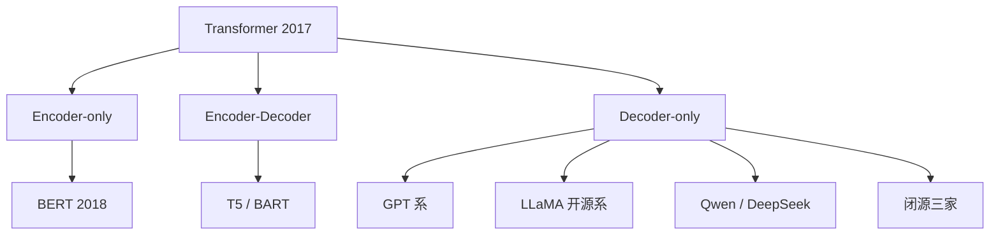
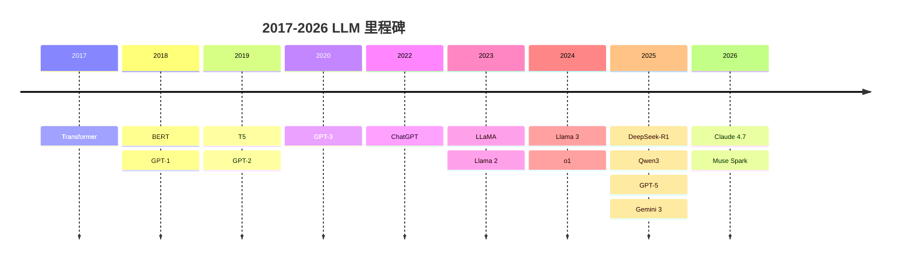

# Ch6 LLM 家族编年史

> 一句话简介：十年 100+ 个模型，其实只有三条架构路线。

## 本章目标

读完本章你应当能：
- 画出 2017-2026 年 LLM 发展的时间线，标出三个分水岭年
- 区分 Encoder-only / Decoder-only / Encoder-Decoder 三种架构路线，并说出为什么 Decoder-only 赢了
- 说出 GPT、BERT、T5、LLaMA、Qwen、DeepSeek 各自的开创性贡献（每条一句话）
- 解释"开源浪潮"如何改变了 LLM 的竞争格局
- 用一句话回答"为什么 2020 年后几乎所有 LLM 都是 Decoder-only"

## 本章导览



全图只讲一件事：一个起点（Transformer），三条分岔（三种架构路线），四个去向（各路线的代表模型与阵营）。读完本章，你应该能自己在图上标出每个方块对应的年份、代表模型和它的一句话贡献。

## 6.1 引子：三个分水岭年

先约定本章的主角。你打"明天天"，输入法弹出"气不错"——这种一个词接一个词往下接话的补全，背后是一个读过海量文字的小程序。把它喂到极致：读过互联网规模的文字，能就任何话题接着往下写——这就是大语言模型（Large Language Model, LLM）。可以想成电台热线主持人：听过的稿子多，什么话题都能接一段。十年间公开的 LLM 少说上百个，名字每年都换一茬，硬记是记不住的。

但如果我们只挑三个年份，就能把整段历史串起来：**2017、2020、2023**。

**2017：骨架诞生。** 这一年出现了一副机器骨架：把句子切成小块，反复对照着读，再一个词一个词写出答案。它像手机主板——摄像头、电池都装在它上面；本章只当起点，不拆开看电路。具体的机器是：输入"今天的雨"，它逐词输出"真大"。这就是 Transformer。之后十年所有 LLM 都照这副骨架造，细节见 Part 1 Ch3。

**2020：变大本身成了本事。** GPT-3 证明了一件事：东西做大到某个程度，会突然冒出原来完全没有的新本事。生活里最像的例子是水加热：99℃ 还是水，到 100℃ 突然翻滚冒泡——量够了，性质就变了。这种"量变引起质变"的现象叫涌现（Emergence）。具体到模型：GPT-2 时代做不好翻译，大得多的 GPT-3 不改任何代码就能翻——本事是"大"出来的，它到底有多大，参见 6.4。

**2023：变成产品，也分成两派。** ChatGPT 于 2022 年 11 月底上线，到 2023 年初成了亿级用户的现象级产品；同一年 LLaMA 的模型文件泄漏到公网、Llama 2 发布——从此"文件可下载、自己能跑"的开源派，与"只给在线接口"的闭源派正式分道扬镳（参见 6.6）。

这很像汽车史上的三个瞬间。1886 年奔驰一号证明"装了发动机的车能跑"（2017，原理可行）；1908 年福特 T 型车把车做成普通家庭买得起的日用品（2020，规模带来新能力）；1970 年代石油危机催生了省油的小型车，市场从此分成省油派与豪华派两条路（2023，产品化与开闭源分野）。汽车的形态后来千变万化，但"能跑、买得起、分阵营"这三件事，分别在那三个年代定型。

讲透了，表只做回顾：

| 年份 | 事件 | 为什么是分水岭 |
|---|---|---|
| 2017 | Transformer 论文发表 | 一切起点，奠定了此后所有模型的骨架 |
| 2020 | GPT-3 发布 | 证明"变大"本身会带来新本事：不用逐个任务重练，也能现场学会新任务 |
| 2023 | ChatGPT 爆红 + LLaMA 开源生态起飞 | LLM 变成大众产品；开源与闭源从此走两条路 |

记住这三个年份，后面所有模型都能挂到这条钩子上。本章接下来的路线是：先用 6.2 把上百个模型收拢成三条架构路线，再各用一节讲每条路线的代表模型（6.3-6.5），然后补上开源与闭源两条阵营线（6.6-6.8），最后在本章小结收成一张回顾图与总表。带着三个年份往下读，再乱的名字也有地方挂。

## 6.2 三大架构路线

上一节是时间线，这一节换一个切法：不按年份，按**架构路线**。十年上百个模型，底层其实只有三种骨架，区别在一个问题——**每个词写出来的时候，允许看到多少原文**。先把三种骨架各自走一遍：名字先挂着，紧跟一句白话、一个生活对应物、一个具体小例子。

- **只编码（Encoder-only）**：整句通读着理解透，但从来只读不写，生不出新句子。像闭卷做阅读理解的学生：能概括全文大意，让他现场写一篇却不入门。给它"这家餐厅评分 4.8"，它能判断是好评；你让它接着写一段新评论，它不会。顺带说清"编码"：读进去的内容变成内部的一串数字。
- **只解码（Decoder-only）**：一个词一个词往下写，写每个词时只看已经写出来的前文。像连载小说作家：写第三章时只记得前两章，但天生就会往下写。你给它上半句"下雨了，我赶紧"，它接"收衣服"——只依赖前文，所以天生会生成。"解码"是反方向：把内部的数字再写回成词。
- **先编码再解码（Encoder-Decoder）**：先把整段输入读懂吃透，再照着一段段写出结果。像先通读全文再写摘要的译者：埋头读完全场，散会后才一段段写出纪要。输入中文"今天很冷"，编码部分先通读，解码部分逐词写出"It's cold today"。

这三条路线都源自同一篇 Transformer 论文——原论文两半都有，后来的模型各自砍掉了其中一半：

| 路线 | 输入可见性 | 典型任务 | 代表模型 |
|---|---|---|---|
| Encoder-only（只编码） | 每个词都能看到整句话 | 分类、信息抽取等"理解"任务 | BERT、RoBERTa |
| Encoder-Decoder | 编码器通读全文，解码器写时看前文 | 翻译、摘要等"输入一段、输出一段" | T5、BART |
| Decoder-only（只解码） | 只能看到自己已写出的前文 | 续写、对话，以及几乎一切生成任务 | GPT 系、LLaMA、Qwen、DeepSeek |

需要说明的是，三种路线用的零件完全相同。核心零件先回顾一句：**读到一个词时，回头给全句打相关分，分高的词多照顾一点**。像荧光笔回头划重点——句子"小猫追蝴蝶，它跑得真快"里的"它"，就是靠给"小猫""蝴蝶"打分，才确定指的是小猫。这就是自注意力（Self-Attention），细节见 Part 1 Ch3。三种路线不同的只是训练任务和允许看到的原文范围，就像同一套发动机，装成只读不写的阅读机、一个字一个字写的打字机，或者先读后写的速记仪。

一句话记住胜负手：**现实世界里"往下写"是最高频的需求，所以 Decoder-only 赢了**。接下来三节（6.3 / 6.4 / 6.5）各讲一条路线的代表模型，看这个判断是怎么在十年里被验证的。

## 6.3 Encoder-only 时代：BERT 与它的继承者

先回头看"读者"路线，因为它是 2018-2020 年的绝对主角。当时的具体失败是：模型读句子只能从左往右读，右边的字对左边的词帮不上忙，理解自然不透。2018 年，Devlin 等人发表 [BERT](https://arxiv.org/abs/1810.04805)（Bidirectional Encoder Representations from Transformers），它的解法是一个巧妙的填空游戏：把句子里的词挖掉几个，逼模型靠上下文把原词猜回来。比如遮住"法国的首都是 [MASK]"里的"巴黎"，让它靠"法国""首都"猜出来——挖空处越多，越逼着你读前后文。为了猜对，模型被迫同时利用左边和右边的上下文，这比当时"只能从左往右读"的模型理解得更透。可以把它想成阅读理解训练：不是抄写原文，而是反复做完形填空。

这种先在海量文字上打通用底子的练习，统称预训练（Pretraining）：反复练基本功，不为哪一道具体的题——像十二年基础教育，语文数学历史什么都学。BERT 预训练考卷的正式名字，就是遮盖语言建模（Masked LM）：把句子里的词挖掉几个，逼它靠上下文把原词猜回来。

这一招在当年立竿见影。先说清楚"榜"是怎么来的：把各家程序拉到同一套考题上打分，按分数排个名次——就像汽车碰撞测试的五星评级，同一套流程，撞完按星级排座次，这就是评测榜（Benchmark）。GLUE 榜上 BERT 曾霸榜两年：任务固定、评分固定，名次才可以横向比较。2018-2020 年，几乎所有理解类评测榜的榜首都被 BERT 及其后代占据，分类、问答、信息抽取这些任务上，各家公司纷纷把 BERT 当作标配底座。它之后还出了几位各有所长的继承者：

| 模型 | 年份 | 一句话贡献 |
|---|---|---|
| [RoBERTa](https://arxiv.org/abs/1907.11692) | 2019 | 把 BERT 的训练配方调到极致：训练更久、去掉多余的训练目标 |
| [ALBERT](https://arxiv.org/abs/1909.11942) | 2019 | 做减法：用更少的参数（内部存的那堆数字，见 6.4）达到接近的效果，让模型更轻 |
| [DeBERTa](https://arxiv.org/abs/2006.03654) | 2020 | 改进注意力的算法设计，是这条路线的集大成者 |

那为什么后来掉队了？原因很简单：**它不会顺畅地生成文本**。完形填空一次只填一个被遮的词，和"从零写出一篇连贯的文章"是两回事；前者学的是"对一句话的理解"，后者学的是"把想法变成文字"。当 2020 年之后大家要的是对话、写作、写代码时，Encoder-only 的天花板就露出来了。它没有消失——今天做文本分类、意图识别这类"只判断不生成"的任务，轻量的 BERT 系模型依然是性价比之选——但它不再是舞台中心。舞台中心让给了"作家"路线，这就是下一节的主角。

## 6.4 Decoder-only 统一：GPT 系

上一节说 Encoder-only 天花板露了出来，接棒的是 OpenAI 的 GPT 系。它的问题意识从第一代就很清楚：现实里最高频的请求是"你接着写"，那就把"接着往下写"练到极致。八代模型每代只解决一个新毛病——先看文字账，阶梯图放最后回顾。

- **GPT-1（2018）：确立"预训练 + 微调"范式。** 上一节的预训练是打通用底子；打完底子，再用少量专门题目重点练一回，改掉不合用的习惯——这叫微调（Fine-tuning）。生活版：新员工入职头两周，学的是这家公司的打卡流程和报销规矩，不是重上一遍大学。具体小例子：拿 500 条"问：在吗 → 答：你好，请讲"这类客服对话语料再训一轮，它就学会客服腔。其中最常考的一种题是"听吩咐办事"：拿海量"怎么吩咐 → 希望怎么答"的成对例子再训一轮，练出听懂人话直接照办的习惯——这叫指令微调（instruction tuning），6.5 会看到它改变一条路线的命运。细节见 Part 1 Ch4。
- **GPT-2（2019）：规模变大，换任务不用重练。** 先把量词说清：程序内部存着的那堆数字，个数叫参数量（Parameters）——个数越多记得越多，也越吃力，像一部百科全书：册数多查得到的偏门知识多，但搬动也更沉。换算：1B 是 10 亿，117M 是 1.17 亿。OpenAI 当时只放出 117M 的小号，扣住 1.5B（15 亿）的完整版，理由是"太危险不敢发布"，成了圈内著名的梗——几个月后还是放了出来。它真正证明的是：模型够大，换任务就不用从头训练。
- **GPT-3（2020）：参数量 1750 亿，几个示例就能现场学会新任务。** 先把用法说清：不改它任何内部，只在问题前先写几个示范例子，让它照着做——像驾校教练先示范三把倒车，学员照着做第四把。问题前的那段话叫提示词（Prompt），那几个示范例子叫少样本（few-shot）。比如想让它中译英，不用改任何参数，只要在提示词里放三个"中文 → 英文"例句——"你好 → Hello"、"谢谢 → Thank you"、"再见 → Goodbye"——第四句中文跟上去，它就能接着翻。这就是 6.1 说的 2020 分水岭：本事是"大"出来的涌现（参见 6.1）。
- **ChatGPT（2022.11）：从论文变成产品。** 模型还是 GPT-3.5 一系，开创性在于加了对齐（Alignment）：让它的回答照人希望的样子来——人给答案排名次，它照好评的方向反复调整。像老师批改作文写评语：按评语改下一篇，几轮下来就对齐了老师的口味。ChatGPT 之前模型会输出冒犯话；加入人工排名训练后，它学会先拒绝过分要求再作答。这套练法的正式名是 RLHF（见 Part 1 Ch5）。
- **GPT-4（2023.03）：通用能力大跨步。** 除了更聪明，还打开了多模态（Multimodal）输入：同一个程序，既能读文字，也能看图、听说话——"模态"就是信息的种类。像四合一一体机：打印、复印、扫描、传真，一台机器全包。你把报错截图发给它，它直接看图指出第 3 行的变量名错了——不用你先转述成文字。
- **GPT-4o（2024.05）：多模态做进一个模型。** "o"指 omni，文本、图像、音频在一个模型里原生打通，回应速度接近人类对话。
- **o1（2024.09）：另起"推理模型"支线。** 碰到难题先写一长段演算草稿再交卷，简单题则直接答——数学与编程能力显著提升，几乎所有家随后跟进（详见 Ch7）。
- **GPT-5（2025.08）：快答与深思合并成一个系统。** 按题目难度自动分配"快答"或"深思"，简单题不用陪跑。

八代讲完，阶梯收回来做回顾——每级台阶对应的毛病，上面都讲过：

```
GPT-1  (2018)     预训练 + 微调：先读海量书，再针对具体任务练手
    ↓
GPT-2  (2019)     规模变大：模型开始"举一反三"，换任务不用重练
    ↓
GPT-3  (2020)     继续变大：几个示例就能现场学会新任务
    ↓
ChatGPT(2022.11)  加上对齐训练（RLHF）：会对话、听话的产品诞生
    ↓
GPT-4  (2023.03)  通用能力大跨步，长文本与多模态输入
    ↓
GPT-4o (2024.05)  多模态：文本、图像、音频共用一个模型
    ↓
o1     (2024.09)  推理模型：先"打草稿"思考，再给出答案
    ↓
GPT-5  (2025.08)  统一系统：按题目难度自动分配"快答"或"深思"
```

十年八代，动作始终如一：**把"接着往下写"这一件事做到极致，写得多了，别的能力自己长出来**。也正因为"接着写"足够简单、足够统一，它才能原样扩展到对话、代码、多模态这些当年没想到的场景。同期还有一条安静的路线，下一节收尾。

## 6.5 Encoder-Decoder 路线：T5 与 BART

"作家"（Decoder-only）和"读者"（Encoder-only）讲完了，还剩"译者"路线。它面对的问题很具体：翻译、摘要这类活，天生是"输入一段、输出一段"——必须先把整段读懂，再写出另一段，单靠"接着前文写"不够顺手。

2019 年，Google 发表 [T5](https://arxiv.org/abs/1910.10683)（Text-to-Text Transfer Transformer），核心想法是一个漂亮的统一：**把所有任务都变成"输入一段文本，输出一段文本"**。分类？把句子输进去，输出标签词。翻译？输入中文，输出英文。摘要？输入原文，输出短文。它的系列命名也来自这个思路：同一个 Transformer，试着当"通用文本转换器"用。同年 Facebook 的 [BART](https://arxiv.org/abs/1910.13461) 走了类似路线，把"破坏再修复文本"作为预训练方式，专攻翻译与摘要。

这条路线像一位全能翻译官：什么语种、什么文体都能接。但职业变迁往往不奖励"全能"。指令微调（参见 6.4）普及之后，Decoder-only 模型学会了直接听懂"把这段话翻译成英文""给这篇长文写三句摘要"这类自然语言指令——全能翻译官会的活，作家看几眼示例也会了。于是翻译、摘要这类"输入一段、输出一段"的任务被 Decoder-only 一条船装走。今天的翻译、摘要需求，要么直接交给通用对话模型，要么留在专用小模型里：Encoder-Decoder 没有消失，但不再是研究与产品的中心。

这不是失败，而是**被吸收**：T5 提出的"万物皆可转成文本生成"这一思想，反而借 Decoder-only 之躯普及到了所有模型上。判断一个技术路线的成败，不能只看它是否消失，更要看它的想法是否活在了后继者身上。

## 6.6 开源浪潮：LLaMA 系

前面三条讲的是"架构之争"，这一节讲另一条改变格局的暗线：**谁有权拿到模型**。架构决定模型"能做什么"，权限决定"谁能用、谁改得动"——两条线叠加，才构成今天的真实版图。先看当时的具体失败：模型里记满知识的那堆数字（就是 6.4 说的参数）锁在大厂机房里，只给一个调用入口——想改它、想自己跑，门都没有。

把那堆数字公开放出来，谁都能下载、自己跑、自己改——这就是开放权重（Open Weights）。像乐高的两种卖法：闭源是卖拼好的摆件，只能看；开放权重是给整包零件，自己拼自己改。具体小例子：LLaMA 权重下载后，有人用一张显卡改成会说行业黑话的版本——前提是那堆数字是公开的。

转折点是 Meta 的 LLaMA 系：

| 时间 | 事件 | 开创性一句话 |
|---|---|---|
| 2023.02 | [LLaMA 1](https://arxiv.org/abs/2302.13971) 发布 | Meta 以研究许可开放权重；随后一周内泄漏到公网，开发者发现它比当时绝大多数开源模型都好用，Alpaca、Vicuna 等微调版本迅速涌现——"泄漏事件"成了开源浪潮的发令枪 |
| 2023.07 | Llama 2 发布 | 首次给出可免费商用的许可，企业敢把开源模型放进产品了 |
| 2024.04 / 07 | Llama 3 → Llama 3.1 发布 | 旗舰级 405B 权重也开放下载，开源与闭源的差距被肉眼可见地拉近 |
| 2025.04 | Llama 4 Scout / Maverick 发布 | 转向新一代架构；同月预览更大旗舰 Behemoth |
| 2025.05 起 | Behemoth 一再推迟、事实上搁置 | 据 Reuters 2025 年 5 月报道多次延期，此后长期未公开发布 |
| 2026.04 | Meta Superintelligence Labs 发布 Muse Spark | Meta 首个闭权重旗舰模型——开源旗手转身闭源，路线之争再添变数 |

表里 2025 年那行有三个名堂，拆开说清：其一，Scout/Maverick 转向的"新一代架构"叫混合专家（Mixture of Experts，MoE）——白话一句：养一整屋子各有所长的专家，但每个问题只叫最对口的少数几个出来答，省得全家出动（完整拆解见 Ch7）；其二，原生多模态就是 6.4 讲过的"图文音一个模型"，只是从预训练起就长在一起，不是后来拼装的；其三，Behemoth 是同月预览的更大旗舰型号，宣称"史上最聪明 LLM 之一"，后来一再推迟（见表中下一行）。

这张表藏着本节的金句：**开源浪潮真正改变的不是模型本身，而是"谁能微调"的准入门槛**。从前要让模型听自己的话，只有大公司烧得起训练集群；有了开放权重，任何有一张显卡的开发者都能在底座上继续改——写诗的、写法律文书的、说行业黑话的模型，都可以在车库里诞生。LLaMA 让"下载一个模型自己改"从不可能变成默认操作，也逼着闭源阵营用产品体验而不是"独占模型"来竞争。至于 2026 年 Meta 自己转身闭权重，恰恰说明这场竞争的焦点已经从"模型归谁"挪到了"产品做给谁"。

## 6.7 中文 LLM 双雄：Qwen 与 DeepSeek

上一节的开源浪潮在 2024-2025 年撞出了中文世界的两股最强涌流：阿里的 Qwen（通义千问）与深度求索的 DeepSeek。它们面对的问题很实在：中文任务要好用，还得让全球开发者用得起、改得动。它们不是"中国版 LLaMA"，而是各自有明确的开创性贡献。

**Qwen 系（阿里）**：覆盖尺寸最全的开源家族之一，从几亿到千亿参数、从手机到服务器都有对应型号，到 2025 年底已是 Hugging Face 上下载量最高的开源家族之一。Qwen2.5（2024.09）把中文能力与代码能力稳稳推到开源第一梯队；[Qwen3（2025.04）](https://qwenlm.github.io/blog/qwen3/)的开创性是**混合思考模式**：同一个模型一键切换"直接回答"与"先打草稿再回答"两种状态——简单问题秒回省成本，难题多想一会儿保质量（"打草稿"就是 6.4 预告过的推理模型套路）。

**DeepSeek 系（深度求索）**分三步走，一步解决一个问题。第一步，把旗舰的价格打下来：DeepSeek-V3（2024.12）是 6710 亿参数的混合专家（MoE，白话见 6.6）基座，据其技术报告训练成本约 560 万美元。第二步，让"会思考的模型"跑进普通人的显卡：[DeepSeek-R1（2025.01）](https://github.com/deepseek-ai/DeepSeek-R1)把推理模型以完全开放的权重发布，还提供一串蒸馏小模型——蒸馏就是把大模型的思考能力"压"进几亿到几百亿参数的小模型里，好比把名师的笔记压缩成一本薄讲义，学生照着也能考出接近的分数，于是消费级显卡也能跑"会思考的模型"。第三步，把长文本的账单砍半：DeepSeek-V3.2-Exp（2025.09）引入稀疏注意力（Sparse Attention），白话是读长文本时只跟最关键的那几句细算关系，其余粗略扫过——推理成本大降，API 价格再砍一半以上（详见 Ch7）。

两家的共同点，也是它们改变世界的姿势：**开源权重 + 便宜的推理 API**。全球开发者从此有了第二个默认选项——不必锁定任何一家闭源 API，下载权重自己部署，或者调用价格低一个量级的托管服务。创业公司拿它们当底座，研究者拿它们做实验，大量本地部署与离线场景也因为它们成为可能。这不涉及谁比谁强的横评，而是结构性变化：**"最强能力"与"最低成本"第一次出现在同一个选择里**。

## 6.8 闭源前沿：Claude、Gemini、GPT-5

开源系给了"第二个默认选项"，那闭源前沿靠什么立足？2026 年形成了相对稳定的三家格局，答案是定位差异——这里不做跑分对比：跑分月月变，定位相对稳定。

三家像三家航空公司：主飞的航线不同，但安全标准（对齐与安全）都是刚需。

- **Claude（Anthropic）**：航线是编程与长程任务——让 AI 自己连贯干完一串开发活，中途少翻车、少要人救火。版本节奏在 2025-2026 年明显加快：Claude Opus 4.5（2025.11）→ Opus 4.6（2026.02）→ Opus 4.7（2026.04），三个版本相隔只有两三个月，每次迭代都不是换名字，而是把"可靠性与智能体编程"再磨一轮——用户可感知的差异：同一串长活儿越跑越稳。
- **Gemini（Google DeepMind）**：航线是原生多模态——文本、图像、视频、音频从预训练起就进同一个模型，好处是你把视频、截图、文字混着丢过去，它一套动作全接住，不用先转成文字；再与 Google 搜索、办公套件深度捆绑。[Gemini 3 Pro 于 2025 年 11 月 18 日发布](https://en.wikipedia.org/wiki/Gemini_(language_model))，接替 2.5 系成为旗舰。
- **GPT（OpenAI）**：航线是通用前沿。2024.09 的 o1 开启推理模型赛道（先打草稿再交卷）；2025.08.07 的 GPT-5 把"快答模型 + 思考模型"整合为统一路由系统——简单题秒回、难题自动多想，用户不用自己挑模型。

还有一个共同底色：三家都在对齐（6.4 讲过：让模型行为照人希望的样子来，见 Part 1 Ch5）上投入重兵——推理模型让"模型想什么"变得可见，也让"想得对不对"变得更要紧。航线图看清即可：要编程与长任务找 Claude 系，要多模态与生态整合找 Gemini 系，要通用前沿找 GPT 系；对齐能力，三家谁都不敢放松。开源与闭源这两条线在 6.6-6.8 各自讲完，十年的历史也走到了头：本章小结先把十年收进一张回顾图与总表，再记要点。

## 本章小结

正文走完十年，先收一张**回顾图**——图上每个名字，前文都已讲过它"治什么病"：



读图要抓疏密：**2017-2020 是奠基期**，四年确定了架构与规模路线，之后的工作更多是把这四年的直觉做大做稳；**2022-2023 是拐点**，产品化与开源生态几乎同时引爆，模型从论文走进了亿级用户的日常；**2024-2025 最密集**，推理模型、开源双雄、多模态旗舰轮番登场，一年发生的里程碑比过去三年加起来还多；**2026 出现新分化**——闭源前沿快速迭代，开源旗手 Meta 反而转身闭权重，"开源 vs 闭源"从技术路线变成了商业选择。最后用 6.2 的三路线回看这张表：

| 路线 | 起点 | 高光期 | 2026 年现状 |
|---|---|---|---|
| Encoder-only | BERT（2018） | 2018-2020 理解类任务霸榜 | 退守分类、抽取等"只判断不生成"的专用场景 |
| Encoder-Decoder | T5 / BART（2019） | 2019-2021 翻译与摘要 | 大部分被 Decoder-only + 指令微调吸收 |
| Decoder-only | GPT-1（2018） | 2020 至今 | 绝对主流：GPT、LLaMA、Qwen、DeepSeek、Claude、Gemini 全在这一边 |

三行读下来就是本章反复给出的答案：路线之争以"合并同类项"结束，所有活下来的选手都站在 Decoder-only 这一边。三条路线收敛成一条，但阵营线反而变多了：开源与闭源、通用与专用、快答与深思。历史部分到此结束——这正是下一章的起点：不再纠结"哪种骨架"，而是看清**今天拿来就能用的模型，到底长什么样**。

要点清单：

- 十年 LLM 史只有三条架构路线，Decoder-only 因为"天生会生成、一个范式通吃所有任务"而胜出——2020 年后几乎所有 LLM 都是 Decoder-only。
- 三个分水岭年：2017（Transformer 诞生）、2020（GPT-3 证明规模即涌现）、2023（ChatGPT 产品化，开源与闭源分道扬镳）。
- 各家族一句话：BERT 用完形填空教会模型"读懂"；GPT 用"接着写"统一了生成；T5 提出万物皆可文本生成；LLaMA 把"谁能微调"的门槛从大公司拉到了一张显卡。
- 开源浪潮改变的不是某个模型的强弱，而是准入门槛：开放权重 + 便宜推理 API，让任何开发者都有了"第二个默认选项"。
- 2026 年的格局：闭源三家（Claude / Gemini / GPT）按定位分工、快速迭代；开源系以 Qwen、DeepSeek 为代表持续扩张，连开源旗手 Meta 也开始闭权重尝试——开与闭的边界仍在移动。
- 时间线和路线图都有了，下一章（Ch7）回答一个更近的问题：今天的模型长什么样，以及我们为什么还要在它之上再搭一层 harness。

## 本章参考

### 必读论文
- [Attention Is All You Need (Vaswani et al., 2017)](https://arxiv.org/abs/1706.03762)
- [BERT (Devlin et al., 2018)](https://arxiv.org/abs/1810.04805)
- [Language Models are Few-Shot Learners (Brown et al., 2020)](https://arxiv.org/abs/2005.14165)
- [LLaMA: Open and Efficient Foundation Language Models (2023)](https://arxiv.org/abs/2302.13971)

### 推荐博客 / 教程
- [The Illustrated BERT (Alammar)](https://jalammar.github.io/illustrated-bert/)
- [LMArena 排行榜](https://lmarena.ai/)

### 视频 / 课程
- [Andrej Karpathy - Intro to Large Language Models](https://www.youtube.com/watch?v=zjkBMFhNj_g)
