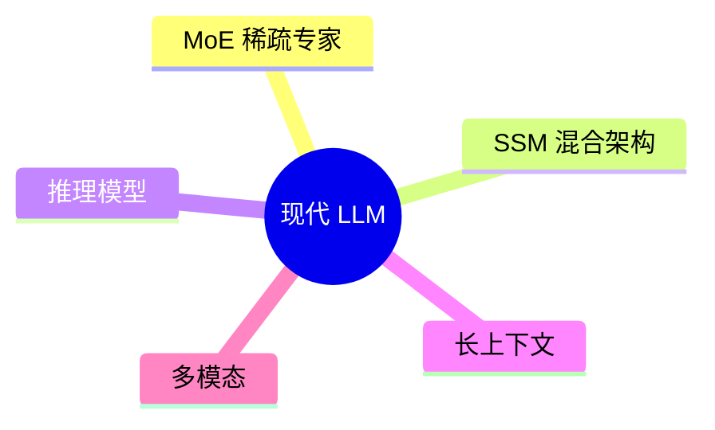

# Ch7 现代 LLM 的关键变体

> 一句话简介：当代模型身上贴着五个标签，每个标签解决一个具体痛点。

## 本章目标

读完本章你应当能：
- 说出当前最强（SOTA）模型的五个关键标签（MoE / SSM 混合 / 推理模型 / 长上下文 / 多模态），并用一句话解释每个的动机
- 用一个生活类比解释 MoE 稀疏激活为什么省钱
- 说明 Transformer 在长序列上贵在哪里、SSM 的解法思路
- 说出推理模型"思考更久答更好"背后的训练与推理两种算力
- 用一句话点名 RMSNorm / SwiGLU / RoPE 等现代组件各自替换掉了什么

## 本章导览



五支骨架先当向导，对应 7.2-7.7 的五个标签。读的时候别急着背图——每节开头都有一个"没有它会怎样"的失败现场；读完再回看此图，它就是一张**回顾图**。结构上，7.2-7.4 是架构层（怎么搭），7.5 是训练层（怎么练），7.6-7.7 是能力层（装多少、看什么），7.8 把零件收成一张点名表。五个标签没有先后依赖，赶时间可以挑着读；但 7.2 的 MoE 与 7.4 的混合架构常在同一个模型里同时出现，连着读会有对照之效。

## 7.1 引子：为什么 2023 后的模型"长得不一样"

上一章（Ch6）把上百个模型按**家族和年份**挂上了时间线。这一章换一个视角：不问"它是谁家的"，只看它身上贴着什么**技术标签**。

先别急着记标签名——2023 年后的模型发布稿，翻来覆去在治五种具体的"不爽"：

- 调用**贵**：随口一句"今天星期几"，模型内部几千亿个数字却要全部醒来算一遍；
- 读长文**慢**：序列一长，计算量翻着倍地涨；
- 难题**答不准**：一道要绕三弯的数学题，它抬手就答、答错；
- 窗口**窄**：想把一整本书放进一次对话，做不到；
- 输入**单**：扔给它一张报错截图，它只能干瞪眼。

每种病后面都有一张对应的药方，没有一个是为贴而贴的装饰。

**手机类比。** 选旗舰手机时你看五个卖点：芯片（更快）、电池（更久）、快充（回血快）、屏幕（更大）、相机（更强）。每个卖点解决一种不满，五个凑齐就是"当代旗舰"——没有人会因为"芯片不是全新品类"就拒绝它。模型的五个标签同理：

| 标签 | 解决的痛点 | 一句话预告 |
|---|---|---|
| MoE 稀疏专家 | **贵** | 参数很多，每次只动用一小部分 |
| SSM 混合架构 | **长**（序列一长就慢） | 长序列不再两两互看 |
| 推理模型 | **难**（难题答不准） | 先打草稿再交卷 |
| 长上下文 | **窄**（窗口装不下） | 一次对话装得下一整本书 |
| 多模态 | **单**（只有文字） | 图、文、音一起看 |

表格里的名字现在还只是挂号单上的病名——7.2 起每节开头都先演一遍"没有它会怎样"，再讲它是什么；7.8 再补一张"零件点名表"。读完你会发现：这些标签并不神秘，每一个都是对 Part 1 某个具体短板的正面回应——它们不是五场彼此无关的革命，而是同一场工程化的五个侧面。

## 7.2 MoE：稀疏激活的专家

**先演"没有它会怎样"。** 假设你调用一个几千亿参数的模型，只为问一句"今天星期几"。参数，就是模型内部存着的那堆数字（Ch6 讲过）；如果没有特殊设计，这堆数字要**全部醒来**算一遍——问星期几和推导数学题动用的是同一批人马，电费按全楼开工算，可大部分工位上的人根本帮不上忙。

**把账算清之前，先立住一个最小单位。** 模型读文字不是整句整句读的，而是先切成小块——可能是一个字、半个词或一个标点。这就像一条切片面包：整条是句子，切出来的每片厚薄并不均匀。比如"我喜欢你"可能切成【我】【喜欢】【你】三片，也可能切成【我不】【喜欢】【你】——切法由它自己定。这种小块叫**词元（Token）**，后文说"每个 token 进来如何如何"，指的都是它。

Part 1 用医院分诊的比方预告过这个思路（参见 3.10）：全院会诊是 8 个科室全来——又慢又贵；分诊台看一眼，只挂对科室的号。本节把它换成算得清的账。

它的做法用一句白话说就是：**养一整屋子各有所长的专家，但每个问题只叫最对口的少数几个出来答**。分诊台描述的是整套效果，落到实处是一个个被复制出来的"专家"——专家不是人，是模型内部负责加工的那层车间（前馈网络，Part 1 见过：每个 token 都要路过它一手）被原样复制成许多份。DeepSeek-V3 养了这样一支 6710 亿参数的"专家团"，但每个词只动用其中 370 亿——团大，出手小。这套做法叫**混合专家（Mixture of Experts, MoE）**。

那"叫谁出场"总得有个看门的。**白话说：每小块输入进门先被看一眼，由它决定这一份派给哪位专家。** 生活里的对应物是单位收发室的分拣员：看一眼地址，决定这封信送财务还是送人事。放到模型里：同一份输入，它给两位专家打分 [0.9, 0.1] 就送专家 A，打分 [0.2, 0.8] 就送专家 B。这个看门的零件叫**路由器（Router）**——分诊台是整套流程的样子，路由器就是流程里那个具体干活的人。

**把账摊开。** 一个最小的 2 专家 MoE，每个 token 只激活 1 个专家：

```text
模型总参数 10B = 专家 A（5B）+ 专家 B（5B），每个 token 只走 1 个：
token「cat」    → 路由器打分 [0.9, 0.1] → 走专家 A → 激活 5B
token「42+8」   → 路由器打分 [0.2, 0.8] → 走专家 B → 激活 5B
结论：总参数 10B，任一 token 的计算量却只有 5B
```

再对照这层病的药方打个比方——**夜班照明**：哪条走廊有人走哪盏亮，不整栋楼开灯。上面的账正是如此：10B 总参数的两专家模型，每个 token 只激活 5B——**账单按 5B 算，学问按 10B 算**：每来一小块输入，只让其中一小部分干活，其余歇着不花钱。这套省钱手法叫**稀疏激活（Sparse Activation）**。

这个"两本账分开算"为什么重要？因为模型的"知识容量"大致随总参数涨，而你的 API 账单只跟激活参数（计算量）走。以前这两个数被焊死在一起：要更多知识就得付更多计算。MoE 把焊点撬开了——这正是它从 2021 年的论文一路变成 2025 年旗舰标配的原因。路由器怎么训、专家负载怎么均衡，属于训练细节，本章不展开。

四代代表一行一个，只需记住"从论文走向了旗舰标配"：

| 工作 | 年份 | 一句话 |
|---|---|---|
| [Switch Transformer](https://arxiv.org/abs/2101.03961) | 2021 | 奠基：证明稀疏 MoE 能扩到万亿参数规模 |
| [Mixtral of Experts](https://arxiv.org/abs/2401.04088) | 2024 | 8 专家选 2，总参数 47B、激活仅 13B，开源可用 |
| DeepSeek-V3 | 2024.12 | 671B 总参数、37B 激活，把旗舰成本打下来 |
| Qwen3 MoE | 2025 | 代表型号 Qwen3-235B-A22B：235B 总参数、22B 激活 |

## 7.3 SSM 与 Mamba：不走寻常路的长序列

**先演"没有它会怎样"（治"长"）。** MoE 治的是贵，这一节治的是长。回顾 Part 1 的一笔账（参见 3.2）：attention 让每个 token 和前面所有 token 两两打一遍分——序列长度翻倍，打分次数翻四倍。读 8 千字的文章还好，读 80 万字的代码库，这套"两两互看"就撑不住了：你只想知道某个函数在哪定义，它却要为每个字跟全篇每个字都握一次手。

**换一种记笔记的方式。** 不是每读一句就翻回去和前面每一句核对，而是**每读一小步，就把已读内容压进固定大小的一页笔记，往后只带着这一页走**。生活里的对应物是接力赛：每棒选手只交接一根接力棒，不交接全程录像——那根棒，就是那页固定大小的笔记。比如读那 80 万字的代码库，它每步只带这页摘要；序列翻倍，计算也只翻一倍（attention 要翻四倍）。这套读法叫**状态空间模型（State Space Model, SSM）**。

**视觉化。** SSM 的每一步只做三件事，图里的"状态"就是那页笔记上此刻写着的内容：

```text
t=1:  输入 x1                 → 状态 h1 → 输出 y1
t=2:  输入 x2 + 旧状态 h1     → 状态 h2 → 输出 y2
t=3:  输入 x3 + 旧状态 h2     → 状态 h3 → 输出 y3
……  笔记大小恒定，序列翻倍 → 每步计算只翻一倍
```

代价也很直觉：笔记只有一页，太旧、太细的信息会被滚动时盖掉——这个短板 7.4 解决。把两条路线的成本曲线画出来，差别一目了然：

```text
序列长度   ×2      ×4      ×8      ×16
attention  计算×4   计算×16  计算×64  计算×256   （两两互看，平方增长）
SSM        计算×2   计算×4   计算×8   计算×16    （滚动笔记，线性增长）
```

**Mamba（2023.12，Albert Gu & Tri Dao）** 是这一思路的成名作：[Mamba: Linear-Time Sequence Modeling with Selective State Spaces](https://arxiv.org/abs/2312.00752)。它的关键改进一句话——让那页笔记**学会选择**：当前 token 相关的信息写进去，无关的忘掉（"选择性"由此得名）。论文报告它的推理吞吐约为同规模 Transformer 的 5 倍——吞吐即每秒能读进、吐出多少字，好比别人读一句的工夫它读五句；且 3B 规模打平了两倍参数的 Transformer。Mamba 之后，"用固定状态换单步便宜"成了与 attention 并列的第二条赛道——但纯 SSM 并没有赢下全场，原因就在下一节。

## 7.4 混合架构：Attention 遇见 SSM

**先演"没有它会怎样"。** 上一节结尾留了个短板：笔记再省也记不住细节。你现在就能造出它的失败案例——把一本书塞给纯 SSM 模型，问它"第 3 页第 2 行写了啥"，它多半答不上：那行字早在滚动更新里被盖掉了。**attention 恰好相反**：每步都能回到任意位置精读，唯独怕长。一个记得牢但贵，一个跑得快但健忘。

**怎么把两个长处拼起来？** 先说白话：**大部分内容快快扫一遍，少数关键处停下来逐字精读**——多数层用 SSM 负责线性扫读，少数层穿插 attention 负责"随时回翻原文"。生活里的对应物是带略读与精读两种读法的读书人：90% 的时间在快速翻页，划线处才停。小例子：7 层快扫配 1 层精读的堆叠，查"第 3 页第 2 行写了啥"时就靠那 1 层翻回去。这种**模型结构上的混合**就叫**混合架构（Hybrid）**——注意与 Ch8 区分：那里同名的"混合架构"讲的是 Agent 反应快慢的分层，同名不同物，到 Ch8 见。**混合不是骑墙，是各取所长。** 一个典型的层堆叠长这样：

```text
… → SSM → SSM → SSM → SSM → SSM → SSM → SSM → attention → SSM → …
     └────────── 多数层：线性扫读，便宜 ──────────┘   └─ 少数层：全局精读 ─┘
```

**为什么配比约是 1 配 5-7？** 精读层太少，笔记里的细节没人负责翻回原文——"第 3 页第 2 行"的老毛病复发；精读层太多，成本又贴回 attention 的老账，长序列的便宜优势被吃回去。实验扫过一圈比例，发现约 1 层 attention 配 5-7 层 SSM 是甜点：记性和便宜两头都保住——Jamba 默认的 1:7 就取自这个区间。

2024 年起的三个代表，一行一个（配比数字均取自各篇原文）：

| 模型 | 团队 / 时间 | 架构一句话 |
|---|---|---|
| [Jamba](https://arxiv.org/abs/2403.19887) | AI21，2024.03 | 首个开源混合体；实验得出的甜点区约 **1 个 attention 配 5-7 个 SSM 层**（默认 1:7） |
| [Nemotron-H](https://arxiv.org/abs/2504.03624) | NVIDIA，2025.04 | 8B 型号 52 层中**只有 4 层是 attention**（约 8%），其余为 Mamba-2 与前馈层 |
| [Falcon-H1](https://arxiv.org/abs/2507.22448) | TII，2025.07 | 换了个接法：每层内 SSM 与 attention **并联**同时算再相加，而非前后排队 |

三家接法不同，方向一致：attention 少而精，SSM 多而快。2025 年后"纯 Transformer"与"纯 SSM"的争论基本收敛到混合路线——架构之争从"谁取代谁"变成了"怎么配比"。这也是为什么 7.2 的 MoE 几乎总和本节的混合同时出现：它们治的是不同的病，一个治成本，一个治序列长度。

## 7.5 推理模型：思考更久，答得更好

**先演"没有它会怎样"（治"难"）。** 前面治的都是"身体"（架构与窗口），这一节治"头脑"。你让它解一道要绕三弯的数学题，它抬手就答、答错——不是参数不够，是它从小被训练成"听到题就张嘴"的抢答选手，从没练过"先把草稿铺开"。Part 1 已有核心类比（参见 5.8）：传统 LLM 是**抢答选手**，我们想要的是会打草稿的那位。

先给这种选手一句白话：**碰到难题先写一长段演算草稿再交卷，简单题则直接答**。生活里的对应物是长考的棋手——落子前在心里推演十几步，快棋手则抬手就走。具体小例子最震撼：[OpenAI 官方公布](https://openai.com/index/learning-to-reason-with-llms/)，o1 在 AIME 2024 数学竞赛上拿到**约 74%**，而同门的 GPT-4o 只有**约 12%**——同一量级的底座，补上"学会思考"的训练后，难题得分翻了六倍。这组数字 5.8 见过，这里是它的意义：**答不好难题不是参数不够，是没学过"想"**。这样的模型叫**推理模型（Reasoning Model）**。

**时间线**（日期均取自官方发布）：OpenAI **o1**（2024.09）打响第一枪 → **o3**（2024.12 预览）跟进 → **DeepSeek-R1**（2025.01）把推理模型以开放权重发布 → **Qwen3**（2025.04）把"思考与否"做成用户可切换的开关。一年半之内，"会打草稿"从独家卖点变成了开源标配——推理能力从此不再是闭源专属。

**那么"先想后答"的习惯，到底怎么练出来的？** 先说白话：靠给每次尝试打分、照着高分改动作。生活里的对应物是电子游戏吃金币：做对动作 +10 分，做错 -5 分，分数涨跌自然教会你怎么打。这套打分练动作的做法叫**强化学习（Reinforcement Learning）**。光给总分还不够——它需要**连中间每一步也单独打分**：训练时写对第一步推理就给分，哪怕最后答案错了也能拿步骤分。这种只盯过程的打分方式叫**过程奖励**。两者合起来，才把"先想后答"从提示词里的一句叮嘱，练成了模型自己的习惯。

**两笔算力账。** 推理模型把成本从训练侧挪了一部分到每次调用侧——上面刚讲完训练侧那笔，两张面孔放在一起看清（表是回顾）：

| 维度 | 训练时算力 | 推理时算力 |
|---|---|---|
| 花在哪 | 靠打分练出"先想后答"的习惯（强化学习 + 过程奖励） | 每次回答**多生成**几千个思考 token |
| 支出特点 | 一次性投入，沉淀进参数里 | 每问一次付一次，响应更慢也更贵 |

值得强调的是，两笔账**缺一不可**：没有训练侧的投入，模型多生成的只是废话（打草稿的习惯是练出来的，不是提示出来的）；没有推理侧的放任，训练出的能力也发挥不出来。同一份能力，在不同题目上"想多久"还不一样——AIME 难题上 o1 平均生成数千个思考 token，简单问答则几乎不犹豫。这解释了推理模型的商业模式：训练贵、单次调用也贵，所以难题（数学、代码、规划）用它，闲聊用普通模型——如何按任务路由算力，是 Part 4 harness 的正经话题。

## 7.6 长上下文与 KV cache

**先演"没有它会怎样"（治"窄"）。** 用户不想"上传第 3 章再问第 3 章"，想**把一整本书塞进一次对话**，然后随口问"作者在哪一章改过口风？"。装不下，就是这个标签要治的病。

先给这个上限一句白话：**一次能塞给它看的文字量的上限；把上限做大，就叫长上下文**。生活里的对应物是戏院舞台：台上站着的演员，是此刻窗口里的字；台下候场的，是还没放进来的。具体小例子：GPT-4 的窗口约 8K，不过四页纸；Gemini 抬到 1M，约等于一整本小说。这个上限叫**上下文窗口（Context Window）**。两年之间它走过的台阶（回顾）：

| 时间 | 代表模型 | 窗口 |
|---|---|---|
| 2023.03 | GPT-4 | 8K（另有 32K 版） |
| 2023.07 | Claude 2 | 100K |
| 2023.11 | GPT-4 Turbo | 128K |
| 2024.02 | Gemini 1.5 Pro | 1M |
| 2025.04 | GPT-4.1 | 1M |

两年从 8K 到 1M，放大了约 125 倍。**但窗口写在宣传页上，账单落在显存里。** 为什么长了就贵？回看 Part 1 的一笔账（参见 3.8）：**写新词时，要把前面算过的中间结果存着，下次直接拿，省得从头重算。** 生活里的对应物是**会议室白板**：全员共用、只能加不能擦，每来一位参会者（新 token）都得添自己那块地；人越多白板越大，而且谁都不能擦（下一位可能要引用任何一块）。照这么攒下去：上下文从 4K 涨到 100K，这块白板能吃掉十几 GB 显存——和一个 7B 模型的全部参数一样大。这块"只能加、不能擦的计算白板"就是 **KV cache**——K、V 只是存的两份中间数据的代号，不必记全名，只要知道每个已读 token 都在上面留了自己的草稿，显存随窗口**线性膨胀**。

想看懂账单，先知道白板上记什么：每读进一个 token，模型会留下两叠数字草稿；有多少层、每层几条草稿道，总量就是层数 × 草稿道数。32 层、每层 8 条草稿道的模型，40K 上下文的白板约 5GB；推到 100K 就是十几 GB 量级——和一个 7B 模型的参数（约 14GB）相当。这就是"窗口标 1M、你却未必用得起 1M"的原因。

工程上的缓解手段一句带过，不展开。**先换个更短的存法**：把存着的数字改用更短、更粗的格式，省地方、稍降精度——好比 MP3 压缩音乐，音质降一档、文件小一半，听歌照样听。一个 7B 模型用 16 位存要 14GB，改成 4 位存约 4GB，一张消费级显卡就塞得下。这种技巧叫**量化（Quantization）**。

**再让读的人少翻点页**：读长文时只跟最关键的那几句细算关系，其余粗略扫过。好比监控室保安——平时只盯有异常的那几路画面，不逐帧看全部。读完整本手册，它只对"四条原则"那几段细算，其余段落粗扫，成本立刻降下来。这套读法叫**稀疏注意力（Sparse Attention）**，Ch6 介绍 DeepSeek 时见过（参见 6.7），白话始终是这一句。

还有一路是**多头共享草稿**：几条草稿道共用同一份 K/V，直接砍掉白板体积——这就是 GQA / MQA（Part 1 参见 3.8）。

这些是"模型侧"的止痛药；真正把长文本用好的系统功夫——检索、裁剪、分层记忆——属于上下文工程，Part 4 再会。窗口的竞赛也给了我们本章第一条完整因果链：**需求要长 → KV cache 贵 → 稀疏化与共享是止痛药 → 系统层分治才是根治**。

## 7.7 多模态原生化

**先演"没有它会怎样"（治"单"）。** 现实世界的输入从来不只有文字：截图、表格、录音、视频。只吃文本的模型面对一张报错截图，得先靠人把它转述成文字——转述这一步，信息已经丢了：圈红的位置、报错的行号，常常一转述就没了。Part 1 已铺过两条路线的轨（参见 5.9），这里只讲这条轨的方向变了——从"拼接"走向"**原生**"。

**两路线，一张表回顾 + 一个趋势**：

```text
路线一 CLIP-style（拼接）              路线二 Native（原生）
图像 → 视觉编码器 → 投影层 → LLM      图/文/音 → 统一 token 化 → 一个 Transformer
先各训各的，再焊起来                   从预训练起就混在一起学
代表：LLaVA、Qwen-VL                  代表：GPT-4o、Gemini
```

2024 年 5 月的 [GPT-4o](https://openai.com/index/hello-gpt-4o/) 是"原生"的旗手：文本、视觉、音频由**同一个模型端到端处理**，不再有可见的拼接缝；Google 的 Gemini 同样按"从预训练起就多模态"来定位自己。趋势很清楚：路线一胜在便宜、模块化，路线二胜在**跨模态的直觉**——图里文字和口头解说的关联，焊上去的两块零件很难学会，一体训练的模型才会。一个试金石问题："这张截图里圈红的那个按钮，对应我刚才说的哪一步操作？"它同时考验看图、听话和对齐三件事，原生模型答起来明显更稳。

挑战依旧，一句话点名即可：**跨模态语义对齐**（同一个东西在图里、话里、字里叫法不同）、**细粒度理解**（图表里第几行的数字）、**长视频**（时空 token 数量爆炸）。多模态的两轨之争 5.9 已铺过（参见 5.9），本章只负责贴标签：**这个模型能看、能听、能说**——具体怎么做到，不再展开。

## 7.8 现代组件一句话点名

五个标签讲完，还剩一桌零件。你在技术报告里会反复撞见这些名字——**只需要记住名字和一句话动机，实现细节 Part 2 不展开**（其中位置编码一族 Part 1 已讲，参见 3.5）。先给被替换的"老零件"各补一句直觉，否则"替换 X"等于白说：LayerNorm 是每层算完后把数值**拉回正常范围**的校准器；激活函数是每层算完后决定**放行多少**的闸门，ReLU 是其中最老的一种——负数一律归零的**开关**；位置编码是告诉模型**每个词站在句中第几个**的座位号。

| 组件 | 它替换 / 解决了什么 |
|---|---|
| **RMSNorm** | 替换 LayerNorm（上面说的"校准器"）：去掉均值中心、只做缩放——训练更稳、算得更快 |
| **SwiGLU** | 替换 ReLU（上面说的"开关"）：带"门"的激活函数，输入自己决定放行多少 |
| **RoPE** | 位置编码（座位号）主流方案：用旋转编码相对位置，天然支持长度外推——没见过的更长窗口也能直接用（Part 1 参见 3.5） |
| **ALiBi** | 给 attention 打分加"距离罚分"——离得越远分越低，换长上下文泛化 |
| **YaRN** | RoPE 的"窗口拉伸术"：微调位置编码，把 4K 训练的模型扩到更长窗口 |

为什么把它们叫"零件"而不是"标签"？因为五个标签回答的是"这个模型**是什么样的**"，零件回答的是"它**由什么拼成**"——读技术报告时，前者是规格表的大标题，后者是小标题下的型号。把它们和五个标签放在一起，就是一张完整的"2026 年模型规格表"：MoE 决定多少钱，SSM 混合决定多长的序列跑多快，推理模型决定难题答多好，长上下文决定窗口多大，多模态决定能看什么，这一桌零件决定训练和推理的边角效率。**规格表上的每一行，都是 Part 1 某个原理的工程回响**——这就是本章和 Ch6 的分工：Ch6 按家族排"谁是谁"，本章按标签排"为什么"。

## 本章小结

- 当代 SOTA 模型贴着五个标签：**MoE**（治贵——总参数大、每个 token 只激活一小部分）、**SSM 混合**（治长——多数层线性快扫，少数层回头精读）、**推理模型**（治难——训练时练出"先想后答"）、**长上下文**（治窄——窗口从 8K 抬到 1M）、**多模态**（治单——图文物音一起看）。
- MoE 的核心是**稀疏激活**：像夜班照明只亮有人的走廊，每个 token 只走一小部分参数——总参数的账和每次算账的账分开算，模型"很大但不贵"。
- attention 序列翻倍、计算翻四倍；SSM 用一页恒定大小的笔记换线性成本，代价是记不住细节——所以共识是**模型结构上的混合**，不是二选一。
- 推理模型有两笔算力账：训练时靠打分**练出**思考习惯，推理时每次回答**多花**思考 token——难题值这个价，闲聊不值。
- KV cache 是"谁都不能擦的白板"：窗口越大、显存越贵；量化、共享草稿、稀疏注意力是模型侧止痛药，系统侧功夫 Part 4 见。
- 贴着这五个标签的模型，就是 2026 年你调用的那些 API——规格表不同，底层都是 Part 1 讲过的那些原理。下次看到新模型发布稿，先别急着记名字，先看它身上贴了哪几张标签、各自治的是哪个痛点。

## 本章参考

### 必读论文
- [Switch Transformers: Scaling to Trillion Parameter Models with Simple and Efficient Sparsity (Fedus et al., 2021)](https://arxiv.org/abs/2101.03961)
- [Mixtral of Experts (2024)](https://arxiv.org/abs/2401.04088)
- [Mamba: Linear-Time Sequence Modeling with Selective State Spaces (2023)](https://arxiv.org/abs/2312.00752)
- [Jamba: A Hybrid Transformer-Mamba Language Model (2024)](https://arxiv.org/abs/2403.19887)
- [DeepSeek-R1: Incentivizing Reasoning Capability in LLMs via Reinforcement Learning (2025)](https://arxiv.org/abs/2501.12948)

### 推荐博客 / 教程
- [The Illustrated Transformer (Alammar)](https://jalammar.github.io/illustrated-transformer/) —— 复习用

### 视频 / 课程
- [Andrej Karpathy - Let's build GPT](https://www.youtube.com/watch?v=kCc8FmEb1nY)
