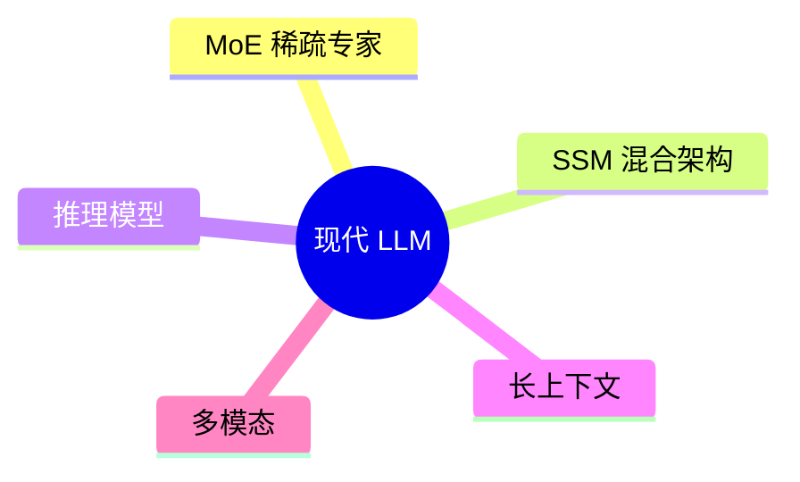

# Ch7 现代 LLM 的关键变体

> 一句话简介：当代模型身上贴着五个标签，每个标签解决一个具体痛点。

## 本章目标

读完本章你应当能：
- 说出当代 SOTA LLM 的五个关键标签（MoE / SSM 混合 / 推理模型 / 长上下文 / 多模态），并用一句话解释每个的动机
- 用一个生活类比解释 MoE 稀疏激活为什么省钱
- 说明 Transformer 在长序列上贵在哪里、SSM 的解法思路
- 说出推理模型"思考更久答更好"背后的训练与推理两种算力
- 用一句话点名 RMSNorm / SwiGLU / RoPE 等现代组件各自替换掉了什么

## 本章导览



全图只讲一件事：当代模型的五个技术标签。7.2-7.4 是架构层（怎么搭），7.5 是训练层（怎么练），7.6-7.7 是能力层（装多少、看什么），7.8 把零件收成一张点名表。五个标签没有先后依赖，赶时间可以挑着读；但 7.2 的 MoE 与 7.4 的混合架构常在同一个模型里同时出现，连着读会有对照之效。

## 7.1 引子：为什么 2023 后的模型"长得不一样"

上一章（Ch6）把上百个模型按**家族和年份**挂上了时间线。这一章换一个视角：不问"它是谁家的"，只看"它身上贴着什么**技术标签**"。2023 年后的前沿模型几乎都贴着五个标签——MoE、SSM 混合、推理模型、长上下文、多模态。每个标签都针对一个具体痛点，没有一个是为贴而贴的装饰。

**手机类比。** 选旗舰手机时你看五个卖点：芯片（更快）、电池（更久）、快充（回血快）、屏幕（更大）、相机（更强）。每个卖点解决一种不满，五个凑齐就是"当代旗舰"——没有人会因为"芯片不是全新品类"就拒绝它。模型的五个标签同理：

| 标签 | 解决的痛点 | 一句话预告 |
|---|---|---|
| MoE 稀疏专家 | **贵** | 参数很多，每个 token 只用一小部分 |
| SSM 混合架构 | **长**（序列一长就慢） | 长序列不再两两互看 |
| 推理模型 | **难**（难题答不准） | 先打草稿再交卷 |
| 长上下文 | **窄**（窗口装不下） | 一次对话装得下一整本书 |
| 多模态 | **单**（只有文字） | 图、文、音统一成 token |

接下来五节把这张表逐行展开；7.8 再补一张"零件点名表"。读完你会发现：这些标签并不神秘，每一个都是对 Part 1 某个具体短板的正面回应——它们不是五场彼此无关的革命，而是同一场工程化的五个侧面。

## 7.2 MoE：稀疏激活的专家

Part 1 已经用医院分诊的比方预告过这个概念（Part 1 参见 3.10）；本节兑现预告，把比方换成算得清的数字。

**直觉先行：不是所有问题都需要全部专家。** 一个 671B 的模型，处理"的"这种字和推导数学题用到的"能力"完全不同；让全部参数为每个 token 全力运转，既浪费也不必要。**混合专家（Mixture of Experts, MoE）** 的做法是：把前馈网络复制成许多份"专家"，每个 token 只请其中最相关的几个出场。

**医院类比（接着 3.10 的比方说完）。** 全院会诊是让 8 个科室全来——又慢又贵；MoE 是分诊台（**路由器 Router**）先看一眼病情，只挂对科室的号。省下的正是"陪诊成本"。

**把比方换成数字。** 一个最小的 2 专家 MoE，每个 token 只激活 1 个专家：

```text
模型总参数 10B = 专家 A（5B）+ 专家 B（5B），每个 token 只走 1 个：
token「cat」    → 路由器打分 [0.9, 0.1] → 走专家 A → 激活 5B
token「42+8」   → 路由器打分 [0.2, 0.8] → 走专家 B → 激活 5B
结论：总参数 10B，任一 token 的计算量却只有 5B
```

工业界把这套配置放大：Mixtral 是 8 选 2，DeepSeek-V3 是"总参数 671B、每 token 只激活 37B"。于是一句话的形式化就有了——**稀疏激活（Sparse Activation）：每个 token 只经过网络的一小部分参数；总参数量和单 token 计算量从此解耦**。模型可以"很大但不贵"。

这个解耦为什么重要？因为模型的"知识容量"大致随总参数涨，而你的 API 账单只跟激活参数（计算量）走。以前这两个数被焊死在一起：要更多知识就得付更多计算。MoE 把焊点撬开了——这正是它从 2021 年的论文一路变成 2025 年旗舰标配的原因。路由器怎么训、专家负载怎么均衡，属于训练细节，本章不展开（留给有兴趣的读者读原文）。

四代代表一行一个，只需记住"稀疏激活从论文走向了旗舰标配"：

| 工作 | 年份 | 一句话 |
|---|---|---|
| [Switch Transformer](https://arxiv.org/abs/2101.03961) | 2021 | 奠基：证明稀疏 MoE 能扩到万亿参数规模 |
| [Mixtral of Experts](https://arxiv.org/abs/2401.04088) | 2024 | 8 专家选 2，总参数 47B、激活仅 13B，开源可用 |
| DeepSeek-V3 | 2024.12 | 671B 总参数、37B 激活，把旗舰成本打下来 |
| Qwen3 MoE | 2025 | 代表型号 Qwen3-235B-A22B：235B 总参数、22B 激活 |

## 7.3 SSM 与 Mamba：不走寻常路的长序列

MoE 治"贵"，这一节治"长"。**回顾 Part 1 的一笔账（参见 3.2）**：attention 让每个 token 和前面所有 token 两两打一遍分——序列长度翻倍，打分次数翻四倍。读 8 千字的文章还好，读 80 万字的代码库，这套"两两互看"就撑不住了。

**便签纸类比。** 读书时你有两种记笔记的方式：一种是每读一句就翻回去和前面每一句再核对一遍（attention）；另一种是只维护**一页便签**——新读到的内容来了，就着旧便签滚动更新，永远只带着最相关的几条往下走。**状态空间模型（State Space Model, SSM）** 就是第二种：固定大小的状态像便签一样沿序列滚动，无论读多长，每一步只携带这一页。

**视觉化。** SSM 的每一步只做三件事：

```text
t=1:  输入 x1                 → 状态 h1 → 输出 y1
t=2:  输入 x2 + 旧状态 h1     → 状态 h2 → 输出 y2
t=3:  输入 x3 + 旧状态 h2     → 状态 h3 → 输出 y3
……  便签大小恒定，序列翻倍 → 每步计算只翻一倍（attention 要翻四倍）
```

代价也很直觉：便签只有一张，太旧、太细的信息会被滚动时盖掉——这个短板 7.4 解决。把两条路线的成本曲线画出来，差别一目了然：

```text
序列长度   ×2      ×4      ×8      ×16
attention  计算×4   计算×16  计算×64  计算×256   （两两互看，平方增长）
SSM        计算×2   计算×4   计算×8   计算×16    （便签滚动，线性增长）
```

**Mamba（2023.12，Albert Gu & Tri Dao）** 是这一思路的成名作：[Mamba: Linear-Time Sequence Modeling with Selective State Spaces](https://arxiv.org/abs/2312.00752)。它的关键改进一句话——让状态**学会选择**：当前 token 相关的信息写进去，无关的忘掉（"选择性"由此得名）。论文报告其推理吞吐约为同规模 Transformer 的 5 倍，且 3B 规模打平了两倍参数的 Transformer。Mamba 之后，"用固定状态换单步便宜"成了与 attention 并列的第二条赛道——但纯 SSM 并没有赢下全场，原因就在下一节。

## 7.4 混合架构：Attention 遇见 SSM

上一节结尾留了个短板：便签再省也记不住细节。你现在就能造出它的失败案例——把一本书塞给纯 SSM 模型，问它"第 3 页第 2 行写了啥"，它多半答不上：那行字早在滚动更新里被盖掉了。**attention 恰好相反**：每步都能回到任意位置精读，唯独怕长。一个记得牢但贵，一个跑得快但健忘。

于是当前的共识是——**混合（Hybrid）**：多数层用 SSM 负责线性扫读，少数层穿插 attention 负责"随时回翻原文"。**混合不是骑墙，是各取所长。** 类比读厚书：90% 的时间在快速翻页（SSM），遇到要精读的段落才停下来逐字核对（attention）。一个典型的层堆叠长这样：

```text
… → SSM → SSM → SSM → SSM → SSM → SSM → SSM → attention → SSM → …
     └────────── 多数层：线性扫读，便宜 ──────────┘   └─ 少数层：全局精读 ─┘
```

2024 年起的三个代表，一行一个（配比数字均取自各篇原文）：

| 模型 | 团队 / 时间 | 架构一句话 |
|---|---|---|
| [Jamba](https://arxiv.org/abs/2403.19887) | AI21，2024.03 | 首个开源混合体；实验得出的甜点区约 **1 个 attention 配 5-7 个 SSM 层**（默认 1:7） |
| [Nemotron-H](https://arxiv.org/abs/2504.03624) | NVIDIA，2025.04 | 8B 型号 52 层中**只有 4 层是 attention**（约 8%），其余为 Mamba-2 与前馈层 |
| [Falcon-H1](https://arxiv.org/abs/2507.22448) | TII，2025.07 | 换了个接法：每层内 SSM 与 attention **并联**同时算再相加，而非前后排队 |

三家接法不同，方向一致：attention 少而精，SSM 多而快。2025 年后"纯 Transformer"与"纯 SSM"的争论基本收敛到混合路线——架构之争从"谁取代谁"变成了"怎么配比"。这也是为什么 7.2 的 MoE 几乎总和本节的混合同时出现：它们治的是不同的病，一个治成本，一个治序列长度。

## 7.5 推理模型：思考更久，答得更好

前面治的都是"身体"（架构与窗口），这一节治"头脑"。Part 1 已建立核心类比（参见 5.8）：传统 LLM 是**抢答选手**，推理模型是**打草稿选手**——先长考，再交卷。本节只补两件事：这条赛道的时间线，以及它背后的两笔算力账。

**时间线**（日期均取自官方发布）：OpenAI **o1**（2024.09）打响第一枪 → **o3**（2024.12 预览）跟进 → **DeepSeek-R1**（2025.01）把推理模型以开放权重发布 → **Qwen3**（2025.04）把"思考与否"做成用户可切换的开关。一年半之内，"会打草稿"从独家卖点变成了开源标配。

**震撼数据。** [OpenAI 官方公布](https://openai.com/index/learning-to-reason-with-llms/)：o1 在 AIME 2024 数学竞赛上拿到**约 74%**，而同门的 GPT-4o 只有**约 12%**——同一量级的底座，补上"学会思考"的训练后，难题得分翻了六倍。这组数字 5.8 见过，这里是它的意义：**答不好难题不是参数不够，是没学过"想"**。DeepSeek-R1 更把整套做法以开放权重发布，让任何人都能在自己的显卡上跑"会打草稿的模型"——推理能力从此不再是闭源专属。

**两笔算力账。** 推理模型把成本从训练侧挪了一部分到每次调用侧，两张面孔要看清：

| 维度 | 训练时算力 | 推理时算力 |
|---|---|---|
| 花在哪 | 用强化学习 + 过程奖励，**练出**"先想后答"的习惯 | 每次回答**多生成**几千个思考 token |
| 支出特点 | 一次性投入，沉淀进权重 | 每问一次付一次，响应更慢也更贵 |

值得强调的是，两笔账**缺一不可**：没有训练侧的投入，模型多生成的只是废话（打草稿的习惯是练出来的，不是提示出来的）；没有推理侧的放任，训练出的能力也发挥不出来。同一份能力，在不同题目上"想多久"还不一样——AIME 难题上 o1 平均生成数千个思考 token，简单问答则几乎不犹豫。这解释了推理模型的商业模式：训练贵、单次调用也贵，所以难题（数学、代码、规划）用它，闲聊用普通模型——如何按任务路由算力，是 Part 4 harness 的正经话题。

## 7.6 长上下文与 KV cache

第五个标签从需求侧说起：用户不想"上传第 3 章再问第 3 章"，想**把一整本书塞进一次对话**，然后随口问"作者在哪一章改过口风？"。窗口（Context Window）因此一路抬升：

| 时间 | 代表模型 | 窗口 |
|---|---|---|
| 2023.03 | GPT-4 | 8K（另有 32K 版） |
| 2023.07 | Claude 2 | 100K |
| 2023.11 | GPT-4 Turbo | 128K |
| 2024.02 | Gemini 1.5 Pro | 1M |
| 2025.04 | GPT-4.1 | 1M |

两年从 8K 到 1M，放大了约 125 倍。**但窗口写在宣传页上，账单落在显存里。** 为什么长了就贵？回看 Part 1 的 KV cache（参见 3.8）：自回归生成时，每个历史 token 的 K/V 都要存下来复用——**会议室白板类比**：白板是全员共用的草稿纸，每来一位参会者（新 token），都得在白板上添自己那块地；人越多，白板越大，而且**谁都不能擦**（下一位参会者可能要引用任何一块内容）。上下文从 4K 涨到 1M，就是会议室从 4 人变成 1000 人——KV cache 的显存占用随窗口**线性膨胀**，很快赶上模型权重本身。

先算一笔具体的账（算法沿用 Part 1 3.8 的估算）：32 层、每层 8 组 KV 头的模型，40K 上下文的 cache 约 5GB；推到 100K 就是十几 GB 量级——和一个 7B 模型的权重（fp16 约 14GB）相当。这就是"窗口标 1M、你却未必用得起 1M"的原因。

工程上的缓解手段一句带过，不展开：**GQA / MQA**（多头共享 K/V，直接砍 cache 体积，Part 1 参见 3.8）、**KV 量化**（把存的那份算得糙一点、占得小一点）、**稀疏 attention**（读长文时只精读关键部分，Ch6 介绍 DeepSeek 时见过，参见 6.7）。这些是"模型侧"的止痛药；真正把长文本用好的系统功夫——检索、裁剪、分层记忆——属于上下文工程，Part 4 再会。窗口的竞赛也给了我们本章第一条完整因果链：**需求要长 → KV cache 贵 → 稀疏化与共享是止痛药 → 系统层分治才是根治**。

## 7.7 多模态原生化

最后一个标签治"单"。现实世界的输入从来不只有文字：截图、表格、录音、视频。只吃文本的模型面对一张报错截图，得先靠人把它转述成文字——转述这一步，信息已经丢了。Part 1 已铺过两条路线的轨（参见 5.9），这里只讲这条轨的方向变了——从"拼接"走向"**原生**"。

**两路线，一张表回顾 + 一个趋势**：

```text
路线一 CLIP-style（拼接）              路线二 Native（原生）
图像 → 视觉编码器 → 投影层 → LLM      图/文/音 → 统一 token 化 → 一个 Transformer
先各训各的，再焊起来                   从预训练起就混在一起学
代表：LLaVA、Qwen-VL                  代表：GPT-4o、Gemini
```

2024 年 5 月的 [GPT-4o](https://openai.com/index/hello-gpt-4o/) 是"原生"的旗手：文本、视觉、音频由**同一个模型端到端处理**，不再有可见的拼接缝；Google 的 Gemini 同样按"从预训练起就多模态"来定位自己。趋势很清楚：路线一胜在便宜、模块化，路线二胜在**跨模态的直觉**——图里文字和口头解说的关联，焊上去的两块零件很难学会，一体训练的模型才会。一个试金石问题："这张截图里圈红的那个按钮，对应我刚才说的哪一步操作？"它同时考验看图、听话和对齐三件事，原生模型答起来明显更稳。

挑战依旧，一句话点名即可：**跨模态语义对齐**（同一个东西在图里、话里、字里叫法不同）、**细粒度理解**（图表里第几行的数字）、**长视频**（时空 token 数量爆炸）。多模态的两轨之争 5.9 已铺过（参见 5.9），本章只负责贴标签：**这个模型能看、能听、能说**——具体怎么做到，不再展开。

## 7.8 现代组件一句话点名

五个标签讲完，还剩一桌零件。你在技术报告里会反复撞见这些名字——**只需要记住名字和一句话动机，实现细节 Part 2 不展开**（其中位置编码一族 Part 1 已讲，参见 3.5）：

| 组件 | 它替换 / 解决了什么 |
|---|---|
| **RMSNorm** | 替换 LayerNorm：去掉均值中心、只做缩放——训练更稳、算得更快 |
| **SwiGLU** | 替换 ReLU：带"门"的激活函数，输入自己决定放行多少 |
| **RoPE** | 位置编码主流方案：用旋转编码相对位置，天然支持长度外推（Part 1 参见 3.5） |
| **ALiBi** | 给 attention 打分加"距离罚分"——离得越远分越低，换长上下文泛化 |
| **YaRN** | RoPE 的"窗口拉伸术"：微调位置编码，把 4K 训练的模型扩到更长窗口 |

为什么把它们叫"零件"而不是"标签"？因为五个标签回答的是"这个模型**是什么样的**"，零件回答的是"它**由什么拼成**"——读技术报告时，前者是规格表的大标题，后者是小标题下的型号。把它们和五个标签放在一起，就是一张完整的"2026 年模型规格表"：MoE 决定多少钱，SSM 混合决定多长的序列跑多快，推理模型决定难题答多好，长上下文决定窗口多大，多模态决定能看什么，这一桌零件决定训练和推理的边角效率。**规格表上的每一行，都是 Part 1 某个原理的工程回响**——这就是本章和 Ch6 的分工：Ch6 按家族排"谁是谁"，本章按标签排"为什么"。

## 本章小结

- 当代 SOTA 模型贴着五个标签：**MoE**（治贵——总参数大、单 token 激活少）、**SSM 混合**（治长——线性扫读配少量精读）、**推理模型**（治难——训练时学会打草稿）、**长上下文**（治窄——窗口从 8K 抬到 1M）、**多模态**（治单——图文物音统一成 token）。
- MoE 的核心是**稀疏激活**：医院分诊只挂对科室，每个 token 只走一小部分参数——总参数量与计算量从此解耦。
- attention 序列翻倍、计算翻四倍；SSM 用一页恒定大小的"便签"换线性成本，代价是记不住细节——所以共识是**混合**，不是二选一。
- 推理模型有两笔算力账：训练时用强化学习**练出**思考，推理时每次回答**多花**思考 token——难题值这个价，闲聊不值。
- KV cache 是"谁都不能擦的白板"：窗口越大、显存越贵；GQA、KV 量化、稀疏 attention 是模型侧止痛药，系统侧功夫 Part 4 见。
- 贴着这五个标签的模型，就是 2026 年你调用的那些 API——规格表不同，底层都是 Part 1 讲过的那些原理。下次看到新模型发布稿，先别急着记名字，先看它身上贴了哪几张标签、各自治的是哪个痛点。

## 本章参考

### 必读论文
- [Switch Transformers: Scaling to Trillion Parameter Models with Simple and Efficient Sparsity (Fedus et al., 2021)](https://arxiv.org/abs/2101.03961)
- [Mixtral of Experts (2024)](https://arxiv.org/abs/2401.04088)
- [Mamba: Linear-Time Sequence Modeling with Selective State Spaces (2023)](https://arxiv.org/abs/2312.00752)
- [Jamba: A Hybrid Transformer-Mamba Language Model (2024)](https://arxiv.org/abs/2403.19887)
- [DeepSeek-R1: Incentivizing Reasoning Capability in LLMs via Reinforcement Learning (2025)](https://arxiv.org/abs/2501.12948)

### 推荐博客 / 教程
- [The Illustrated Transformer (Alammar)](https://jalammar.github.io/illustrated-transformer/) —— 复习用

### 视频 / 课程
- [Andrej Karpathy - Let's build GPT](https://www.youtube.com/watch?v=kCc8FmEb1nY)
