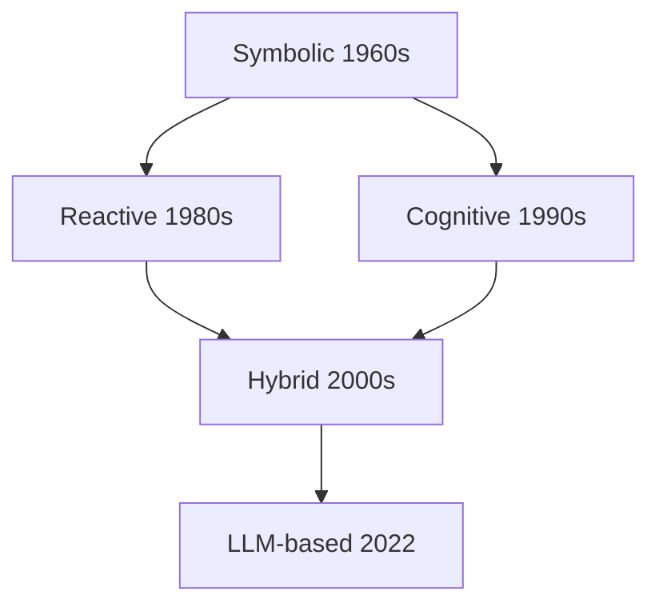

# Ch8 Agent 五十年演进

> 一句话简介：Agent 不是 2023 年的发明，它有 50 年的思想积淀。

## 本章目标

读完本章你应当能：
- 说出 Agent 演进的四个阶段及每阶段的代表工作（各一句话）
- 复述 Agent 的工作定义（自主性 / 反应性 / 主动性 / 社会性），并为每个性质举一个生活例子
- 解释 Symbolic 与 Reactive 两派的核心分歧（"先想后做" vs "先做后想"）
- 用一句话说明为什么 2022 年后 Agent 范式被 LLM-based 统治
- 指出四条路线留下的、至今仍在当代 Agent 设计中出现的通用模式（perception / memory / planning / action）

## 本章导览



这张图现在的身份是**回顾图**，不是讲课：它只把五十年排了个序，方块里的名词还没讲，看不懂是正常的。全图就一件事——四波浪潮：1960s 的 Symbolic 开局，1980s 的 Reactive 反叛，1990s 的 Cognitive 回摆，2022 年 LLM-based 登场；多出的 Hybrid 方块不是第五波，而是 Reactive 与 Cognitive 两支合流出的桥梁（见 8.6），它直接托起了 LLM-based。它的正确用法在 8.8：读到那里再回来对照，每个方块你都应能补上年份、代表工作和一句话贡献——首次讲解一律在正文里完成，图只负责收束。

本章的读法：8.2 先立一个经得起推敲的工作定义，8.3-8.5 按前三波浪潮各走一节，8.6 看合流，8.7 定位 LLM 一代，8.8 把四代连成一个故事收尾。赶时间可以只读三处——8.2 的四性质表、8.4 的"先想后做 vs 先做后想"、8.7 的"为什么是 LLM 赢了"。

## 8.1 引子：Agent 不是一个新词

本章的主角，一句白话说得完：**它不光会回答，还能自己查、自己动手，把整件事从头办到尾**。打个比方，它像一个私人助理——你说"订周五去上海最便宜的机票"，他查航班、比价格、下订单，最后把行程发到你邮箱。身边的小例子对照着看更清楚：聊天机器人最多吐给你一张景点清单；本章说的这种程序会查车次、比酒店价，把一份完整行程单送进你的邮箱。中文里它有个译名叫**智能体（Agent）**，两种叫法指同一个东西，下文统一写 Agent。

"Agent"这个词在计算机科学里出现得比多数人想象的早得多。它的本义是"代理人"——替别人做事的人；这个词义五十年没变，变的是"替你做事"的那颗大脑。1960 年代，美国 SRI 国际研究所已经做出 Shaky 移动机器人——Nils Nilsson 是项目负责人之一——它能接收一句高级指令，自己拆解成一串动作、边看边走边调整。所以当 2023 年的媒体把 Agent 说成"划时代新物种"时，圈内人看到的其实是同一个词的又一次换装。

类比"黑客"这个词的旅程：1960 年代的"黑客"指痴迷技术、以巧取胜的程序员，今天的大众语境里它常指入侵系统的人——词的拼写没变，指的东西却漂移了半个多世纪。Agent 也一样：从 1960 年代的"会自己干活的程序"，到 2026 年"会用工具、会拆任务的 LLM 系统"，中间隔着五十年的重新定义。本章要回答的核心问题就是：**这个词一路变成了什么意思**。

Ch6 和 Ch7 的视角是"模型"——单个模型本身怎么演进。本章切换到"Agent"视角：不再问模型多大、怎么训练，而是问一个**能自己感知环境、自己决策、自己采取行动的系统**，历史上被设计成了哪几种样子，以及为什么最后长成了今天这个样子。先把话说在前面：本章不给各代排"历史功过"，只回答三个朴素问题——**每一代想解决什么、代价是什么、留下了什么**。带着这三问往下读，五十个年份也不会记混。

## 8.2 Agent 的工作定义

写代码的人第一次接触 Agent，往往觉得这个词被用得太滥了——脚本、爬虫、聊天机器人都被叫过 Agent。各说各话的直接后果是：没有一把公共的尺子，甲说的 Agent 和乙说的 Agent 完全不是一回事。1995 年，Wooldridge 与 Jennings 在经典综述 [《Intelligent Agents: Theory and Practice》](https://doi.org/10.1017/S0269888900008122) 里给出了解法：它没给数学公式，而是给出一份"四性质"清单——一个系统要被认真当作 Agent 对待，应当同时具备下面四种表现。这份清单的价值在于给各家自说自话的系统立了同一把尺子：四条缺一，就还只是工具；四条齐了，才有资格谈"自主协作"。先看四个生活瞬间，再记术语：

- **例子**：空调感知室温、自动调温，全程不用你按遥控——这是**自主性（Autonomy）**。反例：每一步都等人发指令的机器，只是遥控玩具。
- **例子**：杯子从桌沿滑落，手先伸出去接住，而不是先开个会讨论——这是**反应性（Reactivity）**。反例：感知到杯子在掉，却先跑完一整套推理才动，杯子早碎了。
- **例子**：天阴下来，没人问你，你主动把伞带上了——这是**主动性（Pro-activeness）**。反例：只在被问"要不要带伞"时才作答，永远慢半拍。
- **例子**：球场上队员彼此传球、补位，而不是各自闷头带球——这是**社会性（Social Ability）**。反例：每个队员拿到球就自己射门，从不传给位置更好的同伴。

收成一张小表，方便日后当检查表用：

| 性质 | 生活例子 |
|---|---|
| 自主性 Autonomy | 空调自动调温，不等遥控器 |
| 反应性 Reactivity | 接住掉落的杯子 |
| 主动性 Pro-activeness | 看天阴主动带伞 |
| 社会性 Social Ability | 团队分工传球 |

这四条会一直陪我们走到书末：以后评估任何一个 Agent 产品——是否不用人盯着（自主）、出事反应够不够快（反应）、会不会自己找活干（主动）、能不能和其他系统配合（社会）——都可以拿这四行当尺子。四条同时满足并不容易：很多系统反应很快却不自主（背后有人盯着），有些足够自主却毫无社会性（拒绝与人协作）。本节一句话复述：**一个能自主、能快速反应、会主动找事、能与人和其他系统协作的系统，就是 Agent。** 记住四个例子，比记住四个英文词更重要。

## 8.3 Symbolic Agents：规则与逻辑的辉煌

1950 年代到 1970 年代，这条路线面对一个具体的难题：机器要做的是"动脑的活"——证明数学题、继承老医生的经验——可"知识怎么装进机器"还没有共识。当时的主流信念给出的答案朴素得像做饭：**把世界写成符号，把知识写成规则，再照着逻辑一步步推**。这里说的"符号"，就是被写成文字或数字的标签，比如"红色""发烧""病人"；规则则是印死的条文。这条路线后来被叫作**符号主义（Symbolic）**。类比一本写死的食谱：什么材料、什么火候，全部事先印好，厨师要做的只是严格执行。也像公司墙上挂的流程图：每个分支都标死了走向，唯独没有"遇到没标的情况怎么办"这一格。

他们先挑最"动脑"的一件活试水：让机器自己做数学证明。1956 年，Newell、Simon 与 Shaw 合作写出 [Logic Theorist](https://en.wikipedia.org/wiki/Logic_Theorist)，它证出了《数学原理》第二章 52 条定理中的 38 条，还找到了一条比书上更短的证法。为什么这段史要从它讲起？因为读懂题目、自己推步骤、交出证明——一整件智力活从头接到尾，中间没有让人代劳，这正是"会自己干活的程序"最早的模样。顺着这条路，同一批人 1957 年做出 [General Problem Solver（GPS，通用问题求解器）](https://en.wikipedia.org/wiki/General_Problem_Solver)：一套"把大问题不断拆成小问题"的通用招数，行话叫手段-目的分析（means-ends analysis），梦想一个程序包打天下。

到了 1970 年，[SHRDLU](https://en.wikipedia.org/wiki/SHRDLU) 把舞台推到日常语言：你可以用英文命令它"把红色方块摞到绿色立方体上"，它照做、还会解释自己为什么这么做。当年的学界几乎确信：自然语言理解马上就要解决了。同一时期，斯坦福的 [MYCIN](https://en.wikipedia.org/wiki/Mycin) 把医诊断成了规则游戏——把医生的诊断经验写成几百条"如果…就…"规则（if-then 规则），按规则向病人提问，诊断血液感染并推荐抗生素，测试中表现接近专科医生的水平。辉煌是真的：这些系统在**限定领域**里表现出色；把专家经验写成规则的这类程序统称**专家系统（Expert Systems）**，产业在 1980 年代一度红极一时——各行各业争相把老师傅的经验一条条写进规则库，卖给企业当"电子专家"。

局限也是真的：所有知识都靠人手工写进规则，而现实从不按剧本走——换一家医院、换一个厨房，食谱里的配料对不上号，整个系统当场瘫痪。MYCIN 只会回答规则库里写过的问题：你若问它别的病，它连问题都听不懂——**规则之外，一无所知，且不知道自己不知道**。这个毛病后来有了专名：**脆弱性（Brittleness）**——规则覆盖到的地方聪明绝顶，覆盖不到的地方一错到底。更麻烦的是，越是有用的专家系统，规则库膨胀得越快、越没人敢改——脆弱性随规模恶化，而不是随投入好转。Symbolic 的脆弱，直接催生了下一节的反叛。

## 8.4 Reactive Agents：不思考，直接反应

1991 年，MIT 的 Rodney Brooks 抛出一个问题，当时听来十分挑衅：机器人非得先在脑中画好一张地图，才能在屋里走路吗？他的答案是：不必。先把他话里那张"地图"讲透：**先把世界在脑内整理成一份档案，再基于档案慢慢推理**——类比出行时先在纸上画好路线、算好换乘再出门。旧式机器人正是这么干的：先建一张房间地图，再规划一条路径，然后才挪步；Brooks 的机器人则走到路口看一眼，该拐就拐，脑中不留任何地图。行话把这张"脑内地图"叫作**表示（representation）**。他把这一主张写成了《[Intelligence Without Representation](https://doi.org/10.1016/0004-3702(91)90053-M)》——标题里那个 Representation，说的正是刚讲的这张地图。

具体怎么做到"不留地图"？他 1986 年就给出了做法：把机器人的控制拆成多层简单行为，各层并行运行，高层可以在关键时刻截胡低层的输出——这套做法叫**层叠架构（Subsumption Architecture）**：

```text
[上层] 躲障碍  ── 传感器报告危险时接管移动，压制下层
[底层] 乱  走  ── 没有危险就朝随机方向探索

两层始终同时在跑；高层"截胡"低层，这就是层叠（Subsumption）的本意
```

类比蟑螂：它脑中没有街道地图，却能绕过拖鞋、穿缝逃生——靠的是"撞到就转向、有威胁就躲开"这类贴地反应，而不是先在脑内规划一条最优逃跑路线。Brooks 的机器人正是这样在堆满杂物的办公室里长期存活的。**先做后想，甚至只做不想**——环境本身就是最好的计算器，行动的后果会直接反馈给下一轮感知。Brooks 的批评还有一层：Symbolic 机器人的"想"太慢了，每一步都要先在机房里推理半天才轮得到执行；而现实里的障碍物可不等人。把"想"从关键路径上摘下来，机器人才有资格生活在真实时间里。

与 Symbolic 的分歧一句话就能说清：**先想后做，还是先做后想？** Symbolic 说：先把世界看清楚、想出完整计划，再动手（think, then act）；Reactive 说：别想了，智能直接体现在动作里（act first）。这场争执各有代价：先想后换来的是 Symbolic 的脆弱，先做后换来的是 Reactive 的短视——蟑螂再灵活，也不会制定周密的觅食计划，更不会为了三个月后的冬天储存粮食。两派谁也说服不了谁：封闭、变化少的环境（棋盘、诊断）站在 Symbolic 一边，开放、变化快的环境（走廊、地板）站在 Reactive 一边，僵局持续到了 1990 年代。值得一提的是 Brooks 后来自己也补了一刀：他说的其实是不需要"传统意义的表示"，而不是字面上的一切内部状态——这场争论的分寸，连发起人本人都要反复校准。

## 8.5 Cognitive Agents：BDI 与心智模型

两派吵到 1990 年代，墙都已看得见：纯规则太脆，出了剧本就崩；纯反应太鲁，永远不会为三个月后的冬天存粮。于是第三条路浮出水面——既然人自己做决策又稳又有章法，那就**把人做决策的方式做成模型**。这条路线叫**认知（Cognitive）**路线；它最有代表性的成果，用一个生活例子就能讲明白。

先看例子：你打算赴一个约。你知道地铁末班车 23 点发出（对世界的了解），你希望准时出现在对方面前（想达成的目标），权衡之后拍板"现在就下楼去坐地铁"（已决定执行的具体计划）。三样分开记就是：**它相信什么、它想要什么、它决定做什么**——分别叫**信念（Belief）**、**愿望（Desire）**、**意图（Intention）**，随时按新情况更新。三样合起来，就是**信念-愿望-意图（Belief-Desire-Intention，BDI）模型**。关键是后两者的区别：愿望可以同时有很多个——打车去、明天改约、干脆不去了都算愿望；意图只留那个真正拍板要做的，并且此后按它行动，直到情况变化迫使你重新掂量。

BDI Agent 按下面这个循环不停运转：

```text
感知 → 更新信念 → 愿望过滤 → 意图形成 → 规划 → 行动
  ▲                                                    │
  └────────────── 环境因行动而改变 ◀───────────────────┘
```

把约会的例子放进这个循环走一遍：你"感知"到时间不多了 → 信念更新（末班车 23 点）→ 愿望过滤（准时到达压过省钱）→ 意图形成（就坐地铁）→ 规划（下楼、买票、坐到某站）→ 行动；若坐过了一站，环境给出新反馈，回到感知重来。循环每转一圈，意图都可能被重新掂量——这正是 BDI 比写死规则灵活的地方。

同一时期还有两条心智建模路线，各用一句话认识即可。SOAR（Laird、Newell 与 Rosenbloom，1987）是一台目标驱动的通用解题机器：解题时不断攒下经验规则，越用越熟。ACT-R（Anderson，1993）来自认知心理学，它用的零件叫**产生式规则**——就是 8.3 那种"如果…就…"的小规则，前一条的结论可以触发下一条，比如"如果发烧且白细胞高，就建议做血培养"。两者本是认知科学的实验工具，却顺手为后来的 Agent 研究提供了一份现成的模块清单——Part 3 讲认知架构时，这些模块还会回来。

BDI、SOAR、ACT-R 的共同点是：Agent 内部第一次有了**结构化的内心世界**——这是对反应派"不画地图"主张的直接拨乱反正。但代价也很眼熟：每一块心智组件仍然是人设计、人写死的，结构一换，工程就得推倒重来。这套区分今天读来依然犀利：给 Agent 派任务时，"它想要什么"（愿望）和"它当前拍板执行哪一步"（意图）分开管理，才不会一次塞给它二十个目标、看着它原地打转。

## 8.6 混合架构：分层各司其职

两派吵到白热化时，有人干脆不站队：不再二选一，而是把两派**叠起来用**——这就是**混合架构（Hybrid Architecture）**。代表作虽诞生于 1990 年代初，这条路线的定型与流行贯穿了其后整个十年。顺手先立一块路牌防撞车：Ch7 7.4 也叫"混合架构"，混的却是**模型结构**（SSM×attention，快扫加精读两层读法，参见 7.4）；本章混的是 **Agent 的行为速度**——不经思考的快反应，加上慢条斯理的规划。名字相同，东西两样。

类比开车：规划"走哪条路上高架"是慢思考，出发前做一次就够；但迎面窜出一辆车时，你打方向盘躲避并不经过任何完整规划——那是快反应。混合架构要做的，就是把这两种速度装进同一个机器人。

两支开路之作各自回应了一个具体的丢脸现场。纯反应的机器人（8.4）在需要"中途改主意"的任务前当场抓狂——它脑中没有地方存放"我原本打算干什么"；全靠慢思考的系统（8.5）又会把"想"放在关键路径上，等推理完，障碍物早到眼前。TouringMachines（Ferguson，1992）的解法是让反应层、建模层、规划层三线并行，都接传感器、都能发指令，谁更着急谁先动；InteRRaP（Müller 与 Pischel，1993）则让行为层管保命、知识层管任务，系统按当前情境把控制权交给合适的那一层。

分工原则一句话：**底层 reactive 保命，上层审慎（deliberative）规划**——平时小事交给快的底层，只有难啃的任务才值得启动慢的上层。两套系统殊途同归地承认了同一件事：反应与规划不是二选一，而是不同时间尺度上的两件正经事。回头看，Symbolic 的长处归了上层，Reactive 的长处归了底层：争吵最凶的两派，其实在同一栋楼里住了上下两层。这个"快慢分层"模式并没有过时：今天 Agent 工程里"即时响应的工具调用 + 后台的长程规划"就是它的直系后代（这层展开是 Part 4 的主题）。混合架构也是通往 LLM-based 的直接桥梁：它证明没有任何一派能独吞智能，缺的只是一个能把"想"和"做"无缝接进同一个循环的引擎——2022 年，这个引擎出现了。

## 8.7 LLM-based Agents：LLM 当大脑

2022 年 10 月，[ReAct](https://arxiv.org/abs/2210.03629)（Yao 等人）给一件老事配上了新配方。循环说穿了就一句话：**每步先写下想法，再动手查一件事，再把查到的写回来，一圈圈转**——类比侦探破案：写下推理→出门查访→把线索记进本子→修正推理→再去查。落到具体一步："需要知道巴黎人口"（想）→ 搜索（做）→ 记下 210 万（看）→"接下来算两倍"（再想）。三个位置的行话是**思考（Thought）→ 行动（Action）→ 观察（Observation）**。循环本身并不复杂，真正的变化在循环里当"大脑"的那位：以前是人手写的一条条规则，这一次换成了一个读过海量文字、自己练出语感的大模型——Ch6、Ch7 的主角。

三个月内，一整波工作涌了出来：

| 时间 | 工作 | 一句话 |
|---|---|---|
| 2022.10 | [ReAct](https://arxiv.org/abs/2210.03629) | 把"思考-行动-观察"固化成通用循环 |
| 2023.02 | [Toolformer](https://arxiv.org/abs/2302.04761) | 让模型学会在需要时调用计算器、搜索等工具 |
| 2023.03 | AutoGPT | 给一个目标就自主拆任务去执行，把 Agent 现象级地推给大众 |
| 2023.03 | [Reflexion](https://arxiv.org/abs/2303.11366) | 失败后用自然语言自我批评，下一轮改进行动 |
| 2023.03 | BabyAGI | 任务列表自动生成、执行、再生成的极简循环 |

表里 ReAct 与 Reflexion 定下的循环影响最深——后来几乎所有 Agent 产品里一圈圈转的，都是"想一步、做一步、看一步"这个节奏。AutoGPT 与 BabyAGI 则更像现象级 demo：给 AutoGPT 一句"帮我做个网站"，它自己列出任务清单、开始写文件、反复检查一处并不存在的进度，一圈又一圈地打转，到头来网站还是没影——真实需求是真需求，可纯自主循环的不稳也被它暴露给了所有人。顺带一提时间线上的巧合：ReAct 上线时 ChatGPT 还没发布；不到两个月后 ChatGPT 引爆全球，现成的"通用大脑"叠上现成的循环，Agent 便从论文走进了产品。

为什么偏偏是 LLM 赢了？回看前四代，它们其实卡在同一个位置：**表示与规划都得人来写**。Symbolic 的规则是人手写的；Reactive 干脆把表示砍掉；BDI 的心智组件是人设计的；混合架构的分层是人配置的——每换一个领域，就得重写一遍"世界怎么表示、计划怎么生成"。LLM 把这两件事同时接了过去：**自然语言就是它的通用表示介质**——想法可以写成句子，目标可以拆成步骤，眼前上下文就是它的工作记忆。更微妙的是，自然语言天生可组合：把"查航班"的中间思考写下来、贴回上下文，下一步就能接着用——等于把纸笔直接递给了循环本身。写死的世界模型只能应对写死的场景，而"帮我查周五去上海最便宜的机票"这种目标，LLM 读到就能现场拆解成查询、比较、下单，不需要任何人预先为它建模。一句话回答本节标题：**前四代把智能的两个核心难题（表示、规划）做成了手写零件，LLM 让自然语言同时兼任了两者，第一次不必为每个领域重造一轮。**

需要说清楚边界：ReAct、Reflexion 这些循环**具体怎么实现、怎么训练**，是 Part 3 的主题（见 Part 3 Ch12）；本章只标注它们的历史位置——在五十年演进中，它们是第四波浪潮的开幕，把此前三代的争论收进了同一个循环里。

## 8.8 五十年演进全景

把四代连成一个故事，比任何总表都好记。**开头**，人们把知识全写成白纸黑字的规则，机器照着推：从证定理的 Logic Theorist 到看病的 MYCIN，限定领域里聪明绝顶；可现实一脱稿就露怯，规则没写到的地方它连问题都听不懂——8.3 那堵墙。**被墙逼急了**，有人让机器人不画地图直接跑：躲障碍是真快，却永远不会为冬天存粮——8.4 的代价。**两派都有理**，于是有人把"打算干什么"重新装回机器人心里，边更新了解、边掂量目标、边拍板执行（BDI，8.5）；再进一步，快慢两层干脆住进同一栋楼：底层保命、上层谋划（8.6）。**四代其实卡在同一件事上**：表示与规划总得人来写，每换一个领域就得重写一遍。2022 年，一个读过海量文字的大脑接进了循环，把这两件事一起接了过去（8.7）。

这个故事背后最重要的一句话是：**五十年不是推倒重来，而是原料逐代沉淀**。Symbolic 留下"系统需要记忆与计划"；Reactive 留下"感知到行动必须有一条不经过深思的快速通路"；BDI 留下"意图要分层、还允许中途改主意"；混合架构留下"快慢分工"。把目标里那句"四条路线的通用模式"落到具体位置，今天任何一个 Agent 拆开都是这四味药：

| 通用模式 | 主要出处 | 今天长什么样（例子） |
|---|---|---|
| perception 感知 | Reactive：感知直连行动 | 解析用户输入、工具返回、环境事件 |
| memory 记忆 | Symbolic：知识库 | 对话上下文、检索库、长期记忆 |
| planning 规划 | Symbolic 拆解 + BDI 意图 | 任务拆解、失败反思、计划更新 |
| action 行动 | 混合架构：快慢双通路 | 即时工具调用 + 后台长程步骤 |

LLM 没有淘汰前四代，它只是第一次提供了能把这四味药装进同一个循环的引擎；而"装进循环"的具体设计，是 Part 3 的正题，本章到此收束——先把这四味药的名字记牢，后面两章会反复用到它们。

## 本章小结

- Agent 是 1960 年代就有的老词；五十年走完四波浪潮——Symbolic 写死规则、Reactive 先做后想、Cognitive 用 BDI 建心智模型、LLM-based 让自然语言兼任表示与规划（混合架构是中间的合流站）。
- Agent 的工作定义看四性质：自主性、反应性、主动性、社会性（Wooldridge & Jennings, 1995）；四条至今仍是评估任何 Agent 产品的现成检查表。
- 两派的核心分歧是"先想后做 vs 先做后想"：前者换来脆弱，后者换来短视；LLM 第一次让表示与规划不必人写，两派手法因此得以进入同一个循环。
- 四条路线留下的遗产——perception / memory / planning / action——至今仍是当代 Agent 的四个基本模块，也是 Part 3 认知架构的历史原料。
- "每一代想解决什么、代价是什么、留下了什么"这三问，是读懂后续一切 Agent 设计争论的底层框架。
- 模型（Ch6、Ch7）和 Agent（本章）都齐了，下一章（Ch9）回答：谁来定接口？——MCP 与 A2A 的故事。

## 本章参考

### 必读论文
- [Intelligent Agents: Theory and Practice (Wooldridge & Jennings, 1995)](https://doi.org/10.1017/S0269888900008122)
- [Intelligence Without Representation (Brooks, 1991)](https://doi.org/10.1016/0004-3702(91)90053-M)
- [A Robust Layered Control System for a Mobile Robot (Brooks, 1986)](https://doi.org/10.1109/jra.1986.1087032)
- [ReAct: Synergizing Reasoning and Acting in Language Models (Yao et al., 2022)](https://arxiv.org/abs/2210.03629)
- [Reflexion: Language Agents with Verbal Reinforcement Learning (Shinn et al., 2023)](https://arxiv.org/abs/2303.11366)

### 推荐博客 / 教程
- [Subsumption Architecture（汉堡应用科学大学机器人课程讲义，配状态机图解）](https://autosys.informatik.haw-hamburg.de/codesamples/subsumption-architecture)
- [BDI Agents（GAMA 平台教程，用淘金者例子讲清信念-愿望-意图）](https://gama-platform.org/wiki/BDIAgents_step2)

### 视频 / 课程
- [Rodney Brooks: Robotics | Lex Fridman Podcast #217](https://www.youtube.com/watch?v=nre0QT9LN6w)——层叠架构提出者亲谈机器人与智能五十年
