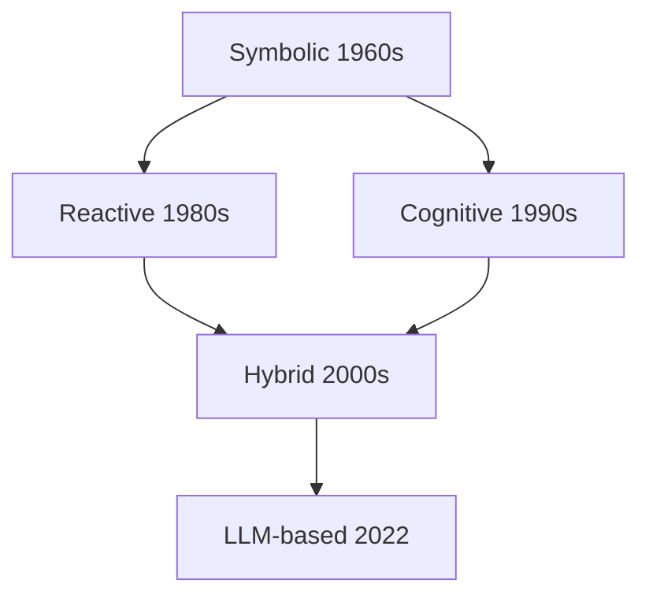

# Ch8 Agent 五十年演进

> 一句话简介：Agent 不是 2023 年的发明，它有 50 年的思想积淀。

## 本章目标

读完本章你应当能：
- 说出 Agent 演进的四个阶段及每阶段的代表工作（各一句话）
- 复述 Agent 的工作定义（自主性 / 反应性 / 主动性 / 社会性），并为每个性质举一个生活例子
- 解释 Symbolic 与 Reactive 两派的核心分歧（"先想后做" vs "先做后想"）
- 用一句话说明为什么 2022 年后 Agent 范式被 LLM-based 统治
- 指出四条路线留下的、至今仍在当代 Agent 设计中出现的通用模式（perception / memory / planning / action）

## 本章导览



全图只讲一件事：Agent 思想五十年的走向。时间上是四波浪潮——1960s 的 Symbolic 开局，1980s 的 Reactive 反叛，1990s 的 Cognitive 回摆，2022 年 LLM-based 登场；图中多出的 Hybrid 方块不是第五波，而是 Reactive 与 Cognitive 两支合流出的桥梁（见 8.6），它直接托起了 LLM-based。读完本章，你应该能在这张图的每个方块旁说出对应年份、代表工作和它的一句话贡献。

本章的读法：8.2 先立一个经得起推敲的工作定义，8.3-8.5 按前三波浪潮各走一节，8.6 看合流，8.7 定位 LLM 一代，8.8 收成总表。赶时间可以只读三处——8.2 的四性质表、8.4 的"先想后做 vs 先做后想"、8.7 的"为什么是 LLM 赢了"。

## 8.1 引子：Agent 不是一个新词

"Agent"这个词在计算机科学里出现得比多数人想象的早得多。它的本义是"代理人"——替别人做事的人；这个词义五十年没变，变的是"替你做事"的那颗大脑。1960 年代，美国 SRI 国际研究所已经做出 Shaky 移动机器人——Nils Nilsson 是项目负责人之一——它能接收一句高级指令，自己拆解成一串动作、边看边走边调整。所以当 2023 年的媒体把 Agent 说成"划时代新物种"时，圈内人看到的其实是同一个词的又一次换装。

类比"黑客"这个词的旅程：1960 年代的"黑客"指痴迷技术、以巧取胜的程序员，今天的大众语境里它常指入侵系统的人——词的拼写没变，指的东西却漂移了半个多世纪。Agent 也一样：从 1960 年代的"会自己干活的程序"，到 2026 年"会用工具、会拆任务的 LLM 系统"，中间隔着五十年的重新定义。本章要回答的核心问题就是：**这个词一路变成了什么意思**。

Ch6 和 Ch7 的视角是"模型"——单个模型本身怎么演进。本章切换到"Agent"视角：不再问模型多大、怎么训练，而是问一个**能自己感知环境、自己决策、自己采取行动的系统**，历史上被设计成了哪几种样子，以及为什么最后长成了今天这个样子。先把话说在前面：本章不给各代排"历史功过"，只回答三个朴素问题——**每一代想解决什么、代价是什么、留下了什么**。带着这三问往下读，五十个年份也不会记混。

## 8.2 Agent 的工作定义

写代码的人第一次接触"Agent"时，往往觉得这个词被用得太滥了——脚本、爬虫、聊天机器人都被叫过 Agent。学术界的锚点是 Wooldridge 与 Jennings 1995 年的经典综述 [《Intelligent Agents: Theory and Practice》](https://doi.org/10.1017/S0269888900008122)：它没给数学公式，而是给出一份"四性质"清单——一个系统要被认真当作 Agent 对待，应当同时具备下面四种表现。这份清单的价值在于给各家自说自话的系统立了同一把尺子：四条缺一，就还只是工具；四条齐了，才有资格谈"自主协作"。先看四个生活瞬间，再记术语：

- **例子**：空调感知室温、自动调温，全程不用你按遥控——这是**自主性（Autonomy）**。反例：每一步都等人发指令的机器，只是遥控玩具。
- **例子**：杯子从桌沿滑落，手先伸出去接住，而不是先开个会讨论——这是**反应性（Reactivity）**。反例：感知到杯子在掉，却先跑完一整套推理才动，杯子早碎了。
- **例子**：天阴下来，没人问你，你主动把伞带上了——这是**主动性（Pro-activeness）**。反例：只在被问"要不要带伞"时才作答，永远慢半拍。
- **例子**：球场上队员彼此传球、补位，而不是各自闷头带球——这是**社会性（Social Ability）**。反例：每个队员拿到球就自己射门，从不传给位置更好的同伴。

收成一张小表，方便日后当检查表用：

| 性质 | 生活例子 |
|---|---|
| 自主性 Autonomy | 空调自动调温，不等遥控器 |
| 反应性 Reactivity | 接住掉落的杯子 |
| 主动性 Pro-activeness | 看天阴主动带伞 |
| 社会性 Social Ability | 团队分工传球 |

这四条会一直陪我们走到书末：以后评估任何一个 Agent 产品——是否不用人盯着（自主）、出事反应够不够快（反应）、会不会自己找活干（主动）、能不能和其他系统配合（社会）——都可以拿这四行当尺子。四条同时满足并不容易：很多系统反应很快却不自主（背后有人盯着），有些足够自主却毫无社会性（拒绝与人协作）。本节一句话复述：**一个能自主、能快速反应、会主动找事、能与人和其他系统协作的系统，就是 Agent。** 记住四个例子，比记住四个英文词更重要。

## 8.3 Symbolic Agents：规则与逻辑的辉煌

1950 年代到 1970 年代的主流信念，一句话就写得完：**智能 = 符号推理（Symbolic Reasoning）**——把世界写成符号，把知识写成规则，再用逻辑推演得出答案。类比一本写死的食谱：什么材料、什么火候，全部事先印好，厨师要做的只是严格执行。也像公司墙上挂的流程图：每个分支都标死了走向，唯独没有"遇到没标的情况怎么办"这一格。这条路线上里程碑个个硬核：

- [Logic Theorist（1956）](https://en.wikipedia.org/wiki/Logic_Theorist)：Newell、Simon 与 Shaw 合作写出的程序，让机器首次做出数学证明——它证出了《数学原理》第二章 52 条定理中的 38 条，还找到了一条比书上更短的证法。
- [General Problem Solver（GPS，1957）](https://en.wikipedia.org/wiki/General_Problem_Solver)：同一批人接着做的"通用问题求解器"，用手段-目的分析（means-ends analysis）把大问题不断拆成小问题，梦想一个程序包打天下。
- [SHRDLU（1970）](https://en.wikipedia.org/wiki/SHRDLU)：Winograd 在 MIT 做的积木世界——你可以用英文命令它"把红色方块摞到绿色立方体上"，它照做、还会解释自己为什么这么做。当年的学界几乎确信：自然语言理解马上就要解决了。
- [MYCIN（1970 年代）](https://en.wikipedia.org/wiki/Mycin)：斯坦福的医疗专家系统，按几百条 if-then 规则向医生提问，诊断血液感染并推荐抗生素，在测试中表现接近专科医生的水平。

辉煌是真的：这些系统在**限定领域**里表现出色，专家系统产业在 1980 年代一度红极一时——各行各业争相把老师傅的经验一条条写进规则库，卖给企业当"电子专家"。局限也是真的：所有知识都靠人手工写进规则，而现实从不按剧本走——换一家医院、换一个厨房，食谱里的配料对不上号，整个系统当场瘫痪。比如 MYCIN 只会回答规则库里写过的问题：你若问它别的病，它连问题都听不懂——**规则之外，一无所知，且不知道自己不知道**。这个毛病后来有了专名：**脆弱性（Brittleness）**——规则覆盖到的地方聪明绝顶，覆盖不到的地方一错到底。更麻烦的是，越是有用的专家系统，规则库膨胀得越快、越没人敢改——脆弱性随规模恶化，而不是随投入好转。Symbolic 的脆弱性，直接催生了下一节的反叛。

## 8.4 Reactive Agents：不思考，直接反应

1991 年，MIT 的 Rodney Brooks 发表《[Intelligence Without Representation](https://doi.org/10.1016/0004-3702(91)90053-M)》，扔出一句挑衅意味十足的主张：智能未必需要"表示"（representation）——机器人可以不建任何世界地图，直接感知、直接行动。此前他 1986 年提出的层叠架构（Subsumption Architecture）已经给出了具体做法：把机器人的控制拆成多层简单行为，各层并行运行，高层可以在关键时刻截胡低层的输出：

```text
[上层] 躲障碍  ── 传感器报告危险时接管移动，压制下层
[底层] 乱  走  ── 没有危险就朝随机方向探索

两层始终同时在跑；高层"截胡"低层，这就是层叠（Subsumption）的本意
```

类比蟑螂：它脑中没有街道地图，却能绕过拖鞋、穿缝逃生——靠的是"撞到就转向、有威胁就躲开"这类贴地反应，而不是先在脑内规划一条最优逃跑路线。Brooks 的机器人正是这样在堆满杂物的办公室里长期存活的。**先做后想，甚至只做不想**——环境本身就是最好的计算器，行动的后果会直接反馈给下一轮感知。Brooks 的批评还有一层：Symbolic 机器人的"想"太慢了，每一步都要先在机房里推理半天才轮得到执行；而现实里的障碍物可不等人。把"想"从关键路径上摘下来，机器人才有资格生活在真实时间里。

与 Symbolic 的分歧一句话就能说清：**先想后做，还是先做后想？** Symbolic 说：先把世界看清楚、想出完整计划，再动手（think, then act）；Reactive 说：别想了，智能直接体现在动作里（act first）。这场争执各有代价：先想后换来的是 Symbolic 的脆弱，先做后换来的是 Reactive 的短视——蟑螂再灵活，也不会制定周密的觅食计划，更不会为了三个月后的冬天储存粮食。两派谁也说服不了谁：封闭、变化少的环境（棋盘、诊断）站在 Symbolic 一边，开放、变化快的环境（走廊、地板）站在 Reactive 一边，僵局持续到了 1990 年代。值得一提的是 Brooks 后来自己也补了一刀：他说的其实是不需要"传统意义的表示"，而不是字面上的一切内部状态——这场争论的分寸，连发起人本人都要反复校准。

## 8.5 Cognitive Agents：BDI 与心智模型

两派吵到 1990 年代，第三条路浮出水面：既然纯规则太脆、纯反应太鲁，那就**把人做决策的方式做成模型**——认知（Cognitive）路线最有代表性的成果，是信念-愿望-意图（Belief-Desire-Intention，BDI）模型。

先看一个生活例子，再看术语。你打算赴一个约：你知道地铁末班车 23 点发出（对世界的了解），你希望准时出现在对方面前（想达成的目标），权衡之后拍板"现在就下楼去坐地铁"（已决定执行的具体计划）。这三样东西分别就是**信念（Belief）**、**愿望（Desire）**、**意图（Intention）**。关键是后两者的区别：愿望可以同时有很多个——打车去、明天改约、干脆不去了都算愿望；意图只留那个真正拍板要做的，并且此后按它行动，直到情况变化迫使你重新掂量。

BDI Agent 按下面这个循环不停运转：

```text
感知 → 更新信念 → 愿望过滤 → 意图形成 → 规划 → 行动
  ▲                                                    │
  └────────────── 环境因行动而改变 ◀───────────────────┘
```

把约会的例子放进这个循环走一遍：你"感知"到时间不多了 → 信念更新（末班车 23 点）→ 愿望过滤（准时到达压过省钱）→ 意图形成（就坐地铁）→ 规划（下楼、买票、坐到某站）→ 行动；若坐过了一站，环境给出新反馈，回到感知重来。循环每转一圈，意图都可能被重新掂量——这正是 BDI 比写死规则灵活的地方。

同一时期还有两条心智建模路线，各用一句话点名即可：SOAR（Laird、Newell 与 Rosenbloom，1987）是目标驱动的通用问题求解架构，靠不断沉淀经验规则变强；ACT-R（Anderson，1993）则从认知心理学出发，用产生式规则模拟人类的实际思考步骤。两者本是认知科学的实验工具，却顺手为后来的 Agent 研究提供了一份现成的模块清单。BDI、SOAR、ACT-R 的共同点是：Agent 内部第一次有了**结构化的内心世界**——这是对 Reactive"无表示"主张的直接拨乱反正。但代价也很眼熟：每一块心智组件仍然是人设计、人写死的，结构一换，工程就得推倒重来。这套区分今天读来依然犀利：给 Agent 派任务时，"它想要什么"（愿望）和"它当前拍板执行哪一步"（意图）分开管理，才不会一次塞给它二十个目标、看着它原地打转。

## 8.6 混合架构：分层各司其职

两派吵到白热化时，有人干脆不站队：代表作虽诞生于 1990 年代初，但这条路线的定型与流行贯穿了其后整个十年——**两派不再二选一，而是叠起来用**，这就是混合架构（Hybrid Architecture）。类比开车：规划"走哪条路上高架"是慢思考，出发前做一次就够；但迎面窜出一辆车时，你打方向盘躲避并不经过任何完整规划——那是快反应。混合架构要做的，就是把这两种速度装进同一个机器人。两条开路之作各用一句话认识：

- TouringMachines（Ferguson，1992）：反应层、建模层、规划层三线并行，都接传感器、都能发指令，谁更着急谁先动。
- InteRRaP（Müller 与 Pischel，1993）：行为层管保命，知识层管任务，系统按当前情境把控制权交给合适的那一层。

分工原则一句话：**底层 reactive 保命，上层审慎（deliberative）规划**——平时小事交给快的底层，只有难啃的任务才值得启动慢的上层。两套系统殊途同归地承认了同一件事：反应与规划不是二选一，而是不同时间尺度上的两件正经事。回头看，Symbolic 的长处归了上层，Reactive 的长处归了底层：争吵最凶的两派，其实在同一栋楼里住了上下两层。这个"快慢分层"模式并没有过时：今天 Agent 工程里"即时响应的工具调用 + 后台的长程规划"就是它的直系后代（这层展开是 Part 4 的主题）。混合架构也是通往 LLM-based 的直接桥梁：它证明没有任何一派能独吞智能，缺的只是一个能把"想"和"做"无缝接进同一个循环的引擎——2022 年，这个引擎出现了。

## 8.7 LLM-based Agents：LLM 当大脑

2022 年 10 月，[ReAct](https://arxiv.org/abs/2210.03629)（Yao 等人）给一件老事配上了新配方：让 LLM 在同一个循环里交替产生**思考（Thought）→ 行动（Action）→ 观察（Observation）**——先写下推理片段，再调用工具，再根据工具返回的结果继续往下写。循环本身并不复杂，真正的变化在于：循环里的"大脑"第一次是预训练出来的大脑，而不是人手写的规则或状态机。三个月内，一整波工作涌了出来：

| 时间 | 工作 | 一句话 |
|---|---|---|
| 2022.10 | [ReAct](https://arxiv.org/abs/2210.03629) | 把"思考-行动-观察"固化成通用循环 |
| 2023.02 | [Toolformer](https://arxiv.org/abs/2302.04761) | 让模型学会在需要时调用计算器、搜索等工具 |
| 2023.03 | AutoGPT | 给一个目标就自主拆任务去执行，把 Agent 现象级地推给大众 |
| 2023.03 | [Reflexion](https://arxiv.org/abs/2303.11366) | 失败后用自然语言自我批评，下一轮改进行动 |
| 2023.03 | BabyAGI | 任务列表自动生成、执行、再生成的极简循环 |

（ReAct 与 Reflexion 日后成为被引用最多的 Agent 论文；AutoGPT 与 BabyAGI 更像现象级 demo——它们证明了真实需求，也把纯自主循环的不稳暴露给了所有人。）顺带一提时间线上的巧合：ReAct 上线时 ChatGPT 还没发布；不到两个月后 ChatGPT 引爆全球，现成的"通用大脑"叠上现成的循环，Agent 便从论文走进了产品。

为什么偏偏是 LLM 赢了？回看前四代，它们其实卡在同一个位置：**表示与规划都得人来写**。Symbolic 的规则是人手写的；Reactive 干脆把表示砍掉；BDI 的心智组件是人设计的；混合架构的分层是人配置的——每换一个领域，就得重写一遍"世界怎么表示、计划怎么生成"。LLM 把这两件事同时接了过去：**自然语言就是它的通用表示介质**——想法可以写成句子，目标可以拆成步骤，眼前上下文就是它的工作记忆。更微妙的是，自然语言天生可组合：把"查航班"的中间思考写下来、贴回上下文，下一步就能接着用——等于把纸笔直接递给了循环本身。写死的世界模型只能应对写死的场景，而"帮我查周五去上海最便宜的机票"这种目标，LLM 读到就能现场拆解成查询、比较、下单，不需要任何人预先为它建模。一句话回答本节标题：**前四代把智能的两个核心难题（表示、规划）做成了手写零件，LLM 让自然语言同时兼任了两者，第一次不必为每个领域重造一轮。**

需要说清楚边界：ReAct、Reflexion 这些循环**具体怎么实现、怎么训练**，是 Part 3 的主题（见 Part 3 Ch12）；本章只标注它们的历史位置——在五十年演进中，它们是第四波浪潮的开幕，把此前三代的争论收进了同一个循环里。

## 8.8 五十年演进全景

四阶段收成一张总表，这是本章的收束锚点：

| 阶段 | 年代 | 代表工作 | 核心思想 | 局限 | 遗产 |
|---|---|---|---|---|---|
| Symbolic | 1950s-1970s | Logic Theorist、GPS、SHRDLU、MYCIN | 智能 = 符号推理，知识写成规则 | 脆弱：出界即崩 | 知识与推理的骨架（memory、planning 的雏形） |
| Reactive | 1980s-1990s | 层叠架构、Brooks 1991 | 先做后想，感知直连行动 | 无大局观，难做长任务 | perception 到 action 的快速通路 |
| Cognitive | 1990s | BDI、SOAR、ACT-R | 把心智做成信念-愿望-意图模型 | 结构写死，工程繁重 | 意图分层与目标管理 |
| LLM-based | 2022 至今 | ReAct、Reflexion 等 | 自然语言兼任表示与规划介质 | 幻觉、成本、可控性（Part 3-6 逐个拆） | 四性质的当代载体 |

（混合架构不单列一行：它是 Reactive 与 Cognitive 的合流，其分层思想已经化进上表"遗产"一列，也化进了今天的工程实践。）

这张表背后最重要的一句话是：**五十年不是推倒重来，而是原料逐代沉淀**。Symbolic 留下"系统需要记忆与计划"；Reactive 留下"感知到行动必须有一条不经过深思的快速通路"；BDI 留下"意图要分层、还允许中途改主意"；混合架构留下"快慢分工"。把目标里那句"四条路线的通用模式"落到具体位置，今天任何一个 Agent 拆开都是这四味药：

| 通用模式 | 主要出处 | 今天长什么样（例子） |
|---|---|---|
| perception 感知 | Reactive：感知直连行动 | 解析用户输入、工具返回、环境事件 |
| memory 记忆 | Symbolic：知识库 | 对话上下文、检索库、长期记忆 |
| planning 规划 | Symbolic 拆解 + BDI 意图 | 任务拆解、失败反思、计划更新 |
| action 行动 | 混合架构：快慢双通路 | 即时工具调用 + 后台长程步骤 |

LLM 没有淘汰前四代，它只是第一次提供了能把这四味药装进同一个循环的引擎；而"装进循环"的具体设计，是 Part 3 的正题，本章到此收束——先把这四味药的名字记牢，后面两章会反复用到它们。

## 本章小结

- Agent 是 1960 年代就有的老词；五十年走完四波浪潮——Symbolic 写死规则、Reactive 先做后想、Cognitive 用 BDI 建心智模型、LLM-based 让自然语言兼任表示与规划（混合架构是中间的合流站）。
- Agent 的工作定义看四性质：自主性、反应性、主动性、社会性（Wooldridge & Jennings, 1995）；四条至今仍是评估任何 Agent 产品的现成检查表。
- 两派的核心分歧是"先想后做 vs 先做后想"：前者换来脆弱，后者换来短视；LLM 第一次让表示与规划不必人写，两派手法因此得以进入同一个循环。
- 四条路线留下的遗产——perception / memory / planning / action——至今仍是当代 Agent 的四个基本模块，也是 Part 3 认知架构的历史原料。
- "每一代想解决什么、代价是什么、留下了什么"这三问，是读懂后续一切 Agent 设计争论的底层框架。
- 模型（Ch6、Ch7）和 Agent（本章）都齐了，下一章（Ch9）回答：谁来定接口？——MCP 与 A2A 的故事。

## 本章参考

### 必读论文 / 经典
- [Intelligent Agents: Theory and Practice (Wooldridge & Jennings, 1995)](https://doi.org/10.1017/S0269888900008122)
- [Intelligence Without Representation (Brooks, 1991)](https://doi.org/10.1016/0004-3702(91)90053-M)
- [A Robust Layered Control System for a Mobile Robot (Brooks, 1986)](https://doi.org/10.1109/jra.1986.1087032)
- [ReAct: Synergizing Reasoning and Acting in Language Models (Yao et al., 2022)](https://arxiv.org/abs/2210.03629)
- [Reflexion: Language Agents with Verbal Reinforcement Learning (Shinn et al., 2023)](https://arxiv.org/abs/2303.11366)

### 推荐博客 / 教程
- [Subsumption Architecture（汉堡应用科学大学机器人课程讲义，配状态机图解）](https://autosys.informatik.haw-hamburg.de/codesamples/subsumption-architecture)
- [BDI Agents（GAMA 平台教程，用淘金者例子讲清信念-愿望-意图）](https://gama-platform.org/wiki/BDIAgents_step2)

### 视频 / 课程
- [Rodney Brooks: Robotics | Lex Fridman Podcast #217](https://www.youtube.com/watch?v=nre0QT9LN6w)——层叠架构提出者亲谈机器人与智能五十年
