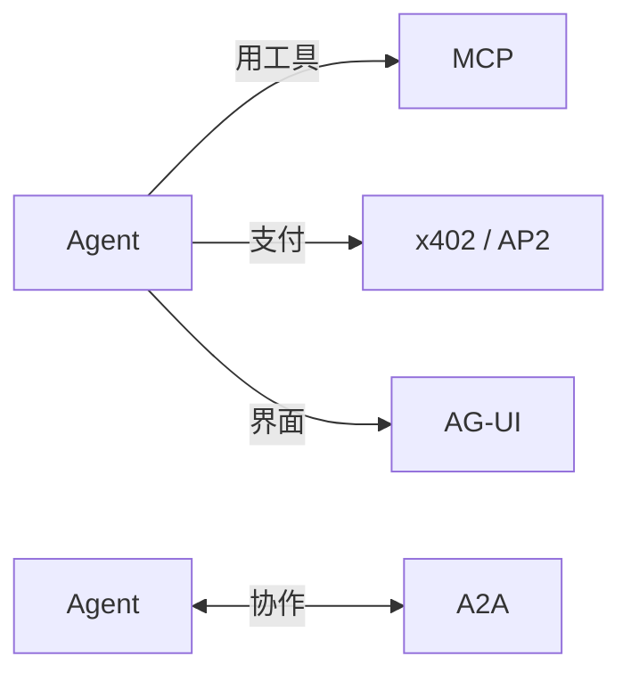
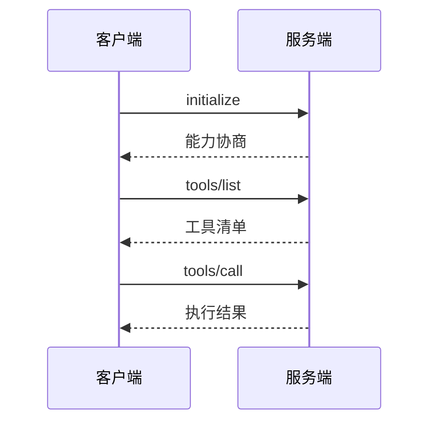

# Ch9 协议层的诞生：MCP 与 A2A

> 一句话简介：Agent 时代的"USB-C 时刻"——工具与协作的统一接口。

## 本章目标

读完本章你应当能：
- 用"每台打印机都要专用驱动"的痛点解释协议层为什么会出现
- 说出 MCP 的起源（时间、发起方、灵感来源）与三大原语（Tools / Resources / Prompts）
- 看懂一张 MCP 客户端调用工具的四步时序图
- 说出 A2A 的起源与它和 MCP 的分工（Agent↔工具 vs Agent↔Agent）
- 用一张表列出 x402 / AP2 / AG-UI 的一句话定位

## 本章导览



全图只讲一件事：Agent 时代冒出的四类"接口需求"各自由哪个协议接住。左边一支是 Agent 伸手去**用工具**——查数据库、跑代码、读文件，这是 MCP；右边一支是 Agent 与 Agent 之间**对话协作**——把任务委托给另一个厂商的 Agent，这是 A2A；下方两支（支付、界面）本章只点名（见 9.8）。读完本章，你应该能指着图上任意一条边说出：谁在和谁通信、由哪个协议负责、它是谁在什么时候发起的。

本章的读法：9.1 先讲清"为什么需要协议"，9.2-9.5 走完 MCP（起源 → 三大原语 → 传输 → 生态），9.6-9.7 走完 A2A（起源 → 与 MCP 的分工），9.8 一句话点名其余协议。赶时间可以只读三处——9.1 的 N×M 问题、9.3 的三原语表、9.7 的 MCP vs A2A 对比表。本章只讲协议的"从哪来、为什么"，不写任何实现代码；动手实现是 Part 4 和 Part 5 的事。

## 9.1 引子：为什么突然冒出"协议"

2024 年之前，想让一个 AI 应用用上外部工具，通行做法是写"专属胶水"：这个模型接那个数据库，要写一套对接；换个模型，再写一套；换个工具，从头再来。假设有 3 个模型、4 个工具，理论上最多要维护 3×4 = 12 套互不通用的对接代码——模型和工具各自增长，胶水代码就爆炸式增长。这个困境有个通行叫法：**N×M 问题**。画出来是这样的：

```
        工具1   工具2   工具3   工具4
模型A  ──×──────×──────×──────×
模型B  ──×──────×──────×──────×
模型C  ──×──────×──────×──────×

每个 × = 一套专属对接代码（最多 N×M 套）
```

类比打印机时代：每买一台新打印机，都要装一遍它专属的驱动；换了操作系统，驱动可能还得重装。后来有了通用打印标准，操作系统自带驱动，打印机插上就能用——接头也从五花八门收拢成 USB-C 一种。Agent 面对的正是同一种病：**接头不统一，所以每一种组合都要单独适配**。

出路也一样：定一个所有模型和所有工具都遵守的接口标准，让对接代码从 N×M 块变成 N+M 块——每端只按标准写一次。这正是 2024 年底起陆续诞生的几个 Agent 协议要做的事。本章只讲其中最重要的两个：**MCP（Model Context Protocol，模型上下文协议）**解决"Agent 怎么统一地用工具"，**A2A（Agent-to-Agent，智能体到智能体协议）**解决"Agent 怎么和 Agent 协作"。一个管伸手，一个管通话。

## 9.2 MCP 起源：从 LSP 到 Model Context Protocol

2024 年 11 月 25 日，Anthropic 发布了 MCP，并公开了宣言式的一篇公告[《Introducing the Model Context Protocol》](https://www.anthropic.com/news/model-context-protocol)。协议的两位主创是 Anthropic 工程师 **David Soria Parra** 与 **Justin Spahr-Summers**。两人后来在访谈中确认：MCP 的设计"大量借鉴了 LSP"。

**LSP（Language Server Protocol，语言服务器协议）**是微软 2016 年随 VS Code 推出的编辑器与编程语言之间的通信标准——它正是 MCP 的直系灵感来源，值得多花三十秒搞懂，因为它和 MCP 的故事几乎是同一个模子：

| | LSP（2016） | MCP（2024） |
|---|---|---|
| 统一之前 | 每个编辑器 × 每种语言都要写专属插件 | 每个模型 × 每个工具都要写专属胶水 |
| 统一之后 | 语言实现一次协议，所有支持 LSP 的编辑器都能用 | 工具实现一次协议，所有支持 MCP 的 Agent 都能用 |
| 类比 | 一个编辑器通吃所有语言 | 一个 Agent 通吃所有工具 |

LSP 之前，IDE 想支持补全、跳转、报错提示，得为每种语言写一个插件；LSP 把"编辑器怎么问、语言服务器怎么答"定成统一格式后，一门语言只需写一个语言服务器，任何编辑器接上就能用。MCP 对工具做了同样的事：数据库、文件系统、网页搜索……每种工具只按 MCP 格式写一次"服务器"，任何支持 MCP 的 Agent 客户端都能连上即用。用 Justin 的话说，这解决的正是 LSP 当年解决过的 N×M 问题。

MCP 官网与规范托管在 [modelcontextprotocol.io](https://modelcontextprotocol.io)，代码在 [GitHub 组织](https://github.com/modelcontextprotocol)下，协议自发布起即开源。理解了"它从 LSP 学了什么"，下一节看它具体规定了哪三类东西可以让 Agent 用。

## 9.3 MCP 三大原语

MCP 规定 Agent 与工具之间可以交换三类东西，称为**三大原语（Primitives）**：Tools、Resources、Prompts。先把三个词的直觉立住——用厨房打比方：

- **Tools（工具）**：Agent 能**动手执行**的动作。类比厨房里可操作的厨具——开火、切菜、搅拌。"查数据库""发邮件""跑一段代码"都是 Tools，方向是 **Agent 调用工具**。
- **Resources（资源）**：Agent 能**读取**的数据。类比食材架上摆着的食材——看得见、取得走，但你不"操作"它。"读这个文件""看这条日志"都是 Resources，方向是 **Agent 读取资源**。
- **Prompts（提示模板）**：服务端预先写好的**提示词模板**。类比贴在厨房墙上的菜谱——按固定套路引导 Agent 怎么干活。"总结网页的标准提示""代码审查的固定流程"都是 Prompts。

收成一张表（这张表值得记住，Part 5 实现 MCP 服务端时会再见到它）：

| 原语 | 方向 | 一句话 | 例子 |
|---|---|---|---|
| Tools | Agent → 工具（执行） | 能动手做的动作 | 查数据库、跑代码 |
| Resources | Agent ← 数据（读取） | 能读到的内容 | 读文件、看日志 |
| Prompts | 服务端 → Agent（模板） | 预写好的提示套路 | 网页总结模板 |

三点提醒。第一，三者的区分标准是**交互方向与语义**，不是技术形式——都是消息，但"执行动作"和"读取数据"对 Agent 意义完全不同（权限控制也据此分开：执行有副作用的动作要审批，只读的可以放宽）。第二，后来的规范还长出了更多原语（如完成补全、结构化通知），但三大原语始终是理解 MCP 的主干。第三，本章到此为止不写一行代码——三大原语在协议消息里长什么样、怎么实现一个自己的 MCP 服务端，见 (Part 5)。

## 9.4 MCP 传输层：stdio 与 Streamable HTTP

原语规定"说什么"，**传输层（Transport）**规定"话怎么送"。MCP 主要有两种传输方式，各对应一类部署场景：

- **stdio（标准输入输出）**：用于**本地**场景。客户端（如 Agent 应用）直接把 MCP 服务端程序当作子进程拉起来，通过进程的标准输入输出传消息。类比把 U 盘直接插进电脑——物理上就在旁边，即插即用，没有网络开销。
- **Streamable HTTP**：用于**远程**场景。服务端是一个 HTTP 地址，客户端发请求过去；关键在于它还支持服务端**主动推送**——执行中的中间结果、进度更新可以顺着连接持续流回来。类比快递柜加实时物流推送：你不仅能去柜子取件（发请求），还能持续收到"已揽收 / 运输中 / 派送中"的推送。

为什么裸 HTTP（一问一答）不够？因为工具执行经常是**耗时且有过程**的：跑一次数据库聚合可能要几十秒，执行一个长任务中途可能失败。如果只用一问一答，客户端要么干等到超时，要么反复轮询；中间的进度和部分结果无处安放。流式响应解决的正是这一段——请求发出后，连接保持打开，服务端可以多次推送，最后再给终态结果。

看一张四步时序图，把"连接 → 报家门 → 问有什么 → 调一个"的骨架装进脑子（这张图是全章的动态缩影，Part 4 深入实现时会反复回到它）：



四步各司其职：**initialize** 是握手——双方交换协议版本与各自支持的能力，先对齐"我们说的同一套话吗"；**tools/list** 是问路——客户端问服务端"你会什么"，拿回工具清单；**tools/call** 是办事——按清单挑一个工具、带上参数执行，拿回结果。

一个写在规范里的现状备忘：2026 年 7 月 28 日版规范把早期的独立 SSE 传输**标记为废弃（Deprecated）、并入 Streamable HTTP**，同时把 Sampling（让服务端反向请求模型补全）等特性也标记为废弃——废弃不等于删除，这些条目按政策仍会保留在规范中至少十二个月，但新项目不应再依赖它们。读规范时看到"Deprecated"，理解成"官方劝你迁移"即可。

## 9.5 MCP 生态时间线

一个协议是不是"行业标准"，最终看对手愿不愿意接。MCP 发布后一年半内的四个节点，标记了它从"一家的接口"变成"行业公共基础设施"的全过程：

| 时间 | 事件 | 意义 |
|---|---|---|
| 2024.11.25 | Anthropic 发布 MCP | 协议诞生，首先用于 Claude 生态 |
| 2025.03 | OpenAI 宣布采纳，接入 ChatGPT 桌面版等产品 | 最大竞争者之一跟进，脱离"一家专属" |
| 2025.04 | Google DeepMind 宣布 Gemini 支持 MCP | 三巨头到齐，事实标准成形 |
| 2025.05 | 微软在 Build 大会宣布 Windows 原生支持 MCP | 从应用层下沉到操作系统层 |
| 2025.12.09 | Anthropic 将 MCP 捐赠给 Linux Foundation 旗下新成立的 Agentic AI Foundation（AAIF） | 治理权交出，中立化 |

解读这四步只用三句话。**2025 年上半年的"三家到齐"**（OpenAI、Google、微软先后接入）说明：再坚持一套私有接口，在对手全部互通时只会自绝于生态——协议的网络效应逼着所有人上车。**下沉到 Windows** 说明接口已经从"某个聊天应用的功能"变成"操作系统的基础设施"，就像 USB 接口最终被写进主板而不是某个软件。**2025 年底的捐赠**则交出了最关键的一件东西——控制权：协议不再由发起公司一家说了算，由行业共同治理，这是"公共基础设施"的法定成人礼。三步走完，MCP 已经不是 Anthropic 的 MCP，而是行业的 MCP。

## 9.6 A2A 起源：Google 发起的协作协议

MCP 解决了"一个 Agent 怎么用工具"，但没回答另一个问题：**两个各自独立的 Agent，怎么把活儿分给对方干**？2025 年 4 月 9 日，Google 发布了这个问题的答案——**A2A（Agent-to-Agent Protocol）**，并联合 50 余家创始合作伙伴共同公布（涵盖 Salesforce、SAP、ServiceNow 等企业软件厂商与咨询公司）。注意是 50 余家——数字不算爆炸，看重的是覆盖面：发起即横跨软件、云、咨询三类玩家。

Google 给 A2A 定的目标一句话说得清：让**不同厂商、不同框架**造出来的 Agent 能互相发现、互相委托任务，而不必暴露各自的内部记忆和工具——就像两家公司合作，不需要公开各自的内部账本。协议的两个核心抽象也只需一句话点名：

- **Agent Card（能力名片）**：Agent 在自己网址上公开的一份 JSON 名片，写明"我是谁、我会干什么、怎么连我"。类比公司官网的"关于我们"页——合作前先看名片。
- **Task（任务）**：一次委托的生命周期，从提交、进行、到完成或失败，状态可查询。类比工单系统里的一张单——派出去的活有据可查。

它的时间线比 MCP 短，但走得很快：

| 时间 | 事件 |
|---|---|
| 2025.04.09 | Google 发起，50 余家伙伴共同公布 |
| 2025.06 | 捐赠给 Linux Foundation 治理 |
| 2026.03.12 | 发布 v1.0——首个稳定、可上生产的规范版本 |
| 2026.04 | 发布一周年：150 余家组织支持，Google / 微软 / AWS 三大云平台均已集成 |

类比来记：如果说 MCP 是一家公司内部的**岗位说明书**——写清每个岗位（工具）接受什么输入、产出什么——那 A2A 就是公司之间的**合作协议**——约定双方怎么接洽、怎么交付、怎么验收。两者管的根本不是同一件事；它们的正式分工，下一节用一张表说清。

## 9.7 A2A 与 MCP：互补不竞争

初学者最常见的误解是把两者放进同一个格子里比较，甚至以为"A2A 是 MCP 的升级版"。错在哪里？看这张表：

| 维度 | MCP | A2A |
|---|---|---|
| 解决什么问题 | Agent 怎么**使用**工具与数据 | Agent 怎么**与** Agent 协作 |
| 通信双方 | Agent ↔ 工具（进程、API、数据源） | Agent ↔ Agent（跨厂商、跨框架） |
| 发起方 | Anthropic，2024.11 | Google，2025.04 |
| 核心抽象 | Tools / Resources / Prompts | Agent Card / Task |
| 归属（截至 2026） | Linux Foundation AAIF | Linux Foundation（AAIF） |

看清"通信双方"一行，分工就明白了：MCP 的另一头是**工具**——死的、按指令执行的程序；A2A 的另一头是**Agent**——活的、会自己决策的系统。一个管 Agent 的"手"，一个管 Agent 之间的"电话"：手再灵巧，也不能替你打电话；电话打得再好，也变不出手来干活。二者在同一套系统里同时出现、各管一层。

所以"A2A 是 MCP 的升级版"这句话错在**层级**：它们不在同一层，没有替代关系——升级是同层换代（拨号 → 宽带），而 MCP 与 A2A 是两层各司其职（手 + 电话）。一个同时用到工具和协作的系统会两者都装：先用 MCP 查数据库、读文件，再用 A2A 把"订机票"委托给航空公司的 Agent。两者都已进入 Linux Foundation 治理，共同构成多 Agent 系统的底层接口——这也是为什么 Part 4 讲 Harness 时，两个都要讲。

## 9.8 一句话点名其他协议

协议层不止 MCP 和 A2A 两块拼图。2025-2026 年还冒出一批各管一段的小协议，本章只做点名，表格里给出各自的"一句话定位 + 去哪读"：

| 协议 | 一句话定位 | 详见 |
|---|---|---|
| x402 | 复活 HTTP 402 状态码，让 Agent 能用加密货币直接在线上为服务付费 | (见 Part 5) |
| AP2 | 代理购物授权：为"Agent 替人下单"提供可审计的授权凭据 | (见 Part 5) |
| AG-UI | 事件协议：把 Agent 的动作实时驱动成前端界面更新 | (见 Part 5) |

它们的共同点是都试图为 Agent 时代补齐"缺的那一个接口"：缺支付接口的补支付（x402、AP2），缺界面接口的补界面（AG-UI）。本章不展开任何实现——你现在只需要记住一件事：**工具、协作、支付、界面，每一层都在被协议化**，而其中最先成熟、今天最绕不开的两个，就是刚讲完的 MCP 与 A2A。

## 本章小结

- 2024 年前的 N×M 问题（每个模型 × 每个工具一套胶水）逼出了协议层——Agent 时代的"USB-C 时刻"：接头统一，对接代码从 N×M 变成 N+M。
- MCP 由 Anthropic 于 2024.11.25 发布（主创 David Soria Parra、Justin Spahr-Summers），灵感直接来自 LSP；三大原语 Tools / Resources / Prompts 分别对应"执行的动作 / 可读的数据 / 提示模板"。
- MCP 传输层分本地 stdio 与远程 Streamable HTTP；一次典型交互四步走——握手、列清单、调工具、拿结果（2026.07 规范已把早期独立 SSE 传输与 Sampling 标记为废弃）。
- 生态时间线（2025.03 OpenAI → 2025.04 Google → 2025.05 Windows → 2025.12 捐给 Linux Foundation AAIF）标记了 MCP 从一家接口到行业公共基础设施的全程。
- A2A 由 Google 于 2025.04.09 联合 50 余家伙伴发起，核心抽象是 Agent Card 与 Task；它与 MCP 互补不竞争——MCP 是"手"（Agent ↔ 工具），A2A 是"电话"（Agent ↔ Agent），不是升级关系。
- 协议层的拼图还没完：x402 / AP2 管支付、AG-UI 管界面，留待 Part 5。下一章（Ch10）的问题顺理成章：接口标准有了，一个最小可用的 Agent 还差哪几块积木？

## 本章参考

### 必读
- [Model Context Protocol 官网](https://modelcontextprotocol.io)
- [Introducing the Model Context Protocol（Anthropic, 2024.11）](https://www.anthropic.com/news/model-context-protocol)
- [MCP GitHub 组织](https://github.com/modelcontextprotocol)
- [A2A GitHub（a2aproject/A2A）](https://github.com/a2aproject/A2A)
- [A2A Protocol 官网](https://a2a-protocol.org)
- [Model Context Protocol - Wikipedia](https://en.wikipedia.org/wiki/Model_Context_Protocol)

### 推荐博客 / 教程
- [Announcing the Agent2Agent Protocol (A2A)（Google Developers Blog, 2025.04.09）](https://developers.googleblog.com/en/a2a-a-new-era-of-agent-interoperability)
- [Linux Foundation Announces the Formation of the Agentic AI Foundation（2025.12.09）](https://www.linuxfoundation.org/press/linux-foundation-announces-the-formation-of-the-agentic-ai-foundation)
- [The Creators of Model Context Protocol（Latent Space 访谈，主创亲述 LSP 灵感）](https://www.latent.space/p/mcp)

### 视频 / 课程
- [The Model Context Protocol (MCP)（Anthropic 官方频道，2025.06）](https://www.youtube.com/watch?v=CQywdSdi5iA)
