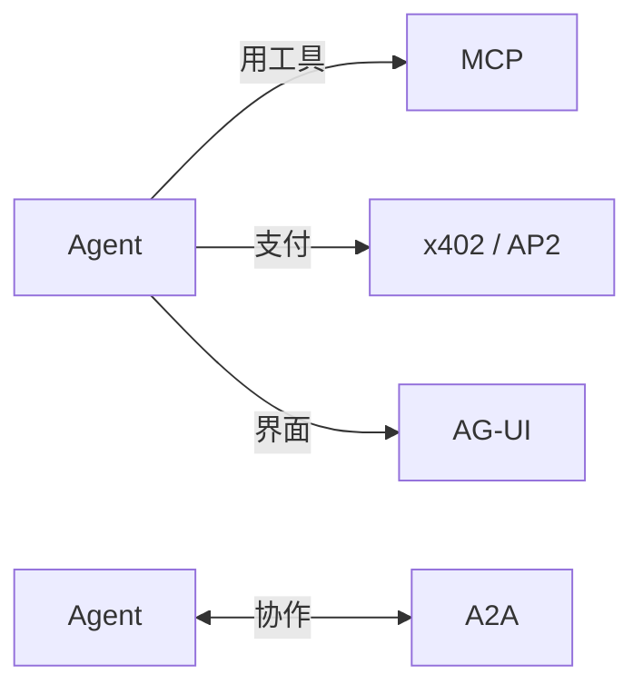
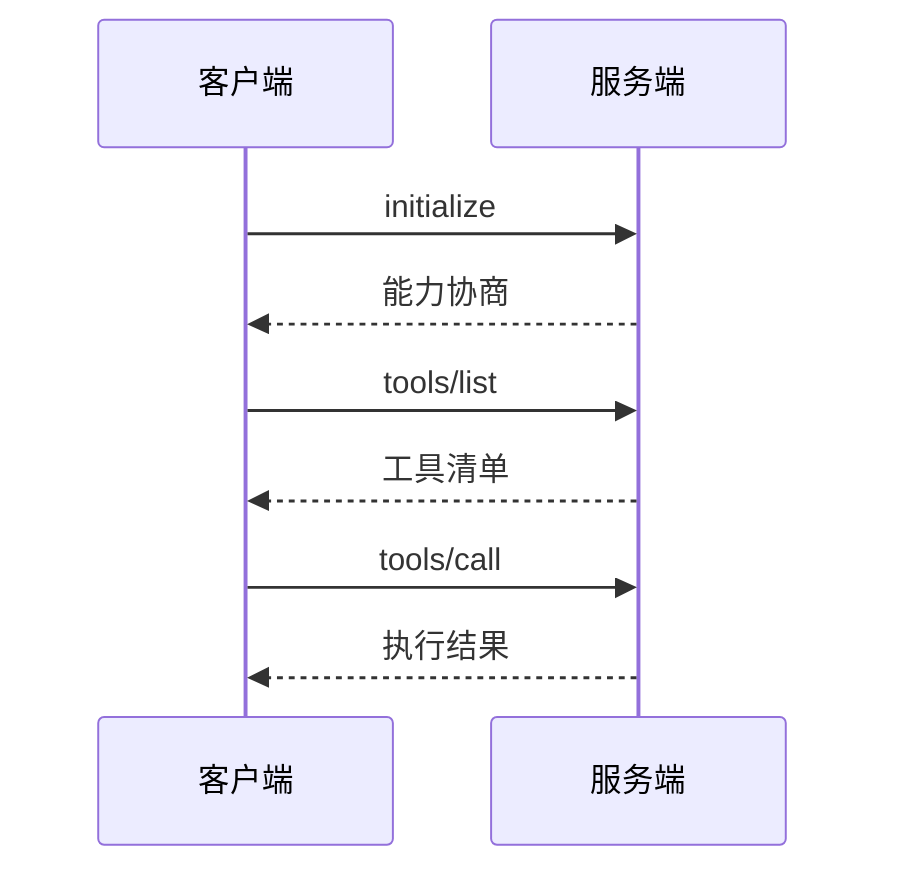

# Ch9 协议层的诞生：MCP 与 A2A

> 一句话简介：Agent 时代的"USB-C 时刻"——工具与协作的统一接口。

## 本章目标

读完本章你应当能：
- 用"每台打印机都要专用驱动"的痛点解释协议层为什么会出现
- 说出 MCP 的起源（时间、发起方、灵感来源）与三大原语（Tools / Resources / Prompts）
- 看懂一张 MCP 客户端调用工具的四步时序图
- 说出 A2A 的起源与它和 MCP 的分工（Agent↔工具 vs Agent↔Agent）
- 用一张表列出 x402 / AP2 / AG-UI 的一句话定位

## 本章导览



全图只讲一件事：Agent 时代冒出的四类"接口需求"各自由哪个协议接住。左边一支是 Agent 伸手去**用工具**——查数据库、跑代码、读文件，这是 MCP；右边一支是 Agent 与 Agent 之间**对话协作**——把任务委托给另一个厂商的 Agent，这是 A2A；下方两支（支付、界面）本章只点名（见 9.8）。先把这张图当**回顾图**记个形状：9.1 到 9.8 走完后，你应该能指着图上任意一条边说出——谁在和谁通信、由哪个协议负责、它是谁在什么时候发起的。

本章的读法：9.1 先讲清"为什么需要协议"，9.2-9.5 走完 MCP（痛点 → 起源 → 三大原语 → 传输 → 生态），9.6-9.7 走完 A2A（痛点 → 起源 → 与 MCP 的分工），9.8 一句话点名其余协议。赶时间可以只读三处——9.1 的 N×M 问题、9.3 的三原语表、9.7 的 MCP vs A2A 对比表。本章只讲协议的"从哪来、为什么"，不写任何实现代码；动手实现是 Part 4 和 Part 5 的事。

## 9.1 引子：为什么突然冒出"协议"

2024 年之前，想让一个 AI 应用用上外部工具，通行做法是写"专属胶水"：这个模型接那个数据库，要写一套对接；换个模型，再写一套；换个工具，从头再来。假设有 3 个模型、4 个工具，理论上最多要维护 3×4 = 12 套互不通用的对接代码——模型和工具各自增长，胶水代码就爆炸式增长。这个困境有个通行叫法：**N×M 问题**。画出来是这样的：

```
        工具1   工具2   工具3   工具4
模型A  ──×──────×──────×──────×
模型B  ──×──────×──────×──────×
模型C  ──×──────×──────×──────×

每个 × = 一套专属对接代码（最多 N×M 套）
```

类比打印机时代：每买一台新打印机，都要装一遍它专属的驱动；换了操作系统，驱动可能还得重装。后来有了通用打印标准，操作系统自带驱动，打印机插上就能用——接头也从五花八门收拢成 USB-C 一种。Agent 面对的正是同一种病：**接头不统一，所以每一种组合都要单独适配**。

出路也一样：定一个双方事先约好的通信规矩——消息长什么样、先问什么后答什么，只要照这个格式写，谁和谁都能直接对上话。打个比方，这就像说普通话：南腔北调，但都按同一套发音和语法来说，才互相听得懂。落到程序里，可以先约定"第一句必须报自己的协议版本，第二句再报名字"，两边都照这个顺序发消息——**双方事先约定好的这套消息格式和问答规矩，就叫协议（Protocol）**。这正是 2024 年底起陆续诞生的几个 Agent 协议要做的事。本章只讲其中最重要的两个：**MCP（Model Context Protocol，模型上下文协议）**——给"Agent 怎么统一地用工具"定的接口；**A2A（Agent-to-Agent，智能体到智能体协议）**——给"Agent 怎么找 Agent 派活"定的接口。一个管伸手，一个管通话；各自的完整讲法与类比，分别见 9.2 与 9.6。

## 9.2 MCP 起源：从 LSP 到 Model Context Protocol

上一节说要"定一个所有模型和工具都遵守的接口标准"。这不是拍脑袋——编辑器世界十年前就为同一种病定过一次规矩，药方几乎原样管用。

先看那个先例。程序员都熟悉这种痛：编辑器想支持代码补全、跳转定义、报错提示，以前得为每种编程语言单独写一个插件——10 个编辑器配 10 种语言，又是 N×M。解法是定一套统一的问答格式：编辑器怎么问、语言怎么答，全部事先说好。格式统一之后，一门语言只需写一个"专管这门语言的小进程"，任何编辑器接上就能用。再打一个生活比方：这就像快递面单格式全国统一——打印软件只用写一次，哪家快递都能打；具体到代码，VS Code 想支持跳转定义，不必为每种语言重写功能，发一条标准问句给对方即可。这套编辑器与编程语言之间的通信标准，叫 **LSP（Language Server Protocol，语言服务器协议）**，微软 2016 年随 VS Code 推出。

把同一张药方开给 Agent 圈，就是 2024 年 11 月 25 日 Anthropic 发布的 **MCP**：给程序用工具定的一套统一接口，谁照它写，谁就能被所有 AI 助手直接用。类比大家每天都在用的 USB-C——换了这一个标准口，充电器、硬盘、耳机全都通用，不再一家一个接头。小例子：数据库工具方按 MCP 格式写一次"查数据库"的服务，支持 MCP 的各家 Agent 客户端连上就能用。顺带拆一下名字里的"上下文"：它指送进模型的那包资料（对话、文件、查回来的数据都算）——MCP 管的，就是这包资料怎么在模型和工具之间来回传递。

两边对齐看一遍：

| | LSP（2016） | MCP（2024） |
|---|---|---|
| 统一之前 | 每个编辑器 × 每种语言都要写专属插件 | 每个模型 × 每个工具都要写专属胶水 |
| 统一之后 | 语言实现一次协议，所有支持 LSP 的编辑器都能用 | 工具实现一次协议，所有支持 MCP 的 Agent 都能用 |
| 类比 | 一个编辑器通吃所有语言 | 一个 Agent 通吃所有工具 |

看清这张表就明白了：MCP 对工具做的事，正是 LSP 对语言做过的事——一边写一次，处处能用；它解决的也正是 LSP 当年解决过的 N×M 问题。发布细节作为回顾：公告见[《Introducing the Model Context Protocol》](https://www.anthropic.com/news/model-context-protocol)，当年主创这份协议的两位 Anthropic 工程师 **David Soria Parra** 与 **Justin Spahr-Summers**，后来在访谈中确认 MCP 的设计"大量借鉴了 LSP"。协议自发布起即开源，官网与规范托管在 [modelcontextprotocol.io](https://modelcontextprotocol.io)，代码在 [GitHub 组织](https://github.com/modelcontextprotocol)下。理解了"它从 LSP 学了什么"，下一节看它具体规定了哪三类东西可以让 Agent 用。

## 9.3 MCP 三大原语

上一节说了 MCP 是"统一接口"——接口总得规定"能递过来哪几类东西"。MCP 把它们分成三类；协议文档管这种最基础的消息种类叫**原语（Primitives）**——先别被术语吓到，就理解成"最基本的消息种类"。用厨房打比方，三种各有分工：

- **Tools（工具）**：Agent 能**动手执行**的动作。类比厨房里可操作的厨具——开火、切菜、搅拌。"查数据库""发邮件""跑一段代码"都是 Tools，方向是 **Agent 调用工具**。
- **Resources（资源）**：Agent 能**读取**的数据。类比食材架上摆着的食材——看得见、取得走，但你不"操作"它。"读这个文件""看这条日志"都是 Resources，方向是 **Agent 读取资源**。
- **Prompts（提示模板）**：服务端**预先写好的一段"给 Agent 的固定指令"**，教它照固定套路干活。类比贴在厨房墙上的菜谱。为什么协议里需要它？没有 Prompts 的话，同一个"总结网页"的活，每个 Agent 都得自己现场编指令，编得好坏全凭运气；而服务端最清楚自己这份数据该怎么用，把常用套路预先写好，谁连上都能照着做。"总结网页的标准提示""代码审查的固定流程"都是 Prompts。

收成一张表（这张表值得记住，Part 5 实现 MCP 服务端时会再见到它）：

| 原语 | 方向 | 一句话 | 例子 |
|---|---|---|---|
| Tools | Agent → 工具（执行） | 能动手做的动作 | 查数据库、跑代码 |
| Resources | Agent ← 数据（读取） | 能读到的内容 | 读文件、看日志 |
| Prompts | 服务端 → Agent（模板） | 预写好的指令套路 | 网页总结模板 |

三点提醒。第一，三者的区分标准是**交互方向与语义**，不是技术形式——都是消息，但"执行动作"和"读取数据"对 Agent 意义完全不同（权限控制也据此分开：执行有副作用的动作要审批，只读的可以放宽）。第二，三类之外，规范后来还长出别的消息类型——比如"补全"（Agent 输入打到一半，服务端帮它把文件路径之类补全）和"通知"（服务端主动推来一条规整的状态更新）——知道有这回事即可，理解 MCP 先抓住这三样主干。第三，本章到此为止不写一行代码——三大原语在协议消息里长什么样、怎么实现一个自己的 MCP 服务端 (见 Part 5)。

## 9.4 MCP 传输层：stdio 与 Streamable HTTP

原语规定"说什么"，**传输层（Transport）**规定"话怎么送"——消息走哪条路、用什么方式送到对方手里。MCP 主要有两种传输方式，各对应一类部署场景：

- **stdio（标准输入输出）**：用于**本地**场景。Agent 程序直接把 MCP 服务端当子进程拉起来，让两个程序从各自默认的收、发口子直接互传文字，不经网络——就像公司内线电话：分机直拨分机，不走外线、不产生话费。具体动作：往它的标准输入写一行 JSON，它从标准输出回一行结果。
- **Streamable HTTP**：用于**远程**场景。服务端是一个网址，客户端发请求过去；答案可以分几次慢慢推过来，关键在于服务端还能**主动推送**——执行中的中间结果、进度更新可以顺着连接持续流回来。类比快递柜加实时物流推送：你不仅能去柜子取件（发请求），还能持续收到"已揽收 / 运输中 / 派送中"的推送。小例子：跑一次数据库聚合要 30 秒，期间服务端先推进度、再推部分结果，最后推终态。

为什么裸 HTTP（一问一答）不够？因为工具执行经常是**耗时且有过程**的：跑一次数据库聚合可能要几十秒，执行一个长任务中途可能失败。如果只用一问一答，客户端要么干等到超时，要么反复轮询；中间的进度和部分结果无处安放。流式响应解决的正是这一段——请求发出后，连接保持打开，服务端可以多次推送，最后再给终态结果。

一次典型调用固定四步，先用动词记住：**连接 → 报家门 → 问有什么 → 调一个**。对应到协议消息：报家门是 **initialize**——握手，双方交换协议版本与各自支持的能力，先对齐"我们说的同一套话吗"；问有什么是 **tools/list**——问路，客户端问服务端"你会什么"，拿回工具清单；调一个是 **tools/call**——办事，按清单挑一个工具、带上参数执行，拿回结果。把这套问答画成一张回顾图钉在脑子里（Part 4 深入实现时会反复回到它）：



握手、问路、办事——三问三答，骨架就是上面这四步。

**读规范小贴士**（维护者关心的变更，与四步机制无关，知道即可）：2026 年 7 月 28 日版规范把早期一种叫 SSE 的传输方式（老式网页连线，只能服务端单向往客户端推消息）标记为废弃（Deprecated）、并入了 Streamable HTTP，同时把 Sampling（让服务端反过来请模型帮忙补一句话的特性）也标记为废弃——废弃不等于删除，这些条目按政策仍会保留在规范中至少十二个月，但新项目不应再依赖它们。读规范时看到"Deprecated"，理解成"官方劝你迁移"即可。

## 9.5 MCP 生态时间线

一个协议是不是"行业标准"，最终看对手愿不愿意接——发布只是起点。MCP 发布后一年半里发生了三件层层递进的事。先是**对手接入**：2025 年上半年，OpenAI、Google、微软先后宣布支持——再坚持一套私有接口，只会在对手全部互通时自绝于生态，协议的网络效应逼着所有人上车。接着是**下沉到操作系统**：Windows 原生支持意味着它从"某个聊天应用的功能"变成"电脑的基础能力"，就像 USB 接口最终被写进主板而不是某个软件。最后是**交出控制权**：2025 年 12 月 9 日，Anthropic 把 MCP 捐赠给 Linux Foundation（Linux 基金会——由多家科技公司共同出资、中立运营开源项目的行业组织）旗下新成立的 Agentic AI Foundation（AAIF）——协议不再由发起公司一家说了算，改由行业共同治理，这是"公共基础设施"的法定成人礼。把这一年半按时间排成回顾表（五个关键节点）：

| 时间 | 事件 | 意义 |
|---|---|---|
| 2024.11.25 | Anthropic 发布 MCP | 协议诞生，首先用于 Claude 生态 |
| 2025.03 | OpenAI 宣布采纳，接入 ChatGPT 桌面版等产品 | 最大竞争者之一跟进，脱离"一家专属" |
| 2025.04 | Google DeepMind 宣布 Gemini 支持 MCP | 三巨头到齐，事实标准成形 |
| 2025.05 | 微软在 Build 大会宣布 Windows 原生支持 MCP | 从应用层下沉到操作系统层 |
| 2025.12.09 | Anthropic 将 MCP 捐赠给 Linux Foundation 旗下新成立的 Agentic AI Foundation（AAIF） | 控制权交出，改由行业共同管理 |

对照表格走完三步，结论只有一句：MCP 已经不是 Anthropic 的 MCP，而是行业的 MCP。

## 9.6 A2A 起源：Google 发起的协作协议

MCP 解决了"一个 Agent 怎么用工具"，但另一个问题还在：**两个各自独立的 Agent，怎么把活儿分给对方干**？看一个具体场景——你让自己的 Agent 办出差：它用 MCP 查完公司日历、读完差旅制度，要把"订机票"这活儿委托给航空公司的 Agent。可两家的 Agent 是不同厂商、不同框架造的，内部结构完全不一样，怎么互相认识、怎么把活儿交接清楚、怎么让对方随时查得到进度？没有规矩的话，每一对厂商又得两两私聊对接——9.1 的 N×M 灾难，在"Agent 找 Agent"上重演一遍。

2025 年 4 月 9 日，Google 发布了这个问题的答案——**A2A（Agent-to-Agent Protocol）**：不同家做的 AI 助手互相介绍自己、互相派活干的一套约定。就像两家公司签的合作协议——约定怎么接洽、怎么交付、怎么验收。小例子：你的 Agent 把"订机票"委托给航司的 Agent，对方进度可查，你的 Agent 不用看见它的内部。Google 联合 50 余家创始合作伙伴共同公布（涵盖 Salesforce、SAP、ServiceNow 等企业软件厂商与咨询公司）——数字不算爆炸，看重的是覆盖面：发起即横跨软件、云、咨询三类玩家。给 A2A 定的目标一句话说得清：让**不同厂商、不同框架**造出来的 Agent 能互相发现、互相委托任务，而不必暴露各自的内部记忆和工具。协议的两个核心抽象也只需一句话点名，都很好懂：

- **Agent Card（能力名片）**：一张公开的"我会什么"名片。Agent 在自己网址上公开一份 JSON 名片，写明"我是谁、我会干什么、怎么连我"。类比公司官网的"关于我们"页——合作前先看名片。
- **Task（任务）**：一张记录派活进度的单子。一次委托从提交、进行、到完成或失败，状态可查询。类比工单系统里的一张单——派出去的活有据可查。

它的时间线比 MCP 短，但走得很快（回顾表）：

| 时间 | 事件 |
|---|---|
| 2025.04.09 | Google 发起，50 余家伙伴共同公布 |
| 2025.06 | 捐赠给 Linux Foundation 治理 |
| 2026.03.12 | 发布 v1.0——首个稳定、可上生产的规范版本 |
| 2026.04 | 发布一周年：150 余家组织支持，Google / 微软 / AWS 三大云平台均已集成 |

A2A 和 MCP 管的根本不是同一件事；它们的正式分工，下一节用一张表说清。

## 9.7 A2A 与 MCP：互补不竞争

初学者最常见的误解是把两者放进同一个格子里比较，甚至以为"A2A 是 MCP 的升级版"。错在哪里？看这张表：

| 维度 | MCP | A2A |
|---|---|---|
| 解决什么问题 | Agent 怎么**使用**工具与数据 | Agent 怎么**与** Agent 协作 |
| 通信双方 | Agent ↔ 工具（进程、API、数据源） | Agent ↔ Agent（跨厂商、跨框架） |
| 发起方 | Anthropic，2024.11 | Google，2025.04 |
| 核心抽象 | Tools / Resources / Prompts | Agent Card / Task |
| 归属（截至 2026） | Linux Foundation AAIF | Linux Foundation（AAIF） |

看清"通信双方"一行，分工就明白了：MCP 的另一头是**工具**——死的、按指令执行的程序；A2A 的另一头是**Agent**——活的、会自己决策的系统。一个管 Agent 的"手"，一个管 Agent 之间的"电话"：手再灵巧，也不能替你打电话；电话打得再好，也变不出手来干活。二者在同一套系统里同时出现、各管一层。

所以"A2A 是 MCP 的升级版"这句话错在**层级**：它们不在同一层，没有替代关系——升级是同层换代（拨号 → 宽带），而 MCP 与 A2A 是两层各司其职（手 + 电话）。一个同时用到工具和协作的系统会两者都装：就像 9.6 开头那个出差场景——先用 MCP 查日历、读制度，再用 A2A 把"订机票"委托给航空公司的 Agent。两者都已进入 Linux Foundation 治理，共同构成多 Agent 系统的底层接口——这也是为什么 Part 4 讲 Harness 时，两个都要讲。

## 9.8 一句话点名其他协议

协议层不止 MCP 和 A2A 两块拼图。2025-2026 年还冒出一批各管一段的小协议，本章只做点名——表格里给出各自的"白话定位 + 没有它会出什么事故 + 去哪读"：

| 协议 | 一句话定位 | 详见 |
|---|---|---|
| x402 | 让 Agent 在网页请求**当场自动付钱**买数据：服务器回一句"402：请付款"（HTTP 里"需要付款"的暗号），Agent 自动用加密货币付掉再重试——像投币洗衣机，收到报价自动投币才出水。没有它，Agent 撞上收费接口只能停机，等人手动付款 | (见 Part 5) |
| AP2 | 给"Agent 替人下单"发一张**可查账的授权条**：能刷多少钱、买什么，事先写死。没有它，Agent 刷爆了卡，也说不清是谁批准的 | (见 Part 5) |
| AG-UI | 把 AI 干的每一步**实时变成网页上看得见的**按钮、进度和更新——像网约车地图，司机每挪一寸，车标跟着挪一寸。没有它，网页只能干瞪眼，等 AI 全部干完才刷新 | (见 Part 5) |

它们的共同点是都试图为 Agent 时代补齐"缺的那一个接口"：缺支付接口的补支付（x402、AP2），缺界面接口的补界面（AG-UI）——正对应导览图下方两支。本章不展开任何实现——你现在只需要记住一件事：**工具、协作、支付、界面，每一层都在被协议化**，而其中最先成熟、今天最绕不开的两个，就是刚讲完的 MCP 与 A2A。

## 本章小结

- 2024 年前的 N×M 问题（每个模型 × 每个工具一套胶水）逼出了协议层——Agent 时代的"USB-C 时刻"：接头统一，对接代码从 N×M 变成 N+M。
- 协议 = 双方事先约定的消息格式和问答规矩；MCP 由 Anthropic 于 2024.11.25 发布（主创 David Soria Parra、Justin Spahr-Summers），灵感直接来自 LSP；三大原语 Tools / Resources / Prompts 分别对应"执行的动作 / 可读的数据 / 指令模板"。
- MCP 传输层分本地 stdio 与远程 Streamable HTTP；一次典型交互四步走——握手、列清单、调工具、拿结果（2026.07 规范已把早期独立 SSE 传输与 Sampling 标记为废弃）。
- 生态时间线（2025.03 OpenAI → 2025.04 Google → 2025.05 Windows → 2025.12 捐给 Linux Foundation AAIF）标记了 MCP 从一家接口到行业公共基础设施的全程。
- A2A 由 Google 于 2025.04.09 联合 50 余家伙伴发起，核心抽象是 Agent Card 与 Task；它与 MCP 互补不竞争——MCP 是"手"（Agent ↔ 工具），A2A 是"电话"（Agent ↔ Agent），不是升级关系。
- 协议层的拼图还没完：x402 / AP2 管支付、AG-UI 管界面，留待 Part 5。下一章（Ch10）的问题顺理成章：接口标准有了，一个最小可用的 Agent 还差哪几块积木？

## 本章参考

### 必读
- [Model Context Protocol 官网](https://modelcontextprotocol.io)
- [Introducing the Model Context Protocol（Anthropic, 2024.11）](https://www.anthropic.com/news/model-context-protocol)
- [MCP GitHub 组织](https://github.com/modelcontextprotocol)
- [A2A GitHub（a2aproject/A2A）](https://github.com/a2aproject/A2A)
- [A2A Protocol 官网](https://a2a-protocol.org)
- [Model Context Protocol - Wikipedia](https://en.wikipedia.org/wiki/Model_Context_Protocol)

### 推荐博客 / 教程
- [Announcing the Agent2Agent Protocol (A2A)（Google Developers Blog, 2025.04.09）](https://developers.googleblog.com/en/a2a-a-new-era-of-agent-interoperability)
- [Linux Foundation Announces the Formation of the Agentic AI Foundation（2025.12.09）](https://www.linuxfoundation.org/press/linux-foundation-announces-the-formation-of-the-agentic-ai-foundation)
- [The Creators of Model Context Protocol（Latent Space 访谈，主创亲述 LSP 灵感）](https://www.latent.space/p/mcp)

### 视频 / 课程
- [The Model Context Protocol (MCP)（Anthropic 官方频道, 2025.06）](https://www.youtube.com/watch?v=CQywdSdi5iA)
