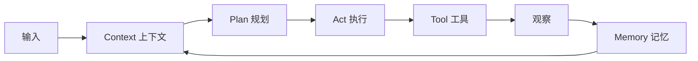

# Ch10 从模型到 Agent：必备的工程组件

> 一句话简介：LLM 只是大脑，Agent 是大脑 + 身体——本章给出身体的五块积木。

## 本章目标

读完本章你应当能：
- 说出最小 Agent 系统的五个工程组件（context / memory / tool / plan / act），并为每个画一张草图
- 用一句话解释上下文工程到底在"工程"什么
- 区分短期记忆、工作记忆、长期记忆三层各自存什么
- 描述 RAG 的三步流水线，并说出它解决什么问题
- 逐行走读一个 50 行的 ReAct 循环示例，说出每一步的数据流

## 本章导览



全图只讲一件事：五块积木怎么串成一个循环。输入和记忆一起拼出上下文，上下文交给规划，规划产出行动，行动调用工具，工具的观察再写回记忆——环转一圈，下一轮决策就比上一轮多一分依据。这个环就是 10.8 里那个 50 行循环的骨架，也是 Part 3 认知架构的工程雏形。

本章的读法：10.1 先把"模型 ≠ Agent"说清楚；10.2 到 10.7 每节聚焦一个工程组件，每节只给一句话直觉加一张局部小图，实现细节分别指路 Part 3、Part 4、Part 5；10.8 用一个可运行的最小例子把五块积木串起来，看真实的数据流。赶时间可以只读三处——10.1 的五组件清单、10.2 的办公桌类比、10.8 的逐行走读。

顺带给后文画张路标：五块积木正好铺进本书后面的行程——"它们如何协同成一个有机整体"是 Part 3 的原理题，上下文与记忆的工程细节是 Part 4 的地基，工具、规划、执行的功能实现是 Part 5 的正题。本章站在三者交界处，只画轮廓不盖楼。

## 10.1 引子：LLM ≠ Agent

会答题不等于会干活。一个 LLM 再聪明，把它直接扔进工作流就会露馅：它只能一问一答，答完就忘，也不会真的动手做任何事。举个具体的例子：你对着聊天窗口问"看看昨天的构建为什么红了"——它既看不见你的构建日志，也点不了重跑按钮，只能凭空猜一个原因，猜得再流畅也不负责任。类比一个人：光有大脑出不了门——还得有感官（看见输入和环境）、记事的本事（想起昨天发生了什么）、手（真正把事办了），以及"先想后做"的习惯（拆开任务、一步步推进）。把这几样配齐，大脑才从"会答题"变成"会干活"——从模型（Model）到 Agent，差的就是这副"身体"。

同一个模型，接上能读日志的工具、带着项目背景的上下文、记得上一轮排查进展的记忆，才真的开始"干活"。

工程上，这副身体被反复拆出五块积木，正好对上上面的导览图：**上下文（Context）是感官**，把此刻该看的信息呈现给模型；**记忆（Memory）是记事的本事**，记住对话与任务的来龙去脉；**工具（Tool）是手**，模型说想查什么算什么，由外面的程序去办；**规划（Plan）与执行（Act）是那套习惯**，把大任务拆成步骤，做完一步看一眼结果再走下一步——分别对应图里的 Plan 与 Act 方块。

值得先说破一点：这份清单不是哪一家的私有设计。把 2026 年市面上的主流 coding agent 逐个拆开——不管它姓甚名谁——五块积木都能严丝合缝地对上号；它是整个行业反复撞了三年多撞出来的公约数，所以也值得你当成通用语言来记。

先声明本章的深度：这是一章"预告"。每块积木只给一句话直觉加一张局部图，点到为止；它们如何拼成完整的认知原理在 Part 3，单块的工程细节在 Part 4 与 Part 5——Part 3 到 Part 5 展开的，正是这里埋下的各条预告。本章的目标不是让你现在就造出 Agent，而是给你一张装配备料单——往后读到任何 Agent 系统，你都能指着它说：这块是感官，这块是记性，这块是手，这两块是干活的习惯。

## 10.2 上下文工程

一句话直觉：**把该看的信息，在正确的时机，塞进有限的窗口。** 模型每次"思考"只能看见送进窗口里的文字，窗口就是它的全部世界——你没塞进去的，它当不存在。

类比办公桌：桌面大小是固定的（这就是上下文窗口，context window），你不会把整个文件柜都摊在桌上，只摊开此刻要用的几份，用完的收走。**上下文工程（Context Engineering）**就是这套桌面整理术：决定什么摆上桌、什么撤下去、什么放在最顺手的位置。拼装动作每一轮都由宿主程序悄悄完成，用户看不见它，但它决定了体验的上限——拼对了，模型像个熟手；拼乱了，再强的模型也在翻垃圾堆。这个词在 2025 年取代"提示词工程"成为业界常用语，[Anthropic 的官方博客](https://www.anthropic.com/engineering/effective-context-engineering-for-ai-agents)（2025 年 9 月）是它的标准出处。

桌上摊的一般是三味原料，拼起来就是一次请求的全部内容——系统提示词是新员工的上岗培训手册，规定角色和规矩；历史对话是会议纪要，记着你来我往说过什么；工具结果是刚查完摊开的资料，最新、也最可能马上要用：

```text
系统提示词 system prompt   "你是一个编程助手，用中文回答……" ← 固定的角色与规则，最先摆上桌
历史对话                    用户问 → 助手答 → 用户追问 → ……   ← 按时间摞在中间，越近的越靠上
工具结果                    search("法国首都") → "首都是巴黎…" ← 刚查回来的事实，压在最上面
```

三者拼在一起，就是模型这一轮"看见的全部"；从上往下读，恰好从"最不变的规则"排到"最新鲜的事实"。注意桌面不是越大越好：窗口越长，装下它的成本越高（这笔账参见 7.6），而多塞进去的信息模型也未必都会用上——东西堆得越满，找关键的那句越难。所以真正的问题从来不是"还能塞什么"，而是"此刻该看什么"：历史越长、工具查得越多，桌面越挤，什么时候压缩旧对话、什么时候丢弃过期结果，就成了这门手艺最考究的部分，留到 Part 4 深挖（见 Part 4 Ch19）。本节只需要记住那句直觉：上下文工程的对象不是模型，而是"模型此刻看见什么"。

## 10.3 记忆三层

上一节的"历史对话"其实只是记忆的一部分。先回顾一句：模型本体不会记住任何事，所谓"记得"全靠窗口里塞了什么——所以记忆按活多久分成三层，各管各的生命周期：

| 层 | 存什么 | 类比 | 活多久 |
|---|---|---|---|
| 短期记忆（in-context memory） | 本次对话从头到尾说过的话 | 桌上的便签 | 关掉会话就没了 |
| 工作记忆（scratchpad） | 本轮任务的中间结果：刚算的数、刚查的事实 | 手边的草稿纸 | 任务做完就扔 |
| 长期记忆（long-term memory） | 跨会话要留的事实与偏好（存文件或向量库） | 上锁的笔记本 | 持久保存，下次接着用 |

区分前两层是本节的难点：**短期记忆记的是"我们聊过什么"，工作记忆记的是"这件事算到哪一步了"**。便签上是你来我往的对话；草稿纸上是任务的中间状态——前几章的 ReAct 循环里，每条观察落在的就是这张草稿纸（参见 8.7）。第三层管跨会话：新开一个窗口，便签和草稿纸都没了，只有笔记本还在。

把三层放进一个具体场景验收一下：你让 Agent 帮你写周报。便签上记着这轮你提的要求（"按时间线写，别超一页"）；草稿纸上摊着它刚整理出来的三条待办和各自进度；笔记本里躺着你上个月就定下的格式偏好。今天聊完，前两样随会话消失；下周新开窗口，第三样仍然在——这就是"活多久"三个字的全部含义。

顺带回答一个新手常问的问题：草稿纸为什么不算便签的一部分？因为对话可能随时跑题，而草稿纸只认当前任务的进度——两者混在一个袋子里，找的时候互相踩。口诀是：**时间上从短到长，用途上从"聊天"到"干活"到"记账"**。至于三层各自怎么实现——记忆的原理归 Part 3（见 Part 3 Ch13），窗口与存储的工程细节归 Part 4（见 Part 4 Ch19），想直接看代码则归 Part 5（见 Part 5 Ch23）。本章到此为止：你只需要记住"三层、三种活法、三个类比"。

## 10.4 工具调用

一句话直觉：**让模型输出一段结构化的"我想调 XX 工具"，由宿主程序（host program）真的去执行。** 模型本体只会生成文字，不会点按钮、不会连网、更不会自己打开数据库——所以业界约定：模型在输出里写清"要调什么、参数是什么"，外面接它的那段程序（宿主）照单去办，办完把结果塞回窗口。模型负责点菜，后厨才真的开火。

时间线上有两个节点值得记住：论文侧的探路更早——2023 年 2 月的 Toolformer 已经证明模型能自学调用工具（论文见本章参考）；真正改变工程界的是 2023 年 6 月，OpenAI 发布 [Function Calling](https://openai.com/index/function-calling-and-other-api-updates)，让"模型输出结构化调用请求"从论文设想变成全行业的标准动作。此后各家接口趋同，工具接入本身又被 MCP（Model Context Protocol）收进统一标准（MCP 的来龙去脉参见 9.3）。顺带一句：宿主在"照单去办"之前通常还会先过一道权限关——危险调用当场拦下，这道关留到 Part 4（见 Part 4 Ch20）。数据来回走一圈是这样的：

```text
模型输出 JSON            宿主校验并执行             结果回填上下文
"我要调 calc，      →   检查函数名与参数，      →   "420" 写进窗口，
 参数 210 * 2"           真的调用 calc()            下一轮模型就能看见
```

"结构化"长什么样？大概是 `{"name": "calc", "arguments": {"expr": "210 * 2"}}` 这样一段 JSON——工具名和参数都是机器可校验的字段，宿主解析起来毫不含糊。对比一下：如果模型只在散文里写"嗯，我打算算一下二百一乘二"，宿主就得靠猜；结构化输出把这份猜测降到了零。一来一回，模型"够得着"的世界就从纯文本扩成了任意软件能力：上一轮的结果躺在窗口里，下一轮的思考直接接着用。至于工具清单长什么样、真实 API 代码怎么写，是 Part 5 的正题（见 Part 5 Ch22），本章不展开。

## 10.5 RAG 的直觉

先说痛点：模型不知道**你的**东西。公司制度、产品手册、昨天的会议纪要——这些不在它的训练数据里；更麻烦的是，让它承认"我不知道"很难，常常一本正经地编——也就是常说的幻觉（Hallucination）。你问"咱们公司年假几天"，它会报出一个像模像样的数字，可那多半是别家公司的数字。私有知识和胡编乱造，是一对孪生问题。

解法叫检索增强生成（Retrieval-Augmented Generation，RAG），拆成三步流水线，每步一句话：

1. **检索（Retrieve）**：拿问题去资料库里找出最相关的几段，像图书管理员按关键词抽出几页；
2. **拼上下文（Augment）**：把这几段原文塞进窗口，摆在问题旁边；
3. **生成（Generate）**：模型照着这几段回答，答案有据可查。

拿一个真问题走一遍：你问"出差住宿报销上限是多少"——检索步从公司制度库里抽出《差旅制度》第 3.2 节那两段；拼上下文步把原文摆进窗口；生成步模型照着原文答"每晚 500 元"，被追问时还能指出依据的是哪一节——底气全来自桌上摊着的那几页。类比开卷考试：考前老师把对的那几页翻出来摊在桌上，你照着写，不必背下整本书。RAG 这个名字就是这么来的——检索给生成"开卷"。注意三步环环相扣：翻错了页，后面写得再流畅也是错答案——开卷考试砸在"翻错页"上的，从来不比砸在"没背过"上的少。三步各自怎么做到"好"，尤其是让 Agent 自己决定查什么、查几次的 agentic RAG，实现留到 Part 5（见 Part 5 Ch22）；2020 年提出这个构想的论文在本章参考里。

## 10.6 多 Agent 协作

为什么一个 Agent 不够？两个现实原因：**窗口有限**——把公司背景、整个代码库、对话历史全背在身上，正事反而没地方放；**分工需要**——审查代码的眼睛和写代码的手用同一份上下文，容易"自己查自己"，看不出自己的错。于是拆开：一个当工头（编排者，orchestrator），若干当工人（子智能体，sub-agent）。

模式一句话：**工头接活、拆活、验收，把子任务派给专职工人；工人干完交回结果，工头决定收工还是再派一轮。**工头手里始终攥着全局进度，工人手里只有一张任务书——分与合的分寸，全在这份"谁看见多少信息"的设计里。

```text
              ┌─→ 工人 A（查资料）
用户 ──→ 工头 ─┼─→ 工人 B（写代码）
              └─→ 工人 C（跑测试）
         ◀── 各自只看分到的任务，结果统一交回工头 ──
```

每个工人只领自己的任务书，窗口里不会塞进别人的底稿——窗口给省出来了，"自己查自己"的毛病也跟着没了；而且几个工人可以同时开工，串行的活变成并行的活。还记得 Ch8 工作定义里的社会性吗（参见 8.2）？多 Agent 协作就是那条性质的工程落地：会传球的球队，才配得上"社会性"三个字。但也要克制：拆开有代价，任务在工头与工人之间传来传去可能走样，每多一个环节就多一份等待；一个 Agent 装得下的活，就别拆。多 Agent 是给"装不下、分不开"的场景准备的，不是越热闹越时髦的排场。

工人之间、Agent 与 Agent 之间怎么说话，靠 A2A（Agent-to-Agent）协议定标准（参见 9.6）。至于拆几个工位、怎么派活、失败怎么重试——原理归 Part 3（见 Part 3 Ch14），代码归 Part 5（见 Part 5 Ch24）。

## 10.7 代码即工具

工具清单列得再长，总有列不到的需求：临时要批量重命名文件、要算一个没人封装过的公式、要调一个冷门命令行参数。这类活写成脚本往往只要三五行——把 data/ 目录下两百个 CSV 的列名统一改掉，用 Python 展开写也就十行——可没人能提前把一百种"三五行"都写成现成工具。与其无休止地往清单里加条目，不如给 Agent 一件**万能工具：让它自己写代码、跑 shell**。任意计算、任意文件操作、任意系统命令，都能被这一件兜底——这也是主流 coding agent 都把"执行代码"当看家本领的原因。

能跑 shell 还有一层含义：Agent 从"只会说"变成了"能使唤整个系统"——读写文件、安装依赖、启动服务，都成了它伸得出去的手。一句话安全提醒：万能意味着万险——能跑任意代码的 Agent，也能跑坏代码甚至恶意代码；这段代码是它现场写的，写之前谁也没审过。所以执行必须关进沙箱（Sandbox），断网、限权限、用一次性环境，让"跑坏了也只坏在沙箱里"，细节归 Part 4（见 Part 4 Ch20）；想看带沙箱的执行实现，在 Part 5（见 Part 5 Ch25）。

## 10.8 一个最小 ReAct 循环

前面把零件挨个看过，这一节让整台机器转起来。用的骨架是 ReAct（Reasoning + Acting，2022 年由 Yao 等人提出，时间位置参见 8.7）：模型在同一个循环里交替做三件事——

- **Thought（思考）**：写下当前知道什么、下一步打算干嘛，一段自然语言的内心独白；
- **Action（行动）**：点名一个工具、给出参数，相当于"我要去查、去算"；
- **Observation（观察）**：工具真实返回的结果，原样写回窗口，供下一轮 Thought 使用。

为什么要把"想的"也写下来？因为 Thought 一旦落成文字，就和观察一起留在窗口里——下一轮决策既看得见新事实，也看得见自己上一轮的打算，转多少圈都不会忘了初衷。三步首尾相接成一个三角，转到模型能给出最终答案为止：

```text
         Thought（想）
          ▲      │
          │      ▼
Observation ◀── Action（做）
   （看）
```

完整可运行的循环见 [`react_loop.py`](../code/part-2/react_loop.py)（约 50 行，仅标准库）。问题写在主程序里——"法国首都人口的两倍是多少？"——注意这一问其实考了两件事：先查、再算，所以循环注定要转三轮。代码用规则函数 `llm_decide` 代替真实的 LLM 决策，好处是不依赖任何 API 也能把循环转起来，看清数据怎么流。以下是按代码逻辑推演的**预期输出**：

```text
Thought: 需要先知道巴黎人口
Action: search: 法国首都人口
Observation: 法国的首都是巴黎，人口约 210 万
Thought: 拿到人口 210 万，接下来算两倍
Action: calc: 210 * 2
Observation: 420
Thought: 已经算出结果
Final Answer: 420 万

>>> 420 万
```

逐行走读一遍数据流：**第一轮**，`llm_decide` 看见还没有任何观察，给出第一个行动 `search: 法国首都人口`；工具从内置知识库返回"人口约 210 万"，这行观察被追加进 `observations` 列表——记忆添了一笔。**第二轮**，`llm_decide` 数出已有 1 条观察，据此给出 `calc: 210 * 2`，算出的 420 作为第二条观察再次回填——工具的结果原样进窗口、不经过任何转述，模型读到的是一手观察。**第三轮**，它看见 2 条观察足以收尾，宣布最终答案，`react()` 返回"420 万"，主程序打印出 `>>> 420 万`。循环外面还套着一根最大步数的保险丝：默认五步还收不了尾就承认失败返回，防止它在原地打转磨光预算——真实系统里这根保险丝同样必备，只是阈值要按任务另定。

把五块积木对号入座：`observations` 列表是记忆，`llm_decide` 是规划，`TOOLS` 是工具表，"解析 Action → 执行 → 回填"是执行，三者拼起来、按轮次依次排好的完整文本就是每一轮的上下文。值得留意的是，整段输出里没有任何魔法：每一行都是上一行的直接后果——这也顺带解释了 10.2 的担忧：循环每转一圈，观察就多一条，桌面只会越摊越满。真实系统里唯一的改动是把 `llm_decide` 换成一次 LLM API 调用——把观察历史拼进提示词交给模型，让它生成下一轮的 Thought 与 Action——**循环骨架不变，大脑可换**，这正是 ReAct 留给工程界最重要的遗产：身体定型，大脑可升级。

## 本章小结

- LLM 只是大脑；Agent = 大脑 + 五块积木：上下文、记忆、工具、规划、执行——这是任何主流 Agent 产品都对得上的公约数。
- 上下文工程是"把该看的信息在正确时机塞进有限的窗口"，三味原料是系统提示词、历史对话、工具结果。
- 记忆分三层：对话的便签（短期）、任务的草稿纸（工作）、跨会话的笔记本（长期），生命周期各不相同。
- 工具调用是模型结构化地"点菜"、宿主程序"炒菜"再回填；2023 年 6 月的 Function Calling 定动作，如今的 MCP 定标准。
- RAG 是开卷考试：检索 → 拼上下文 → 生成，专治"私有知识不知道还硬编"。
- 一个不够就拆成工头与工人（靠 A2A 说话），代码是必须关沙箱的万能工具；50 行 ReAct 循环证明：骨架可以极简，大脑可以替换。

## Part 3 衔接

本章交出的是一张"身体的积木清单"：五块积木各自是什么、为什么非有不可，外加一个能转起来的最小循环。但清单回答不了更根本的问题——这些积木如何被组织成一个有机的整体？循环每转一圈，凭什么决定下一步？有的系统先想后做，有的先做后想，分界又在哪里？这正是 Part 3 的正题：从原理层看清 Agent 的认知架构，以及 ReAct、Reflexion、Plan-and-Execute 这些范式如何驱动这个循环。读完 Part 3，你会把本章的"积木清单"换成一张"装配图"。

## 本章参考

### 必读论文
- [ReAct: Synergizing Reasoning and Acting in Language Models (Yao et al., 2022)](https://arxiv.org/abs/2210.03629)
- [Toolformer: Language Models Can Teach Themselves to Use Tools (2023)](https://arxiv.org/abs/2302.04761)
- [Retrieval-Augmented Generation for Knowledge-Intensive NLP Tasks (Lewis et al., 2020)](https://arxiv.org/abs/2005.11401)

### 推荐博客 / 教程
- [Effective context engineering for AI agents（Anthropic 官方博客，2025.09）](https://www.anthropic.com/engineering/effective-context-engineering-for-ai-agents)

### 视频 / 课程
- [I-X Seminar: Formulating and Evaluating Language Agents（Shunyu Yao 学术讲座，ReAct 第一作者亲讲，从 ReAct 延伸到语言智能体的定义与评测）](https://www.youtube.com/watch?v=qmGu9okiICU)
